<!--
Combined manuscript: docs/IVD_MANUSCRIPT_2026-05-22_clean.md (with Martin Lotz's 27 review edits)
plus four ML-driven additions from analyses ML#20 (notochordal scan), ML#24/#25/#14
(endothelial-admixed perivascular test, contamination × disease state), and ML#27
(sex availability + sex-adjusted DE robustness). Generated 2026-06-12.
-->

# A Continuum-Aware Single-Cell Atlas of the Human Intervertebral Disc
## …and identification of genes and regulatory mechanisms in disc degeneration

*IVD Atlas Project — 2026-06-12*

## Abstract

Low back pain is the leading global cause of years lived with disability, and structural intervertebral disc (IVD) degeneration is its most common identifiable substrate — yet the cell-type-specific molecular programs that drive degeneration, and the genes and regulatory mechanisms behind them, remain incompletely defined. We assembled a cross-study single-cell atlas of the human IVD comprising 410,705 cells from 78 samples and 57 donors across the nucleus pulposus (NP), annulus fibrosus (AF), and cartilaginous endplate (CEP). Because the disc's mesenchymal cells lie on graded transcriptional continua that uniform batch correction can erase, we integrated the data with a tiered scVI strategy and annotated 19 cell types and 26 sub-states. Pseudobulk DESeq2 across 26 powered contrasts identified 1,823 differentially expressed genes (FDR < 0.05). The signal is dominated by NP cells — the three NP cell types contribute 72% — and converges on fibrotic ECM remodelling, NF-κB / acute-phase inflammation, and dysregulation of 18 pain-associated genes (including IL6, NTN1, UNC5B, PENK, VEGFA, and PDGFA). The AF shows a distinct, temporally early response: AF_outer cells mount a large but transient shift at the mild stage (121 DEGs, predominantly downregulated, including the pain-relevant CXCL8, NGFR, and PLA2G2A) that resolves by severe degeneration, while AF_inner cells stay largely quiescent. Cell-cell communication analysis shows broad gain of complement-driven neutrophil-recruitment signalling and loss of cartilaginous-endplate WNT and basement-membrane signalling. Cell-type composition does not shift significantly, indicating that degeneration is principally a transcriptional rather than a cellular remodelling. We report the atlas with explicit caveats for the limitations of cross-study scRNA-seq meta-analysis.

## Introduction

Low back pain is the leading single cause of years lived with disability globally, and structural intervertebral disc (IVD) degeneration is its most common identifiable substrate. The healthy adult disc is a heterogeneous, largely avascular, hypocellular tissue comprising the gelatinous *nucleus pulposus* (NP), the concentric *annulus fibrosus* (AF), and the *cartilaginous endplates* (CEP) that interface with vertebral bone.  Disc degeneration involves a coordinated cascade of extracellular matrix (ECM) catabolism, cellular phenotype shifts, neovascularization, and aberrant sensory nerve ingrowth — the latter two contributing directly to the discogenic pain phenotype.

Since 2020, multiple groups have applied single-cell RNA sequencing to human IVD tissue, yielding insights into disc cell heterogeneity, fibrotic transitions, candidate disc progenitor/stem populations (e.g. PROCR⁺ NP progenitors), and immune cell infiltration.  Each individual study is, however, modest in sample size, often restricted to one or two compartments, and uses non-standardized annotation. Meta-analysis across studies is therefore attractive (statistical power, generalizability) but methodologically delicate. Three issues recur:

1. **The continuum problem.** Mesenchymal chondrocyte- and fibroblast-like cells exist on a graded morphological and molecular spectrum within each compartment. Standard batch correction methods applied uniformly across all cell types tend to compress this within-compartment variation, conflating biological continua with technical noise.
2. **Pseudobulk vs. single-cell DE.** Single-cell DE tests that treat individual cells as independent observations inflate false-positive rates substantially when applied across donors with unequal cell counts. Pseudobulk aggregation followed by donor-level DESeq2 is now standard practice for cross-study scRNA-seq DE.
3. **Contamination handling.** Public IVD datasets vary in their stringency for excluding red-blood-cell-contaminated NP samples and for distinguishing genuine endothelial signal from endothelial cells admixed with NP_fibrocartilaginous cells. Silent filtering of these cells removes counts that may inform the contamination calls themselves.

This manuscript reports an IVD scRNA-seq atlas constructed to address each of these issues directly. We use a tiered integration strategy that splits the data by coarse cell class — immune, endothelial, and other non-mesenchymal lineages on one path; chondrocyte- and fibroblast-like mesenchymal cells on a second path with more conservative settings — and we annotate in three stages (coarse class, compartment-prefixed cell type, sub-state). We retain contamination cells with explicit flags rather than filtering them. All differential expression uses pseudobulk DESeq2. The full pipeline (data acquisition through final analyses) is reproducible end-to-end from the published count matrices.

## Methods

### Datasets and harmonization

Twelve human IVD scRNA-seq datasets were identified through GEO and CNGB and downloaded with their original count matrices. The selection process initially screened 23 candidate studies; 11 were excluded as mouse/rat models, animal-disc-tissue studies, or for unavailable count data. The 12 retained studies span 78 samples from 57 donors, with conditions covering healthy adult (20 samples), mild degeneration (18), severe degeneration (21), ungraded degeneration (3), herniated (10), neonatal (3), and aged ungraded (3). Per-study count matrices were converted to AnnData (.h5ad) and harmonized at the sample-metadata level: condition labels were collapsed to seven canonical categories and compartment was recorded as NP (49 samples), AF (17), CEP (6), or IVD_mixed (6, for the single dataset that did not separate compartments).

GSE205535 was processed against its published corrigenda. Three datasets use non-10x chemistries — GSE165722 and GSE205535 (BD Rhapsody) and CNP0002664 (Singleron Matrix); the remaining nine are 10x Genomics. Platform identity was retained as an integration covariate. 

**Table M1. Study characteristics.** Per-study tissue, donor, age, and sex composition. Sex is tallied per donor; age range reflects donors with a recorded age.

| Accession | First author (year) | Compartment(s) | Platform | Samples | Donors | Age (yrs) | Sex (M / F / unrecorded) |
|-----------|---------------------|----------------|----------|--------:|-------:|-----------|--------------------------|
| GSE160756 | Gan (2021) | NP, AF, CEP | 10x | 7 | 2 | 18–31 | 0 / 0 / 2 |
| GSE165722 | Tu (2022) | NP | BD Rhapsody | 8 | 8 | 41–65 | 4 / 4 / 0 |
| GSE189916 | Jiang (2022) | Whole IVD (mixed) | 10x | 6 | 4 | neonatal (0); 3 adult unrecorded | 1 / 0 / 3 |
| GSE199866 | Cherif (2022) | NP, inner AF | 10x | 4 | 1 | unrecorded | 0 / 0 / 1 |
| GSE205535 | Li (2022) | NP | BD Rhapsody | 2 | 2 | 11–81 | 0 / 0 / 2 |
| CNP0002664 | Han (2022) | NP | Singleron | 6 | 6 | unrecorded | 0 / 0 / 6 |
| GSE233666 | Guo (2023) | NP | 10x | 4 | 4 | 20–69 | 1 / 3 / 0 |
| GSE244889 | Chen (2024) | NP | 10x | 7 | 7 | 17–62 | 3 / 4 / 0 |
| GSE251686 | Jia (2024) | NP | 10x | 6 | 6 | unrecorded | 0 / 0 / 6 |
| GSE255768 | Shi (2024) | CEP | 10x | 2 | 2 | 58–66 | 1 / 1 / 0 |
| GSE230809 | Swahn (2024) | NP, AF | 10x | 24 | 13 | 21–73 | 13 / 0 / 0 |
| GSE242443 | Kuchynsky (2024) | CEP | 10x | 2 | 2 | unrecorded | 0 / 0 / 2 |
| **Total** | **12 studies** | NP, AF, CEP | 10x ×9; BD Rhapsody ×2; Singleron ×1 | **78** | **57** | 0–81 (median 42) | **23 / 12 / 22** |

Across all 12 studies the atlas comprises 78 samples from 57 unique donors. **Sex** (by donor, where recorded) is 23 male, 12 female, and 22 unrecorded; the male skew is driven largely by the all-male GSE230809 cohort (13 donors; see Caveats §6). **Age** was recorded for 57 of 78 samples, spanning 0–81 years (median 42) — including neonatal tissue (GSE189916) alongside a broad adult degenerative range — with 21 samples carrying no recorded age.

### Quality control and preprocessing

Per-cell QC used per-sample ambient-RNA estimation, scrublet-based doublet detection, and conservative cutoffs on `pct_counts_mt` (≤ 20%), `n_genes_by_counts` (≥ 200, with platform-aware upper bounds), and `total_counts` (≥ 500). Genes detected in fewer than three cells per dataset were dropped. Counts were retained as raw integers; CP10K + log1p normalization was applied lazily on a per-analysis basis to preserve raw counts for pseudobulk aggregation.

### Coarse cell classification

A panel-based scoring approach assigned every cell a coarse class — *mesenchymal*, *immune*, *endothelial*, or *unknown* — using marker panels for canonical disc mesenchymal lineages (COL1A1, COL2A1, ACAN, PRG4), immune subsets (CD3D, CD8A, CD68, CD14, LYZ, S100A8, MS4A1, MZB1), red blood cells (HBB, HBA1, HBA2), and endothelial cells (PECAM1, CDH5, EMCN, VWF). Cells with no panel reaching threshold were labelled *unknown* and routed downstream into the mesenchymal integration tier. The *unknown* cells are predominantly low-quality disc cells rather than missed lineages.

### Tiered integration

The tiered integration strategy splits the data into two parallel streams. The non-mesenchymal tier integrates immune, endothelial, RBC, and similar cells under default scVI settings; the mesenchymal tier integrates chondrocyte- and fibroblast-like disc cells under more conservative settings designed to preserve within-compartment continua. Both tiers were integrated per compartment (NP, AF, CEP) and on the union of all cells, producing four `.h5ad` objects with 30-dimensional `X_integrated` latent representations. This two-tier split is an integration-strategy device rather than a biological taxonomy: for describing atlas composition we group the resolved cell types into four major cell lineages — **mesenchymal** (chondrocyte- and fibroblast-like disc cells), **vascular** (endothelial together with pericyte/smooth-muscle cells), **immune** (macrophage, neutrophil, and other immune cells), and **erythroid** (red blood cells, retained as flagged contamination). The non-mesenchymal integration tier thus comprises the vascular, immune, and erythroid lineages.

The tiered approach was selected over a flat single-method integration after an NP-specific quality experiment demonstrated that applying a single integration uniformly across all cell types collapsed the well-documented NP_fibrocartilaginous-to-mature-chondrocyte continuum into a single homogeneous cluster. The substantive distinction is therefore: separate models for separable populations, conservative settings for populations whose within-compartment variation is biologically informative.

A sensitivity analysis was also performed using flat Seurat CCA integration applied uniformly across all cells; the tiered approach yielded finer cell-type resolution and a larger trustworthy DE pool (1,823 vs. 1,198 significant DEGs across versions), with biological themes preserved across the two integration strategies. We report the tiered analysis as primary.

### Integration-method comparison

To test whether the tiered design's continuum-preservation rationale holds against global single-method integration, we benchmarked four whole-compartment integrations of the NP set — Seurat CCA, Harmony (harmonypy, grouped by study), scANVI, and STACAS — against the tiered (mesenchymal-tier) CCA used in production, all under matched preprocessing (CP10K + log1p, 3,000 highly variable genes, 50-dimensional PCA; scANVI uses its own 20-dimensional latent). Every method was scored on a single common battery so that the values are directly comparable: batch mixing (iLISI, batch_ASW), biological conservation (cLISI, bio_ASW, and cluster-versus-label agreement NMI and ARI), and retention of marker-gene variance for the chondrogenic (ACAN, COL2A1, SOX9) and fibrogenic (COL1A1) programs that define the disc mesenchymal continuum. For every metric shown a higher value is preferable; the marker-variance ratios are expressed relative to the unintegrated PCA, so that a value near 1 indicates that biological marker variation survived integration.

For the NP compartment — where the fibrocartilaginous-to-mature-chondrocyte continuum is most pronounced — the methods compare as follows (Figure 14 shows the corresponding UMAP embeddings):

| Method | Scope | iLISI | batch_ASW | cLISI | bio_ASW | NMI | ARI | ACAN | COL2A1 | SOX9 | COL1A1 |
|---|---|---|---|---|---|---|---|---|---|---|---|
| Flat CCA (v5) | all | 0.258 | 0.850 | 0.869 | 0.416 | 0.134 | 0.062 | 0.699 | 0.678 | 0.762 | 0.839 |
| Flat CCA (v4) | all | 0.209 | 0.796 | 0.888 | 0.500 | 0.122 | 0.044 | 0.610 | 0.651 | 0.730 | 0.558 |
| Tiered CCA (v5) | mesenchymal | 0.209 | 0.869 | 0.799 | 0.455 | 0.113 | 0.056 | 0.663 | 0.674 | 0.727 | 0.798 |
| Tiered CCA (v4) | mesenchymal | 0.216 | 0.861 | 0.729 | 0.510 | 0.102 | 0.028 | 0.623 | 0.630 | 0.749 | 0.551 |
| scANVI | all | 0.005 | 0.896 | 0.990 | 0.519 | 0.374 | 0.128 | 0.256 | 0.377 | 0.538 | 0.513 |
| STACAS | all | 0.023 | 0.855 | 0.987 | 0.504 | 0.391 | 0.177 | 0.310 | 0.405 | 0.567 | 0.606 |
| Harmony | all | 0.126 | 0.857 | 0.908 | 0.473 | 0.253 | 0.086 | 0.470 | 0.551 | 0.615 | 0.685 |

All methods achieve comparable global batch correction (batch_ASW 0.80–0.90). They diverge on the biological axes. The two semi-supervised latent-space methods, scANVI and STACAS, produce the sharpest discrete structure — the highest cLISI (0.99) and the highest cluster-versus-label agreement (NMI 0.37–0.39, ARI 0.13–0.18), with Harmony next and the CCA runs lowest. This advantage should be read with caution: scANVI and STACAS are guided by the same coarse anchor labels against which cLISI, NMI and ARI are scored, so their lead on those three label-recovery metrics is partly self-fulfilling rather than a like-for-like comparison with the unsupervised CCA and Harmony embeddings. (A related artifact: scANVI and STACAS report near-zero local iLISI (0.005–0.023) yet high global batch_ASW — batches overlap globally but each tightly compacted cell-type neighborhood remains study-skewed, so the two batch metrics disagree.)

The label-free discriminator is marker-variance retention, which uses no anchor labels and therefore compares all methods on equal footing. Here the ordering inverts: flat CCA retains the most chondrogenic (ACAN 0.70, COL2A1 0.68, SOX9 0.76) and fibrogenic (COL1A1 0.84) variance, Harmony less, STACAS less still, and scANVI least of all (ACAN 0.26, COL2A1 0.38, COL1A1 0.51). In other words, the methods that sharpen discrete cell-type boundaries do so by compressing the continuous chondrogenic-to-fibrogenic gradient, most severely the semi-supervised latent-space methods. The same Harmony signature held in every other compartment (AF, CEP, all_cells): batch_ASW within ≈ 0.03 of flat CCA while ACAN/COL2A1/SOX9 variance retention was consistently lower (e.g. AF COL2A1 0.28 vs. 0.62; all-cells ACAN 0.50 vs. 0.81). This is the expected signature of a correction that sharpens cluster boundaries at the expense of the continuum — the same effect that motivated routing mesenchymal cells through a conservative, continuum-preserving tier rather than a single global integration.

Metrics for flat CCA are computed on the full NP set (262,967 cells); Harmony, scANVI and STACAS on the 262,924-cell post-QC NP object; and the tiered CCA rows on the mesenchymal tier only (259,558 cells). STACAS here is run on the full NP set, in contrast to the subsampled run used during initial workflow selection; scANVI and STACAS are semi-supervised, taking the Module 04 coarse labels as integration anchors.

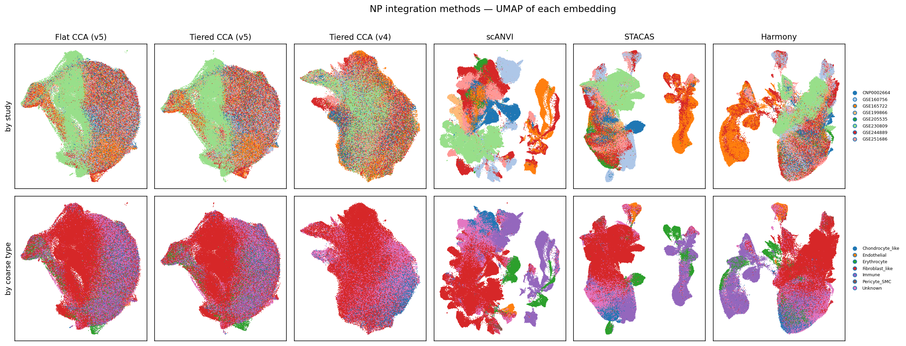

> *[Figure 14.]* NP integration methods compared in UMAP space. Each column is the UMAP of one integration's NP embedding (flat CCA v5, tiered CCA v5 and v4 on the mesenchymal tier, scANVI, STACAS, Harmony); flat CCA v4 is omitted as its embedding was not retained, though its metrics row is shown in the table above. Top row coloured by study (batch mixing); bottom row by Module 04 coarse cell class (biological structure). The semi-supervised latent-space methods (scANVI, STACAS) resolve the non-mesenchymal lineages into the most sharply separated islands, while the CCA embeddings keep the mesenchymal Chondrocyte_like/Fibroblast_like cells as a single graded mass — the visual counterpart of their higher chondrogenic marker-variance retention in the table.

#### Continuum-preservation controls (CCA arms)

The marker-variance ratios in the table above are computed on Leiden clusters (resolution 0.5) of each embedding, so they are sensitive to how finely a method fragments the continuum rather than measuring the gradient directly: at matched resolution the more conservative v4 pipeline resolves the mesenchymal tier into 18 clusters versus 13 for v5, which mechanically lowers v4's within-cluster variance ratio even where the underlying gradient is equally smooth. To decouple gradient preservation from clustering granularity, the 2026-04-17 NP integration experiment added cluster-free controls across the four CCA arms (flat and tiered, v4 and v5).

The primary cluster-free control is Moran's I of marker expression on the *k*=50 neighbour graph — spatial autocorrelation of each gene across the embedding, with no clustering step. Computing it pooled across all cells and again within each study separately (the latter immune to between-study placement, so a clean within-donor gradient measure) gives:

| Marker | Moran's I | Flat v5 | Tiered v5 | Flat v4 | Tiered v4 |
|---|---|---|---|---|---|
| COL2A1 | within-study (↑) | 0.419 | 0.419 | 0.553 | 0.551 |
| | pooled | 0.598 | 0.552 | 0.606 | 0.604 |
| ACAN | within-study (↑) | 0.425 | 0.432 | 0.560 | 0.558 |
| | pooled | 0.545 | 0.639 | 0.575 | 0.579 |
| SOX9 | within-study (↑) | 0.294 | 0.296 | 0.344 | 0.339 |
| | pooled | 0.435 | 0.367 | 0.425 | 0.418 |
| COL1A1 | within-study (↑) | 0.491 | 0.491 | 0.651 | 0.653 |
| | pooled | 0.484 | 0.437 | 0.684 | 0.683 |

Within-study Moran's I is higher for both v4 arms across all four markers (e.g. COL1A1 ≈ 0.65 for v4 vs ≈ 0.49 for v5; COL2A1 ≈ 0.55 vs ≈ 0.42), indicating v4 preserves a smoother marker gradient *within* each donor. The pooled-minus-within-study gap is large and positive for the v5 arms on the chondrogenic markers (COL2A1, ACAN, SOX9: +0.12 to +0.21) but near zero for v4 (≤ +0.05), meaning v5's apparent pooled gradient is inflated by between-study separation whereas v4's reflects genuine within-donor structure. This cluster-free control therefore points the opposite way from the clustering-dependent variance ratio, and is the basis for treating the conservative v4 integration as the better continuum-preserving choice for the mesenchymal tier.

A second axis is preservation of biological *condition* contrasts (healthy / mild / severe / herniated) — the property that most directly governs downstream differential expression — scored by `condition_ASW` (silhouette separation of condition labels; higher, i.e. closer to 0, indicates condition structure retained) and `condition_LISI` (local condition mixing; lower indicates retention):

| Integration | Scope | condition_ASW (↑) | condition_LISI (↓) |
|---|---|---|---|
| Flat CCA (v5) | all | −0.165 | 2.517 |
| Flat CCA (v4) | all | −0.011 | 2.237 |
| Tiered CCA (v5) | mesenchymal | −0.175 | 2.172 |
| Tiered CCA (v4) | mesenchymal | −0.020 | 2.234 |

On `condition_ASW` the arms separate by pipeline version rather than by tiering: both v4 arms retain condition structure an order of magnitude better (−0.011 to −0.020) than either v5 arm (−0.165 to −0.175), with the production flat-v5 embedding the single worst arm — consistent with the concern that v5 flat CCA absorbs condition differences as batch within the large NP_mature_chondrocyte cluster. `condition_LISI` is a noisier discriminator, flagging flat v5 as the most condition-mixed arm (2.517) but not otherwise cleanly ranking v4 above v5 (the other three fall within 2.17–2.24). Together with the within-study Moran's I, this condition-signal axis — not the clustering-dependent variance ratio — drove selection of the conservative SCTransform + MNN-anchor tiered-v4 integration for production.

*Values for these controls come from the §5 NP integration experiment (`scripts/05h_np_experiment_metrics.py` for the condition metrics, `scripts/05j_continuum_control_metrics.py` for Moran's I), a separate metric battery from the seven-method table above and reported here rather than merged into it to avoid mixing conventions. Flat arms scored on the full NP set (262,967 cells); tiered arms on the mesenchymal tier (259,558 cells). Two further cluster-free controls from the same experiment — a k=50 neighbourhood-variance ratio and the full resolution sweep of variance ratio against cluster count — are shown in integration notebook §5c.*

### Clustering

Leiden clustering was applied per tier per compartment, scanning resolutions chosen by an equal-weighted silhouette + modularity score. Tier-aware adaptive thresholds (three resolutions for > 300K cells, six for > 200K, ten for > 50K) and skipping modularity computation for > 100K cells kept run times tractable. Resulting cluster counts are: NP 17 mesenchymal + 4 non-mesenchymal, AF 9 + 3, CEP 4 + 4, all_cells 24 + 9.

### Annotation

Annotation was performed in three stages:

1. **Coarse:** confirmed/refined the Module 04 coarse class using post-integration neighbourhoods. CellTypist (with CP10K + log1p normalized inputs) provided independent reference labels for the non-mesenchymal tier; a 60% per-cluster majority threshold against the panel-derived coarse label served as fallback when CellTypist did not fire.
2. **Cell type (compartment-prefixed):** panel-based scoring against fine-grained marker panels produced compartment-prefixed labels — NP_fibrocartilaginous, NP_mature_chondrocyte, NP_fibrochondrocyte_chondroid, AF_inner, AF_outer, CEP_outer, CEP_hyaline, CEP_fibrochondrocyte_fibroid — plus shared non-mesenchymal labels (Macrophage_M1, Macrophage_M2, Neutrophil, Immune, Endothelial, Pericyte_SMC, Erythrocyte). A label-harmonization step collapsed historical generic labels (e.g. Fibroblast_like → compartment-specific) for cross-compartment consistency.
3. **Sub-state:** overlap-based scoring against sub-state panels (*proliferating, inflammatory, stressed, matrix_active, migratory, homeostatic*) plus an endothelial-admixed contamination flag (CD34, EMCN, AQP1 panel). Mesenchymal cells received a `cell_subtype` label; non-mesenchymal cells inherited `cell_subtype = cell_type`. The all_cells object yielded 26 named sub-states (excluding the unassigned residual).

The three NP mesenchymal labels denote distinct positions along a single continuum and are not interchangeable, ordered from the most chondrocytic to the most fibroblastic: **NP_mature_chondrocyte** (anabolic chondrocyte — ACAN, COL2A1, SOX9, COMP, PRG4) → **NP_fibrochondrocyte_chondroid** (a cartilage-leaning *chondroid* fibrochondrocyte intermediate) → **NP_fibrocartilaginous** (the fibroblast-leaning pole co-expressing type I and type II collagen with VCAN, which carries the degenerative fibrotic signature described in §2).

**Contamination handling.** 16,514 Erythrocyte cells (4.0% of the atlas) and 1,831 endothelial-admixed cells within NP_fibrocartilaginous (0.4%) were retained with `is_contamination = True` flags and `contamination_type ∈ {RBC, endothelial_admixed, clean}`. This preserves the count for downstream analyses while allowing transparent filtering at the interpretation stage. A post-hoc marker-panel scoring of the endothelial-admixed cells against Mural/Pericyte (RGS5, PDGFRB, ACTA2, MCAM, KCNJ8) and Adventitial-fibroblast (PI16, DPT, MFAP5, PCOLCE2) panels — to test whether they represent a genuine perivascular population rather than doublets — returns scores indistinguishable from background (Mural −0.02, Adventitial 0.09) while their Endothelial-panel score (0.91) approaches that of bona fide Endothelial cells (0.89) and their NP_fibrocartilaginous-panel score drops from 1.31 (clean) to 0.25. The pattern is consistent with the contamination/doublet interpretation rather than a perivascular cell-state call (Supplementary Table S21; `results/ML24`).

### Pseudobulk differential expression

Per-sample pseudobulk count aggregation followed by DESeq2 was used for differential expression to avoid the inflated false-positive rate of single-cell DE tests that treat cells as independent observations. The primary grouping was `cell_type` (compartment-prefixed); composition tests were additionally run on `cell_subtype`. Comparisons were defined per cell type as `healthy_vs_degenerated_all`, `healthy_vs_degenerated_mild`, `healthy_vs_degenerated_severe`, and `mild_vs_severe`. Comparisons with fewer than three samples per group were marked underpowered and skipped. One inflated contrast (Macrophage_M2 healthy-vs-severe, which returned 5,659 DEGs from a 7-sample comparison and showed evident dispersion-estimation pathology) is retained on disk for transparency but excluded from all downstream interpretation; see Caveats §1.

### Pathway enrichment, transcription factor activity, and pain-gene cross-referencing

Over-representation analysis (ORA) against GO/KEGG/Reactome via Enrichr, pre-ranked GSEA (gseapy, MSigDB plus a custom IVD gene-set library), and CollecTRI-based transcription factor activity inference via decoupler were run per significant cell-type × comparison contrast. Pain-gene cross-referencing used a curated panel covering inflammatory pain, neurotrophin signalling, nerve guidance, neovascularization, neuropeptides, and ion-channel nociception categories.

### Trajectory analysis

PAGA-initialized diffusion pseudotime (DPT) on the mesenchymal tier computed per-compartment trajectories. The neighbour graph used `X_integrated`; root clusters were chosen by maximum enrichment of the expected mature/inner population (NP_mature_chondrocyte for NP, AF_inner for AF, CEP_hyaline for CEP). NP and AF were downsampled to 50,000 cells before PAGA; CEP was processed in full at 36,879 cells. RNA velocity was not feasible — none of the public count matrices include spliced/unspliced layers.

### Cell-cell communication

LIANA consensus rank-aggregation (CellPhoneDB, NATMI, Connectome, log2FC, sca, geometric mean) was run per condition group (healthy vs. degenerated pooled) on the union atlas, with each condition downsampled to 20,000 cells for tractability. Pain-relevant interactions were flagged by ligand or receptor membership in the curated pain panel.

### Software

scanpy 1.10, anndata 0.12.10, scvi-tools 1.4.2, Seurat 5.4.0, DESeq2 1.42.1, decoupler-py, gseapy, LIANA-py. Python 3.12; R 4.4 with Bioconductor 3.20. All analyses CPU-only on a 247 GB RAM, 32-core AWS instance.

## Results

### §1 — A 410,705-cell atlas of the human intervertebral disc

The integrated atlas comprises **410,705 cells** across 78 samples from 57 donors, distributed across NP (262,924 cells, 64%), AF (84,617 cells, 21%), and CEP (50,854 cells, 12%), with the remainder from a single dataset (GSE189916) that does not separate compartments and is labelled IVD_mixed. The tiered integration preserves within-compartment continuity: NP_fibrocartilaginous, NP_fibrochondrocyte_chondroid, and NP_mature_chondrocyte populations form a graded structure in the latent space rather than discrete clusters, consistent with the histological literature describing NP mesenchymal cells as a continuous spectrum. The atlas is NP-dominated (NP = 64% of cells), but this reflects study sampling rather than tissue cellularity: eight of the twelve studies profiled NP, whereas only three each sampled AF or CEP (Table M1). Compartment cell counts here therefore index sequencing effort per compartment, not the relative cellularity of the intact disc, and do not bear on whether NP or AF loses more cells during degeneration.

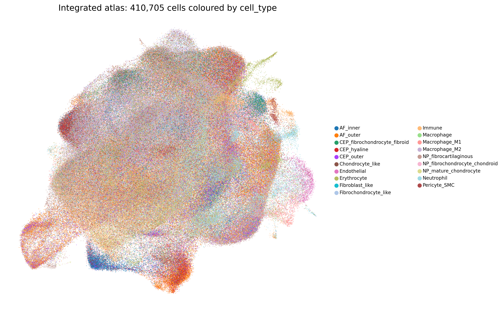

> *[Figure 1.]* UMAP of the all-cells integrated atlas after tiered scVI integration and three-stage annotation. 410,705 cells coloured by `cell_type`. Mesenchymal populations (NP_fibrocartilaginous, NP_fibrochondrocyte_chondroid, NP_mature_chondrocyte, AF_inner, AF_outer, CEP_outer, CEP_hyaline, CEP_fibrochondrocyte_fibroid) and the non-mesenchymal lineages — vascular (Endothelial, Pericyte_SMC), immune (Macrophage_M1, Macrophage_M2, Neutrophil, Immune), and erythroid (Erythrocyte) — are clearly separated; within each compartment, related mesenchymal cell types are positioned as adjacent graded populations.

Per-compartment cell-type counts are summarized below; compartment-specific UMAPs are shown in Figure 2.

**Table 1. Cell-type composition of the atlas.**

| Cell type | Lineage | n cells | % atlas | Sub-states resolved |
|-----------|---------|--------:|--------:|---------------------|
| NP_fibrocartilaginous | Mesenchymal | 94,597 | 23.0 | 6 (proliferating, inflammatory, matrix_active, migratory, stressed, endothelial_admixed) |
| NP_fibrochondrocyte_chondroid | Mesenchymal | 59,650 | 14.5 | 1 (homeostatic) |
| NP_mature_chondrocyte | Mesenchymal | 33,010 | 8.0 | 1 (matrix_active) |
| AF_outer | Mesenchymal | 48,836 | 11.9 | 3 (homeostatic, matrix_active, proliferating) |
| AF_inner | Mesenchymal | 23,769 | 5.8 | 2 (homeostatic, stressed) |
| CEP_outer | Mesenchymal | 15,557 | 3.8 | 3 (homeostatic, matrix_active, proliferating) |
| CEP_hyaline | Mesenchymal | 12,306 | 3.0 | 2 (homeostatic, stressed) |
| CEP_fibrochondrocyte_fibroid | Mesenchymal | 9,016 | 2.2 | 1 (homeostatic) |
| Neutrophil | Immune | 27,912 | 6.8 | — |
| Macrophage_M2 | Immune | 22,752 | 5.5 | — |
| Immune | Immune | 22,404 | 5.5 | — |
| Erythrocyte (contamination) | Erythroid | 16,514 | 4.0 | — |
| Pericyte_SMC | Vascular | 6,124 | 1.5 | — |
| Macrophage_M1 | Immune | 3,500 | 0.9 | — |
| Endothelial | Vascular | 2,474 | 0.6 | — |

> *Note: the all_cells object additionally contains 6,897 cells labelled Chondrocyte_like, 3,847 labelled Fibrochondrocyte_like, and 1,473 labelled Fibroblast_like — these are predominantly the GSE189916 cells from the compartment-undefined IVD_mixed tissue that retain generic (non-compartment-prefixed) labels.*

A targeted scan of the NP cell types against a notochordal-cell marker panel (KRT8, KRT18, KRT19, FOXA2, TBXT, CD24, CA12) returns mean scores of essentially zero across all three NP mesenchymal cell types (NP_fibrocartilaginous −0.010, NP_fibrochondrocyte_chondroid −0.005, NP_mature_chondrocyte −0.001). The atlas therefore does not contain a coherent notochordal-like sub-population at the cell-type level, consistent with the well-described postnatal loss of notochordal cells from the human NP. The single neonatal dataset (GSE189916) is labelled IVD_mixed and its cells carry generic (`Chondrocyte_like` / `Fibrochondrocyte_like` / `Fibroblast_like`) labels rather than NP-prefixed labels, so neonatal-specific notochordal signal is not interrogated by this NP-restricted scan; a dedicated neonatal-versus-adult notochordal analysis would require compartment re-annotation of GSE189916 (Supplementary Table S20; `results/ML20`).

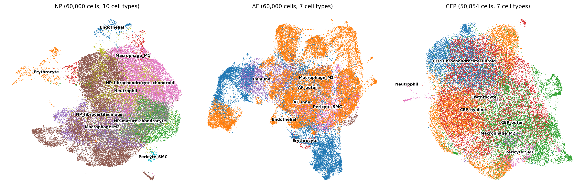

> *[Figure 2.]* Compartment-specific UMAPs. NP (left, 262,924 cells), AF (centre, 84,617 cells), CEP (right, 50,854 cells) atlases coloured by `cell_type`. Within each compartment, mesenchymal populations are arranged as adjacent graded clusters rather than separated discrete clusters, consistent with the continuum hypothesis. Non-mesenchymal populations occupy distinct regions of feature space.

The Stage 3 sub-state annotation (Methods §Annotation) splits each mesenchymal `cell_type` into 1–6 sub-states (`proliferating`, `inflammatory`, `stressed`, `matrix_active`, `migratory`, `homeostatic`, plus the `endothelial_admixed` contamination flag) — 8 NP, 5 AF, and 6 CEP sub-states across the mesenchymal tier — capturing functional heterogeneity within each cell-type cluster. These sub-state-resolved UMAPs are shown in Figure 2b. Statistical analyses (pseudobulk DE, pathway, TF, CCC) are reported at the coarser `cell_type` granularity to preserve per-group sample size.

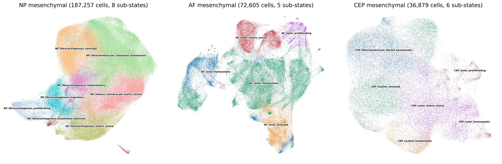

> *[Figure 2b.]* Mesenchymal-tier sub-state UMAPs. NP (left, 187,257 mesenchymal cells, 8 sub-states), AF (centre, 72,605 mesenchymal cells, 5 sub-states), CEP (right, 36,879 mesenchymal cells, 6 sub-states), each coloured by `cell_subtype` (Stage 3 annotation). Same UMAP coordinates as Figure 2 — only the mesenchymal cells are shown and the colouring is by sub-state rather than cell type. The sub-state structure preserves the within-`cell_type` heterogeneity visible in Figure 2 (e.g. the NP_fibrocartilaginous pole resolves into `stressed`, `matrix_active`, `migratory`, `inflammatory`, `proliferating`, and `endothelial_admixed` sub-states). Counts per sub-state are listed in the "Sub-states resolved" column of Table 1.

### §2 — NP fibrocartilaginous cells dominate the degenerative transcriptional signature

Of the 26 statistically powered cell-type × comparison contrasts (one inflated contrast excluded; see Caveats §1), **1,823 significant DEGs** at FDR < 0.05 were identified. The cell-type distribution is highly asymmetric, with the three NP cell types collectively accounting for **1,310 of 1,823 trustworthy DEGs (72%)**:

**Table 2. DE counts per cell-type × contrast (trustworthy contrasts only).**

| Cell type | H vs. mild | H vs. severe | Mild vs. severe | H vs. all |
|-----------|-----------:|-------------:|----------------:|----------:|
| NP_fibrocartilaginous | 14 | 291 | 325 | 84 |
| NP_fibrochondrocyte_chondroid | 5 | 27 | 350 | — |
| NP_mature_chondrocyte | 3 | 121 | 174 | 2 |
| AF_outer | 121 | 3 | 1 | — |
| AF_inner | 2 | — | — | — |
| Immune | 4 | 38 | 11 | — |
| Macrophage_M1 | — | — | 21 | — |
| Macrophage_M2 | 1 | (excluded) | 171 | 1 |
| Neutrophil | 2 | 23 | 25 | 3 |

NP_fibrocartilaginous carries the largest single mild-vs-severe contrast at 325 DEGs (189 up, 136 down). Examining the actual top-ranking DEGs in this contrast (Figure 3), the upregulated set in severe-vs-mild is dominated by ECM remodelling and acute-phase inflammatory transcripts: MFAP5 (log2FC +4.7, padj 5×10⁻³), EYA2 (+3.6), C3 (+3.2), SERPINF1 (+3.0), IL6 (+2.7, padj 9×10⁻³), HSD11B1 (+2.6), CXCL2 (+2.3, padj 1×10⁻³), IBSP (+2.3), FBLN1 (+2.3), IFI27 (+2.3), COL12A1 (+2.3, padj 3×10⁻⁴), CXCL3 (+2.3), and SAA1 (+2.1, padj 6×10⁻⁴). The downregulated set is led by hemoglobin transcripts (HBA2, HBB — likely tracking RBC contamination heterogeneity across samples), followed by immune lineage markers (FCN1, LYZ), the WNT ligand WNT16 (−2.6), the hedgehog interacting protein HHIP (−2.1), the neuromedin NMU (−2.6), and the cell cycle / DNA replication factors MCM10 and SFN.

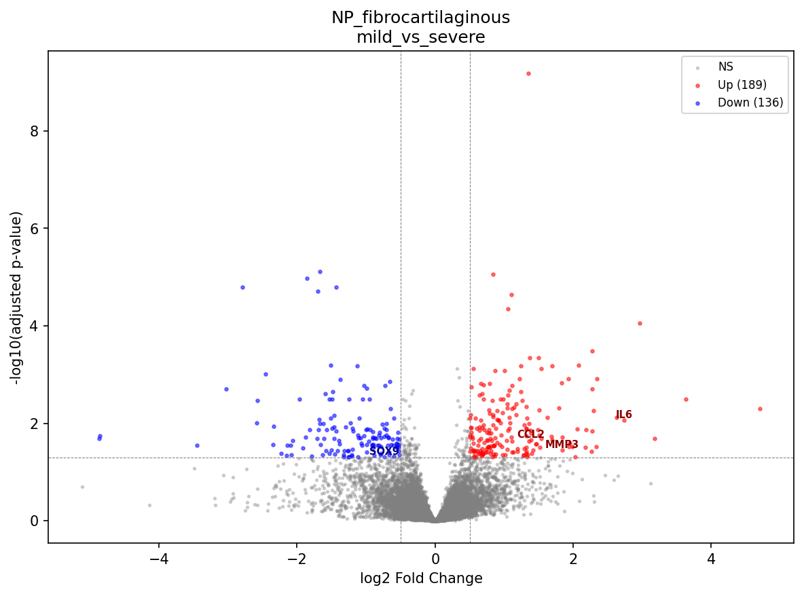

> *[Figure 3.]* Volcano plot of NP_fibrocartilaginous mild-vs-severe degeneration. 325 significant DEGs at FDR < 0.05 (red), with the largest log2FC and lowest-padj transcripts labelled. Upregulated severe-vs-mild signal is concentrated in fibrotic ECM (COL12A1, FBLN1, SERPINF1), acute-phase / SAA family (SAA1, SAA2), and inflammatory chemokines (IL6, CXCL2, CXCL3). Downregulated signal includes WNT16, HHIP, and neuromedin NMU.

Across the broader NP set (NP_fibrocartilaginous + NP_fibrochondrocyte_chondroid + NP_mature_chondrocyte), severe-versus-mild and severe-versus-healthy contrasts share a recurring transcriptional pattern: upregulation of fibrotic collagens (COL1A1, COL3A1, COL10A1, COL12A1 — sig UP in NP_fibrocartilaginous healthy-vs-severe and mild-vs-severe contrasts), upregulation of selected matrix-degrading enzymes (MMP3 in NP_fibrocartilaginous and NP_mature_chondrocyte mild-vs-severe, MMP19 in NP_fibrocartilaginous, ADAMTS1 and ADAMTS5 in NP_mature_chondrocyte mild-vs-severe), and broad activation of the NF-κB / acute-phase axis (NFKBIZ, IL6, CXCL2/3, SAA1/2, CCL2, PTGS1/2). Canonical anabolic chondrocyte transcripts (COL2A1, ACAN, PRG4) do not reach significance in any pairwise comparison at the cell-type level in this analysis — the dominant ECM signature is fibrotic remodelling, not collapse of the chondrocyte ECM program.

The per-contrast DEG counts in Table 2 show two patterns worth reconciling explicitly. First, several cell types yield **more DEGs in mild-vs-severe than in healthy-vs-severe** (NP_fibrochondrocyte_chondroid 350 vs. 27; NP_mature_chondrocyte 174 vs. 121). This is partly a power effect — samples per group differ across contrasts, and the healthy arm is the most sparsely and unevenly sampled condition (Table M1) — but it is also biologically coherent: for the chondroid NP populations the largest transcriptional step falls *between mild and severe* rather than between healthy and severe, consistent with these cells changing most in late-stage disease. Second, **AF_outer's signal is largest at healthy-vs-mild (121 DEGs) and collapses to 3 by healthy-vs-severe** — the early-then-quiesce pattern detailed in §3, not a monotonic increase with grade. Both observations argue against reading raw per-contrast DEG counts as a simple dose-response to degeneration severity; sample composition per contrast and cell-type-specific timing jointly shape them.

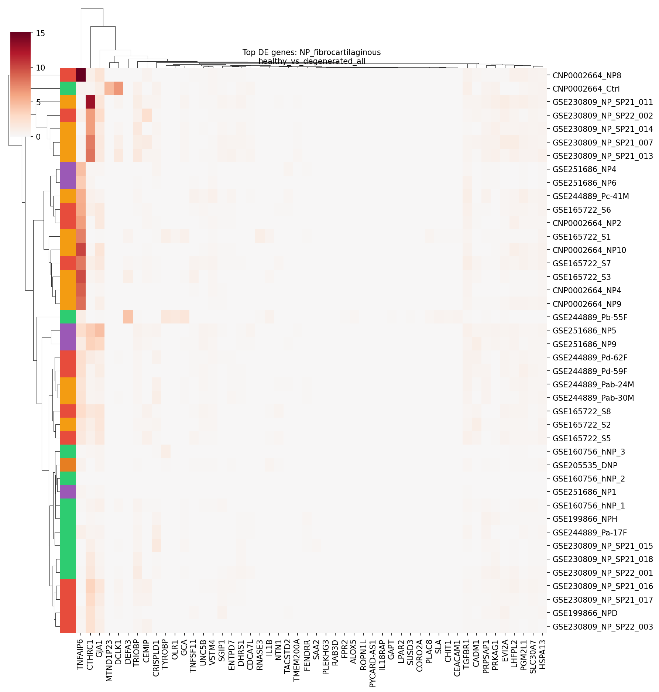

> *[Figure 4.]* NP_fibrocartilaginous healthy-vs-degeneration heatmap. Top differentially expressed genes across the three NP_fibrocartilaginous contrasts (healthy-vs-degenerated_all, healthy-vs-severe, mild-vs-severe), showing the consistent direction of effect across the degeneration gradient.

### §3 — AF outer cells respond early, then quiesce

AF_outer cells exhibit a distinctive temporal pattern that contrasts sharply with NP cells. At healthy-vs-mild, **121 DEGs** are detected — predominantly downregulated (110 of 121). By healthy-vs-severe the signal collapses to 3 DEGs, and mild-vs-severe yields a single significant DEG. AF_inner cells, by contrast, return only 2 DEGs across all comparisons.

Examining the AF_outer healthy-vs-mild downregulated set, the pattern is striking: a coordinated loss of pain-relevant inflammatory and neurotrophic transcripts at the earliest detectable stage of degeneration. CXCL8 (log2FC −4.4, padj 2×10⁻²), NGFR (−9.5, padj 3×10⁻²), and PLA2G2A (−7.7, padj 3×10⁻²) are all significantly downregulated in mild-vs-healthy AF_outer. This signature is not recapitulated in any other compartment.

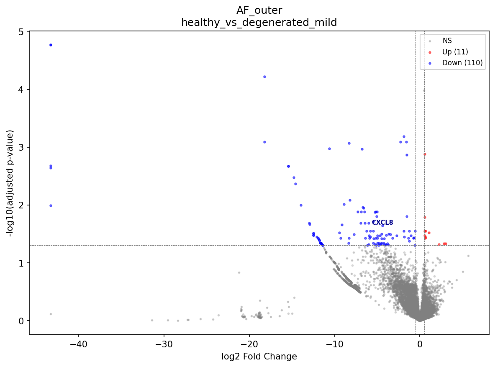

> *[Figure 5.]* Volcano plot of AF_outer healthy-vs-mild degeneration. 121 significant DEGs (red), 110 of which are downregulated. Pain-relevant transcripts CXCL8, NGFR, and PLA2G2A are among the most strongly downregulated, suggesting either a transient stress response that resolves by the severe stage or a population shift not visible at cell-type-level resolution.

The biology is ambiguous. Three interpretations are consistent with the data: (i) a transient transcriptional stress response in AF outer fibroblasts during early degeneration that has resolved by the severe stage; (ii) a shift in the AF_outer sub-state composition (matrix_active vs. proliferating vs. homeostatic fractions) that is averaged across at the cell-type level; or (iii) sampling differences across donors at severe AF disease stages, particularly since CEP and severe AF samples come predominantly from a subset of donors. Distinguishing among these would require longitudinal sampling of the same donors across degeneration stages — which is not feasible in humans, because repeat IVD biopsy would itself injure the disc and accelerate its degeneration, and no cross-sectional dataset can substitute for true within-donor time-course data. We therefore treat the AF_outer trajectory as descriptive rather than causal.

### §4 — Eighteen pain-associated genes with cell-type-specific dysregulation

Cross-referencing the trustworthy DE results against a curated 60-gene pain panel yields **18 unique pain-associated genes** that are significantly differentially expressed at FDR < 0.05 in one or more contrasts. The full set, grouped by pain category and cell type, is summarized in Table 3.

**Table 3. Pain-associated genes significantly DE at FDR < 0.05.**

| Gene | Category | Direction in degeneration | Cell types with significant signal |
|------|----------|---------------------------|-------------------------------------|
| IL6 | Inflammatory pain | UP (severe) | NP_fibrocartilaginous, Immune |
| IL1B | Inflammatory pain | DOWN (deg_all) | NP_fibrocartilaginous |
| CCL2 | Inflammatory pain | UP | NP_fibrocartilaginous, Neutrophil, Immune |
| TNF | Inflammatory pain | UP (mild → severe) | Neutrophil |
| CXCL8 | Inflammatory pain | DOWN (healthy → mild) | AF_outer |
| PTGS2 | Inflammatory pain | UP (mild → severe) | Macrophage_M1 |
| PLA2G2A | Inflammatory pain | UP / DOWN | NP_fibrocartilaginous (UP severe), Immune (UP mild→severe), AF_outer (DOWN mild) |
| BDKRB1 | Inflammatory pain | UP | NP_fibrochondrocyte_chondroid |
| BDKRB2 | Inflammatory pain | UP | NP_mature_chondrocyte |
| NTN1 | Nerve guidance | UP | NP_fibrocartilaginous, NP_mature_chondrocyte |
| UNC5B | Nerve guidance | UP | NP_fibrocartilaginous |
| NGFR | Neurotrophin receptor | UP / DOWN | Immune (UP severe), AF_outer (DOWN mild) |
| PENK | Neuropeptides | UP | NP_fibrocartilaginous |
| VEGFA | Neovascularization | UP | NP_mature_chondrocyte |
| PDGFA | Neovascularization | UP | NP_mature_chondrocyte, NP_fibrochondrocyte_chondroid |
| FGF2 | Neovascularization | UP | NP_fibrochondrocyte_chondroid |
| FLT1 | Neovascularization | UP | Macrophage_M1 |
| P2RX4 | Nociception ion channel | DOWN | NP_fibrochondrocyte_chondroid |

NP_fibrocartilaginous carries the broadest pain signature: 10 of 18 unique genes (IL6, IL1B, CCL2, PLA2G2A, NTN1, UNC5B, PENK, and additional contrast-specific hits) are dysregulated in this single cell type. NP_mature_chondrocyte concentrates the neovascularization axis (VEGFA + PDGFA + BDKRB2 + NTN1). NP_fibrochondrocyte_chondroid contributes the kinin and growth-factor arm (BDKRB1, FGF2, PDGFA). Macrophage_M1 carries the canonical macrophage pain ligands (PTGS2, FLT1).

The opposing direction of AF_outer signals (CXCL8, NGFR, PLA2G2A all DOWN at healthy-vs-mild) underscores the §3 finding that the AF outer compartment undergoes a different early response than NP cells do.

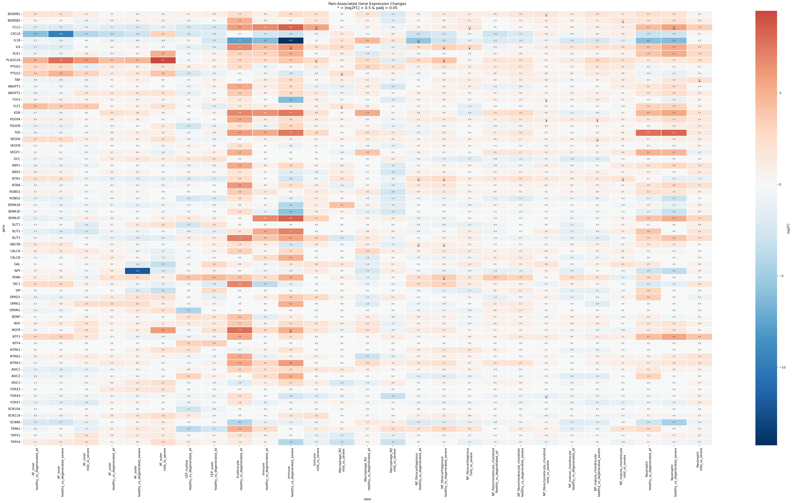

> *[Figure 6.]* Pain-associated gene heatmap. Log2 fold-change of pain-panel genes across cell-type × comparison contrasts where the gene reaches significance (FDR < 0.05). Red = upregulated, blue = downregulated. NP_fibrocartilaginous (column-grouped) carries the broadest signal; NP_mature_chondrocyte concentrates the neovascularization axis.

### §5 — Pathway enrichment and transcription factor activity converge on fibrotic ECM, NF-κB, and acute-phase programs

Pathway enrichment yielded **3,051 significant ORA terms** (Enrichr; GO Biological Process, KEGG, Reactome) and **6,890 significant GSEA terms** (gseapy; MSigDB + a custom IVD gene-set library) at FDR < 0.05 across the 26 trustworthy contrasts. Transcription factor activity inference via decoupler against the CollecTRI regulon database identified **555 significant TF × comparison records covering 252 unique TFs** at FDR < 0.05.

Four themes recur:

1. **Fibrotic ECM remodelling.** Upregulation of fibrotic collagens (COL1A1, COL3A1, COL10A1, COL12A1) and selected catabolic enzymes (MMP3, MMP19, ADAMTS1, ADAMTS5) in NP_fibrocartilaginous and NP_mature_chondrocyte severity contrasts. GO terms *extracellular matrix organization*, *collagen catabolic process*, and *proteoglycan metabolic process* lead the upregulated NP_fibrocartilaginous severity comparisons. Canonical chondrocyte anabolic markers (COL2A1, ACAN, PRG4) are not significantly dysregulated at the cell-type level — the dominant ECM signal is fibrotic remodelling rather than collapse of the chondrocyte ECM program.
2. **NF-κB and acute-phase activation.** NFKBIZ, IL6, CXCL2/3, SAA1/2, CCL2, PTGS1/2 all upregulated across multiple NP cell types and contrasts. Acute-phase serum amyloid A transcripts SAA1 and SAA2 are among the largest-effect upregulated DEGs in NP_fibrocartilaginous mild-vs-severe (SAA1 +2.1, padj 6×10⁻⁴) and NP_mature_chondrocyte mild-vs-severe (SAA1 +2.8, padj 2×10⁻⁴).
3. **AP-1 and stress-response TF activity.** CollecTRI TF activity scores rank AP-1 (composite AP-1 score, 10 significant contrast records) as the single most consistently active regulator, followed by EGR1, JUN, RELA, SP1, NFKB1, NFKB, PPARG, FOS, SP3, CEBPB, RUNX2, ETS1, GLI2, and SMAD3. The NF-κB family (NFKB1, NFKB, RELA) collectively contributes 24 significant records across degeneration contrasts. AP-1 / JUN / FOS / EGR1 — canonical stress-response and immediate-early transcription factors — are the dominant signal at the TF level.
4. **Cell-type-specific pain dysregulation.** ORA over the curated IVD gene-set library confirms enrichment of *inflammatory_pain*, *neurotrophin_signalling*, and *neovascularization* categories in NP_fibrocartilaginous and NP_mature_chondrocyte degeneration contrasts.

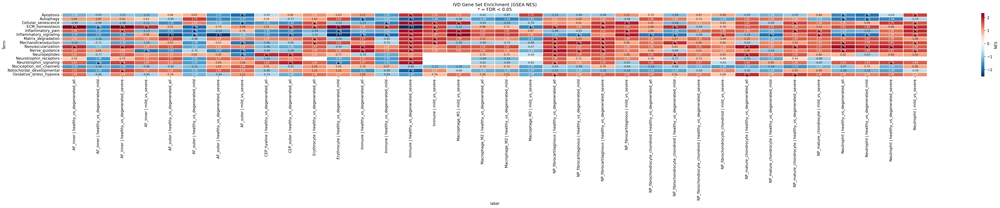

> *[Figure 7.]* GSEA enrichment heatmap across IVD-specific gene sets. Normalized enrichment score per contrast (columns) × pain / ECM / immune gene-set (rows). Red = enriched in the second term of the contrast (i.e., degenerated for healthy-vs-degenerated contrasts).

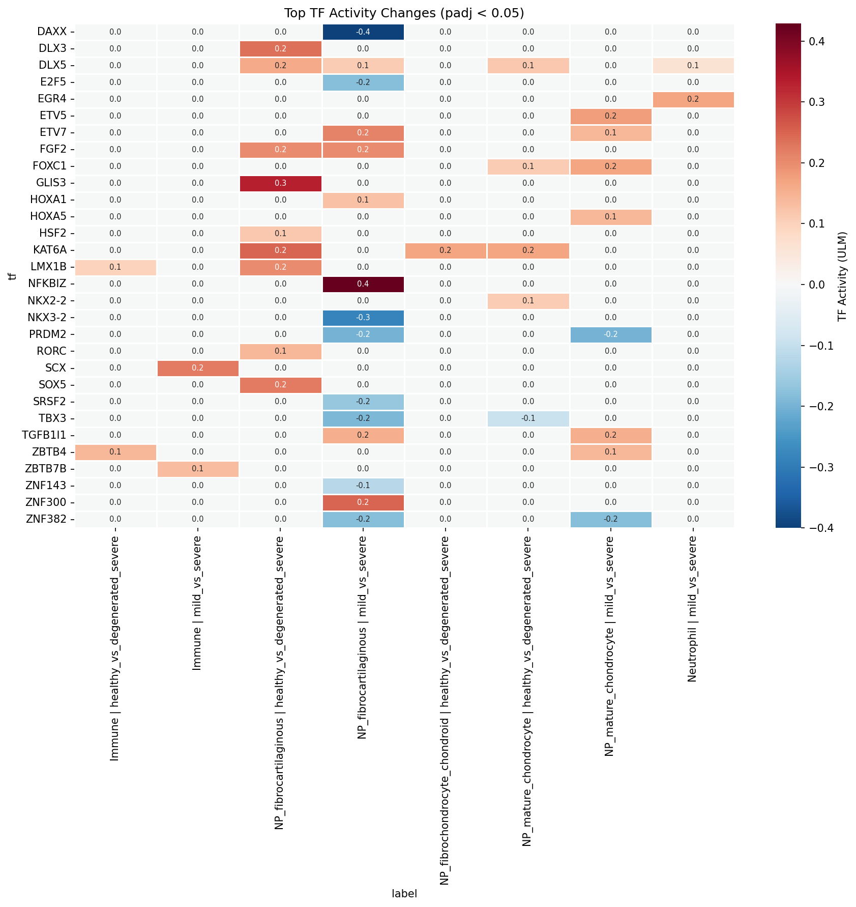

> *[Figure 8.]* Transcription factor activity heatmap. CollecTRI-derived TF activity scores per contrast (columns) × TF (rows), restricted to the 25 most significant TFs by frequency of FDR < 0.05 contrast hits. AP-1, EGR1, JUN, RELA, SP1, NFKB1, PPARG, and FOS dominate.

### §6 — Cell-cell communication: neutrophil-recruitment signaling gained, CEP basement-membrane signaling lost

LIANA consensus rank-aggregation on 20,000 cells per condition identified **66,827 ligand-receptor interactions in healthy tissue and 76,019 in degenerated tissue**, with a 90,650-interaction union. 6,883 interactions in the degenerated pool involve a curated pain-panel ligand or receptor.

Top ligands by interaction count differ between conditions in informative ways. In healthy tissue, the top ligands by interaction count are TGFB1 (2,205), FN1 (1,995), VEGFA (1,288), FGF2 (1,261), THBS1 (1,176), APP (1,155), COL1A2 (975), COL6A1 (966), COL2A1 (896), and COL6A2 (882). In degenerated tissue, FN1 moves to the top (2,085 — up from 1,995 in healthy), TGFB1 drops to second (1,908 — down from 2,205), VEGFA rises (1,485 vs. 1,288 in healthy), COL1A1 appears in the top 10 (1,400 in degen; not in top 10 in healthy), and ADAM10 appears (1,105 in degen). The shift is consistent with the §2 finding of fibrotic ECM remodelling — fibronectin and fibrotic collagens are gaining signaling weight in degeneration.

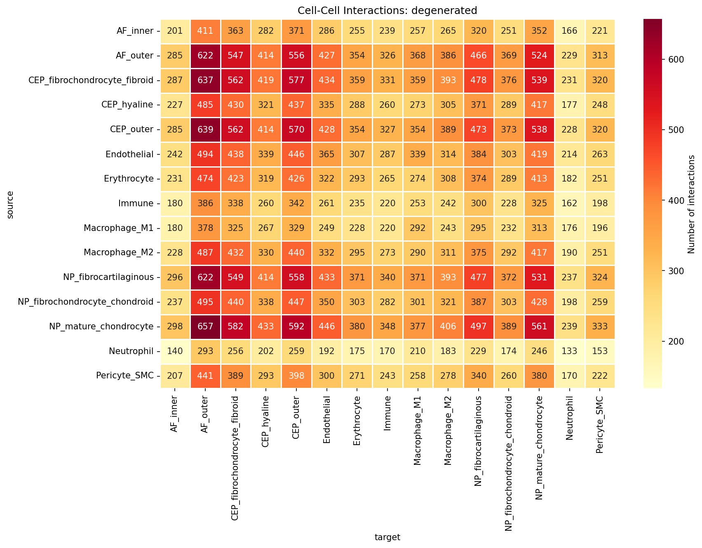

> *[Figure 9.]* Cell-cell interaction heatmap in degenerated tissue. Source cell-type (rows) × target cell-type (columns) interaction counts. Mesenchymal cell types are heavily interconnected; non-mesenchymal populations show more focused interaction profiles.

Differential analysis (rank_diff = magnitude_rank_healthy − magnitude_rank_degenerated; positive = gained in degeneration) yields two robust patterns:

**Gained in degeneration.** Pan-cell-type → Neutrophil FN1 → C5AR1 and RPS19 → C5AR1 signaling dominates the top of the gained list. Fibronectin and ribosomal protein S19 acting as C5a-receptor ligands across virtually every disc mesenchymal cell type is the canonical complement-driven neutrophil chemotaxis axis being broadly activated.

**Lost in degeneration.** A coordinated set of CEP_outer-centric signaling axes attenuates: WNT2B → FZD4/LRP5/LRP6 (CEP_outer autocrine and to NP_mature_chondrocyte), LAMB3 → ITGA6 / ITGAV / ITGA2 integrins (CEP-to-AF basement membrane), NDP → FZD4 (Norrin/WNT), and MDK → SDC3 (midkine). In parallel, AF_outer / NP_fibrocartilaginous → CD4 HLA-class-II presentation is reduced. The lost-in-degeneration signal is therefore a coordinate loss of WNT, basement-membrane, and immune-presentation signaling rather than a single-axis effect.

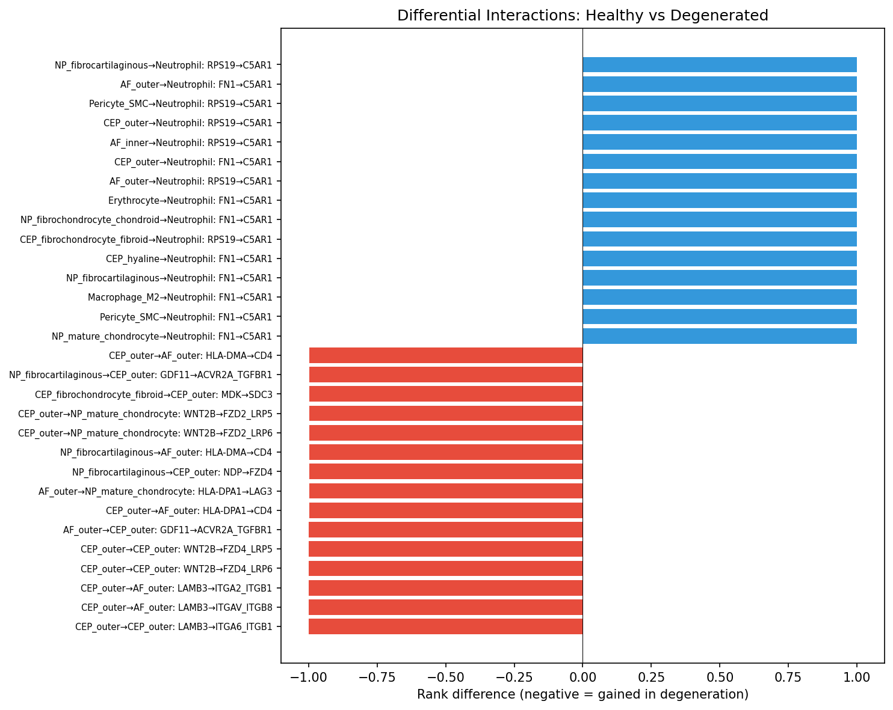

> *[Figure 10.]* Differential interaction plot. Each point represents one source-target-ligand-receptor interaction; horizontal axis = rank_diff, vertical axis = degenerated-condition magnitude rank. Right-side points are gained in degeneration; left-side points are lost. Annotated top interactions include FN1 → C5AR1 (gained, multiple sources → Neutrophil) and CEP_outer WNT2B → FZD4/LRP5/6 (lost).

Pain-relevant interactions in degenerated tissue are dominated by neovascularization (VEGFA 1,485, FGF2 1,157, VEGFC 246, VEGFB 216), neurotrophic (NGF 360), semaphorin nerve-guidance (SEMA3C 300, SEMA3A 250), inflammatory (TNFSF10 250, PTGS2 224), and granulin (GRN 285) ligand contributions. Aggregate interaction counts are sensitive to the cell-type partition — finer cell-type resolution combinatorially multiplies the number of source-target-ligand-receptor tuples. Cell-type-pair-specific and ligand-specific calls are therefore the interpretable level of CCC analysis.

Neutrophils (27,912 cells; 6.8% of the atlas) are not a classical resident IVD population, and their prominence warrants comment. They are nonetheless a reproducible feature of degenerated disc: an independent human IVD scRNA-seq study reported a neutrophil subpopulation abundant specifically in degenerated discs and enriched for extracellular-matrix-organization programmes, signalling to nucleus pulposus cells through a MIF → ACKR3 axis correlated with degeneration grade (Zhang TL et al., *Translational Research* 2024;272:1–18). This is consistent with the broadly gained complement-driven FN1/RPS19 → C5AR1 neutrophil-recruitment axis described above. Two caveats temper the quantitative claim, however. First, neutrophils are short-lived and fragile, and are systematically under-recovered and prone to ambient-RNA and peripheral-blood contamination in dissociation-based scRNA-seq; the absolute count is therefore a lower-confidence quantity than the resident mesenchymal populations. Second, our coarse `Neutrophil`/`Immune` labels are not resolved into granulocyte subsets. We therefore report neutrophil involvement at the level of a gained recruitment axis rather than as a precise abundance estimate, and flag orthogonal validation (e.g. the MIF/ACKR3 axis or histological neutrophil quantification) as a priority.

### §7 — Cell-type composition does not shift significantly with degeneration

Compositional analysis across 19 cell-type × comparison contrasts at the compartment level identified no significant changes after FDR correction (lowest adjusted p-value 0.61). The largest absolute shifts — AF_inner enrichment in severe AF (log2FC +3.05, raw p = 0.04; +1.33 at healthy-vs-severe, raw p = 0.07), Macrophage_M2 depletion in NP severe degeneration (log2FC −4.28, raw p = 0.02), and Pericyte_SMC depletion in severe disc (log2FC −7.98, raw p = 0.07) — do not survive multiple-testing correction. The finer `cell_subtype`-level composition analysis (also FDR-corrected) similarly returns no significant shifts.

The conservative interpretation is that disc degeneration is **principally a transcriptional, not a cellular, remodelling** at the cell-type level. Composition shifts at the sub-state level (proliferating, stressed, inflammatory, matrix_active fractions within each cell type) are more variable across donors and are best interpreted at the individual sub-state level rather than as compartment-wide claims.

This null result sits in apparent tension with the well-documented histological depletion of NP cellularity in advancing degeneration, and the discrepancy deserves explicit treatment. Several non-exclusive factors reconcile them. (i) The analysis is cross-sectional and *proportional*: composition tests measure each cell type's fraction of recovered cells per sample, not absolute cellularity per unit tissue, so a uniform loss of cells need not change proportions. (ii) The test is FDR-conservative and underpowered — several raw-p < 0.05 shifts exist (Macrophage_M2 and Pericyte_SMC depletion in severe disc) but do not survive correction across 19 contrasts. (iii) Dissociation and capture efficiency vary with matrix density and degeneration grade, biasing which cells are recovered from severely fibrotic tissue. (iv) Degenerative remodelling may manifest transcriptionally (the 1,823-DEG signal) before, or independently of, a proportional shift detectable at this resolution. The conservative reading is therefore that we find no *evidence* of cell-type compositional change in these data — not positive evidence of its absence — and that the absolute NP cell loss documented histologically is largely invisible to, rather than contradicted by, a proportional cross-sectional analysis.

### §8 — Cell-state trajectories: per-cell-type gradients within compartments

PAGA-initialized DPT pseudotime in each compartment yields the expected ordering at the cell-type level — root clusters enriched for the mature/inner population (NP_mature_chondrocyte for NP, AF_inner for AF, CEP_hyaline for CEP) progress along a continuous axis toward the more degenerative / outer populations.

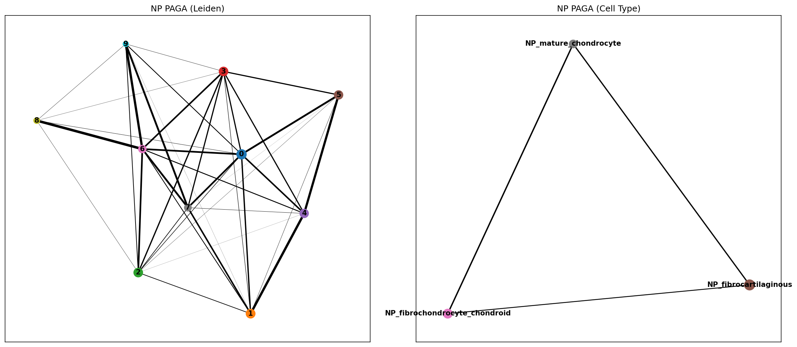

> *[Figure 11.]* PAGA connectivity graph, NP. Node size = cluster size; edge weight = PAGA connectivity. The NP mesenchymal population is a connected graph rather than a set of well-separated clusters, consistent with the continuum hypothesis.

The compartment-level pseudotime-versus-condition ordinal correlation is near zero for NP and AF (NP ρ = −0.004, p = 0.41; AF ρ = −0.003, p = 0.49), while CEP retains a weak positive correlation (ρ = +0.077, p = 1.9×10⁻⁴⁹). At the per-cell-type level, gradients are stronger and opposing within compartments: AF_inner ρ = +0.54, AF_outer ρ = −0.30 (both p ≈ 0); CEP_hyaline ρ = +0.17, CEP_outer ρ = −0.21. NP cell-type-specific correlations are small in magnitude (ρ ∈ {−0.04, +0.06, −0.05}).

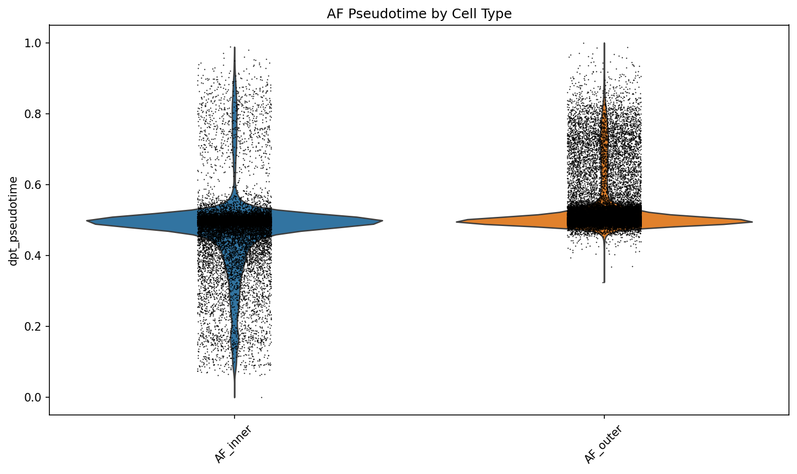

> *[Figure 12.]* Pseudotime by cell type, AF. Distribution of DPT pseudotime per AF cell type. AF_inner and AF_outer occupy distinct portions of the pseudotime axis with opposing condition-correlated gradients.

Mann-Whitney U tests of healthy-versus-degenerated pseudotime medians remain highly significant in all three compartments (NP p = 3×10⁻⁴, AF p = 1×10⁻²⁰, CEP p = 2×10⁻⁴³), though absolute median shifts are small (e.g. NP healthy 0.038 vs. degenerated 0.038; AF healthy 0.500 vs. degenerated 0.497). The conservative reading is therefore: the discrete healthy-vs-degenerated shift is real but the compartment-level pseudotime direction is not a robust claim, with within-cell-type gradients accounting for most of the signal.

Trajectory-associated genes (top 500 by DPT correlation) substantially overlap with the DE results: 328/500 (NP), 326/500 (AF), and 338/500 (CEP) trajectory genes are also DE genes — 65–68% per compartment. The NP trajectory's late-up program (282 genes) is led by COL1A1, MKI67, TNC, BIRC5, SERPINF1, HMMR, AQP1, COL6A1 — consistent with the fibrotic proliferative remodelling signal from §2. The late-down program (87 genes) is led by SEMA3A, DSP, FGF2, NGF, TRPV4, TNFRSF11B, F13A1, IL11 — interestingly including several neurotrophin and pain-relevant ligands whose loss along the NP pseudotime axis is opposite to what a simple "more degeneration → more pain ligand expression" model would predict.

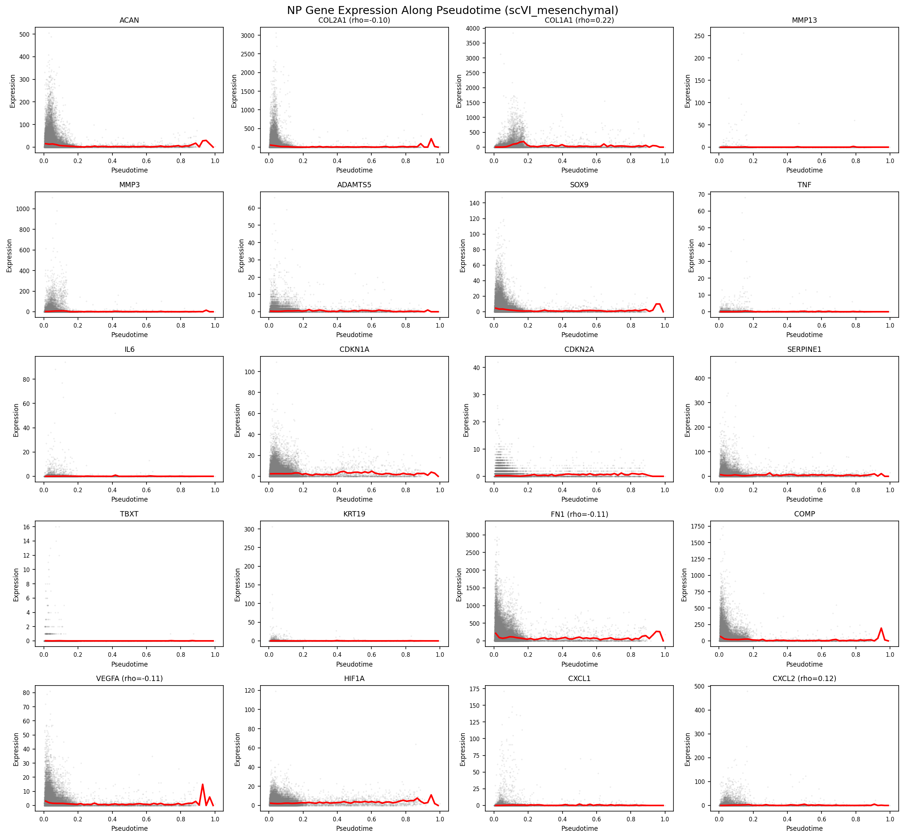

> *[Figure 13.]* Gene dynamics along NP pseudotime. Smoothed expression of top trajectory-associated genes plotted against DPT pseudotime, with program assignment (late_up, late_down, stable) shown. Fibrotic ECM and proliferation transcripts (COL1A1, COL3A1, MKI67, BIRC5) rise along the trajectory; neurotrophic and stress-response transcripts (SEMA3A, FGF2, NGF) decline.

## Discussion

### A coherent transcriptional model of disc degeneration

The atlas supports a model in which disc degeneration is principally a **cell-type-specific transcriptional remodelling rather than a compositional collapse**. NP_fibrocartilaginous cells drive the signal, upregulating fibrotic collagens (COL1A1, COL3A1, COL10A1, COL12A1), selected matrix-degrading enzymes (MMP3, MMP19, ADAMTS1, ADAMTS5 — concentrated in NP_mature_chondrocyte and NP_fibrocartilaginous), acute-phase proteins (SAA1, SAA2, SERPINF1), inflammatory mediators (IL6, CCL2, CXCL2/3, NFKBIZ, PTGS1/2), nerve-guidance cues (NTN1, UNC5B), neuropeptides (PENK), and neurotrophin receptors (NGFR in Immune cells). NP_mature_chondrocyte contributes the neovascularization arm (VEGFA, PDGFA, BDKRB2). NP_fibrochondrocyte_chondroid carries its own kinin signature (BDKRB1) and the FGF2 / PDGFA growth-factor axis. The result is a coherent biology in which the NP mesenchymal cell continuum acts collectively as both effector and amplifier of the catabolic / fibrotic / inflammatory / nociceptive cascade — and the dominant transcriptional theme is fibrotic remodelling, not collapse of the chondrocyte ECM program. Canonical chondrocyte anabolic markers (COL2A1, ACAN, PRG4) do not reach significance in any cell-type-level pairwise comparison in this atlas.

This fibroblastic remodelling of the NP resident compartment is consistent with — and adds cell-type resolution to — the prevailing concept of NP degeneration as progressive loss of the juvenile notochordal/chondrocytic phenotype and its replacement by a fibrocartilaginous, fibroblast-like state with age and degeneration. Our data localise that transition specifically to the NP_fibrocartilaginous pole and show it is driven by *gained* fibrotic-ECM and inflammatory programmes rather than by collapse of the chondrocyte anabolic programme (COL2A1, ACAN, PRG4 are not significantly downregulated at the cell-type level). 

AF_outer cells contribute a temporally-distinct early response that quiesces by the severe stage, with a pain-relevant downregulation signature (CXCL8, NGFR, PLA2G2A) appearing at the mild stage and disappearing by severe. AF_inner cells, CEP cells, and the immune compartment all participate in narrower but coherent ways. Macrophage_M1 polarization in late degeneration carries the canonical macrophage pain ligands (PTGS2, FLT1). The Immune compartment carries IL6, NGFR, CCL2, and PLA2G2A upregulation at the severe stage. Neutrophil recruitment via complement (FN1/RPS19 → C5AR1) is the single most prominent gained cell-cell signaling axis in the degenerated atlas.

### Relationship to the twelve source studies

Our conclusions are broadly concordant with the individual contributing studies while extending them through cross-study integration. The NP chondrocyte/fibroblast heterogeneity and the resident-cell continuum we recover were each described, in single-cohort form, by Gan et al. (2021), Tu et al. (2022), Han et al. (2022), and Jia et al. (2024); the fibrotic, fibroblast-leaning late-stage NP pole we label NP_fibrocartilaginous corresponds to the late-stage, serglycin-marked fibrotic NP cells reported by Chen et al. (2024). The inner–outer AF gradient we resolve was characterised by Swahn et al. (2024) in surgically separated NP and AF. Our NF-κB/acute-phase inflammatory signature and gained immune signalling align with the immune-driven degeneration and NP ossification described by Guo et al. (2023). The endplate cell diversity we annotate is consistent with the dedicated CEP studies of Shi et al. (2024) and Kuchynsky et al. (2024), while Jiang et al. (2022) supply the neonatal/notochordal anchor, Li et al. (2022) the normal-versus-degenerative NP contrast, and Cherif et al. (2022) a within-individual paired design.

What integration adds beyond any single study is statistical resolution and rigour. Pseudobulk DESeq2 across 78 samples concentrates 72% of the trustworthy DE signal in three NP cell types and isolates NP_fibrocartilaginous as the dominant degenerative substrate — a cell-type-specific attribution no single underpowered cohort could make — and surfaces the AF_outer early-then-quiesce pattern, which requires sampling multiple grades across studies to detect. Where we diverge, it is generally toward caution: candidate progenitor populations highlighted individually (PROCR⁺ NP progenitors, Gan et al. 2021; notochordal subpopulations, Jiang et al. 2022) are not separately resolved as discrete clusters here, and our compositional analysis finds no FDR-significant shifts, in contrast to proportional changes emphasised in some single-cohort reports — differences we attribute to the conservative pseudobulk/FDR framework and cross-study heterogeneity rather than to a biological contradiction.

### Methodological considerations

Three methodological choices distinguish this atlas from prior cross-study IVD scRNA-seq analyses:

**Tiered integration.** Splitting the integration by coarse cell class — separate models for non-mesenchymal and mesenchymal cells, with conservative settings for the latter — preserves the within-compartment continua that uniform single-method integration tends to compress. A sensitivity analysis using flat Seurat CCA integration on the same data confirmed this: the tiered approach yielded finer cell-type resolution (19 vs. 16 cell types in the union atlas), a larger trustworthy DE pool (1,823 vs. 1,198 DEGs), and broader pain-gene signal (18 vs. 10 unique significant pain genes), while preserving the qualitative biological themes (NF-κB / inflammatory upregulation, no compositional shift). The trade-off is that some compartment-level summary statistics (e.g. pseudotime-condition ordinal correlations) shift between the two approaches, because finer cell-type partition redistributes signal that flat integration averages across. We treat the qualitative themes as the strong claims and report compartment-level summary metrics with caveats (Caveats §2).

**Three-stage annotation with compartment-prefixed labels.** Coarse class → compartment-prefixed cell type → sub-state. The compartment prefix (NP_fibrocartilaginous vs. AF_outer vs. CEP_outer) is important because some functional cell types (Fibroblast_like, Chondrocyte_like) are not equivalent across compartments, and grouping them by generic class hides compartment-specific biology. Sub-state assignment (proliferating, inflammatory, stressed, matrix_active, migratory, homeostatic) provides descriptive resolution within each cell type without inflating the statistical claims (DE was run on cell_type, not cell_subtype, to preserve sample-level statistical power).

**Contamination flagging rather than filtering.** 4.5% of the atlas — 16,514 Erythrocyte cells and 1,831 endothelial-admixed NP_fibrocartilaginous cells — is retained with explicit flags rather than removed. The hemoglobin downregulation signal in the NP_fibrocartilaginous mild-vs-severe contrast (HBA2, HBB) likely reflects this flagged contamination, and is interpreted accordingly. Silent filtering would have removed counts whose biology is informative about the contamination calls themselves.

The pseudobulk DESeq2 approach is used in preference to single-cell DE methods (Wilcoxon, MAST) to avoid the well-documented inflation of false positives when treating cells as independent observations. The single inflated contrast in this atlas (Macrophage_M2 healthy-vs-severe, 5,659 DEGs from a 7-sample comparison) is excluded from interpretation specifically because its DE count is incompatible with the donor-level statistical model — likely driven by a sample-imbalance × dispersion-estimation interaction. The contrast remains on disk for transparency.

### Therapeutic implications

The cell-type-specific resolution of the pain-gene panel suggests that interventions distinguish themselves by where they act. NP_fibrocartilaginous cells are a candidate cell-type target for neurotrophin- and nerve-guidance-axis interventions (NTN1, UNC5B, PENK upregulation). NP_mature_chondrocyte and NP_fibrochondrocyte_chondroid cells are the angiogenic-mediator source (VEGFA, PDGFA, FGF2 upregulation). Macrophage_M1 cells are an inflammatory amplifier (PTGS2, FLT1 upregulation). PTGS2 recurs across NP cell types and Macrophage_M1, supporting its standing as a high-priority therapeutic node. The complement-driven neutrophil recruitment axis (C5AR1 ligands) is gained broadly across mesenchymal cells in degeneration and represents a potential upstream intervention point. None of these targets is novel in isolation — each has prior literature support — but the cell-type-specific source of each signal provides a more refined picture of where intervention might be biologically appropriate.

### Robust versus version-sensitive findings

We distinguish two classes of finding by their methodological robustness:

**Robust across integration approach.** ECM remodelling (fibrotic collagen up; selected catabolic enzyme up) in NP cell types. NF-κB / acute-phase / inflammatory upregulation in NP cell types. No compositional shifts after FDR correction. Pain-gene panel dysregulation concentrated in NP_fibrocartilaginous and NP_mature_chondrocyte. Disc cells as inflammatory mediators (NP cells, not infiltrating immune cells, are the dominant source of degeneration-associated cytokine and chemokine signal at the cell-type-level DE resolution).

**Sensitive to integration approach or to subsampling.** Compartment-level pseudotime-condition correlation direction (per-cell-type gradients dominate the signal in this analysis; aggregating them across compartments cancels out). Aggregate CCC interaction counts (sensitive to the cell-type partition and the 20,000-cell-per-condition subsampling cap; cell-type-pair-specific calls are more interpretable than aggregate counts). Specific TF significance calls (the top-ranking TFs by frequency are AP-1, EGR1, JUN, RELA, SP1, NFKB1, PPARG, FOS — but individual TFs have variable cross-analysis significance, so we report the family-level themes rather than individual TF claims).

## Caveats and limitations

The following caveats apply to specific claims in this manuscript and are flagged explicitly rather than hidden in supplementary materials:

1. **One DE contrast is statistically inflated and excluded from all downstream interpretation.** Macrophage_M2 healthy-vs-severe returned 5,659 DEGs from a 7-sample comparison. The per-gene dispersion estimates and the gene-count distribution flag clear pathology. The contrast is retained on disk for transparency but excluded from all pathway, TF, pain-gene, CCC, and manuscript-level analyses. Cite Macrophage_M2 mild-vs-severe (171 DEGs, well-distributed) for macrophage-related claims in degeneration.
2. **Trajectory pseudotime-condition correlations are dominated by within-cell-type gradients, not compartment-level direction.** AF_inner ρ = +0.54 and AF_outer ρ = −0.30 cancel at the compartment level (AF ρ = −0.003). The discrete healthy-vs-degenerated MWU shift is robust; the compartment-level direction is not a strong claim. Report cell-type-specific gradients rather than compartment-level direction.
3. **Contamination cells are retained with flags, not filtered.** 16,514 Erythrocyte cells (predominantly in NP and CEP) and 1,831 endothelial-admixed NP_fibrocartilaginous cells carry `is_contamination=True` flags. The hemoglobin downregulation signal in NP_fibrocartilaginous mild-vs-severe reflects this contamination distribution across samples, not biology of the disc cells themselves. The two contamination categories are both concentrated in healthy rather than degenerated samples — atlas-wide, RBC contamination affects 7.5% of healthy cells versus 1.7% of degenerated cells, and the endothelial-admixed flag affects 3.5% of healthy NP_fibrocartilaginous cells versus 1.3% of degenerated NP_fibrocartilaginous cells (Fisher OR = 2.68, p = 8 × 10⁻⁹³). This skew is consistent with cross-study sample-handling differences (some healthy donors are organ-donor cadaveric tissue with retained vascular content, whereas degenerated samples are surgical) rather than degeneration-driven changes in disc vascular architecture (Supplementary Table S21; `results/ML24`).
4. **GSE189916 (IVD_mixed) cells carry generic cell-type labels.** That dataset does not separate compartments at the tissue level, so its cells retain non-compartment-prefixed labels (Fibroblast_like, Chondrocyte_like, Fibrochondrocyte_like) rather than being forced into compartment-specific bins.
5. **GSE242443 CEP cells are culture-expanded.** They contribute a culture-derived rather than fresh-tissue signal; CEP results should be interpreted with this in mind.
6. **Sex is confounded with disease state, and donors skew male.** Sex is recorded for 48 of 78 samples (36 male, 12 female; 30 unrecorded) and is unevenly distributed across condition: among sex-known samples the healthy arm has only 8 (6 male, 2 female), whereas degeneration is better represented (mild 13 male / 2 female; severe 12 male / 4 female). The largest single cohort, GSE230809 (24 samples, 13 donors; NP and AF), is exclusively male, so its age and disease effects are additionally sex-confounded and this confound propagates to the NP/AF analyses it dominates. Because sex is confounded with both disease state and study of origin, a properly powered sex-stratified pseudobulk DE — especially a healthy-vs-degenerated contrast within females — is not feasible in the current data; we therefore treat sex as a descriptive covariate and a limitation rather than a tested axis. The feasible empirical test — adding a `sex` term to the pseudobulk DESeq2 design (`~sex + group` versus `~group`) — was estimable for all 12 NP cell-type × contrast combinations but for none of the AF_outer contrasts (AF_outer's healthy reference is all-male). Across the NP contrasts where both designs returned ≥85 naive DEGs, 69–94% of the naive-design DEGs are retained under sex adjustment (Supplementary Table S22; `results/ML27/sex_adjustment_summary.csv`); the manuscript-level NP DEGs are therefore not driven by sex confounding. The sex-adjusted design returns substantially more DEGs in several contrasts, but those expansions track parametric dispersion-trend convergence failures (pyDESeq2 fell back to a mean-based dispersion trend) rather than a clean gain in power, and we report only the retention figure as the robust claim. The AF_outer findings of §3 — the 121-DEG early downregulation including CXCL8, NGFR, and PLA2G2A — are derived from a predominantly male sample inventory (AF_outer healthy: 6 M / 0 F / 2 unrecorded; AF_outer mild: 4 M / 0 F) and could not be sex-adjusted; whether the early AF_outer signature is preserved in female donors is therefore an open question rather than a tested one. 
7. **No RNA velocity.** Public count matrices do not include spliced/unspliced layers. Pseudotime is DPT-only.
8. **CEP is underpowered for cell-type-level DE.** Only 6 CEP-containing samples and 50,854 cells; no CEP cell-type-specific DE comparisons reach the powered threshold for healthy-vs-mild contrasts. CEP claims rest primarily on annotation, composition, trajectory, and CCC analyses.
9. **Compositional shifts are not FDR-significant.** Several raw-p < 0.05 shifts (AF_inner enrichment in severe AF, Macrophage_M2 depletion in severe NP, Pericyte_SMC depletion in severe disc) are reported descriptively but do not survive multiple-testing correction.
10. **LIANA CCC aggregate counts are sensitive to subsampling and to the cell-type partition.** The 20,000-cell-per-condition subsampling cap means that aggregate interaction counts are not directly comparable across pipeline parameterizations. Cell-type-pair-specific and ligand-specific calls are the interpretable level.
11. **Cross-sectional sampling.** All datasets are cross-sectional snapshots of human IVD tissue. Longitudinal trajectory inference (e.g. true temporal ordering of healthy → mild → severe within the same donor) is not possible from the available data.

## Data and code availability

All 12 source datasets are publicly available at GEO or CNGB (accession numbers in the dataset registry). The full analysis pipeline (12 modules, scripts, specifications, notebooks, and metadata) is at https://github.com/andrewsu/lotz-ivd. Per-module logs, intermediate AnnData files, and result tables are reproducible end-to-end from the raw count matrices. Per-file checksums are recorded in `metadata/file_checksums.json`.

## Author contributions, acknowledgments, references

To be populated at submission.
