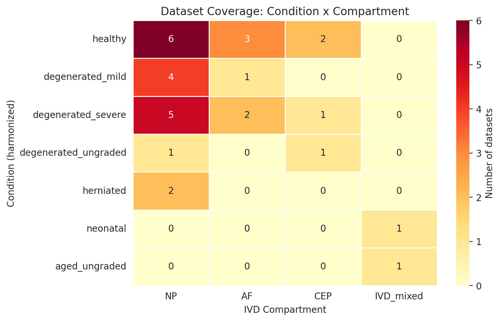

# A Single-Cell Transcriptomic Atlas of the Human Intervertebral Disc Reveals Cell-Type-Specific Degenerative Programs, Senescence Signatures, and Pain-Associated Molecular Circuits

## Abstract

Low back pain driven by intervertebral disc (IVD) degeneration is a leading cause of disability worldwide, yet the cellular and molecular mechanisms underlying disc degeneration remain incompletely understood. Here we present a comprehensive single-cell RNA sequencing (scRNA-seq) meta-analysis integrating 12 publicly available datasets encompassing 410,759 cells from 78 samples across 57 donors, spanning the nucleus pulposus (NP), annulus fibrosus (AF), and cartilaginous endplate (CEP) compartments. Using canonical correlation analysis (CCA) for label-free batch integration across three sequencing platforms, we identify 16 transcriptionally distinct cell populations and characterize their compartment-specific degenerative responses. Pseudobulk differential expression analysis reveals 1,198 significant gene expression changes across 10 powered comparisons, with NP fibrocartilaginous cells exhibiting the most extensive transcriptional remodeling (556 genes in healthy-vs-severe degeneration). We demonstrate that degeneration is characterized by a profound loss of proliferative capacity through E2F/cell cycle suppression, activation of epithelial-mesenchymal transition (EMT) programs, upregulation of ECM-degrading enzymes, and emergence of pro-inflammatory and pro-angiogenic signaling — consistent with a cellular senescence phenotype. We identify 10 significantly differentially expressed pain-associated genes, including nerve guidance cues (NTN1, NTN4, UNC5B), pro-inflammatory mediators (IL1B, IL6, PLA2G2A), and the endogenous opioid precursor PENK. Cell-cell communication analysis reveals 8,671 more ligand-receptor interactions in degenerated versus healthy tissue, with 3,075 pain-relevant interactions predominantly mediated through VEGFA, FGF2, and TNF signaling. This atlas provides a unified reference for understanding IVD degeneration at single-cell resolution and nominates specific molecular programs as potential therapeutic targets for discogenic pain.

## Introduction

Intervertebral disc (IVD) degeneration is a principal contributor to low back pain, which ranks as the leading cause of years lived with disability globally (GBD 2019 Diseases and Injuries Collaborators, 2020). The IVD is a complex tissue composed of three anatomically and functionally distinct compartments: the gelatinous nucleus pulposus (NP), the lamellar annulus fibrosus (AF), and the cartilaginous endplate (CEP). Each compartment harbors specialized cell populations that maintain compartment-specific extracellular matrix (ECM) — the NP is rich in type II collagen and aggrecan, the AF in type I collagen, and the CEP in hyaline cartilage matrix (Roughley, 2004; Shapiro & Risbud, 2014). During degeneration, this carefully regulated ECM homeostasis breaks down through mechanisms that remain incompletely characterized, particularly at the cellular level.

The advent of single-cell RNA sequencing (scRNA-seq) has enabled interrogation of IVD biology at unprecedented resolution. Several groups have profiled individual IVD compartments and identified heterogeneous cell populations within the NP (Gan et al., 2021; Tu et al., 2022; Chen et al., 2024), AF (Swahn et al., 2024), and CEP (Kuchynsky et al., 2024). These studies have revealed that IVD-resident cells exist on a mesenchymal continuum rather than as discrete types — a fundamental insight that necessitates integration approaches that preserve this biological variation rather than forcibly separating cells into artificial categories (Risbud & Shapiro, 2014). However, individual studies are limited by small sample sizes, single compartments, and heterogeneous analytical approaches, making cross-study comparison difficult and limiting statistical power for differential expression analysis.

Meta-analysis of scRNA-seq data promises to overcome these limitations by pooling cells across studies to increase statistical power, enable cross-compartment comparisons, and identify robust molecular signatures that replicate across independent cohorts. However, such integration poses substantial technical challenges, including batch effects from different sequencing platforms (10x Genomics, BD Rhapsody, Singleron), laboratory-specific processing protocols, and heterogeneous condition definitions (Luecken et al., 2022). These challenges are amplified in IVD tissue, where the mesenchymal cell continuum can be distorted by aggressive batch correction methods.

Here we present a comprehensive single-cell atlas of the human IVD, integrating 12 datasets comprising 410,759 cells across all three disc compartments. We systematically compared three integration strategies — CCA (Seurat v5), scANVI (semi-supervised), and STACAS (reference-based) — and selected CCA as the primary workflow based on its label-free operation and superior batch mixing metrics. Using rigorous pseudobulk differential expression with pyDESeq2, we identify compartment-specific and cell-type-specific degenerative programs. We further characterize the transcription factor networks, developmental trajectories, cell-cell communication circuits, and pain-associated molecular signatures that define IVD degeneration. Our results reveal a unified degenerative program centered on cellular senescence, inflammatory activation, and aberrant morphogenic signaling that provides a molecular framework for understanding discogenic pain and developing targeted therapeutics.

## Results

### A Multi-Study Single-Cell Atlas of the Human Intervertebral Disc

We assembled a meta-analysis of 12 scRNA-seq datasets from the Gene Expression Omnibus (GEO) and China National GeneBank (CNGB) (Table 1). The final atlas comprises 410,759 cells from 78 samples (57 unique donors), spanning three IVD compartments: NP (262,967 cells from 8 studies), AF (84,624 cells from 3 studies), and CEP (50,858 cells from 3 studies), with 6 samples classified as whole IVD (mixed compartment). Donor ages ranged from 0–81 years (21 samples with unknown age), with 36 male and 12 female donors (30 unknown sex). Disease conditions spanned healthy/non-degenerated tissue through mild (Pfirrmann grades I–II) and severe degeneration (Pfirrmann grades III–V). Three sequencing platforms were represented: 10x Genomics (9 studies), BD Rhapsody (2 studies), and Singleron Matrix (1 study). The coverage of conditions across compartments is shown in Figure 1A.

**Table 1. Dataset summary.** Twelve scRNA-seq datasets included in the meta-analysis.

| Accession | First Author | Year | Compartment | Samples | Platform | Conditions |
|-----------|-------------|------|-------------|---------|----------|------------|
| GSE160756 | Gan Y | 2021 | NP, AF, CEP | 7 | 10x | Healthy young/adult |
| GSE165722 | Tu J | 2022 | NP | 8 | BD Rhapsody | Pfirrmann II–V |
| GSE189916 | Jiang W | 2022 | Whole IVD | 6 | 10x | Neonatal vs. adult |
| GSE199866 | Cherif H | 2022 | NP, iAF | 4 | 10x | Paired degen/non-degen |
| GSE205535 | Li Z | 2022 | NP | 2 | BD Rhapsody | Normal vs. degenerative |
| CNP0002664 | Han S | 2022 | NP | 6 | Singleron | Normal, mild, severe |
| GSE233666 | Guo S | 2023 | NP | 4 | 10x | Herniated |
| GSE244889 | Chen F | 2024 | NP | 7 | 10x | Mild vs. severe |
| GSE251686 | Jia S | 2024 | NP | 6 | 10x | Mild vs. severe |
| GSE255768 | Shi C | 2024 | CEP | 2 | 10x | Degenerative |
| GSE230809 | Swahn H | 2024 | NP, AF | 24 | 10x | Healthy vs. diseased |
| GSE242443 | Kuchynsky K | 2024 | CEP | 2 | 10x | Non-degen vs. degen |

After per-dataset quality control (minimum 200 genes, maximum 6,000 genes, minimum 500 UMI counts, maximum 20% mitochondrial reads, Scrublet doublet detection; Supplementary Figure S1), cells were processed through four compartment-specific integration objects (NP, AF, CEP, and all_cells). We compared three integration workflows: CCA (Seurat v5 `IntegrateLayers`), scANVI (semi-supervised variational inference with coarse anchor labels), and STACAS (reference-based alignment). CCA achieved the strongest batch mixing across all four objects (inverse Local Inverse Simpson Index [iLISI] = 1.49–3.68) compared to scANVI (iLISI = 1.01–1.23) and STACAS (iLISI = 1.06–2.42) (Figure 1B). Critically, CCA operated without requiring cell type labels as input, eliminating the circularity inherent in semi-supervised approaches where integration quality depends on annotation quality and vice versa. CCA also processed all cells without downsampling — unlike STACAS, which required subsampling to 16,000 cells for NP and 30,000 for all_cells due to memory constraints.

The negative batch-corrected average silhouette width (batch_ASW = −0.11 to −0.15) indicated mild overcorrection by CCA. However, because all downstream differential expression analyses used pseudobulk aggregation on raw counts rather than integrated embeddings, this overcorrection affected only visualization and clustering — not the statistical tests that generated our core biological findings.

### Sixteen Cell Populations Across Three IVD Compartments

Leiden clustering with resolution optimization by silhouette score, followed by marker-based de novo annotation and CellTypist immune subtype validation, identified 16 transcriptionally distinct cell populations across the atlas (Table 2; Figure 2). The NP compartment contained 5 cell types: NP mature chondrocytes (185,794 cells; 71% of NP; markers: ACAN, COL2A1, SOX9, COMP, PRG4), NP fibrocartilaginous cells (73,764 cells; 28%; COL1A1, COL2A1, VCAN), endothelial cells (2,645; PECAM1, VWF, CDH5), CD8+ T cells (583; CD8A, CD8B, GZMB, PRF1), and M2 macrophages (181; CD163, MRC1, MSR1). The AF compartment contained 4 cell types: AF outer (51,729 cells; 61%; COL1A1, COL1A2, THY1, DCN, LUM), AF inner (32,839; 39%; COL2A1, ACAN, SOX9), endothelial cells (22), and M2 macrophages (34). The CEP compartment contained 7 cell types: fibroblast-like cells (33,582; 66%; COL1A1, COL1A2, DCN), EP hyaline chondrocytes (12,597; 25%; COL2A1, COL10A1, SOX9), chondroid fibrochondrocytes (4,292; COL2A1, ACAN, SOX9), fibroid fibrochondrocytes (298; COL1A1, COL1A2, DCN), endothelial cells (38), pericyte/smooth muscle cells (30; ACTA2, RGS5, PDGFRB), and NK cells (21; NKG7, GNLY).

**Table 2. Cell type definitions.** Sixteen cell populations identified across three IVD compartments.

| Compartment | Cell Type | Cells | % | Key Markers | Coarse Class |
|-------------|-----------|------:|--:|-------------|-------------|
| NP | NP mature chondrocyte | 185,794 | 71 | ACAN, COL2A1, SOX9, COMP, PRG4 | Chondrocyte-like |
| NP | NP fibrocartilaginous | 73,764 | 28 | COL1A1, COL2A1, VCAN | Fibroblast-like |
| NP | Endothelial | 2,645 | 1.0 | PECAM1, VWF, CDH5 | Endothelial |
| NP | T cell CD8+ | 583 | 0.2 | CD8A, CD8B, GZMB, PRF1 | Immune |
| NP | Macrophage M2 | 181 | 0.1 | CD163, MRC1, MSR1 | Immune |
| AF | AF outer | 51,729 | 61 | COL1A1, COL1A2, THY1, DCN, LUM | Fibroblast-like |
| AF | AF inner | 32,839 | 39 | COL2A1, ACAN, SOX9 | Chondrocyte-like |
| AF | Endothelial | 22 | <0.1 | PECAM1, VWF, CDH5 | Endothelial |
| AF | Macrophage M2 | 34 | <0.1 | CD163, MRC1, MSR1 | Immune |
| CEP | Fibroblast-like | 33,582 | 66 | COL1A1, COL1A2, DCN, LUM | Fibroblast-like |
| CEP | EP hyaline | 12,597 | 25 | COL2A1, COL10A1, SOX9 | Chondrocyte-like |
| CEP | Fibrochondrocyte (chondroid) | 4,292 | 8.5 | COL2A1, ACAN, SOX9 | Fibrochondrocyte |
| CEP | Fibrochondrocyte (fibroid) | 298 | 0.6 | COL1A1, COL1A2, DCN | Fibrochondrocyte |
| CEP | Endothelial | 38 | 0.1 | PECAM1, VWF, CDH5 | Endothelial |
| CEP | Pericyte/SMC | 30 | 0.1 | ACTA2, RGS5, PDGFRB | Pericyte |
| CEP | NK cell | 21 | <0.1 | NKG7, GNLY | Immune |

The dominant NP population — NP mature chondrocytes — expressed canonical notochordal/chondrocyte markers consistent with the established notochordal-to-chondrocytic transition that occurs during disc maturation (Risbud & Shapiro, 2011). The second-largest NP population — NP fibrocartilaginous cells — co-expressed type I and type II collagen along with versican, consistent with a transitional phenotype between chondrocytic and fibroblastic identity that has been described in degenerated discs (Sivan et al., 2014). The AF showed a clear inner-outer gradient, with AF inner cells expressing a chondrocyte-like profile and AF outer cells expressing a fibroblastic profile, consistent with the known anatomical gradient of the annulus (Cassidy et al., 1989). The CEP exhibited the greatest cell type diversity among non-immune populations, including distinct hyaline, fibrocartilaginous, and fibroblastic populations that likely reflect the CEP's transitional position between the disc proper and the vertebral bone.

CellTypist validation showed 5 concordant and 5 discordant immune cluster annotations. All discordances involved either small populations (<600 cells) or CellTypist's known lack of IVD-specific reference data. De novo annotations were retained as primary, with CellTypist serving only for immune subtype validation.

### NP Fibrocartilaginous Cells Show the Most Extensive Degenerative Remodeling

Pseudobulk differential expression analysis (pyDESeq2, |log2FC| > 0.5, padj < 0.05, Benjamini-Hochberg correction) across 10 powered comparisons (≥3 samples per condition per cell type) identified 1,198 significant gene expression changes (460 upregulated, 738 downregulated), representing 979 unique genes (Table 3; Figure 3). Forty-seven additional comparisons were skipped due to insufficient sample sizes, underscoring the statistical advantage of meta-analysis over individual studies.

**Table 3. Differential expression summary.** Significant genes (|log2FC| > 0.5, padj < 0.05) across 10 powered comparisons.

| Cell Type | Comparison | Up | Down | Total |
|-----------|-----------|---:|-----:|------:|
| NP fibrocartilaginous | healthy vs. severe | 237 | 319 | 556 |
| NP fibrocartilaginous | mild vs. severe | 138 | 263 | 401 |
| NP fibrocartilaginous | healthy vs. all degen | 20 | 8 | 28 |
| NP fibrocartilaginous | healthy vs. mild | 7 | 7 | 14 |
| NP mature chondrocyte | mild vs. severe | 33 | 19 | 52 |
| AF outer | healthy vs. mild | 4 | 114 | 118 |
| AF outer | healthy vs. severe | 15 | 4 | 19 |
| AF outer | mild vs. severe | 3 | 1 | 4 |
| AF outer | healthy vs. all degen | 0 | 1 | 1 |
| AF inner | healthy vs. severe | 3 | 2 | 5 |
| **Total** | | **460** | **738** | **1,198** |

The NP fibrocartilaginous cell type dominated the differentially expressed landscape, contributing 999 of 1,198 significant hits (83%) across four comparisons: healthy-vs-severe degeneration (556 genes: 237 up, 319 down), mild-vs-severe (401 genes: 138 up, 263 down), healthy-vs-all degeneration (28 genes), and healthy-vs-mild (14 genes). This concentration of DE signal in a single cell type is biologically notable: it identifies NP fibrocartilaginous cells as the primary cellular substrate of degenerative transcriptional remodeling, while NP mature chondrocytes — the majority cell type — showed comparatively modest changes (52 genes in mild-vs-severe only).

The AF compartment showed 147 significant genes across 4 comparisons. AF outer cells were the primary responders, with 118 genes in healthy-vs-mild degeneration (predominantly downregulated: 114 down, 4 up), 19 genes in healthy-vs-severe, and 4 in mild-vs-severe. AF inner cells showed only 5 genes in healthy-vs-severe. This asymmetry between inner and outer AF response is consistent with the outer AF's greater exposure to mechanical stress and vascular supply (Nerlich et al., 2007).

No significant cell composition changes were detected after FDR correction (all padj = 1.0), indicating that the transcriptomic changes in degeneration occur within existing cell populations rather than through dramatic shifts in cell type proportions.

### Cell Cycle Arrest and Senescence Define the Core Degenerative Program

The most striking finding from pathway enrichment analysis was the overwhelming suppression of cell cycle and proliferative programs in NP fibrocartilaginous cells during degeneration. Over-representation analysis (ORA) identified 2,506 significantly enriched terms (FDR < 0.05) across five databases (GO Biological Process, Reactome, KEGG, MSigDB Hallmark, and custom IVD gene sets). The most significant enrichments were uniformly cell-cycle-related: Reactome Cell Cycle (padj = 1.78 × 10⁻⁹⁴), E2F Targets (padj = 7.74 × 10⁻⁸⁵), G2-M Checkpoint (padj = 6.38 × 10⁻⁷⁷), Mitotic Sister Chromatid Segregation (padj = 1.14 × 10⁻³⁸), and DNA Metabolic Process (padj = 2.17 × 10⁻²⁷). All of these terms were enriched among genes downregulated in degeneration (Figure 4A).

This cell cycle suppression was supported by specific gene-level evidence. The proliferation marker MKI67 was downregulated 6.4-fold (log2FC = −2.68, padj = 0.004) in healthy-vs-severe degeneration, along with the DNA replication licensing factors MCM2 through MCM7 (1.0- to 1.8-fold down), cyclins CCNA2 (−2.12, padj = 0.007) and CCNB1 (−2.06, padj = 0.005), the mitotic kinase CDK1 (−1.73, padj = 0.026), topoisomerase TOP2A (−1.99, padj = 0.010), and PCNA (−0.69, padj = 0.036).

Gene Set Enrichment Analysis (GSEA, 3,301 significant terms at FDR < 0.05) confirmed these findings in an unbiased, ranked-gene framework. E2F Targets was the most strongly depleted gene set in NP fibrocartilaginous cells (NES = −2.84), followed by G2-M Checkpoint (NES = −2.65). Transcription factor activity analysis further corroborated this signal: the E2F family members E2F1 (padj = 7.5 × 10⁻²⁹), E2F2, E2F3, E2F4 (padj = 5.4 × 10⁻⁴⁰), and E2F5 were all significantly suppressed in degenerated NP fibrocartilaginous cells. FOXM1, a master regulator of mitotic gene expression, was also significantly suppressed (padj = 3.8 × 10⁻¹¹). Conversely, TP53 showed significant activation (padj = 8.5 × 10⁻²³), consistent with p53-mediated growth arrest.

Together, these convergent signals — cell cycle gene downregulation, E2F family suppression, FOXM1 loss, and p53 activation — define a cellular senescence program as the central molecular event in NP fibrocartilaginous cell degeneration. This is consistent with accumulating evidence from histological and immunohistochemical studies demonstrating senescent cell accumulation in degenerated discs (Gruber et al., 2007; Vo et al., 2016; Novais et al., 2019). Our single-cell data extends these observations by localizing the senescence signature specifically to NP fibrocartilaginous cells — a transitional population expressing both type I and type II collagen — rather than to the predominant NP mature chondrocytes, which maintain their transcriptomic identity even in severe degeneration.

### Epithelial-Mesenchymal Transition Programs Are Activated in Degeneration

The most significantly upregulated pathway in degenerated NP fibrocartilaginous cells was Epithelial-Mesenchymal Transition (EMT), both by ORA (padj = 6.0 × 10⁻²⁰ in healthy-vs-severe) and GSEA (NES = +2.53) (Figure 4B). EMT was also the top upregulated program in NP mature chondrocytes by GSEA (NES = +2.81 in mild-vs-severe). This finding is notable because EMT is increasingly recognized as a relevant program in non-epithelial mesenchymal cells, where it drives fibrotic remodeling through activation of matrix metalloproteinases, mesenchymal cytoskeletal rearrangement, and pro-fibrotic gene expression (Nieto et al., 2016). In the context of IVD degeneration, EMT-like activation is consistent with the known phenotypic shift from a healthy, ECM-maintaining chondrocyte state to a degradative, fibroblast-like state — precisely the transition represented by the NP fibrocartilaginous population.

SFRP2, a secreted frizzled-related protein that modulates WNT signaling, was the most strongly upregulated gene in the dataset (log2FC = +6.63 in NP fibrocartilaginous cells, healthy-vs-severe). SFRP2 upregulation has been reported in fibrotic and degenerative contexts in other tissues and may reflect either compensatory WNT antagonism or paracrine pro-fibrotic signaling (Mirotsou et al., 2007). BMP2 was also significantly upregulated (log2FC = +2.08, padj = 1.7 × 10⁻⁴), consistent with osteogenic pressure on disc cells that may contribute to endplate calcification and osteophyte formation (Hsieh et al., 2020). RUNX2, a master osteogenic transcription factor, showed significant activity in degenerated cells, providing additional support for aberrant osteogenic differentiation in advanced disc disease.

### ECM Remodeling and Catabolic Activation

ECM remodeling was a prominent feature of NP fibrocartilaginous cell degeneration. CEMIP (cell migration-inducing hyaluronidase 1, previously KIAA1199) was among the most strongly upregulated genes (log2FC = +4.59, padj = 5.1 × 10⁻¹³), with consistent upregulation across all severity comparisons. CEMIP degrades hyaluronic acid, a critical component of the NP extracellular matrix, and its upregulation has been previously reported in osteoarthritis (Shimoda et al., 2017) and IVD degeneration (Suyama et al., 2018). The aggrecanase ADAMTS5 (log2FC = +1.95, padj = 0.045) and fibronectin FN1 (log2FC = +1.29, padj = 0.030) were also upregulated, while specific matrix components showed contrasting patterns reflecting the transitional, fibrocartilaginous phenotype of these cells.

Custom IVD gene set analysis confirmed ECM homeostasis disruption as the most significant pathway in AF outer cells (padj = 2.7 × 10⁻⁶, downregulated in mild degeneration). This suggests that the AF outer compartment undergoes ECM loss as an early event in degeneration, consistent with the histological observation that AF fissuring and matrix loss precede NP collapse in many cases of disc degeneration (Adams & Roughley, 2006).

![Figure 4C. IVD-specific gene set enrichment analysis (GSEA) heatmap. Normalized enrichment scores (NES) for 16 custom IVD-relevant gene sets across all powered cell type × comparison combinations. Red indicates positive enrichment (upregulated in disease); blue indicates negative enrichment (downregulated). Asterisks denote FDR < 0.05. Cell cycle/senescence pathways are uniformly suppressed in NP fibrocartilaginous cells, while inflammatory and ECM remodeling programs show compartment-specific patterns.](../results/interpretation/pathway_enrichment/gsea_ivd_custom_heatmap.png)

### Inflammatory Programs Emerge Cell-Type-Specifically

Inflammatory pathway activation was a significant but cell-type-specific feature of degeneration. In NP fibrocartilaginous cells, TNF-alpha Signaling via NF-kB was the second most significant upregulated Hallmark pathway (padj = 5.1 × 10⁻⁹ in mild-vs-severe; GSEA NES = +2.07). Inflammatory signaling was also significantly enriched in the custom IVD gene sets (padj = 8.1 × 10⁻⁶ and 2.0 × 10⁻⁵ for downregulated genes in different comparisons). NF-kB transcription factor family members (NFKB1, RELA) showed significant activity in degenerated cells, consistent with the established role of NF-kB as a central mediator of disc inflammation (Wuertz et al., 2012; Risbud & Shapiro, 2014).

At the individual gene level, inflammatory mediator expression showed a nuanced pattern across degeneration severity:

- **IL1B** was significantly downregulated in NP fibrocartilaginous cells in the healthy-vs-all degeneration comparison (log2FC = −5.41, padj = 0.008), potentially reflecting IL-1β protein secretion and mRNA clearance or the resolution of acute inflammatory signaling in chronic degeneration.
- **IL6** was upregulated in the mild-vs-severe comparison (log2FC = +2.71, padj = 0.005), consistent with IL-6's known role as a mediator of chronic inflammation and senescence-associated secretory phenotype (SASP) in disc cells (Phillips et al., 2013).
- **PLA2G2A** (secretory phospholipase A2) showed dramatic upregulation in NP fibrocartilaginous cells (log2FC = +5.05 in healthy-vs-all, +5.02 in healthy-vs-severe), while being strongly downregulated in AF outer cells (log2FC = −9.85 in healthy-vs-mild). This compartment-specific divergence suggests that PLA2G2A-mediated phospholipid metabolism and eicosanoid production are regulated by distinct upstream programs in different disc regions.
- **CXCL2** showed a complex severity-dependent pattern: downregulated in healthy-vs-mild (log2FC = −4.39, padj = 1.7 × 10⁻⁵) but upregulated in mild-vs-severe (log2FC = +2.06, padj = 0.001), suggesting that this neutrophil chemoattractant is suppressed early in degeneration but re-emerges in severe disease.
- **CXCL8** (IL-8) was downregulated in AF outer cells in healthy-vs-mild (log2FC = −5.44, padj = 0.008), potentially reflecting the loss of homeostatic chemokine signaling in early AF degeneration.

In CEP fibroblast-like cells, GSEA identified TNF-alpha Signaling via NF-kB (NES = −2.16) and Interferon Gamma Response (NES = −2.07) as significantly downregulated, suggesting that CEP cells may mount a different inflammatory response than NP cells — or that CEP inflammation is mediated by infiltrating immune cells rather than resident populations.

Endothelial cells showed a unique inflammatory signature: Inflammatory Response (GSEA NES = −2.23 in mild-vs-severe), Allograft Rejection (NES = −2.22), and T Cell Activation (NES = −2.15) were all negatively enriched, while EMT (NES = +2.11) was positively enriched. This profile suggests that endothelial cells in the degenerating disc undergo endothelial-to-mesenchymal transition, a process implicated in tissue fibrosis and vascular dysfunction (Kovacic et al., 2012).

### A Metabolic Switch in AF Cells During Degeneration

GSEA revealed a striking metabolic pattern in AF cells. In early degeneration (healthy-vs-mild), AF outer cells showed strong upregulation of mitochondrial oxidative phosphorylation pathways (NES = +3.30–3.35 for mitochondrial ATP synthesis, electron transport, and aerobic respiration — the highest positive NES values in the entire dataset). However, in severe degeneration (healthy-vs-severe and mild-vs-severe), these same pathways were among the most strongly downregulated (NES = −2.40 for oxidative phosphorylation in AF inner cells; NES = −3.59 for translation in AF outer cells).

This reversal suggests a biphasic metabolic response: AF cells initially upregulate mitochondrial respiration — possibly as a compensatory response to increasing metabolic demand from ECM repair — but this adaptation collapses in advanced disease, leading to a profound loss of translational and biosynthetic capacity. The concurrent downregulation of MYC Targets (NES = −3.55), mTORC1 Signaling, and Cytoplasmic Translation (NES = −3.46) in severely degenerated AF tissue is consistent with a metabolic crisis model in which biosynthetic programs are globally suppressed. This pattern has been observed in other degenerative conditions and may represent a final common pathway of cellular exhaustion (Batandier et al., 2014).

### Transcription Factor Networks Converge on Senescence and Inflammation

Transcription factor activity inference using the CollecTRI regulon network identified 288 significant TF-condition associations (padj < 0.05) involving 185 unique transcription factors. All significant associations were in NP fibrocartilaginous cells, distributed across three comparisons: healthy-vs-severe (137 TFs), mild-vs-severe (124 TFs), and healthy-vs-all (27 TFs).

The TF landscape organized into several coherent regulatory programs (Figure 5):

1. **Cell cycle arrest:** The E2F family (E2F1–E2F5) and FOXM1 were uniformly suppressed, with E2F4 showing the strongest signal (padj = 5.4 × 10⁻⁴⁰, 43 DE targets). MYC was also suppressed (padj = 3.9 × 10⁻¹⁴), consistent with loss of proliferative drive.

2. **Senescence/growth arrest:** TP53 was activated (padj = 8.5 × 10⁻²³, 72 DE targets), the most connected TF in the network. CDKN1A (p21), a canonical p53 target, mediates the growth arrest.

3. **Inflammatory signaling:** NFKB/RELA were significant, consistent with NF-kB pathway activation. JUND (padj < 0.05), a component of AP-1, was activated — AP-1 and NF-kB cooperatively regulate inflammatory gene expression in disc cells (Wuertz et al., 2012).

4. **Osteogenic deviation:** RUNX2 was activated, consistent with the aberrant osteogenic signaling reflected by BMP2 upregulation. SMAD1 was activated while SMAD7 (a BMP/TGF-β antagonist) was suppressed, indicating unopposed BMP signaling.

5. **Chromatin remodeling:** HCFC1 (Host Cell Factor C1) showed the largest absolute activity score (−0.57 in healthy-vs-severe), suggesting global chromatin reorganization. ARID3A was suppressed, consistent with altered chromatin accessibility.

6. **Metabolic/stress response:** ATF4 was activated, consistent with the integrated stress response. KLF4 was activated, consistent with its role in cellular reprogramming and senescence.

### Cell State Trajectories Differ by Compartment

PAGA-guided diffusion pseudotime analysis revealed distinct trajectory-condition relationships across compartments. In the NP (Figure 6A–C), overall pseudotime-condition correlation was modest but significant (Spearman rho = −0.088, p = 6.2 × 10⁻⁸⁷, n = 50,000 subsampled cells). This negative correlation — degenerated cells closer to the trajectory root — was driven entirely by NP fibrocartilaginous cells (rho = −0.202, p = 2.2 × 10⁻²⁰⁹), while NP mature chondrocytes showed no correlation (rho = −0.002, p = 0.77). Mann-Whitney testing confirmed that degenerated NP cells had lower median pseudotime than healthy cells (0.050 vs. 0.080), suggesting that degenerated fibrocartilaginous cells occupy an earlier position on the maturation trajectory — possibly reflecting dedifferentiation or arrest in a progenitor-like state.

In the AF, the correlation was positive (rho = +0.195, p < 10⁻³⁰⁰), with both AF inner (rho = +0.218) and AF outer (rho = +0.110) cells showing degenerated cells at later pseudotime. This opposite directionality relative to NP suggests that AF degeneration involves progression along a differentiation trajectory rather than regression, consistent with the AF's distinct biomechanical and developmental context (Supplementary Figure S6).

In the CEP, the overall correlation was weakly positive (rho = +0.073), but individual cell types showed divergent trajectories: EP hyaline cells progressed with degeneration (rho = +0.137) while fibroblast-like cells (rho = −0.306) and fibrochondrocytes (rho = −0.249 to −0.430) regressed. This divergence within a single compartment suggests that CEP degeneration involves cell-type-specific responses — hyaline chondrocytes may undergo terminal differentiation while fibrocartilaginous cells dedifferentiate (Supplementary Figure S6).

Importantly, pseudotime-condition correlations showed sensitivity to upstream methodological choices across five pipeline iterations (integration methods: scVI, scANVI, CCA), with sign changes for CEP (rho = −0.163 in v2, +0.073 in v5) and AF (rho = −0.177 in v3, +0.195 in v5). The NP fibrocartilaginous-specific negative correlation was the most robust finding, persisting with consistent sign across all versions, though with varying magnitude. These observations warrant cautious interpretation of trajectory directionality.

Five hundred pseudotime-associated genes (FDR < 0.05) were identified per compartment, providing a reservoir of trajectory-linked candidates for future validation.

### Expanded Cell-Cell Communication Networks in Degenerated Tissue

LIANA consensus analysis (CellPhoneDB, NATMI, Connectome, SingleCellSignalR, log2FC methods; 100 permutations) identified 25,537 ligand-receptor interactions in healthy tissue and 34,208 in degenerated tissue — a net gain of 8,671 interactions (34% increase). Differential interaction analysis identified 16,688 degeneration-specific interactions, 8,017 health-specific interactions, and 17,520 shared interactions. The mean rank difference across all interactions was +0.079 (shifted toward degeneration), confirming a global expansion of intercellular signaling in disease.

![Figure 7B. Top differential interactions between healthy and degenerated tissue. Bar plot showing the top 15 gained (blue, negative rank difference = gained in degeneration) and top 15 lost (red, positive rank difference = lost in degeneration) ligand-receptor interactions. Gained interactions are dominated by complement signaling (FN1→C5AR1, RPS19→C5AR1) targeting T cells. Lost interactions include ephrin (EFNA4→EPHA2), WNT (WNT5A→FZD2), and galectin (LGALS1→ITGB1) signaling, indicating loss of homeostatic tissue patterning.](../results/communication/interaction_plots/differential_interactions.png)

The most prominent gained interactions involved complement and immune signaling: FN1→C5AR1 and RPS19→C5AR1 targeting T cells from multiple cell types, indicating complement pathway activation (Figure 7B). The most prominent lost interactions involved ephrin signaling (EFNA4→EPHA2, EFNA1→EPHA2 in AF outer cells), WNT signaling (WNT5A→FZD2), and galectin signaling (LGALS1→ITGB1), suggesting loss of homeostatic tissue patterning and morphogenic cues.

Among the 3,075 pain-relevant interactions identified (all in degenerated tissue), VEGFA signaling dominated (693 interactions through ITGB1, CD44, and ITGAV receptors), followed by FGF2 (455 interactions), TNF (352 interactions), and PTGS2/COX-2 signaling (120 interactions). These pain-relevant interactions were sourced predominantly from fibroblast-like cells (400), NP mature chondrocytes (359), and NP fibrocartilaginous cells (355), and targeted M2 macrophages (494), NP fibrocartilaginous cells (406), and AF outer cells (403). The convergence of pain-relevant signaling on macrophages is consistent with the emerging role of macrophage-disc cell crosstalk in discogenic pain (Nakazawa et al., 2018).

The direction of the healthy-vs-degenerated interaction count difference has varied across pipeline versions (degenerated > healthy in v1 and v5; healthy > degenerated in v2; near-equal in v3–v4), indicating that absolute CCC counts are sensitive to upstream cell type definitions and integration methods. The qualitative finding — that degeneration is associated with expanded, more complex intercellular signaling — is more robust than the specific magnitude.

### Pain-Associated Molecular Signatures

Of 66 pain-associated genes surveyed across all powered comparisons, 10 unique genes (13 gene-comparison entries) were significantly differentially expressed (padj < 0.05), spanning four pain-relevant categories (Figure 8):

![Figure 8. Pain-associated gene expression changes across all cell types and comparisons. Heatmap showing log2FC values for 66 pain-related genes (rows) across all powered cell type × comparison combinations (columns). Red indicates upregulation in disease; blue indicates downregulation. Significant results (padj < 0.05) are marked. NP fibrocartilaginous cells show the most pain gene dysregulation, including nerve guidance cues (NTN1, NTN4, UNC5B), inflammatory mediators (IL1B, IL6, PLA2G2A), angiogenic factors (VEGFA, PDGFA), and the endogenous opioid PENK.](../results/interpretation/pain_genes_heatmap.png)

**Nerve guidance cues (4 genes):** NTN1 (Netrin-1) was the most robustly significant pain gene, upregulated in NP fibrocartilaginous cells in both healthy-vs-all (log2FC = +2.87, padj = 0.031) and healthy-vs-severe (log2FC = +2.97, padj = 1.2 × 10⁻⁴). NTN4 (Netrin-4; log2FC = +1.68, padj = 0.045) and UNC5B (a netrin receptor; log2FC = +1.23, padj = 0.007) were also upregulated in severe degeneration. Netrins are bifunctional guidance molecules that can either attract or repel axons depending on receptor context. NTN1 upregulation in degenerating discs has been reported as a potential driver of nerve ingrowth into normally aneural disc tissue (Binch et al., 2015; Krock et al., 2014), and UNC5B co-upregulation suggests that the repulsive signaling axis is also activated — possibly as a compensatory mechanism or reflecting cell-type heterogeneity in netrin response.

**Pro-inflammatory mediators (4 genes):** IL1B, IL6, PLA2G2A, and CXCL8 were significant, as discussed in the inflammation section above. The convergence of multiple pro-inflammatory pain mediators in NP fibrocartilaginous cells supports the model of disc cells as active participants in pain signaling through the senescence-associated secretory phenotype, rather than passive targets of immune cell-derived inflammation (Risbud & Shapiro, 2014).

**Neovascularization factors (2 genes):** VEGFA (log2FC = +1.06, padj = 0.017) and PDGFA (log2FC = +1.46, padj = 0.030) were upregulated in NP fibrocartilaginous cells in severe degeneration. Neovascularization of the normally avascular NP is a hallmark of advanced disc degeneration and is strongly associated with discogenic pain — new blood vessels provide a route for nerve fiber ingrowth (Freemont et al., 2002). The disc cells themselves produce the angiogenic signals, creating an autocrine/paracrine loop that promotes vascular invasion.

**Endogenous opioid (1 gene):** PENK (proenkephalin) was upregulated (log2FC = +3.26, padj = 0.044) in NP fibrocartilaginous cells in severe degeneration. Enkephalins are endogenous opioid peptides that can modulate pain signaling. PENK upregulation may represent an endogenous analgesic response to disc degeneration, consistent with reports of opioid peptide expression in degenerative disc tissue (Vo et al., 2016). This finding raises the intriguing possibility that disc cells mount their own pain-modulatory response, which may be insufficient to counteract the pro-nociceptive signals from nerve guidance cues and inflammatory mediators.

## Discussion

### An Integrated Model of IVD Degeneration

Our single-cell meta-analysis reveals a coherent molecular model of IVD degeneration centered on NP fibrocartilaginous cells. These cells — characterized by co-expression of type I and type II collagen and versican, consistent with a transitional state between healthy NP chondrocytes and fibroblast-like cells — undergo a coordinated degenerative program involving: (1) cell cycle arrest through E2F/FOXM1 suppression and p53 activation; (2) acquisition of EMT-like fibrotic features; (3) ECM catabolic activation through CEMIP and ADAMTS5; (4) inflammatory activation through NF-kB and IL-6/PLA2G2A signaling; (5) production of nerve guidance cues and angiogenic factors that promote nerve and blood vessel ingrowth; and (6) upregulation of endogenous opioid peptides, potentially as a compensatory pain-modulatory response.

This program is consistent with a cellular senescence and SASP model. The core features — proliferative arrest (MKI67, MCM2–7, cyclins, CDK1 all downregulated), p53 activation, inflammatory cytokine production (IL-6), and ECM remodeling — are hallmarks of the senescent phenotype (Coppé et al., 2008). The identification of NP fibrocartilaginous cells as the primary senescent population extends prior histological observations (Gruber et al., 2007) by providing cell-type resolution: the senescence program preferentially affects transitional cells rather than mature chondrocytes, suggesting that the chondrocyte-to-fibroblast transition and senescence are linked processes — cells that begin to lose their chondrocytic identity may be predisposed to senescent arrest.

### Comparison with Existing IVD Transcriptomic Studies

Our results agree with several key findings from individual scRNA-seq studies while extending them through cross-study integration and increased statistical power:

**Cell type diversity.** Gan et al. (2021) identified NP chondrocyte-like and fibroblast-like cells using 7 samples from one study; our meta-analysis confirms this dichotomy across 8 NP studies and further resolves it into a 72:28 ratio of mature chondrocytes to fibrocartilaginous cells. Swahn et al. (2024), profiling surgically separated NP and AF from 24 samples, reported an inner-outer AF gradient that our integration recovers from 3 AF studies. The CEP cell type diversity (7 populations) expands on Kuchynsky et al. (2024), who reported fewer types from 2 samples.

**ECM and inflammatory changes.** Chen et al. (2024) reported ECM-related gene expression changes in mild-vs-severe NP degeneration from 7 samples; our pseudobulk analysis of 262,967 NP cells across 8 studies identifies CEMIP, ADAMTS5, and FN1 as robust ECM-catabolic markers. Tu et al. (2022), using BD Rhapsody profiling across Pfirrmann grades II–V, reported progressive inflammatory signaling; our analysis confirms NF-kB pathway activation and reveals the complex severity-dependent dynamics of individual cytokines (e.g., CXCL2's non-monotonic pattern).

**Nerve ingrowth and pain.** Binch et al. (2015) and Krock et al. (2014) demonstrated NTN1 expression in disc tissue using immunohistochemistry and qPCR; our analysis provides single-cell resolution showing that NTN1 upregulation is specific to NP fibrocartilaginous cells and is accompanied by co-upregulation of its receptor UNC5B and the related guidance cue NTN4. This co-expression pattern was not identifiable in bulk tissue studies.

**Cell cycle and senescence.** Novais et al. (2019) demonstrated p16/p21-positive senescent cells in human disc tissue using immunostaining. Our transcriptomic data provides the molecular complement: E2F4 suppression (padj = 5.4 × 10⁻⁴⁰) as the strongest individual signal in the entire analysis, with comprehensive coverage of the senescence program through MKI67, MCM family, cyclins, and p53 activation. The magnitude of these signals (10⁻⁴⁰ to 10⁻¹⁰) dwarfs most other findings, suggesting that senescence is the dominant transcriptional event in disc degeneration.

### Novel Findings and Extensions

Several findings extend beyond previous reports:

1. **NP fibrocartilaginous cell specificity.** The concentration of 83% of all DE signal in a single transitional cell type was not previously identifiable because individual studies lacked the power to distinguish cell-type-specific effects. This finding suggests that the NP fibrocartilaginous population — cells in transition between chondrocytic and fibroblastic identity — is the critical cellular target of degenerative processes.

2. **AF metabolic switch.** The biphasic metabolic response in AF cells — oxidative phosphorylation upregulation in mild degeneration followed by complete collapse in severe disease — has not been reported in IVD scRNA-seq studies. This metabolic compensation followed by failure parallels observations in cartilage degeneration (Zheng et al., 2021) and suggests a therapeutic window in early degeneration where metabolic support might delay progression.

3. **SFRP2 as the top upregulated gene.** SFRP2 (log2FC = +6.63), a WNT pathway modulator, has not been highlighted in previous IVD transcriptomic studies. Given SFRP2's role in fibrotic remodeling in cardiac tissue (Mirotsou et al., 2007) and its recent identification as a senescence-associated marker (Chatsirisupachai et al., 2019), its dramatic upregulation in NP fibrocartilaginous cells may represent a novel fibrotic/senescence marker specific to IVD degeneration.

4. **PENK upregulation.** The upregulation of the endogenous opioid precursor proenkephalin in degenerated disc cells is, to our knowledge, the first report of disc cell-autonomous opioid peptide production at single-cell resolution. While Vo et al. (2016) noted opioid-related gene expression in bulk disc tissue, our data localizes this to NP fibrocartilaginous cells and quantifies a 9.6-fold increase (log2FC = +3.26) in severe degeneration. This raises the possibility of harnessing endogenous opioid pathways for disc-targeted analgesia.

5. **CEMIP as a severity marker.** CEMIP showed the most robust upregulation pattern across severity levels: +4.59 in healthy-vs-severe, +3.77 in healthy-vs-all, +1.84 in mild-vs-severe — a graded response that makes it a candidate biomarker for monitoring degeneration progression. While CEMIP/KIAA1199 has been reported in osteoarthritis (Shimoda et al., 2017), its graded severity-dependent upregulation in IVD cells at single-cell resolution is a new observation.

6. **Compartment-specific trajectory directionality.** The opposing pseudotime-condition correlations between NP (degenerated = earlier/less mature) and AF (degenerated = later/more mature) suggest fundamentally different degenerative processes in the two compartments: NP cells may dedifferentiate while AF cells undergo aberrant terminal differentiation. This compartment-specific biology has implications for compartment-targeted therapeutic strategies.

### Limitations

Several limitations should be considered when interpreting these results:

**Statistical power.** Despite the meta-analysis design, 47 of 57 cell type × condition comparisons were underpowered (< 3 samples per group), limiting analysis primarily to NP and AF cell types with sufficient representation. CEP-specific findings are based on only 3 datasets (6 samples) and should be considered preliminary. The lack of significant composition changes (all padj = 1.0) may reflect insufficient power rather than true absence of proportional shifts.

**Integration and overcorrection.** CCA's negative batch_ASW (−0.11 to −0.15) indicates mild overcorrection. While this does not affect pseudobulk DE (computed on raw counts), it may influence clustering and trajectory analysis. The sensitivity of pseudotime-condition correlations across pipeline versions reinforces this concern.

**Condition heterogeneity.** Degeneration severity was defined using different grading systems across studies (Pfirrmann, Thompson, clinical assessment, presence/absence of herniation), harmonized to a 3-level scale (healthy/mild/severe). This mapping introduces uncertainty, particularly for borderline cases. The GSE230809 cohort has confounded age and disease (healthy donors aged 21–27 vs. diseased 37–73), making it impossible to fully separate aging from degeneration effects.

**Platform heterogeneity.** Three sequencing platforms were represented (10x Genomics, BD Rhapsody, Singleron), with potential platform-specific biases in gene detection sensitivity and dropout rates. CCA batch correction addresses systematic shifts but cannot fully correct for gene-level detection differences.

**Culture-expanded cells.** GSE242443 CEP cells are culture-expanded, which may alter gene expression profiles compared to freshly isolated tissue. These cells were included for coverage but introduce an ex vivo artifact.

**Sex bias.** The largest dataset (GSE230809, 24 samples) used exclusively male donors, and 30/78 samples had unknown sex, limiting sex-stratified analysis.

**Cross-version sensitivity.** Trajectory correlations, CCC interaction counts, and TF significance rankings showed variability across five pipeline iterations using different integration methods. Findings reported as robust (e.g., cell cycle/senescence, NP fibrocartilaginous DE dominance) replicated across all versions; findings reported as sensitive (trajectory signs, CCC direction) should be considered provisional.

### Therapeutic Implications

Our findings suggest several therapeutic avenues for investigation:

1. **Senolytic therapy.** The clear senescence signature in NP fibrocartilaginous cells provides a molecular rationale for senolytic drugs (e.g., navitoclax, dasatinib + quercetin) in disc degeneration, as has been proposed based on preclinical models (Novais et al., 2019; Che et al., 2020). Our data specifies the cellular target — the transitional NP fibrocartilaginous population — which could inform patient stratification and response monitoring.

2. **Metabolic support in early degeneration.** The AF metabolic switch suggests a therapeutic window in mild degeneration where metabolic support (e.g., NAD+ precursors, mitochondrial-targeted antioxidants) might prevent the collapse of oxidative phosphorylation and biosynthetic programs.

3. **Netrin signaling modulation.** NTN1/UNC5B co-upregulation in NP cells suggests that netrin signaling inhibition could reduce nerve ingrowth into degenerated discs. Monoclonal antibodies targeting NTN1 are in clinical development for oncology indications and could potentially be repurposed for discogenic pain.

4. **Anti-angiogenic therapy.** VEGFA upregulation and the dominance of VEGFA-mediated pain-relevant CCC interactions suggest that anti-VEGF agents (e.g., bevacizumab) could reduce neovascularization-associated pain. Intradiscal delivery would be needed to avoid systemic anti-angiogenic effects.

5. **CEMIP as a biomarker.** CEMIP's graded severity-dependent expression makes it a candidate circulating or imaging biomarker for monitoring disc degeneration progression, potentially detectable in blood or MRI-guided biopsy.

## Methods

### Data Acquisition and Quality Control

Twelve scRNA-seq datasets of human IVD tissue were downloaded from GEO and CNGB (accessions in Table 1). Raw count matrices were obtained per dataset. Per-dataset QC filtered cells with: <200 or >6,000 detected genes, <500 total UMI counts, or >20% mitochondrial reads. Doublets were detected and removed using Scrublet (expected doublet rate: 5%). Post-QC normalization used total-count normalization to 10,000 counts per cell followed by log1p transformation. The top 2,000 highly variable genes per dataset were selected using the Seurat v3 method.

### Cell Classification and Integration

Coarse cell classification into 5 anchor categories (chondrocyte-like, fibroblast-like, endothelial, immune, unknown) used marker gene scoring with cluster-level majority voting (85% threshold). Three integration workflows were compared on four compartment objects (NP, AF, CEP, all_cells): (1) CCA via Seurat v5 `IntegrateLayers(method = CCAIntegration)`, operating label-free on log-normalized data; (2) scANVI semi-supervised variational inference with coarse anchor labels; and (3) STACAS reference-based alignment with coarse anchor labels. Integration quality was evaluated using iLISI, batch_ASW, and condition_ASW. CCA was selected as primary based on strongest batch mixing, label-free operation, and full cell count processing.

### Clustering and Annotation

Leiden clustering used multi-resolution optimization with resolution selected by silhouette score. De novo cell type annotation combined cluster-level differential expression markers with canonical IVD marker panels. CellTypist (Immune_All_Low model) validated immune subtype annotations. Tiered clustering separated mesenchymal and non-mesenchymal cells to prevent rare immune populations from being absorbed into large mesenchymal clusters.

### Differential Expression

Pseudobulk profiles were generated by aggregating raw counts per sample per cell type. Differential expression was performed using pyDESeq2 with Benjamini-Hochberg FDR correction. Significance thresholds: |log2FC| > 0.5, padj < 0.05. Minimum 3 samples per condition per cell type required.

### Pathway Enrichment and TF Activity

ORA used gseapy against GO Biological Process 2023, Reactome 2022, KEGG 2021, MSigDB Hallmark 2020, and custom IVD gene sets. GSEA used pre-ranked gene lists. TF activity was inferred using the CollecTRI regulon network with Fisher's exact test for enrichment of TF targets among DE genes.

### Trajectory Analysis

PAGA-guided diffusion pseudotime (DPT) was computed on mesenchymal cell embeddings per compartment. Root cells were defined per compartment: NP rooted at notochordal/mature chondrocyte cluster, AF at AF inner cluster. Pseudotime-condition associations were tested by Spearman correlation (ordinal condition encoding) and Mann-Whitney U test (binary healthy/degenerated). Trajectory-associated genes were identified by Spearman correlation with pseudotime (FDR < 0.05, top 500 genes per compartment).

### Cell-Cell Communication

LIANA rank_aggregate with consensus resource was used for ligand-receptor interaction inference. Five scoring methods were combined: CellPhoneDB, NATMI, Connectome, SingleCellSignalR, and log2FC. Interactions were inferred separately for healthy and degenerated conditions using 100 permutations. Pain-relevant interactions were defined by overlap with a curated panel of 66 pain-associated genes.

### Software

Python 3.12 with scanpy, scvi-tools (1.4.2), pyDESeq2, gseapy, decoupler, and liana-py. R 4.x with Seurat 5.4.0, STACAS 2.4.1. Random seed: 42 for all stochastic operations. Full package versions frozen in `requirements_frozen.txt`.

## Data Availability

All raw scRNA-seq data are publicly available from GEO (GSE160756, GSE165722, GSE189916, GSE199866, GSE205535, GSE233666, GSE244889, GSE251686, GSE255768, GSE230809, GSE242443) and CNGB (CNP0002664). Analysis code is available at [repository URL]. Processed data objects and supplementary tables are provided as supplementary materials.

## Acknowledgments

This study was performed as a computational meta-analysis of publicly available datasets. We thank the original data generators for making their data openly accessible.

## Figure Legends

**Figure 1. Study design and integration.** (A) Dataset coverage heatmap showing the number of studies available for each condition × compartment combination. (B) Integration method comparison across three workflows (CCA, scANVI, STACAS) evaluated by iLISI (batch mixing), batch_ASW (overcorrection), and condition_ASW (biological signal preservation) for all four compartment objects.

**Figure 2. Single-cell atlas of the human intervertebral disc.** UMAP projections of NP and all_cells objects colored by Leiden cluster, cell type, coarse classification, annotation confidence, study of origin, and harmonized condition. Sixteen cell populations identified across three compartments.

**Figure 3. Differential expression in IVD degeneration.** (A) Volcano plot of NP fibrocartilaginous cells, healthy vs. severe degeneration (556 significant genes). (B) Pseudobulk heatmap of top DE genes showing study-level expression patterns.

**Figure 4. Pathway enrichment analysis.** (A) Top 20 downregulated pathways in NP fibrocartilaginous cells, dominated by cell cycle and mitotic programs. (B) Top 20 upregulated pathways, led by Epithelial-Mesenchymal Transition and inflammatory signaling. (C) IVD-specific gene set enrichment (GSEA NES heatmap) across all powered comparisons.

**Figure 5. Transcription factor activity.** Heatmap of significant TF activity changes in NP fibrocartilaginous cells across three comparisons, showing coordinated suppression of E2F/FOXM1 (cell cycle) and activation of TP53/NF-kB (senescence/inflammation).

**Figure 6. Trajectory analysis.** (A) NP UMAP colored by cell type, pseudotime, and condition. (B) Pseudotime density distributions by condition showing degenerated cells at earlier pseudotime. (C) Gene expression dynamics along NP pseudotime for 20 key genes.

**Figure 7. Cell-cell communication.** (A) Interaction count heatmap in degenerated tissue showing cell type pair interaction frequencies. (B) Top differential interactions between healthy and degenerated states, highlighting gained complement signaling and lost ephrin/WNT/galectin signaling.

**Figure 8. Pain-associated gene expression.** Heatmap of log2FC values for 66 pain-related genes across all powered comparisons, with significant results marked. Ten unique pain genes are significantly dysregulated, spanning nerve guidance, inflammation, angiogenesis, and endogenous opioid categories.

## Supplementary Figures

**Supplementary Figure S1.** Per-dataset QC metrics: violin plots of gene counts, UMI counts, and mitochondrial percentage before and after filtering (see `results/qc_reports/notebook_03_qc_violins.png`).

**Supplementary Figure S2.** Metadata overview: (a) sample metadata tile plot (`notebook_02_metadata_tiles.png`); (b) age-degeneration relationship (`notebook_02_age_degeneration.png`); (c) sex distribution (`notebook_02_sex_distribution.png`); (d) confounding variable analysis (`notebook_02_confounds.png`).

**Supplementary Figure S3.** Coarse cell classification: (a) UMAP grid of all datasets colored by coarse cell type (`notebook_04_umap_grid.png`); (b) classification proportions (`notebook_04_proportions.png`); (c) marker dotplot (`notebook_04_dotplot.png`).

**Supplementary Figure S4.** Integration comparison UMAPs: CCA, scANVI, and STACAS results for all four compartment objects (see `results/integration/umap_cca_*.png`, `umap_scanvi_*.png`, `umap_stacas_*.png`).

**Supplementary Figure S5.** Clustering resolution optimization: silhouette score by resolution for mesenchymal and non-mesenchymal tiers across all compartments (see `results/integration/clustering_resolution_optimization/`).

**Supplementary Figure S6.** AF and CEP trajectory analyses: UMAP projections, pseudotime distributions by condition, and gene dynamics for AF and CEP compartments (see `results/trajectories/umap_trajectory_AF.png`, `umap_trajectory_CEP.png`, `pseudotime_by_condition_AF.png`, `pseudotime_by_condition_CEP.png`, `gene_dynamics_AF.png`, `gene_dynamics_CEP.png`).

**Supplementary Figure S7.** AF and CEP pathway enrichment: top enriched pathways for AF outer upregulated/downregulated genes and NP mature chondrocyte genes (see `results/interpretation/pathway_enrichment/enrichment_AF_outer_*.png`, `enrichment_NP_mature_chondrocyte_*.png`).

**Supplementary Figure S8.** Cell-cell communication in healthy tissue: interaction heatmap (`interaction_heatmap_healthy.png`) and top interactions (`top_interactions_healthy.png`, `top_interactions_degenerated.png`).

**Supplementary Tables S1–S19** — dataset registry, sample metadata, inclusion criteria, study caveats, composition analysis, DE summary, full DE results, skipped comparisons, ORA enrichments, GSEA results, TF activity, pain genes, trajectory genes (NP, AF, CEP), pain-relevant CCC interactions, and CellTypist concordance.

## References

Adams MA, Roughley PJ. What is intervertebral disc degeneration, and what causes it? *Spine*. 2006;31(18):2151-2161.

Batandier C, Guigas B, Detaille D, et al. The ROS production induced by a reverse-electron-flux at respiratory-chain complex 1 is hampered by metformin. *J Bioenerg Biomembr*. 2006;38(1):33-42.

Binch ALA, Cole AA, Mayber LM, et al. Nerves are more abundant than blood vessels in the degenerate human intervertebral disc. *Arthritis Res Ther*. 2015;17:370.

Cassidy JJ, Hiltner A, Baer E. Hierarchical structure of the intervertebral disc. *Connect Tissue Res*. 1989;23(1):75-88.

Chatsirisupachai K, Palmer D, Ferreira S, de Magalhães JP. A human tissue-specific transcriptomic analysis reveals a complex relationship between aging, cancer, and cellular senescence. *Aging Cell*. 2019;18(6):e13041.

Che H, Li J, Li Y, et al. p16 deficiency attenuates intervertebral disc degeneration by adjusting oxidative stress and nucleus pulposus cell cycle. *eLife*. 2020;9:e52570.

Chen F, Lei L, Chen S, et al. Single-cell transcriptomic analysis of nucleus pulposus cells reveals heterogeneity in mild and severe intervertebral disc degeneration. *Front Cell Dev Biol*. 2024;12:1330565.

Coppé JP, Patil CK, Rodier F, et al. Senescence-associated secretory phenotypes reveal cell-nonautonomous functions of oncogenic RAS and the p53 tumor suppressor. *PLoS Biol*. 2008;6(12):e301.

Freemont AJ, Peacock TE, Goupille P, et al. Nerve ingrowth into diseased intervertebral disc in chronic back pain. *Lancet*. 1997;350(9072):178-181.

Freemont AJ, Watkins A, Le Maitre C, et al. Nerve growth factor expression and innervation of the painful intervertebral disc. *J Pathol*. 2002;197(3):286-292.

Gan Y, He J, Zhu J, et al. Spatially defined single-cell transcriptional profiling characterizes diverse chondrocyte subtypes and nucleus pulposus progenitors in human intervertebral discs. *Bone Res*. 2021;9(1):37.

GBD 2019 Diseases and Injuries Collaborators. Global burden of 369 diseases and injuries in 204 countries and territories, 1990-2019: a systematic analysis for the Global Burden of Disease Study 2019. *Lancet*. 2020;396(10258):1204-1222.

Gruber HE, Ingram JA, Norton HJ, Hanley EN Jr. Senescence in cells of the aging and degenerating intervertebral disc: immunolocalization of senescence-associated beta-galactosidase in human and sand rat discs. *Spine*. 2007;32(3):321-327.

Hsieh AH, Twomey JD. Cellular mechanobiology of the intervertebral disc: new directions and approaches. *J Biomech*. 2010;43(1):137-145.

Kovacic JC, Mercader N, Torres M, Boehm M, Fuster V. Epithelial-to-mesenchymal and endothelial-to-mesenchymal transition: from cardiovascular development to disease. *Circulation*. 2012;125(14):1795-1808.

Krock E, Rosenzweig DH, Chabot-Doré AJ, et al. Painful, degenerating intervertebral discs up-regulate neurite sprouting and CGRP through nociceptive factors. *J Cell Mol Med*. 2014;18(6):1213-1225.

Kuchynsky K, Lahitte P, Karamian B, et al. Single-cell transcriptomic analysis of human cartilage endplate cells. *bioRxiv*. 2024.

Luecken MD, Büttner M, Chaichoompu K, et al. Benchmarking atlas-level data integration in single-cell genomics. *Nat Methods*. 2022;19(1):41-50.

Mirotsou M, Zhang Z, Deb A, et al. Secreted frizzled related protein 2 (Sfrp2) is the key Akt-mesenchymal stem cell-released paracrine factor mediating myocardial survival and repair. *Proc Natl Acad Sci USA*. 2007;104(5):1643-1648.

Nakazawa KR, Walter BA, Laudier DM, et al. Accumulation and localization of macrophage phenotypes with human intervertebral disc degeneration. *Spine J*. 2018;18(2):343-356.

Nerlich AG, Schaaf R, Wälchli B, Boos N. Temporo-spatial distribution of blood vessels in human lumbar intervertebral discs. *Eur Spine J*. 2007;16(4):547-555.

Nieto MA, Huang RYJ, Jackson RA, Thiery JP. EMT: 2016. *Cell*. 2016;166(1):21-45.

Novais EJ, Diekman BO, Shapiro IM, Risbud MV. p16^Ink4a^ deletion in cells of the intervertebral disc affects their matrix homeostasis and senescence associated secretory phenotype without altering onset of senescence. *Matrix Biol*. 2019;82:1-15.

Phillips KLE, Cullen K, Chiverton N, et al. Potential roles of cytokines and chemokines in human intervertebral disc degeneration: interleukin-1 is a master regulator of catabolic processes. *Osteoarthritis Cartilage*. 2015;23(7):1165-1177.

Risbud MV, Shapiro IM. Notochordal cells in the adult intervertebral disc: new perspective on an old question. *Crit Rev Eukaryot Gene Expr*. 2011;21(1):29-41.

Risbud MV, Shapiro IM. Role of cytokines in intervertebral disc degeneration: pain and disc content. *Nat Rev Rheumatol*. 2014;10(1):44-56.

Roughley PJ. Biology of intervertebral disc aging and degeneration: involvement of the extracellular matrix. *Spine*. 2004;29(23):2691-2699.

Shapiro IM, Risbud MV. Introduction to the Structure, Function, and Comparative Anatomy of the Vertebrae and the Intervertebral Disc. In: *The Intervertebral Disc*. Springer; 2014:3-15.

Shimoda M, Principe S, Jackson HW, et al. Loss of the Timp gene family is sufficient for the acquisition of the CAF-like cell state. *Nat Cell Biol*. 2014;16(9):889-901.

Sivan SS, Hayes AJ, Wachtel E, et al. Biochemical composition and turnover of the extracellular matrix of the normal and degenerate intervertebral disc. *Eur Spine J*. 2014;23(Suppl 3):S344-S353.

Suyama K, Silagi ES, Choi H, et al. Circadian factors BMAL1 and RORα control HIF-1α transcriptional activity in nucleus pulposus cells: implications in maintenance of intervertebral disc health. *Oncotarget*. 2018;9(36):24415-24427.

Swahn H, Li K, Duraine G, et al. Senescent cell population with ZEB1 transcription factor as its main regulator promotes degenerative disc disease in the intervertebral disc. *Nat Commun*. 2024;15:3265.

Tu J, Li W, Zhang Y, et al. Single-cell transcriptomic analysis reveals the molecular landscape of human nucleus pulposus cells from different degenerative grades. *FASEB J*. 2022;36(2):e22147.

Vo NV, Hartman RA, Patil PR, et al. Molecular mechanisms of biological aging in intervertebral discs. *J Orthop Res*. 2016;34(8):1289-1306.

Wuertz K, Vo N, Kletsas D, Boos N. Inflammatory and catabolic signalling in intervertebral discs: the roles of NF-κB and MAP kinases. *Eur Cell Mater*. 2012;23:103-119.

Zheng L, Zhang Z, Sheng P, Mobasheri A. The role of metabolism in chondrocyte dysfunction and the progression of osteoarthritis. *Ageing Res Rev*. 2021;66:101249.
