# IVD Single-Cell Atlas: Pipeline Workflow

## Overview

Human-gated agentic bioinformatics pipeline analyzing 12 scRNA-seq datasets (436K cells, 78 samples, 57 donors) of human intervertebral disc tissue. Each module produces results that are reviewed at a human checkpoint before the pipeline advances.

## Workflow Diagram

```mermaid
flowchart TD
    %% ── Styles ──
    classDef module fill:#4A90D9,stroke:#2C5F8A,color:#fff,stroke-width:2px
    classDef checkpoint fill:#E8A838,stroke:#B07D20,color:#fff,stroke-width:3px
    classDef decision fill:#FFFACD,stroke:#B07D20,color:#333,stroke-width:1px,font-size:11px
    classDef data fill:#7BC47F,stroke:#4A8A4E,color:#fff,stroke-width:2px
    classDef complete fill:#95C8E8,stroke:#5A9ABF,color:#333,stroke-width:1px

    %% ── Spec Writing ──
    SPECS["Spec Writing\n10 module specifications"]:::module
    SPECS --> CP_SPECS

    CP_SPECS{{"HUMAN CHECKPOINT\nSpec Review & Approval"}}:::checkpoint
    CP_SPECS --> M01

    %% ── Module 01 ──
    M01["Module 01: Dataset Discovery\n13 candidates identified across 7 databases\n~533K cells total"]:::module
    M01 --> CP01

    CP01{{"HUMAN CHECKPOINT\nApprove Dataset List"}}:::checkpoint
    N01["Decisions:\n- Include GSE242443 (culture-expanded CEP)\n- Defer Zhou 2023 embryonic data to Module 08\n- Drop 2 NGDC datasets (NP already well-covered)\n- 12 datasets, coverage adequate"]:::decision
    CP01 -.- N01
    CP01 --> M02

    %% ── Module 02 ──
    M02["Module 02: Metadata Harmonization\n78 samples, 57 donors, 12 studies\nCondition mapping, demographics, compartment labels"]:::module
    M02 --> CP02

    CP02{{"HUMAN CHECKPOINT\nApprove Condition Mappings"}}:::checkpoint
    N02["Decisions (tentative):\n- Herniated kept separate from degenerated\n- GSE165722 Pfirrmann grades corrected (GEO off-by-one)\n- GSE244889 Pfirrmann I reclassified as healthy\n- Thompson III boundary: degenerated_mild\n- MUST revisit mappings before Module 06"]:::decision
    CP02 -.- N02
    CP02 --> M03

    %% ── Module 03 ──
    M03["Module 03: Preprocessing\n436,558 cells post-QC across 12 datasets\nQC: min_genes=200, max_genes=6000, max_mt=20%\nScrublet doublet detection"]:::module
    M03 --> CP03

    CP03{{"HUMAN CHECKPOINT\nQC Review (retroactive)"}}:::checkpoint
    N03["Notes:\n- 4 datasets had 100% retention (pre-filtered)\n- GSE251686_NP3 excluded (corrupt matrix)\n- Diffuse CD68 expected IVD biology\n- No blocking issues"]:::decision
    CP03 -.- N03
    CP03 --> M04

    %% ── Module 04 ──
    M04["Module 04: Cell Type Annotation\nMarker-based scoring (16 signatures)\n+ CellTypist (Immune_All_Low)\nConsensus labels in cell_type_final"]:::module
    M04 --> CP04

    CP04{{"HUMAN CHECKPOINT\nAnnotation Review (retroactive)"}}:::checkpoint
    N04["Notes:\n- NP subtypes: notochordal, mature chondrocyte,\n  stressed/degenerative, fibrocartilaginous\n- AF subtypes: inner, outer, mechanical stress\n- CellTypist refined immune populations\n- No IVD reference atlas available"]:::decision
    CP04 -.- N04
    CP04 --> M05

    %% ── Module 05 ──
    M05["Module 05: Integration\nTier 1: Non-resident cells (14.6K cells, scVI)\nTier 2: Resident cells (NP 139K, AF 283K)\n4 approaches: scVI, scANVI, Harmony, BBKNN"]:::module
    M05 --> CP05a

    CP05a{{"HUMAN CHECKPOINT\nTier 1 Integration Review"}}:::checkpoint
    N05a["Decisions:\n- Tier 1 scVI integration approved\n- Retroactive approval of Modules 03-04\n- Proceed to Tier 2"]:::decision
    CP05a -.- N05a
    CP05a --> CP05b

    CP05b{{"HUMAN CHECKPOINT\nTier 2 Integration Selection"}}:::checkpoint
    N05b["Decisions:\n- Primary: scANVI (best overall score + cell type ASW)\n- Sensitivity: scVI (preserves cell state continuum)\n- Harmony rejected (overcorrects, merges clusters)\n- BBKNN not primary (no corrected embedding)\n- Pseudobulk DE uses scANVI labels + raw counts"]:::decision
    CP05b -.- N05b

    %% ── Condition Mapping Revisit ──
    CP05b --> COND_REVIEW

    COND_REVIEW{{"HUMAN CHECKPOINT\nCondition Mapping Revisit\n(required before DE analysis)"}}:::checkpoint
    N_COND["Decisions:\n- Herniated: separate category (10 samples), exploratory\n- GSE205535_NNP (11yo trauma): exclude from DE\n- Thompson III boundary: accepted as mild\n- Neonatal (n=3): separate, not mixed into healthy\n- Aged ungraded (n=3): separate category\n- Primary comparison: healthy (20) vs degenerated_all (42)"]:::decision
    COND_REVIEW -.- N_COND
    COND_REVIEW --> M06

    %% ── Module 06 ──
    M06["Module 06: Differential Analysis\nComposition: Mann-Whitney U (0/58 significant)\nPseudobulk DE: pyDESeq2, 17 powered comparisons\n5,328 significant genes"]:::module
    M06 --> CP06

    CP06{{"HUMAN CHECKPOINT\nDE Results Review"}}:::checkpoint
    N06["Decisions:\n- Herniated comparison exploratory only\n  (RPL genes in top hits, likely study-confounded)\n- Endothelial annotation caveat noted\n  (some may be misclassified NP/AF)\n- Composition trends sensible despite no FDR hits\n- No systematic batch domination"]:::decision
    CP06 -.- N06
    CP06 --> M07

    %% ── Module 07 ──
    M07["Module 07: Biological Interpretation\nORA: 1,244 enrichments (GO/KEGG/Reactome/MSigDB)\nGSEA: 1,081 significant terms\nTF activity: 113 significant TFs\nPain gene analysis: 3 significant hits"]:::module
    M07 --> CP07

    CP07{{"HUMAN CHECKPOINT\nInterpretation Review"}}:::checkpoint
    N07["Decisions:\n- Pathways consistent with known IVD biology\n- Novel TF findings (ATF3/7, HSF1/2) to highlight\n- Pain analysis confirms indirect signaling model\n  (disc cells produce pro-inflammatory mediators,\n   not nociceptors)\n- No contradictions found"]:::decision
    CP07 -.- N07
    CP07 --> M08

    %% ── Module 08 ──
    M08["Module 08: Trajectory Analysis\nPAGA + diffusion pseudotime\nNP root: notochordal cluster\nAF root: AF_inner cluster\n500 trajectory genes per compartment"]:::module
    M08 --> CP08

    CP08{{"HUMAN CHECKPOINT\nTrajectory Review"}}:::checkpoint
    N08["Decisions:\n- NP trajectory: notochordal -> mature -> stressed\n- AF trajectory: inner -> outer -> mechanical_stress\n- Pseudotime correlates with disease condition\n- ~55% DE gene overlap confirms consistency\n- RNA velocity absent (acceptable)\n- Sensitivity check (scVI) confirms direction"]:::decision
    CP08 -.- N08
    CP08 --> M09

    %% ── Module 09 ──
    M09["Module 09: Cell-Cell Communication\nLIANA (4 methods consensus)\nHealthy: 44K interactions | Degenerated: 53K\n3,662-4,194 pain-relevant interactions"]:::module
    M09 --> CP09

    CP09{{"HUMAN CHECKPOINT\nCommunication Review"}}:::checkpoint
    N09["Decisions:\n- Interactions biologically plausible\n- Pain-relevant: neurotrophin + VEGF pathways\n- More interactions in degeneration (53K vs 44K)\n  consistent with increased paracrine signaling\n- Collagen-integrin positive controls confirmed"]:::decision
    CP09 -.- N09
    CP09 --> M10

    %% ── Module 10 ──
    M10["Module 10: Final Reporting\n12-section report, 13 supplementary tables\nAll 18 validation checks PASS"]:::module
    M10 --> CP10

    CP10{{"HUMAN CHECKPOINT\nFinal Review"}}:::checkpoint
    N10["AWAITING REVIEW"]:::decision
    CP10 -.- N10

    %% ── Data flow annotations ──
    D1[("data/raw/\n12 datasets")]:::data
    D2[("data/processed/\nper-dataset .h5ad")]:::data
    D3[("data/integrated/\nNP + AF atlases")]:::data
    D4[("results/\nDE, enrichments,\ntrajectory, CCC")]:::data
    D5[("results/final_report.html")]:::data

    D1 -.-> M03
    M03 -.-> D2
    D2 -.-> M05
    M05 -.-> D3
    D3 -.-> M06
    M06 -.-> D4
    D4 -.-> M10
    M10 -.-> D5
```

## Legend

| Element | Meaning |
|---------|---------|
| Blue boxes | Computational modules (agent-executed) |
| Orange hexagons | Human checkpoints (pipeline pauses for expert review) |
| Yellow notes | Key decisions made at each checkpoint |
| Green cylinders | Data artifacts |
| Dashed arrows | Data flow |
| Solid arrows | Pipeline sequence |

## Key Pipeline Characteristics

- **Human-in-the-loop**: 12 human checkpoints across 10 modules ensure scientific rigor
- **Tiered integration**: Non-resident cells (immune, endothelial) integrated separately from resident cells (NP, AF) to preserve the IVD cell state continuum
- **Pseudobulk DE**: Avoids treating cells as independent observations (a common single-cell pitfall)
- **Multi-method validation**: Integration compared 4 approaches; CCC used 4 method consensus
- **Condition mapping revisited**: Explicit checkpoint before DE analysis to finalize disease categories
