# IVD Single-Cell Atlas: Pipeline Workflow

## Overview

Human-gated agentic bioinformatics pipeline analyzing 11 scRNA-seq datasets (410K cells, 71 samples, 57 donors) of human intervertebral disc tissue. Each module produces results that are reviewed at a human checkpoint before the pipeline advances.

**How to read this diagram:** Blue boxes are computational modules (agent-executed). Orange hexagons are human checkpoints where the pipeline pauses. Yellow notes show the key decisions made. Full questions and rationale for each checkpoint are in the [Checkpoint Details](#checkpoint-details) section below.

## Workflow Diagram

```mermaid
flowchart TD
    %% ── Styles ──
    classDef module fill:#4A90D9,stroke:#2C5F8A,color:#fff,stroke-width:2px
    classDef checkpoint fill:#E8A838,stroke:#B07D20,color:#fff,stroke-width:3px
    classDef decision fill:#FFFACD,stroke:#B07D20,color:#333,stroke-width:1px,font-size:11px
    classDef data fill:#7BC47F,stroke:#4A8A4E,color:#fff,stroke-width:2px

    %% ── Spec Writing ──
    SPECS["Spec Writing<br/>10 module specifications"]:::module
    SPECS --> CP_SPECS

    CP_SPECS{{"HUMAN CHECKPOINT<br/>Spec Review & Approval"}}:::checkpoint
    CP_SPECS --> M01

    %% ── Module 01 ──
    M01["Module 01: Dataset Discovery<br/>13 candidates across 7 databases<br/>~533K cells total"]:::module
    M01 --> CP01

    CP01{{"HUMAN CHECKPOINT<br/>Approve Dataset List"}}:::checkpoint
    N01["Details: see #01 below<br/>- Include GSE242443 (culture-expanded CEP)<br/>- Defer Zhou 2023 embryonic data to Module 08<br/>- Drop 2 NGDC datasets (NP well-covered)<br/>- 12 datasets, coverage adequate"]:::decision
    CP01 -.- N01
    CP01 --> M02

    %% ── Module 02 ──
    M02["Module 02: Metadata Harmonization<br/>71 samples, 57 donors, 11 studies<br/>Condition mapping, demographics, compartment labels"]:::module
    M02 --> CP02

    CP02{{"HUMAN CHECKPOINT<br/>Approve Condition Mappings"}}:::checkpoint
    N02["Details: see #02 below<br/>- Herniated kept separate from degenerated<br/>- GSE165722 Pfirrmann grades corrected<br/>- GSE244889 Pfirrmann I reclassified as healthy<br/>- Thompson III boundary: degenerated_mild<br/>- MUST revisit mappings before Module 06"]:::decision
    CP02 -.- N02
    CP02 --> M03

    %% ── Module 03 ──
    M03["Module 03: Preprocessing<br/>~410K cells post-QC across 11 datasets<br/>QC: min_genes=200, max_genes=6000, max_mt=20%<br/>Scrublet doublet detection"]:::module
    M03 --> CP03

    CP03{{"HUMAN CHECKPOINT<br/>QC Review (retroactive)"}}:::checkpoint
    N03["Details: see #03 below<br/>- 4 datasets had 100% retention (pre-filtered)<br/>- GSE251686_NP3 excluded (corrupt matrix)<br/>- Diffuse CD68 expected IVD biology<br/>- No blocking issues"]:::decision
    CP03 -.- N03
    CP03 --> M04

    %% ── Module 04 ──
    M04["Module 04: Cell Classification<br/>Binary mesenchymal vs non-mesenchymal<br/>Marker-based scoring"]:::module
    M04 --> CP04

    CP04{{"HUMAN CHECKPOINT<br/>Annotation Review (retroactive)"}}:::checkpoint
    N04["Details: see #04 below<br/>- Binary classification: mesenchymal vs non-mesenchymal<br/>- 0% ambiguous across 11 datasets<br/>- Marker-based scoring"]:::decision
    CP04 -.- N04
    CP04 --> M05

    %% ── Module 05 ──
    M05["Module 05: Integration + Annotation<br/>4 compartment objects: NP (263K), AF (85K), CEP (51K), all_cells (411K)<br/>scVI integration, clustering, de novo annotation<br/>CellTypist validation for non-mesenchymal"]:::module
    M05 --> CP05

    CP05{{"HUMAN CHECKPOINT<br/>Integration + Annotation Review"}}:::checkpoint
    N05["Details: see #05 below (MOST CRITICAL GATE)<br/>- scVI-only integration, 4 compartment objects<br/>- De novo annotation with CellTypist validation<br/>- NP 8/13 discordant clusters flagged<br/>- Pseudobulk DE uses de novo labels"]:::decision
    CP05 -.- N05
    CP05 --> M06

    %% ── Module 06 ──
    M06["Module 06: Differential Analysis<br/>Composition: Mann-Whitney U<br/>Pseudobulk DE: pyDESeq2, 21 powered comparisons<br/>949 unique significant genes, herniated excluded"]:::module
    M06 --> CP06

    CP06{{"HUMAN CHECKPOINT<br/>DE Results Review"}}:::checkpoint
    N06["Details: see #06 below<br/>- 21 powered comparisons, herniated excluded<br/>- NP_fibrocartilaginous and EP_hyaline as new cell types<br/>- 949 unique significant genes<br/>- No systematic batch domination"]:::decision
    CP06 -.- N06
    CP06 --> M07

    %% ── Module 07 ──
    M07["Module 07: Biological Interpretation<br/>ORA: 1,577 enrichments (GO/KEGG/Reactome/MSigDB)<br/>GSEA: 1,576 significant terms<br/>TF activity: 290 significant TFs<br/>Pain gene analysis: 10 significant hits"]:::module
    M07 --> CP07

    CP07{{"HUMAN CHECKPOINT<br/>Interpretation Review"}}:::checkpoint
    N07["Details: see #07 below<br/>- 1,577 ORA enrichments, 290 significant TFs<br/>- 10 pain gene hits<br/>- Novel TF findings to highlight<br/>- No contradictions found"]:::decision
    CP07 -.- N07
    CP07 --> M08

    %% ── Module 08 ──
    M08["Module 08: Trajectory Analysis<br/>PAGA + diffusion pseudotime<br/>NP, AF, and CEP compartments<br/>500 trajectory genes per compartment"]:::module
    M08 --> CP08

    CP08{{"HUMAN CHECKPOINT<br/>Trajectory Review"}}:::checkpoint
    N08["Details: see #08 below<br/>- NP/AF/CEP trajectories<br/>- NP rho=-0.258, AF rho=+0.341 (reversed), CEP rho=-0.163<br/>- AF reversal flagged for investigation<br/>- Pseudotime-condition correlations computed"]:::decision
    CP08 -.- N08
    CP08 --> M09

    %% ── Module 09 ──
    M09["Module 09: Cell-Cell Communication<br/>LIANA (5 methods consensus)<br/>Healthy: 28.9K interactions | Degenerated: 27K<br/>Pain-relevant interactions flagged"]:::module
    M09 --> CP09

    CP09{{"HUMAN CHECKPOINT<br/>Communication Review"}}:::checkpoint
    N09["Details: see #09 below<br/>- Interactions biologically plausible<br/>- Pain-relevant: neurotrophin + VEGF pathways<br/>- Reversed CCC pattern: fewer interactions in degeneration (27K vs 28.9K)<br/>- Collagen-integrin positive controls confirmed"]:::decision
    CP09 -.- N09
    CP09 --> M10

    %% ── Module 10 ──
    M10["Module 10: Final Reporting<br/>12-section report, 19 supplementary tables<br/>All validation checks PASS"]:::module
    M10 --> CP10

    CP10{{"HUMAN CHECKPOINT<br/>Final Review"}}:::checkpoint
    N10["AWAITING REVIEW"]:::decision
    CP10 -.- N10

    %% ── Data flow annotations ──
    D1[("data/raw/<br/>11 datasets")]:::data
    D2[("data/processed/<br/>per-dataset .h5ad")]:::data
    D3[("data/integrated/<br/>NP, AF, CEP, all_cells")]:::data
    D4[("results/<br/>DE, enrichments, trajectory, CCC")]:::data
    D5[("results/final_report.html")]:::data

    D1 -.-> M03
    M03 -.-> D2
    D2 -.-> M05
    M05 -.-> D3
    D3 -.-> M06
    M06 -.-> D4
    D4 -.-> M10
    M10 -.-> D5

```

## Legend

| Element | Meaning |
|---------|---------|
| Blue boxes | Computational modules (agent-executed) |
| Orange hexagons | Human checkpoints (pipeline pauses for expert review) |
| Yellow notes | Key decisions made at each checkpoint |
| Green cylinders | Data artifacts |
| Dashed arrows | Data flow |
| Solid arrows | Pipeline sequence |

---

## Checkpoint Details

### Checkpoint: Specs Review & Approval

**Questions posed to reviewer:**
1. Are the 10 module specifications scientifically appropriate for building an IVD single-cell atlas?
2. Is the modular structure (one task per session, human gates between modules) adequate for quality control?
3. Are there missing analyses or modules that should be added?

**Decision:** All specs approved. Proceed to execution.

---

### Checkpoint 01: Dataset List

**Questions posed to reviewer:**
1. Are the inclusion/exclusion criteria appropriate? Should any be adjusted?
2. Are there any borderline datasets that should be reconsidered?
3. Is the coverage across compartments (NP, AF, CEP) and conditions (healthy, degenerated, aged, neonatal) adequate for the project goals?
4. Are there any datasets where the condition labels are ambiguous and need clarification?
5. Are there spatial transcriptomics datasets that should be earmarked for later validation?

**Decisions:**
- **Include GSE242443** (culture-expanded CEP) despite culture expansion — CEP coverage is limited and caveats will be documented
- **Defer Zhou 2023** embryonic IVD data to Module 08 (trajectory analysis) — not appropriate for the adult-focused atlas
- **Drop PRJCA014236 and PRJCA007656** (Chinese repositories) — NP compartment already well-covered without them
- **12 datasets approved**, coverage deemed adequate across compartments and conditions
- No human IVD spatial transcriptomics datasets found

---

### Checkpoint 02: Condition Mappings

**Questions posed to reviewer:**
1. Are the condition mappings accurate? Especially the ambiguous cases flagged.
2. Is the condition hierarchy appropriate? Should "herniated" be a separate axis or folded into degeneration severity?
3. Is the age group binning appropriate for the scientific questions?
4. Are there any donor-level confounds (e.g., same donor contributing to multiple conditions) that need special handling?
5. Should GSE205535 "normal" (11-year-old with spinal cord injury) be reclassified or excluded?
6. Given the sample distribution across conditions and compartments, is the analysis plan still viable? Are any comparisons underpowered?

**Decisions (tentative — must revisit before Module 06):**
- **Herniated kept separate** from degenerated — distinct biology expected
- **GSE165722 Pfirrmann grades corrected** — GEO had systematic off-by-one error vs. paper Table 1
- **GSE244889 Pfirrmann I reclassified as healthy** despite authors' "mildly degenerated disc" label
- **Thompson III boundary set to degenerated_mild** — conservative classification
- **Flagged for revisit:** GSE205535_NNP (11yo trauma), neonatal samples, herniated vs. degenerated distinction

---

### Checkpoint 03: QC Review

**Questions posed to reviewer:**
1. Are QC thresholds appropriate for each dataset? Do some need different mitochondrial thresholds?
2. Do the preliminary cell type labels make sense? Are expected cell types present where expected?
3. Are there datasets where quality is too low to include in downstream analysis?
4. Do any datasets show strong batch effects between samples within the same study?
5. Are there unexpected cell populations (contaminating cell types that shouldn't be in IVD)?
6. For the chondrocyte/fibroblast continuum — do they form one cluster or subclusters? Does resolution need adjustment?

**Decisions (retroactive review — checkpoint was not properly gated during execution):**
- QC thresholds accepted as appropriate (standard scRNA-seq thresholds)
- 4 datasets had 100% retention (pre-filtered by original authors) — acceptable
- **GSE251686_NP3 excluded** due to corrupt matrix file (5 of 6 samples retained)
- Diffuse CD68 expression in 6/12 datasets recognized as expected IVD biology (stressed disc cells express CD68 at low levels)
- No blocking issues identified

---

### Checkpoint 04: Annotation Review

**Questions posed to reviewer:**
1. Do the cell type labels make biological sense for each dataset?
2. For the chondrocyte/fibroblast continuum: are the discrete labels meaningful, or should we rely on continuous scores?
3. Are there cell populations that appear in some studies but not others — biology or technical artifact?
4. Should any gene signatures be revised based on what the data shows?
5. Is the annotation granularity appropriate — too coarse or too fine?
6. Do the original study annotations agree with ours? Where they disagree, which is more credible?

**Decisions (retroactive review):**
- Binary classification: mesenchymal vs non-mesenchymal
- 0% ambiguous across 11 datasets — clean separation
- Marker-based scoring sufficient for binary gate
- No blocking issues identified

---

### Checkpoint 05: Integration + Annotation Review

*This is the most critical checkpoint in the pipeline — the integration and annotation choices affect all downstream analyses.*

**Questions posed to reviewer:**
1. Does scVI integration adequately remove batch effects while preserving cell type structure across the 4 compartment objects?
2. Are the de novo cluster annotations biologically sensible?
3. Where CellTypist disagrees with de novo labels, which is more credible?
4. Are there study-specific effects that persist after integration?
5. Does the integration reveal any new cell states not visible in per-dataset analysis?

**Decisions:**
- **scVI-only integration** — 4 compartment objects: NP (263K cells), AF (85K cells), CEP (51K cells), all_cells (411K cells)
- **De novo annotation** via clustering + marker analysis, with CellTypist validation for non-mesenchymal cells
- **NP: 8 of 13 clusters discordant** between de novo and CellTypist — flagged but de novo labels retained (CellTypist lacks IVD-specific training)
- **NP_fibrocartilaginous** and **EP_hyaline** identified as new cell types
- Pseudobulk DE will use de novo labels + raw counts

---

### Checkpoint 06: Differential Analysis Results

**Questions posed to reviewer:**
1. Do the composition changes make biological sense? (e.g., increased immune infiltration with degeneration)
2. Are the DE results consistent with known IVD biology? (e.g., upregulation of catabolic enzymes, inflammatory cytokines)
3. Are there unexpected findings that warrant follow-up?
4. Is there evidence that study covariates dominate the results (more genes associated with study than condition)?
5. Are there comparisons that should be added, removed, or redefined?
6. Should any DE results feed back into annotation (e.g., subclusters with very different DE profiles)?

**Key results presented:** 21 powered DE comparisons. 949 unique significant genes. Herniated excluded from comparisons. NP_fibrocartilaginous and EP_hyaline identified as new cell types.

**Decisions:**
- **Herniated excluded** from DE comparisons — condition mapping revisited before rerun
- **21 powered comparisons** across NP, AF, CEP compartments
- **NP_fibrocartilaginous and EP_hyaline** accepted as new cell types with distinct DE profiles
- No systematic batch domination in degeneration comparisons

---

### Checkpoint 07: Biological Interpretation

**Questions posed to reviewer:**
1. Are the enriched pathways consistent with known IVD degeneration biology?
2. Are there novel pathways or transcription factors that warrant follow-up?
3. Do the pain-associated findings suggest specific cell types as primary contributors to discogenic pain?
4. Are there actionable targets (e.g., druggable genes) among the top hits?
5. Are there findings that contradict established IVD biology — artifacts or genuinely novel?

**Key results presented:** 1,577 ORA enrichments. 1,576 GSEA significant terms. ECM, inflammatory, collagen, immune pathways confirmed. 290 significant TFs. 10 significant pain gene hits.

**Decisions:**
- Pathways **consistent with known IVD biology** — ECM degradation, inflammatory signaling, cellular senescence all enriched in degeneration
- **Novel TF findings worth highlighting:** ATF3/ATF7 (stress response in NP severe), HSF1/HSF2 (heat shock/stress across cell types), E2F4/TFDP1 (cell cycle re-entry in NP severe)
- **Pain analysis confirms indirect signaling model** — disc cells produce pro-inflammatory mediators (TNF, CXCL8) that sensitize nerves; disc cells are not nociceptors themselves
- No contradictions with established biology

---

### Checkpoint 08: Trajectory Analysis

**Questions posed to reviewer:**
1. Does the inferred trajectory make biological sense? Is the root cell choice appropriate?
2. Does pseudotime align with the expected healthy-to-degenerated axis, or is it capturing batch/compartment effects?
3. Are the velocity results coherent or noisy? Should they be included?
4. Do gene programs along the trajectory reveal a staged degenerative process or a smooth gradient?
5. Are there branch points suggesting divergent cell fates?
6. Should trajectory findings feed back into cell type annotation?

**Key results presented:** PAGA + DPT for NP, AF, and CEP compartments. Pseudotime-condition correlations: NP rho=-0.258, AF rho=+0.341 (reversed direction), CEP rho=-0.163. 500 trajectory genes per compartment.

**Decisions:**
- **NP trajectory biologically sensible:** pseudotime correlates with degeneration (rho=-0.258)
- **AF trajectory reversed:** rho=+0.341 indicates healthy cells at later pseudotime — flagged for investigation, may reflect AF-specific biology or integration artifact
- **CEP trajectory:** modest correlation (rho=-0.163) with degeneration
- **RNA velocity unavailable** (no spliced/unspliced layers in input data) — documented and acceptable
- AF reversal requires cautious interpretation in manuscript

---

### Checkpoint 09: Cell-Cell Communication

**Questions posed to reviewer:**
1. Are the top interactions biologically plausible?
2. Do condition-specific interactions suggest mechanisms by which immune cells drive degeneration?
3. Are there pain-relevant interactions that could be therapeutic targets?
4. Are any interactions likely artifacts of ambient RNA or doublets?

**Key results presented:** LIANA consensus (5-method: CellPhoneDB + NATMI + Connectome + SingleCellSignalR + logFC). Healthy: 28.9K interactions. Degenerated: 27K interactions. Pain-relevant interactions flagged.

**Decisions:**
- Interactions **biologically plausible** — collagen-integrin positive controls confirmed
- Pain-relevant interactions include **neurotrophin and VEGF pathways**
- **Reversed CCC pattern:** fewer interactions in degeneration (27K vs 28.9K) — opposite of v1 finding; may reflect loss of tissue organization in degenerated discs
- No artifact concerns flagged

---

### Checkpoint 10: Final Review

**Questions posed to reviewer:**
1. Does the report accurately represent the findings?
2. Are the conclusions supported by the evidence?
3. Are limitations adequately described?
4. What follow-up analyses or experiments are suggested by the results?
5. Is this ready for presentation to collaborators or for manuscript preparation?

**Status: AWAITING REVIEW**

---

## Key Pipeline Characteristics

- **Human-in-the-loop**: 11 human checkpoints across 10 modules ensure scientific rigor
- **Compartment-based integration**: Separate scVI integration for NP, AF, CEP, and all_cells objects to preserve compartment-specific biology
- **Pseudobulk DE**: Avoids treating cells as independent observations (a common single-cell pitfall)
- **Multi-method validation**: CCC used 5-method consensus; CellTypist cross-validation for annotation
- **Most critical gate**: Module 05 (Integration + Annotation) — this choice cascades through all downstream analyses
