# IVD Single-Cell Atlas: Pipeline Workflow

## Overview

Human-gated agentic bioinformatics pipeline analyzing 12 scRNA-seq datasets (436K cells, 78 samples, 57 donors) of human intervertebral disc tissue. Each module produces results that are reviewed at a human checkpoint before the pipeline advances.

**How to read this diagram:** Blue boxes are computational modules (agent-executed). Orange hexagons are human checkpoints where the pipeline pauses — click any checkpoint to jump to its detailed questions and decisions below. Yellow notes show the key decisions made.

## Workflow Diagram

```mermaid
flowchart TD
    %% ── Styles ──
    classDef module fill:#4A90D9,stroke:#2C5F8A,color:#fff,stroke-width:2px
    classDef checkpoint fill:#E8A838,stroke:#B07D20,color:#fff,stroke-width:3px
    classDef decision fill:#FFFACD,stroke:#B07D20,color:#333,stroke-width:1px,font-size:11px
    classDef data fill:#7BC47F,stroke:#4A8A4E,color:#fff,stroke-width:2px

    %% ── Spec Writing ──
    SPECS["Spec Writing<br/>10 module specifications"]:::module
    SPECS --> CP_SPECS

    CP_SPECS{{"HUMAN CHECKPOINT<br/>Spec Review & Approval"}}:::checkpoint
    CP_SPECS --> M01

    %% ── Module 01 ──
    M01["Module 01: Dataset Discovery<br/>13 candidates across 7 databases<br/>~533K cells total"]:::module
    M01 --> CP01

    CP01{{"HUMAN CHECKPOINT<br/>Approve Dataset List"}}:::checkpoint
    N01["Decided:<br/>- Include GSE242443 (culture-expanded CEP)<br/>- Defer Zhou 2023 embryonic data to Module 08<br/>- Drop 2 NGDC datasets (NP well-covered)<br/>- 12 datasets, coverage adequate"]:::decision
    CP01 -.- N01
    CP01 --> M02

    %% ── Module 02 ──
    M02["Module 02: Metadata Harmonization<br/>78 samples, 57 donors, 12 studies<br/>Condition mapping, demographics, compartment labels"]:::module
    M02 --> CP02

    CP02{{"HUMAN CHECKPOINT<br/>Approve Condition Mappings"}}:::checkpoint
    N02["Decided (tentative):<br/>- Herniated kept separate from degenerated<br/>- GSE165722 Pfirrmann grades corrected<br/>- GSE244889 Pfirrmann I reclassified as healthy<br/>- Thompson III boundary: degenerated_mild<br/>- MUST revisit mappings before Module 06"]:::decision
    CP02 -.- N02
    CP02 --> M03

    %% ── Module 03 ──
    M03["Module 03: Preprocessing<br/>436,558 cells post-QC across 12 datasets<br/>QC: min_genes=200, max_genes=6000, max_mt=20%<br/>Scrublet doublet detection"]:::module
    M03 --> CP03

    CP03{{"HUMAN CHECKPOINT<br/>QC Review (retroactive)"}}:::checkpoint
    N03["Decided:<br/>- 4 datasets had 100% retention (pre-filtered)<br/>- GSE251686_NP3 excluded (corrupt matrix)<br/>- Diffuse CD68 expected IVD biology<br/>- No blocking issues"]:::decision
    CP03 -.- N03
    CP03 --> M04

    %% ── Module 04 ──
    M04["Module 04: Cell Type Annotation<br/>Marker-based scoring (16 signatures)<br/>+ CellTypist (Immune_All_Low)<br/>Consensus labels in cell_type_final"]:::module
    M04 --> CP04

    CP04{{"HUMAN CHECKPOINT<br/>Annotation Review (retroactive)"}}:::checkpoint
    N04["Decided:<br/>- NP subtypes: notochordal, mature, stressed, fibrocartilaginous<br/>- AF subtypes: inner, outer, mechanical stress<br/>- CellTypist refined immune populations<br/>- No IVD reference atlas available"]:::decision
    CP04 -.- N04
    CP04 --> M05

    %% ── Module 05 ──
    M05["Module 05: Integration<br/>Tier 1: Non-resident cells (14.6K cells, scVI)<br/>Tier 2: Resident cells (NP 139K, AF 283K)<br/>4 approaches: scVI, scANVI, Harmony, BBKNN"]:::module
    M05 --> CP05a

    CP05a{{"HUMAN CHECKPOINT<br/>Tier 1 Integration Review"}}:::checkpoint
    N05a["Decided:<br/>- Tier 1 scVI integration approved<br/>- Retroactive approval of Modules 03-04<br/>- Proceed to Tier 2"]:::decision
    CP05a -.- N05a
    CP05a --> CP05b

    CP05b{{"HUMAN CHECKPOINT<br/>Tier 2 Integration Selection"}}:::checkpoint
    N05b["Decided:<br/>- Primary: scANVI (best overall + cell type ASW)<br/>- Sensitivity: scVI (preserves continuum)<br/>- Harmony rejected (overcorrects)<br/>- BBKNN not primary (no embedding)<br/>- Pseudobulk DE uses scANVI labels"]:::decision
    CP05b -.- N05b

    %% ── Condition Mapping Revisit ──
    CP05b --> COND_REVIEW

    COND_REVIEW{{"HUMAN CHECKPOINT<br/>Condition Mapping Revisit<br/>(required before DE analysis)"}}:::checkpoint
    N_COND["Decided:<br/>- Herniated: separate, exploratory (10 samples)<br/>- GSE205535_NNP (11yo trauma): exclude from DE<br/>- Thompson III boundary: accepted as mild<br/>- Neonatal (n=3): separate from healthy<br/>- Primary: healthy (20) vs degenerated_all (42)"]:::decision
    COND_REVIEW -.- N_COND
    COND_REVIEW --> M06

    %% ── Module 06 ──
    M06["Module 06: Differential Analysis<br/>Composition: Mann-Whitney U (0/58 significant)<br/>Pseudobulk DE: pyDESeq2, 17 powered comparisons<br/>5,328 significant genes"]:::module
    M06 --> CP06

    CP06{{"HUMAN CHECKPOINT<br/>DE Results Review"}}:::checkpoint
    N06["Decided:<br/>- Herniated comparison exploratory only<br/>- Endothelial annotation caveat noted<br/>- Composition trends sensible despite no FDR hits<br/>- No systematic batch domination"]:::decision
    CP06 -.- N06
    CP06 --> M07

    %% ── Module 07 ──
    M07["Module 07: Biological Interpretation<br/>ORA: 1,244 enrichments (GO/KEGG/Reactome/MSigDB)<br/>GSEA: 1,081 significant terms<br/>TF activity: 113 significant TFs<br/>Pain gene analysis: 3 significant hits"]:::module
    M07 --> CP07

    CP07{{"HUMAN CHECKPOINT<br/>Interpretation Review"}}:::checkpoint
    N07["Decided:<br/>- Pathways consistent with known IVD biology<br/>- Novel TF findings (ATF3/7, HSF1/2) to highlight<br/>- Pain confirms indirect signaling model<br/>- No contradictions found"]:::decision
    CP07 -.- N07
    CP07 --> M08

    %% ── Module 08 ──
    M08["Module 08: Trajectory Analysis<br/>PAGA + diffusion pseudotime<br/>NP root: notochordal cluster<br/>AF root: AF_inner cluster<br/>500 trajectory genes per compartment"]:::module
    M08 --> CP08

    CP08{{"HUMAN CHECKPOINT<br/>Trajectory Review"}}:::checkpoint
    N08["Decided:<br/>- NP: notochordal -> mature -> stressed<br/>- AF: inner -> outer -> mechanical_stress<br/>- Pseudotime correlates with disease<br/>- ~55% DE overlap confirms consistency<br/>- Sensitivity check (scVI) confirms direction"]:::decision
    CP08 -.- N08
    CP08 --> M09

    %% ── Module 09 ──
    M09["Module 09: Cell-Cell Communication<br/>LIANA (4 methods consensus)<br/>Healthy: 44K interactions | Degenerated: 53K<br/>3,662-4,194 pain-relevant interactions"]:::module
    M09 --> CP09

    CP09{{"HUMAN CHECKPOINT<br/>Communication Review"}}:::checkpoint
    N09["Decided:<br/>- Interactions biologically plausible<br/>- Pain-relevant: neurotrophin + VEGF pathways<br/>- More interactions in degeneration (53K vs 44K)<br/>- Collagen-integrin positive controls confirmed"]:::decision
    CP09 -.- N09
    CP09 --> M10

    %% ── Module 10 ──
    M10["Module 10: Final Reporting<br/>12-section report, 13 supplementary tables<br/>All 18 validation checks PASS"]:::module
    M10 --> CP10

    CP10{{"HUMAN CHECKPOINT<br/>Final Review"}}:::checkpoint
    N10["AWAITING REVIEW"]:::decision
    CP10 -.- N10

    %% ── Data flow annotations ──
    D1[("data/raw/<br/>12 datasets")]:::data
    D2[("data/processed/<br/>per-dataset .h5ad")]:::data
    D3[("data/integrated/<br/>NP + AF atlases")]:::data
    D4[("results/<br/>DE, enrichments, trajectory, CCC")]:::data
    D5[("results/final_report.html")]:::data

    D1 -.-> M03
    M03 -.-> D2
    D2 -.-> M05
    M05 -.-> D3
    D3 -.-> M06
    M06 -.-> D4
    D4 -.-> M10
    M10 -.-> D5

    %% ── Hyperlinks to checkpoint details ──
    click CP_SPECS href "#checkpoint-specs-review--approval" _blank
    click CP01 href "#checkpoint-01-dataset-list" _blank
    click CP02 href "#checkpoint-02-condition-mappings" _blank
    click CP03 href "#checkpoint-03-qc-review" _blank
    click CP04 href "#checkpoint-04-annotation-review" _blank
    click CP05a href "#checkpoint-05a-tier-1-integration" _blank
    click CP05b href "#checkpoint-05b-tier-2-integration-selection" _blank
    click COND_REVIEW href "#checkpoint-condition-mapping-revisit" _blank
    click CP06 href "#checkpoint-06-differential-analysis-results" _blank
    click CP07 href "#checkpoint-07-biological-interpretation" _blank
    click CP08 href "#checkpoint-08-trajectory-analysis" _blank
    click CP09 href "#checkpoint-09-cell-cell-communication" _blank
    click CP10 href "#checkpoint-10-final-review" _blank
```

## Legend

| Element | Meaning |
|---------|---------|
| Blue boxes | Computational modules (agent-executed) |
| Orange hexagons | Human checkpoints — click to see questions and decisions |
| Yellow notes | Key decisions made at each checkpoint |
| Green cylinders | Data artifacts |
| Dashed arrows | Data flow |
| Solid arrows | Pipeline sequence |

---

## Checkpoint Details

### Checkpoint: Specs Review & Approval

**Questions posed to reviewer:**
1. Are the 10 module specifications scientifically appropriate for building an IVD single-cell atlas?
2. Is the modular structure (one task per session, human gates between modules) adequate for quality control?
3. Are there missing analyses or modules that should be added?

**Decision:** All specs approved. Proceed to execution.

---

### Checkpoint 01: Dataset List

**Questions posed to reviewer:**
1. Are the inclusion/exclusion criteria appropriate? Should any be adjusted?
2. Are there any borderline datasets that should be reconsidered?
3. Is the coverage across compartments (NP, AF, CEP) and conditions (healthy, degenerated, aged, neonatal) adequate for the project goals?
4. Are there any datasets where the condition labels are ambiguous and need clarification?
5. Are there spatial transcriptomics datasets that should be earmarked for later validation?

**Decisions:**
- **Include GSE242443** (culture-expanded CEP) despite culture expansion — CEP coverage is limited and caveats will be documented
- **Defer Zhou 2023** embryonic IVD data to Module 08 (trajectory analysis) — not appropriate for the adult-focused atlas
- **Drop PRJCA014236 and PRJCA007656** (Chinese repositories) — NP compartment already well-covered without them
- **12 datasets approved**, coverage deemed adequate across compartments and conditions
- No human IVD spatial transcriptomics datasets found

---

### Checkpoint 02: Condition Mappings

**Questions posed to reviewer:**
1. Are the condition mappings accurate? Especially the ambiguous cases flagged.
2. Is the condition hierarchy appropriate? Should "herniated" be a separate axis or folded into degeneration severity?
3. Is the age group binning appropriate for the scientific questions?
4. Are there any donor-level confounds (e.g., same donor contributing to multiple conditions) that need special handling?
5. Should GSE205535 "normal" (11-year-old with spinal cord injury) be reclassified or excluded?
6. Given the sample distribution across conditions and compartments, is the analysis plan still viable? Are any comparisons underpowered?

**Decisions (tentative — must revisit before Module 06):**
- **Herniated kept separate** from degenerated — distinct biology expected
- **GSE165722 Pfirrmann grades corrected** — GEO had systematic off-by-one error vs. paper Table 1
- **GSE244889 Pfirrmann I reclassified as healthy** despite authors' "mildly degenerated disc" label
- **Thompson III boundary set to degenerated_mild** — conservative classification
- **Flagged for revisit:** GSE205535_NNP (11yo trauma), neonatal samples, herniated vs. degenerated distinction

---

### Checkpoint 03: QC Review

**Questions posed to reviewer:**
1. Are QC thresholds appropriate for each dataset? Do some need different mitochondrial thresholds?
2. Do the preliminary cell type labels make sense? Are expected cell types present where expected?
3. Are there datasets where quality is too low to include in downstream analysis?
4. Do any datasets show strong batch effects between samples within the same study?
5. Are there unexpected cell populations (contaminating cell types that shouldn't be in IVD)?
6. For the chondrocyte/fibroblast continuum — do they form one cluster or subclusters? Does resolution need adjustment?

**Decisions (retroactive review — checkpoint was not properly gated during execution):**
- QC thresholds accepted as appropriate (standard scRNA-seq thresholds)
- 4 datasets had 100% retention (pre-filtered by original authors) — acceptable
- **GSE251686_NP3 excluded** due to corrupt matrix file (5 of 6 samples retained)
- Diffuse CD68 expression in 6/12 datasets recognized as expected IVD biology (stressed disc cells express CD68 at low levels)
- No blocking issues identified

---

### Checkpoint 04: Annotation Review

**Questions posed to reviewer:**
1. Do the cell type labels make biological sense for each dataset?
2. For the chondrocyte/fibroblast continuum: are the discrete labels meaningful, or should we rely on continuous scores?
3. Are there cell populations that appear in some studies but not others — biology or technical artifact?
4. Should any gene signatures be revised based on what the data shows?
5. Is the annotation granularity appropriate — too coarse or too fine?
6. Do the original study annotations agree with ours? Where they disagree, which is more credible?

**Decisions (retroactive review):**
- NP subtypes accepted: notochordal, mature chondrocyte, stressed/degenerative, fibrocartilaginous
- AF subtypes accepted: inner, outer, mechanical stress
- CellTypist-refined immune populations accepted (Immune_All_Low model)
- No IVD-specific reference atlas available — consensus approach (marker scoring + CellTypist) is the best available strategy
- No blocking issues identified

---

### Checkpoint 05a: Tier 1 Integration

**Questions posed to reviewer:**
1. Does the Tier 1 (non-resident cell) scVI integration adequately remove batch effects while preserving cell type structure?
2. Are the 14,566 non-resident cells from 9 studies well-mixed across batches?
3. Should the Modules 03-04 retroactive review be accepted, or do any issues need re-analysis?

**Decisions:**
- Tier 1 scVI integration approved
- Retroactive approval granted for Modules 03 and 04
- Proceed to Tier 2 (resident cell integration)

---

### Checkpoint 05b: Tier 2 Integration Selection

*This is the most critical checkpoint in the pipeline — the integration choice affects all downstream analyses.*

**Questions posed to reviewer:**
1. Which integration approach (scVI, scANVI, Harmony, BBKNN) best preserves cell state variation while removing batch effects?
2. Is any approach clearly superior, or is a combination needed (e.g., different methods for NP vs. AF)?
3. Does the "blob" problem occur with any approach (overcorrection collapsing all cells into one cluster)?
4. Should the analysis proceed with integrated data, per-dataset data, or both in parallel?
5. Are there study-specific effects that persist after integration and need covariate handling in DE?
6. Does the integration reveal any new cell states not visible in per-dataset analysis?

**Quantitative comparison presented:**

| Metric | scVI | scANVI | Harmony | BBKNN |
|--------|------|--------|---------|-------|
| NP overall score | 0.607 | **0.618** | 0.599 | 0.614 |
| AF overall score | 0.608 | **0.615** | 0.601 | 0.611 |
| Cell type separation (ASW) | 0.50 | **0.52** | 0.46 | 0.49 |
| Continuum preservation | **1.0** | 0.65 | 0.68 | 0.53 |
| Disease signal retention | 0.65 | 0.63 | 0.57 | **0.93** |

**Decisions:**
- **Primary: scANVI** — best overall score and cell type separation; semi-supervised approach leverages Module 04 annotations
- **Sensitivity check: scVI** — perfectly preserves cell state continuum (score variance ratio = 1.0), important for trajectory analysis
- **Harmony rejected** — most aggressive correction, fewest clusters (merges real biological groups), lowest condition accuracy
- **BBKNN not primary** — highest condition accuracy but no corrected embedding, limiting downstream flexibility
- No blob problem with any approach
- Pseudobulk DE will use scANVI labels + raw counts (not embeddings)

---

### Checkpoint: Condition Mapping Revisit

*Required gate before differential expression analysis — changes after this point require full reanalysis.*

**Questions posed to reviewer:**
1. Should herniated samples (10 NP, from GSE233666 + GSE251686) be a separate category or folded into degenerated?
2. Should GSE205535_NNP (11-year-old spinal cord injury, classified "healthy") be reclassified or excluded from DE?
3. Is the Thompson III boundary classification (degenerated_mild) appropriate?
4. Should neonatal samples (GSE189916, n=3) be mixed into "healthy" or kept separate?
5. How should aged ungraded samples (GSE189916 adult, n=3) be handled — healthy, degenerated, or separate?
6. How should degenerated samples with unknown grade be handled?
7. What is the final set of DE comparisons?

**Decisions:**
- **Herniated kept separate** — mechanically disrupted tissue has distinct inflammatory/repair signatures vs. in-situ degeneration; 10 samples provide enough power for exploratory herniated vs. healthy comparisons
- **GSE205535_NNP excluded from DE** — acute spinal cord injury is not representative of healthy disc biology; trauma response genes would contaminate healthy baseline; kept for annotation/integration only
- **Thompson III boundary accepted** as degenerated_mild (conservative, no change)
- **Neonatal samples kept separate** — neonatal disc biology is fundamentally different from adult healthy
- **Aged ungraded kept separate** — could be healthy-aged or subclinically degenerated; useful for aging analyses but excluded from healthy vs. degenerated comparisons
- **Degenerated ungraded** included in "degenerated_all" but not in mild vs. severe
- **Final comparison plan:** Primary: healthy (20) vs. degenerated_all (42). Secondary: healthy vs. mild (18), healthy vs. severe (21), mild vs. severe. Exploratory: healthy vs. herniated, herniated vs. degenerated, neonatal vs. adult-healthy

---

### Checkpoint 06: Differential Analysis Results

**Questions posed to reviewer:**
1. Do the composition changes make biological sense? (e.g., increased immune infiltration with degeneration)
2. Are the DE results consistent with known IVD biology? (e.g., upregulation of catabolic enzymes, inflammatory cytokines)
3. Are there unexpected findings that warrant follow-up?
4. Is there evidence that study covariates dominate the results (more genes associated with study than condition)?
5. Are there comparisons that should be added, removed, or redefined?
6. Should any DE results feed back into annotation (e.g., subclusters with very different DE profiles)?

**Key results presented:** 0/58 significant composition changes. 17 powered DE comparisons (128 skipped as underpowered). 5,328 significant genes total. NP_mature_chondrocyte healthy_vs_herniated dominated (4,316 genes).

**Decisions:**
- **Herniated comparison flagged as exploratory/likely study-confounded** — RPL genes in top hits suggest technical rather than biological signal; only 2 studies contribute herniated samples
- **Endothelial annotation caveat noted** — ACAN/IBSP/CYTL1 among top DE genes suggest some "endothelial" cells may be misclassified NP/AF cells; no re-annotation needed at this stage
- Composition trends biologically sensible despite failing FDR (immune increase, chondrocyte decrease in degeneration)
- No systematic batch domination in degeneration comparisons
- No additional comparisons needed

---

### Checkpoint 07: Biological Interpretation

**Questions posed to reviewer:**
1. Are the enriched pathways consistent with known IVD degeneration biology?
2. Are there novel pathways or transcription factors that warrant follow-up?
3. Do the pain-associated findings suggest specific cell types as primary contributors to discogenic pain?
4. Are there actionable targets (e.g., druggable genes) among the top hits?
5. Are there findings that contradict established IVD biology — artifacts or genuinely novel?

**Key results presented:** 1,244 ORA enrichments. ECM, inflammatory, collagen, immune pathways confirmed. 113 significant TFs including ATF3/ATF7, HSF1/HSF2, NFKBIB. Only 3 significant pain gene hits (TNF x2, CXCL8 x1).

**Decisions:**
- Pathways **consistent with known IVD biology** — ECM degradation, inflammatory signaling, cellular senescence all enriched in degeneration
- **Novel TF findings worth highlighting:** ATF3/ATF7 (stress response in NP severe), HSF1/HSF2 (heat shock/stress across cell types), E2F4/TFDP1 (cell cycle re-entry in NP severe)
- **Pain analysis confirms indirect signaling model** — disc cells produce pro-inflammatory mediators (TNF, CXCL8) that sensitize nerves; disc cells are not nociceptors themselves
- No contradictions with established biology

---

### Checkpoint 08: Trajectory Analysis

**Questions posed to reviewer:**
1. Does the inferred trajectory make biological sense? Is the root cell choice appropriate?
2. Does pseudotime align with the expected healthy-to-degenerated axis, or is it capturing batch/compartment effects?
3. Are the velocity results coherent or noisy? Should they be included?
4. Do gene programs along the trajectory reveal a staged degenerative process or a smooth gradient?
5. Are there branch points suggesting divergent cell fates?
6. Should trajectory findings feed back into cell type annotation?

**Key results presented:** PAGA + DPT for NP (50K cells) and AF (50K cells). Pseudotime-condition correlation: NP rho=-0.207, AF rho=-0.177 (healthy at earlier pseudotime). 500 trajectory genes per compartment with ~55% overlap with DE genes.

**Decisions:**
- **NP trajectory biologically sensible:** notochordal -> mature chondrocyte -> stressed/degenerative gradient
- **AF trajectory biologically sensible:** inner -> outer -> mechanical_stress gradient
- Pseudotime **aligns with disease condition** (healthy cells at earlier pseudotime)
- **RNA velocity unavailable** (no spliced/unspliced layers in input data) — documented and acceptable
- ~55% DE gene overlap **confirms consistency** between trajectory and differential analyses
- **Sensitivity check with scVI** (NP rho=-0.132) confirms same direction, supporting robustness

---

### Checkpoint 09: Cell-Cell Communication

**Questions posed to reviewer:**
1. Are the top interactions biologically plausible?
2. Do condition-specific interactions suggest mechanisms by which immune cells drive degeneration?
3. Are there pain-relevant interactions that could be therapeutic targets?
4. Are any interactions likely artifacts of ambient RNA or doublets?

**Key results presented:** LIANA consensus (CellPhoneDB + NATMI + Connectome + SingleCellSignalR). Healthy: 44,079 interactions. Degenerated: 53,036 interactions. 3,662-4,194 pain-relevant interactions flagged.

**Decisions:**
- Interactions **biologically plausible** — collagen-integrin positive controls confirmed
- Pain-relevant interactions include **neurotrophin and VEGF pathways**
- More interactions in degeneration (53K vs 44K) **consistent with increased paracrine signaling** in degenerative disc environment
- No artifact concerns flagged

---

### Checkpoint 10: Final Review

**Questions posed to reviewer:**
1. Does the report accurately represent the findings?
2. Are the conclusions supported by the evidence?
3. Are limitations adequately described?
4. What follow-up analyses or experiments are suggested by the results?
5. Is this ready for presentation to collaborators or for manuscript preparation?

**Status: AWAITING REVIEW**

---

## Key Pipeline Characteristics

- **Human-in-the-loop**: 13 human checkpoints across 10 modules ensure scientific rigor
- **Tiered integration**: Non-resident cells (immune, endothelial) integrated separately from resident cells (NP, AF) to preserve the IVD cell state continuum
- **Pseudobulk DE**: Avoids treating cells as independent observations (a common single-cell pitfall)
- **Multi-method validation**: Integration compared 4 approaches; CCC used 4-method consensus
- **Condition mapping revisited**: Explicit checkpoint before DE analysis to finalize disease categories
- **Most critical gate**: Module 05 (Integration Selection) — this choice cascades through all downstream analyses
