# IVD Single-Cell Atlas: Pipeline Workflow (v1)

## Overview

Human-gated agentic bioinformatics pipeline analyzing 12 scRNA-seq datasets (436,239 cells, 78 samples, 57 donors) of human intervertebral disc tissue. Each module produces results reviewed at a human checkpoint before the pipeline advances.

**Pipeline version:** v1 (original pipeline, 2026-02-26 to 2026-03-05). Commit: `c950d1d`.

## Workflow Diagram

```mermaid
flowchart TD
    classDef module fill:#4A90D9,stroke:#2C5F8A,color:#fff,stroke-width:2px
    classDef checkpoint fill:#E8A838,stroke:#B07D20,color:#fff,stroke-width:3px
    classDef decision fill:#FFFACD,stroke:#B07D20,color:#333,stroke-width:1px,font-size:11px
    classDef data fill:#7BC47F,stroke:#4A8A4E,color:#fff,stroke-width:2px

    SPECS["Spec Writing<br/>10 module specifications"]:::module
    SPECS --> CP_SPECS
    CP_SPECS{{"HUMAN CHECKPOINT<br/>Spec Review & Approval"}}:::checkpoint
    CP_SPECS --> M01

    M01["Module 01: Dataset Discovery<br/>13 candidates across 7 databases<br/>12 selected, ~436K cells"]:::module
    M01 --> CP01
    CP01{{"HUMAN CHECKPOINT<br/>Approve Dataset List"}}:::checkpoint
    N01["12 datasets approved incl. GSE233666<br/>Include GSE242443 (culture-expanded CEP)<br/>Defer Zhou 2023 embryonic to Module 08<br/>Drop 2 NGDC datasets"]:::decision
    CP01 -.- N01
    CP01 --> M02

    M02["Module 02: Metadata Harmonization<br/>78 samples, 57 donors, 12 studies<br/>Condition mapping, demographics"]:::module
    M02 --> CP02
    CP02{{"HUMAN CHECKPOINT<br/>Approve Condition Mappings"}}:::checkpoint
    N02["Herniated kept separate<br/>GSE165722 Pfirrmann corrected<br/>Thompson III → degenerated_mild<br/>Herniated comparisons flagged as exploratory"]:::decision
    CP02 -.- N02
    CP02 --> M03

    M03["Module 03: Preprocessing<br/>436,239 cells post-QC across 12 datasets<br/>QC: min_genes=200, max_genes=6000, max_mt=20%<br/>Scrublet doublet detection"]:::module
    M03 --> CP03
    CP03{{"HUMAN CHECKPOINT<br/>QC Review (retroactive)"}}:::checkpoint
    N03["4 datasets 100% retention (pre-filtered)<br/>GSE251686_NP3 excluded (corrupt)<br/>Diffuse CD68 = expected IVD biology"]:::decision
    CP03 -.- N03
    CP03 --> M04

    M04["Module 04: Pre-Integration Annotation<br/>Per-dataset fine-grained annotation<br/>16 IVD-specific gene signatures<br/>CellTypist validation for immune cells"]:::module
    M04 --> CP04
    CP04{{"HUMAN CHECKPOINT<br/>Annotation Review (retroactive)"}}:::checkpoint
    N04["Fine-grained per-dataset types<br/>NP_notochordal, NP_mature_chondrocyte,<br/>NP_stressed_degen, AF_inner, AF_outer,<br/>AF_mechanical_stress, immune subtypes"]:::decision
    CP04 -.- N04
    CP04 --> M05

    M05["Module 05: Integration<br/>4-method benchmark: scVI, scANVI, Harmony, BBKNN<br/>2 tiers: non-resident (14.6K) + resident (NP 139K, AF 283K)<br/>scANVI primary (composite 0.615), scVI for trajectory"]:::module
    M05 --> CP05
    CP05{{"HUMAN CHECKPOINT<br/>Integration Review"}}:::checkpoint
    N05["MOST CRITICAL GATE<br/>scANVI chosen as primary integration<br/>2-tier: resident vs non-resident<br/>No dedicated CEP object<br/>Pre-integration annotations carried forward"]:::decision
    CP05 -.- N05
    CP05 --> M06

    M06["Module 06: Differential Analysis<br/>Pseudobulk DE: pyDESeq2<br/>17 powered comparisons<br/>~1,012 unique sig genes (excl. herniated)<br/>~5,328 gene-comparison pairs total"]:::module
    M06 --> CP06
    CP06{{"HUMAN CHECKPOINT<br/>DE Results Review"}}:::checkpoint
    N06["Herniated comparisons included (exploratory)<br/>NP_mature_chondrocyte h_vs_herniated: 4,316 genes<br/>CXCL2 log2FC=3.13, padj=0.002<br/>CXC triad (CXCL1/2/3) all significant<br/>TNF padj=0.043 (borderline)"]:::decision
    CP06 -.- N06
    CP06 --> M07

    M07["Module 07: Biological Interpretation<br/>ORA + GSEA pathway enrichment<br/>113 significant TF-condition associations<br/>HSF1/E2F4/RELA/NFKB1 highlighted<br/>3 significant pain genes"]:::module
    M07 --> CP07
    CP07{{"HUMAN CHECKPOINT<br/>Interpretation Review"}}:::checkpoint
    N07["CXC chemokine triad narrative<br/>HSF1/HSF2 heat shock activation<br/>RELA/NFKB1 NF-kB signaling<br/>Pain model: TNF + CXC chemokines"]:::decision
    CP07 -.- N07
    CP07 --> M08

    M08["Module 08: Trajectory Analysis<br/>PAGA + diffusion pseudotime<br/>NP and AF compartments (no CEP)<br/>500 trajectory genes per compartment"]:::module
    M08 --> CP08
    CP08{{"HUMAN CHECKPOINT<br/>Trajectory Review"}}:::checkpoint
    N08["NP rho=-0.207 (healthy early)<br/>AF rho=-0.177 (healthy early)<br/>Notochordal → mature → stressed continuum<br/>scVI sensitivity check for trajectory"]:::decision
    CP08 -.- N08
    CP08 --> M09

    M09["Module 09: Cell-Cell Communication<br/>LIANA (5 methods consensus)<br/>Healthy: 44K | Degenerated: 53K interactions<br/>+20% interactions in degeneration"]:::module
    M09 --> CP09
    CP09{{"HUMAN CHECKPOINT<br/>Communication Review"}}:::checkpoint
    N09["More interactions in degeneration (+20%)<br/>Pain-relevant: neurotrophin + VEGF<br/>Collagen-integrin positive controls confirmed"]:::decision
    CP09 -.- N09
    CP09 --> M10

    M10["Module 10: Final Reporting<br/>Full report + supplementary tables"]:::module
    M10 --> CP10
    CP10{{"HUMAN CHECKPOINT<br/>Final Review"}}:::checkpoint

    D1[("data/raw/<br/>12 datasets")]:::data
    D2[("data/processed/<br/>per-dataset .h5ad")]:::data
    D3[("data/integrated/<br/>2-tier: resident + non-resident")]:::data
    D4[("results/<br/>DE, enrichments, trajectory, CCC")]:::data

    D1 -.-> M03
    M03 -.-> D2
    D2 -.-> M05
    M05 -.-> D3
    D3 -.-> M06
    M06 -.-> D4
    D4 -.-> M10
```

## Key v1 Characteristics

- **12 datasets** including GSE233666 (herniated-only, later excluded in v2+)
- **4-method integration benchmark**: scVI, scANVI, Harmony, BBKNN — scANVI chosen as primary
- **2-tier integration**: non-resident (14.6K immune/endothelial) + resident (NP 139K, AF 283K) — no dedicated CEP object
- **Pre-integration annotation**: fine-grained per-dataset cell types carried forward through integration
- **Herniated comparisons included** as exploratory — later found to be study-confounded (RPL genes in top hits)
- **CXC chemokine triad narrative** (CXCL1/2/3 all significant) — later versions showed only CXCL2 robust

## v1 Key Results

| Metric | Value |
|--------|-------|
| Datasets | 12 |
| Total cells | 436,239 |
| Powered DE comparisons | 17 |
| Unique DE genes | ~1,012 (excl. herniated) |
| Top DE comparison | NP_mature_chondrocyte h_vs_herniated (4,316 genes) |
| CXCL2 | log2FC=3.13, padj=0.002 |
| NP trajectory rho | -0.207 |
| AF trajectory rho | -0.177 |
| CCC healthy/degen | 44K / 53K (+20% in degeneration) |
| TF associations | 113 |
| Pain genes | 3 |

## Known Issues Identified in v1

- Herniated comparisons were study-confounded (GSE233666 only study with herniated)
- CXC triad (CXCL1/2/3) partially driven by herniated samples
- TNF was borderline significant (padj=0.043)
- No CEP-specific integration or trajectory analysis
- AF object (283K cells) included cells later reassigned to NP in v2

---

*Superseded by v2 (pipeline restructure, GSE233666 exclusion, scVI-only). See `results/VERSION_DIFFERENCES_SUMMARY.md` for cross-version comparison.*
