# IVD Single-Cell Atlas: Pipeline Workflow (v2)

## Overview

Human-gated agentic bioinformatics pipeline analyzing 11 scRNA-seq datasets (410,759 cells, 71 samples, ~50 donors) of human intervertebral disc tissue. Each module produces results reviewed at a human checkpoint before the pipeline advances.

**Pipeline version:** v2 (pipeline restructure + scVI-only, 2026-03-09 to 2026-03-10). Commit: `430feb5`.

## What Changed from v1

- **GSE233666 excluded** (herniated-only, study-confounded DE results)
- **scVI-only integration** replaces 4-method benchmark
- **4 compartment objects** (NP, AF, CEP, all_cells) replace 2-tier (resident/non-resident)
- **Binary classification** (mesenchymal vs non-mesenchymal) in Module 04 replaces fine-grained per-dataset annotation
- **Post-integration de novo annotation** in Module 05 replaces pre-integration annotation carry-forward
- **Dedicated CEP object** (50,858 cells) — first time CEP analyzed independently

## Workflow Diagram

```mermaid
flowchart TD
    classDef module fill:#4A90D9,stroke:#2C5F8A,color:#fff,stroke-width:2px
    classDef checkpoint fill:#E8A838,stroke:#B07D20,color:#fff,stroke-width:3px
    classDef decision fill:#FFFACD,stroke:#B07D20,color:#333,stroke-width:1px,font-size:11px
    classDef data fill:#7BC47F,stroke:#4A8A4E,color:#fff,stroke-width:2px

    SPECS["Spec Writing<br/>10 module specifications"]:::module
    SPECS --> CP_SPECS
    CP_SPECS{{"HUMAN CHECKPOINT<br/>Spec Review & Approval"}}:::checkpoint
    CP_SPECS --> M01

    M01["Module 01: Dataset Discovery<br/>12 candidates → 11 selected<br/>GSE233666 excluded (herniated-only)"]:::module
    M01 --> CP01
    CP01{{"HUMAN CHECKPOINT<br/>Approve Dataset List"}}:::checkpoint
    N01["11 datasets (GSE233666 excluded)<br/>410,759 cells, 71 samples, ~50 donors"]:::decision
    CP01 -.- N01
    CP01 --> M02

    M02["Module 02: Metadata Harmonization<br/>71 samples, ~50 donors, 11 studies<br/>Herniated excluded from DE comparisons"]:::module
    M02 --> CP02
    CP02{{"HUMAN CHECKPOINT<br/>Approve Condition Mappings"}}:::checkpoint
    N02["Herniated excluded from comparisons<br/>GSE251686 herniated treated as severe<br/>Same condition hierarchy as v1"]:::decision
    CP02 -.- N02
    CP02 --> M03

    M03["Module 03: Preprocessing<br/>410,759 cells post-QC across 11 datasets<br/>Same QC thresholds as v1"]:::module
    M03 --> CP03
    CP03{{"HUMAN CHECKPOINT<br/>QC Review"}}:::checkpoint
    CP03 --> M04

    M04["Module 04: Binary Classification<br/>Mesenchymal vs non-mesenchymal<br/>Marker-based scoring with majority voting"]:::module
    M04 --> CP04
    CP04{{"HUMAN CHECKPOINT<br/>Classification Review"}}:::checkpoint
    N04["Binary: mesenchymal vs non-mesenchymal<br/>Score-based classification<br/>70% cluster voting threshold<br/>⚠ ~17K stressed NP cells misrouted to non-mes"]:::decision
    CP04 -.- N04
    CP04 --> M05

    M05["Module 05: Integration + Clustering + Annotation<br/>scVI-only, 4 compartments:<br/>NP (263K), AF (85K), CEP (51K), all_cells (411K)<br/>Post-integration de novo annotation + CellTypist"]:::module
    M05 --> CP05
    CP05{{"HUMAN CHECKPOINT<br/>Integration + Annotation Review"}}:::checkpoint
    N05["MOST CRITICAL GATE<br/>scVI-only integration<br/>4 compartment objects (new: CEP)<br/>De novo annotation + CellTypist validation<br/>NP 8/13 clusters discordant with CellTypist<br/>~17K misrouted cells identified"]:::decision
    CP05 -.- N05
    CP05 --> M06

    M06["Module 06: Differential Analysis<br/>Pseudobulk DE: pyDESeq2<br/>21 powered comparisons<br/>949 unique sig genes, 1,231 pairs<br/>Herniated excluded"]:::module
    M06 --> CP06
    CP06{{"HUMAN CHECKPOINT<br/>DE Results Review"}}:::checkpoint
    N06["21 powered comparisons<br/>CXCL2 log2FC=3.14, padj=0.005<br/>CXCL1/CXCL3/TNF not significant<br/>NP_mature_chondrocyte m_vs_s: 315 genes"]:::decision
    CP06 -.- N06
    CP06 --> M07

    M07["Module 07: Biological Interpretation<br/>ORA: 1,577 enrichments<br/>290 significant TF associations<br/>10 significant pain genes<br/>Prostaglandin pathway discovered"]:::module
    M07 --> CP07
    CP07{{"HUMAN CHECKPOINT<br/>Interpretation Review"}}:::checkpoint
    N07["PTGS2/PLA2G2A/PTGES prostaglandin axis<br/>290 TF associations (up from 113 in v1)<br/>10 pain genes (up from 3)<br/>NF-kB/HSF1 programs confirmed"]:::decision
    CP07 -.- N07
    CP07 --> M08

    M08["Module 08: Trajectory Analysis<br/>PAGA + diffusion pseudotime<br/>NP, AF, and CEP (new) compartments<br/>500 trajectory genes per compartment"]:::module
    M08 --> CP08
    CP08{{"HUMAN CHECKPOINT<br/>Trajectory Review"}}:::checkpoint
    N08["NP rho=-0.258 (consistent with v1)<br/>AF rho=+0.341 (REVERSED from v1)<br/>CEP rho=-0.163 (new)<br/>AF reversal flagged for investigation"]:::decision
    CP08 -.- N08
    CP08 --> M09

    M09["Module 09: Cell-Cell Communication<br/>LIANA (5 methods consensus)<br/>Healthy: 29K | Degenerated: 27K<br/>Direction reversed from v1"]:::module
    M09 --> CP09
    CP09{{"HUMAN CHECKPOINT<br/>Communication Review"}}:::checkpoint
    N09["Fewer interactions in degeneration (-6.5%)<br/>Reversed from v1 (+20%)<br/>CCC direction sensitivity flagged"]:::decision
    CP09 -.- N09
    CP09 --> M10

    M10["Module 10: Final Reporting<br/>Full report + supplementary tables"]:::module
    M10 --> CP10
    CP10{{"HUMAN CHECKPOINT<br/>Final Review"}}:::checkpoint

    D1[("data/raw/<br/>11 datasets")]:::data
    D2[("data/processed/<br/>per-dataset .h5ad")]:::data
    D3[("data/integrated/<br/>NP, AF, CEP, all_cells")]:::data
    D4[("results/<br/>DE, enrichments, trajectory, CCC")]:::data

    D1 -.-> M03
    M03 -.-> D2
    D2 -.-> M05
    M05 -.-> D3
    D3 -.-> M06
    M06 -.-> D4
    D4 -.-> M10
```

## Key v2 Characteristics

- **11 datasets** (GSE233666 excluded — herniated-only confound)
- **scVI-only integration** (benchmark dropped — scVI sufficient for this use case)
- **4 compartment objects**: NP (262,967), AF (84,624), CEP (50,858), all_cells (410,759)
- **Binary classification**: mesenchymal vs non-mesenchymal in Module 04
- **Post-integration de novo annotation** with CellTypist validation
- **Known annotation bug**: ~17K stressed NP cells misrouted to non-mesenchymal (fixed in v3)

## v2 Key Results

| Metric | Value |
|--------|-------|
| Datasets | 11 |
| Total cells | 410,759 |
| Powered DE comparisons | 21 |
| Unique DE genes | 949 |
| Top DE comparison | NP_mature_chondrocyte m_vs_s (315 genes) |
| CXCL2 | log2FC=3.14, padj=0.005 |
| NP trajectory rho | -0.258 |
| AF trajectory rho | +0.341 (reversed from v1) |
| CEP trajectory rho | -0.163 (new) |
| CCC healthy/degen | 29K / 27K (-6.5%, reversed from v1) |
| TF associations | 290 |
| Pain genes | 10 |

## Known Issues Identified in v2

- ~17K stressed NP cells misrouted to non-mesenchymal tier (NAMPT/SOD2/CXCL8/HLA-B stress markers triggered non-mesenchymal classification)
- NP 8/13 non-mesenchymal clusters discordant with CellTypist
- AF trajectory reversed from v1 (likely driven by 70% reduction in AF cell count)
- CCC direction reversed from v1 (sensitive to cell type granularity)
- De novo scoring formula favored diffuse CD68 over specific endothelial markers

---

*Superseded by v3 (annotation fix). See `results/VERSION_DIFFERENCES_SUMMARY.md` for cross-version comparison.*
