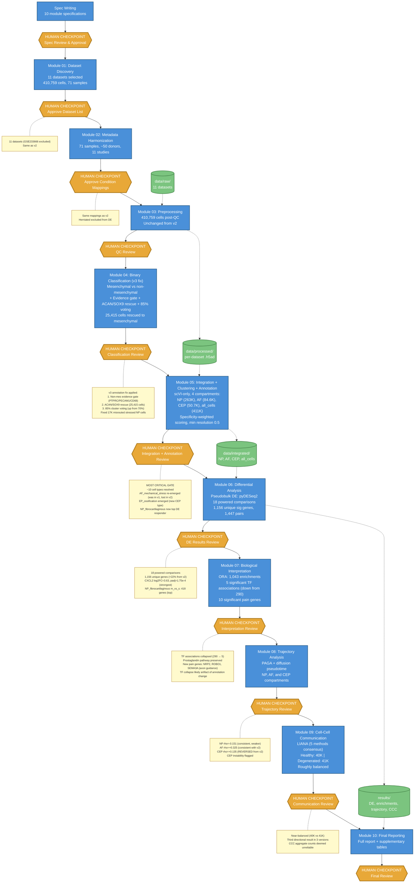

# IVD Single-Cell Atlas: Pipeline Workflow (v3)

## Overview

Human-gated agentic bioinformatics pipeline analyzing 11 scRNA-seq datasets (410,759 cells, 71 samples, ~50 donors) of human intervertebral disc tissue. Each module produces results reviewed at a human checkpoint before the pipeline advances.

**Pipeline version:** v3 (annotation fix, 2026-03-10). Commit: `6622221`.

## What Changed from v2

- **Three annotation fixes** in Module 04 to address the ~17K misrouted stressed NP cells:
  1. Non-mesenchymal evidence gate (requires canonical immune/endothelial markers)
  2. ACAN/SOX9 rescue (25,415 cells reclassified to mesenchymal)
  3. Stricter 85% cluster voting threshold (up from 70%)
- **Specificity-weighted scoring** in Module 05 de novo annotation
- **Minimum non-mesenchymal resolution** floor of 0.5 in Module 05
- **Modules 04-10 rerun**; Modules 01-03 unchanged

## Workflow Diagram

## Key v3 Characteristics

- **Same 11 datasets and 410,759 cells** as v2
- **Annotation fix** rescued 25,415 misrouted cells back to mesenchymal
- **~10 cell types** including AF_mechanical_stress (re-emerged) and EP_ossification (new)
- **scVI-only integration** (unchanged from v2)
- **Strongest CXCL2 result** across v1-v3 (padj=1.75e-4)
- **TF activity collapsed** from 290 to 5 significant associations

## v3 Key Results

| Metric | Value |
|--------|-------|
| Datasets | 11 |
| Total cells | 410,759 |
| Cell types | ~10 |
| Powered DE comparisons | 18 |
| Unique DE genes | 1,156 |
| Top DE comparison | NP_fibrocartilaginous m_vs_s (418 genes) |
| CXCL2 | log2FC=3.63, padj=1.75e-4 |
| NP trajectory rho | -0.151 |
| AF trajectory rho | +0.325 |
| CEP trajectory rho | +0.135 (reversed from v2) |
| CCC healthy/degen | 40K / 41K (balanced) |
| TF associations | 5 |
| Pain genes | 10 |

## What the Annotation Fix Revealed

1. **NP_fibrocartilaginous became the top DE responder** — 418 genes in mild_vs_severe (doubled from v2's 203)
2. **CXCL2 signal strengthened** with purer pseudobulk profiles
3. **TF associations collapsed** (290 → 5) — v2's 290 were likely inflated by misannotated cells
4. **Axon guidance pain genes emerged** (NRP2, ROBO1, SEMA3A) — later did not replicate in v4
5. **Annotation is the single largest source of downstream variation** — changing annotation alone altered DE counts by 22%, TFs by 98%, CCC by ~45%

---

*Superseded by v4 (scANVI semi-supervised, 12-module pipeline, two-stage annotation). See `results/VERSION_DIFFERENCES_SUMMARY.md` for cross-version comparison.*
