# IVD Single-Cell Atlas: Pipeline Workflow (v4)

## Overview

Human-gated agentic bioinformatics pipeline analyzing 11 scRNA-seq datasets (410,759 cells, 71 samples, ~50 donors) of human intervertebral disc tissue. Each module produces results reviewed at a human checkpoint before the pipeline advances.

**Pipeline version:** v4 (scANVI semi-supervised + 12-module pipeline, 2026-03-11). Commit: `34f0312`.

## What Changed from v3

- **12-module pipeline** (up from 10): Integration (05), Clustering (06), and Annotation (07) split into separate modules
- **scANVI semi-supervised integration** replaces unsupervised scVI
- **5 coarse anchor categories** (Chondrocyte_like, Fibroblast_like, Immune, Endothelial, Pericyte_SMC) + Unknown replace binary mesenchymal/non-mesenchymal
- **Two-stage annotation**: Stage 1 coarse marker scoring → Stage 2 within-group DE refinement
- **Resolution-optimized clustering** with adaptive resolution counts by dataset size
- **19 cell types** resolved (up from ~10 in v3)

## Workflow Diagram

```mermaid
flowchart TD
    classDef module fill:#4A90D9,stroke:#2C5F8A,color:#fff,stroke-width:2px
    classDef checkpoint fill:#E8A838,stroke:#B07D20,color:#fff,stroke-width:3px
    classDef decision fill:#FFFACD,stroke:#B07D20,color:#333,stroke-width:1px,font-size:11px
    classDef data fill:#7BC47F,stroke:#4A8A4E,color:#fff,stroke-width:2px

    SPECS["Spec Writing<br/>12 module specifications"]:::module
    SPECS --> CP_SPECS
    CP_SPECS{{"HUMAN CHECKPOINT<br/>Spec Review & Approval"}}:::checkpoint
    CP_SPECS --> M01

    M01["Module 01: Dataset Discovery<br/>11 datasets, 410,759 cells<br/>Unchanged from v2/v3"]:::module
    M01 --> CP01
    CP01{{"HUMAN CHECKPOINT<br/>Approve Dataset List"}}:::checkpoint
    CP01 --> M02

    M02["Module 02: Metadata Harmonization<br/>71 samples, ~50 donors, 11 studies<br/>Unchanged from v2/v3"]:::module
    M02 --> CP02
    CP02{{"HUMAN CHECKPOINT<br/>Approve Condition Mappings"}}:::checkpoint
    CP02 --> M03

    M03["Module 03: Preprocessing<br/>410,759 cells post-QC<br/>Unchanged from v2/v3"]:::module
    M03 --> CP03
    CP03{{"HUMAN CHECKPOINT<br/>QC Review"}}:::checkpoint
    CP03 --> M04

    M04["Module 04: Coarse Classification<br/>5 anchor categories + Unknown<br/>Chondrocyte_like, Fibroblast_like,<br/>Immune, Endothelial, Pericyte_SMC"]:::module
    M04 --> CP04
    CP04{{"HUMAN CHECKPOINT<br/>Classification Review"}}:::checkpoint
    N04["5 coarse anchors for scANVI<br/>Replaces binary mes/non-mes<br/>Unknown cells positioned by scANVI similarity<br/>Richer priors for semi-supervised integration"]:::decision
    CP04 -.- N04
    CP04 --> M05

    M05["Module 05: scANVI Integration<br/>Semi-supervised with coarse anchor labels<br/>scVI pre-train (200 epochs) → scANVI fine-tune (50 epochs)<br/>4 compartments: NP (263K), AF (85K), CEP (51K), all_cells (411K)"]:::module
    M05 --> CP05
    CP05{{"HUMAN CHECKPOINT<br/>Integration Review"}}:::checkpoint
    N05["scANVI semi-supervised (replaces scVI)<br/>Tiered: mesenchymal + non-mesenchymal per compartment<br/>Checkpoint resume for model reloading<br/>Batch key: study"]:::decision
    CP05 -.- N05
    CP05 --> M06

    M06["Module 06: Clustering<br/>Leiden with resolution optimization<br/>Adaptive resolutions by dataset size<br/>NP: 62 clusters, AF: 14, CEP: 9, all: 70"]:::module
    M06 --> CP06
    CP06{{"HUMAN CHECKPOINT<br/>Clustering Review"}}:::checkpoint
    N06["Resolution optimization per compartment<br/>Modularity skipped for >100K cells<br/>Combined leiden: M-prefix (mes) + NM-prefix (non-mes)"]:::decision
    CP06 -.- N06
    CP06 --> M07

    M07["Module 07: Two-Stage Annotation<br/>Stage 1: coarse marker scoring<br/>Stage 2: within-group DE refinement<br/>19 cell types across all compartments"]:::module
    M07 --> CP07
    CP07{{"HUMAN CHECKPOINT<br/>Annotation Review"}}:::checkpoint
    N07["MOST CRITICAL GATE<br/>19 cell types: 10 NP, 2 AF, 3 CEP + non-mes<br/>NP: NP_mature_chondrocyte (115K),<br/>NP_fibrocartilaginous (91K), Fibrochondrocyte subtypes<br/>17,607 NP cells unassigned (6.7%)"]:::decision
    CP07 -.- N07
    CP07 --> M08

    M08["Module 08: Differential Analysis<br/>Pseudobulk DE: pyDESeq2<br/>23 powered comparisons<br/>772 unique sig genes, 966 pairs"]:::module
    M08 --> CP08
    CP08{{"HUMAN CHECKPOINT<br/>DE Results Review"}}:::checkpoint
    N08["23 powered comparisons (most ever)<br/>772 unique genes across finer cell types<br/>New comparisons: AF_inner, Fibrochondrocyte subtypes<br/>NP_fibrocartilaginous m_vs_s: 305 genes (top)"]:::decision
    CP08 -.- N08
    CP08 --> M09

    M09["Module 09: Biological Interpretation<br/>ORA: 1,772 enrichments<br/>GSEA: 2,024 significant terms<br/>246 TF associations<br/>7 pain genes"]:::module
    M09 --> CP09
    CP09{{"HUMAN CHECKPOINT<br/>Interpretation Review"}}:::checkpoint
    N09["TF activity recovered (246, up from 5 in v3)<br/>PTGS2 in AF_inner: padj=5.1e-8 (strongest pain gene)<br/>Prostaglandin pathway preserved<br/>FGF2/VEGFA neovascularization genes (new)"]:::decision
    CP09 -.- N09
    CP09 --> M10

    M10["Module 10: Trajectory Analysis<br/>PAGA + diffusion pseudotime<br/>NP, AF, CEP on scANVI embeddings<br/>500 trajectory genes per compartment"]:::module
    M10 --> CP10
    CP10{{"HUMAN CHECKPOINT<br/>Trajectory Review"}}:::checkpoint
    N10["NP rho=-0.092 (consistent direction, weaker)<br/>AF rho=+0.019 (collapsed to near-zero)<br/>CEP rho=+0.396 (strongest trajectory signal ever)<br/>AF trajectory deemed unreliable across 4 versions"]:::decision
    CP10 -.- N10
    CP10 --> M11

    M11["Module 11: Cell-Cell Communication<br/>LIANA (5 methods consensus)<br/>Healthy: 39K | Degenerated: 37K<br/>3,184 pain-relevant interactions"]:::module
    M11 --> CP11
    CP11{{"HUMAN CHECKPOINT<br/>Communication Review"}}:::checkpoint
    N11["Fewer interactions in degeneration (-5.7%)<br/>3,184 pain-relevant interactions flagged<br/>CCC aggregate counts remain version-sensitive"]:::decision
    CP11 -.- N11
    CP11 --> M12

    M12["Module 12: Final Reporting<br/>12-section report + 27 supplementary tables<br/>MANUSCRIPT.md + FINAL_REPORT.md"]:::module
    M12 --> CP12
    CP12{{"HUMAN CHECKPOINT<br/>Final Review"}}:::checkpoint
    N12["AWAITING REVIEW"]:::decision
    CP12 -.- N12

    D1[("data/raw/<br/>11 datasets")]:::data
    D2[("data/processed/<br/>per-dataset .h5ad")]:::data
    D3[("data/integrated/<br/>NP, AF, CEP, all_cells<br/>+ scANVI models")]:::data
    D4[("results/<br/>DE, enrichments,<br/>trajectory, CCC")]:::data
    D5[("results/<br/>FINAL_REPORT.md<br/>MANUSCRIPT.md<br/>27 supp tables")]:::data

    D1 -.-> M03
    M03 -.-> D2
    D2 -.-> M05
    M05 -.-> D3
    D3 -.-> M06
    M06 -.-> M07
    M07 -.-> M08
    M08 -.-> D4
    D4 -.-> M12
    M12 -.-> D5
```

## Key v4 Characteristics

- **12-module pipeline**: Integration, Clustering, and Annotation are separate modules (05, 06, 07)
- **scANVI semi-supervised integration**: 5 coarse anchor categories provide biologically meaningful priors
- **Two-stage annotation**: Coarse markers → fine DE refinement. 19 cell types resolved.
- **Resolution-optimized clustering**: Adaptive resolution counts (3 for >300K cells, 6 for >200K, 10 for >50K, 20 for smaller)
- **23 powered DE comparisons**: Most ever, including new types (AF_inner, Fibrochondrocyte subtypes)
- **PTGS2 strongest pain finding**: padj=5.1e-8 in AF_inner — orders of magnitude stronger than any prior result
- **TF activity recovered**: 246 associations (up from 5 in v3)

## v4 Key Results

| Metric | Value |
|--------|-------|
| Datasets | 11 |
| Total cells | 410,759 |
| Cell types | 19 |
| Clusters | NP 62, AF 14, CEP 9, all_cells 70 |
| Powered DE comparisons | 23 |
| Unique DE genes | 772 |
| Top DE comparison | NP_fibrocartilaginous m_vs_s (305 genes) |
| CXCL2 (best hit) | Fibrochondrocyte_chondroid m_vs_s: log2FC=3.90, padj=0.034 |
| PTGS2 (best hit) | AF_inner h_vs_s: padj=5.1e-8 |
| NP trajectory rho | -0.092 |
| AF trajectory rho | +0.019 (near-zero) |
| CEP trajectory rho | +0.396 (strongest ever) |
| CCC healthy/degen | 39K / 37K (-5.7%) |
| TF associations | 246 |
| ORA pathways | 1,772 |
| Pain genes | 7 |
| Unassigned NP cells | 17,607 (6.7%) |

## v4 Cell Type Taxonomy

**NP (10 types, 262,967 cells):**
- NP_mature_chondrocyte (115,388)
- NP_fibrocartilaginous (90,857)
- Fibrochondrocyte_chondroid (18,354)
- NP_notochordal (8,920)
- Fibrochondrocyte_stressed (4,195)
- Fibrochondrocyte_fibroid (3,648)
- NP_stressed (3,613)
- unassigned (17,607)
- Macrophage_M2 (325)
- Pericyte_SMC (60)

**AF (2 types, 84,568 cells):**
- AF_outer (49,651)
- AF_inner (34,917)

**CEP (3 types, 50,769 cells):**
- EP_hyaline (31,775)
- Fibroblast_like (17,038)
- Fibrochondrocyte_chondroid (1,956)

## What v4's Methodology Revealed

1. **PTGS2 in AF_inner** (padj=5.1e-8) — the strongest pain gene finding across all versions, invisible at v3's coarser resolution where AF was not split into inner/outer for DE.
2. **Fibrochondrocyte subtypes** — three distinct populations (chondroid 18K, fibroid 3.6K, stressed 4.2K) with separate DE signatures, resolved from v3's broader NP_fibrocartilaginous/NP_stressed_degen.
3. **CXCL2 distributes across subtypes** — significant in Fibrochondrocyte_chondroid (log2FC=3.90) and NP_fibrocartilaginous (padj=2.5e-4) rather than the broader NP_mature_chondrocyte of v1-v3. The finer resolution localizes the signal more precisely.
4. **CEP trajectory strengthened** (rho=+0.396) — scANVI may resolve the CEP degeneration axis better than scVI.
5. **AF trajectory collapsed** to near-zero (rho=+0.019) — confirming this metric is unreliable across integration methods.

---

*Current version. See `results/VERSION_DIFFERENCES_SUMMARY.md` and `results/V3_V4_COMPARISON.md` for cross-version comparison.*
