# IVD Single-Cell Atlas: Pipeline Workflow (v5)

## Overview

Human-gated agentic bioinformatics pipeline analyzing 12 scRNA-seq datasets (410,759 cells, 78 samples, 57 donors) of human intervertebral disc tissue. Each module produces results reviewed at a human checkpoint before the pipeline advances.

**Pipeline version:** v5 (CCA integration + 12-module pipeline, 2026-03-25).

## What Changed from v4

- **CCA integration (Seurat v5)** replaces scANVI semi-supervised — label-free, eliminates circular annotation risk
- **Three-workflow comparison**: CCA, scANVI, and STACAS evaluated with integration metrics (iLISI, batch_ASW, condition_ASW); CCA selected for strongest batch mixing (iLISI 1.5–3.7)
- **Full-cell CCA** on 247GB RAM machine — no downsampling for any object
- **Fewer, broader clusters** (NP: 62→12, AF: 14→12, CEP: 9→9, all: 70→15) reflecting smoother CCA embedding topology
- **Simplified NP taxonomy** (10→5 types): NP_mature_chondrocyte (72%) and NP_fibrocartilaginous (28%) dominate
- **16 cell types** total (down from 19 in v4)
- **TF activity recovered**: 288 significant TF-condition pairs (185 unique TFs), up from 246 in v4

## Workflow Diagram

```mermaid
flowchart TD
    classDef module fill:#4A90D9,stroke:#2C5F8A,color:#fff,stroke-width:2px
    classDef checkpoint fill:#E8A838,stroke:#B07D20,color:#fff,stroke-width:3px
    classDef decision fill:#FFFACD,stroke:#B07D20,color:#333,stroke-width:1px,font-size:11px
    classDef data fill:#7BC47F,stroke:#4A8A4E,color:#fff,stroke-width:2px

    SPECS["Spec Writing<br/>12 module specifications"]:::module
    SPECS --> CP_SPECS
    CP_SPECS{{"HUMAN CHECKPOINT<br/>Spec Review & Approval"}}:::checkpoint
    CP_SPECS --> M01

    M01["Module 01: Dataset Discovery<br/>12 datasets, 410,759 cells<br/>Unchanged from v1"]:::module
    M01 --> CP01
    CP01{{"HUMAN CHECKPOINT<br/>Approve Dataset List"}}:::checkpoint
    CP01 --> M02

    M02["Module 02: Metadata Harmonization<br/>78 samples, 57 donors, 12 studies<br/>Unchanged from v1"]:::module
    M02 --> CP02
    CP02{{"HUMAN CHECKPOINT<br/>Approve Condition Mappings"}}:::checkpoint
    CP02 --> M03

    M03["Module 03: Preprocessing<br/>410,759 cells post-QC<br/>Unchanged from v1"]:::module
    M03 --> CP03
    CP03{{"HUMAN CHECKPOINT<br/>QC Review"}}:::checkpoint
    CP03 --> M04

    M04["Module 04: Coarse Classification<br/>5 anchor categories + Unknown<br/>Reused from v4"]:::module
    M04 --> CP04
    CP04{{"HUMAN CHECKPOINT<br/>Classification Review"}}:::checkpoint
    N04["Same 5 coarse anchors as v4<br/>CCA does not use these for integration<br/>(label-free), but anchors inform annotation"]:::decision
    CP04 -.- N04
    CP04 --> M05

    M05["Module 05: CCA Integration (Seurat v5)<br/>Label-free, full-cell, no downsampling<br/>IntegrateLayers(method=CCAIntegration)<br/>4 compartments: NP (263K), AF (85K), CEP (51K), all_cells (411K)"]:::module
    M05 --> CP05
    CP05{{"HUMAN CHECKPOINT<br/>Integration Review"}}:::checkpoint
    N05["CCA selected over scANVI + STACAS<br/>iLISI: NP 3.68, AF 1.49, CEP 1.63, all 3.18<br/>Label-free: no circular annotation risk<br/>Negative batch_ASW = possible overcorrection<br/>DE uses pseudobulk on raw counts (not embeddings)"]:::decision
    CP05 -.- N05
    CP05 --> M06

    M06["Module 06: Clustering<br/>Leiden on CCA embedding<br/>NP: 12, AF: 12, CEP: 9, all_cells: 15 clusters"]:::module
    M06 --> CP06
    CP06{{"HUMAN CHECKPOINT<br/>Clustering Review"}}:::checkpoint
    N06["Smoother CCA topology → fewer clusters<br/>NP 62→12, AF 14→12 (v4→v5)<br/>Combined leiden: M-prefix (mes) + NM-prefix (non-mes)"]:::decision
    CP06 -.- N06
    CP06 --> M07

    M07["Module 07: Post-Integration Annotation<br/>NP: 5 types, AF: 4 types, CEP: 7 types<br/>16 cell types across all compartments"]:::module
    M07 --> CP07
    CP07{{"HUMAN CHECKPOINT<br/>Annotation Review"}}:::checkpoint
    N07["MOST CRITICAL GATE<br/>16 cell types (down from 19 in v4)<br/>NP: mature_chondrocyte (186K, 72%),<br/>fibrocartilaginous (74K, 28%)<br/>Broader categories reflect smoother CCA embedding"]:::decision
    CP07 -.- N07
    CP07 --> M08

    M08["Module 08: Differential Analysis<br/>Pseudobulk DE: pyDESeq2<br/>17 powered comparisons<br/>1,198 unique sig genes"]:::module
    M08 --> CP08
    CP08{{"HUMAN CHECKPOINT<br/>DE Results Review"}}:::checkpoint
    N08["17 powered comparisons<br/>1,198 unique sig genes<br/>NP_fibrocartilaginous h→severe: 556 genes (top)<br/>Cell cycle/mitosis downregulated in degeneration"]:::decision
    CP08 -.- N08
    CP08 --> M09

    M09["Module 09: Biological Interpretation<br/>ORA: 2,506 enrichments<br/>GSEA: 3,301 significant terms<br/>288 TF associations (185 unique TFs)<br/>10 pain genes"]:::module
    M09 --> CP09
    CP09{{"HUMAN CHECKPOINT<br/>Interpretation Review"}}:::checkpoint
    N09["TF activity strong (288 sig, 185 unique)<br/>10 pain genes, 1,037 pain-associated DE genes<br/>3,075 pain-relevant L-R pairs flagged<br/>Prostaglandin pathway preserved across versions"]:::decision
    CP09 -.- N09
    CP09 --> M10

    M10["Module 10: Trajectory Analysis<br/>PAGA + diffusion pseudotime<br/>NP, AF, CEP on CCA embeddings<br/>500 trajectory genes per compartment"]:::module
    M10 --> CP10
    CP10{{"HUMAN CHECKPOINT<br/>Trajectory Review"}}:::checkpoint
    N10["NP rho=-0.088 (weak negative, consistent direction)<br/>AF rho=+0.195 (opposite sign to NP)<br/>CEP rho=+0.073 (weakened from v4 +0.396)<br/>All correlations weak — method-sensitive"]:::decision
    CP10 -.- N10
    CP10 --> M11

    M11["Module 11: Cell-Cell Communication<br/>LIANA (5 methods consensus)<br/>Healthy: 25,537 | Degenerated: 34,208<br/>3,075 pain-relevant interactions"]:::module
    M11 --> CP11
    CP11{{"HUMAN CHECKPOINT<br/>Communication Review"}}:::checkpoint
    N11["More interactions in degeneration (+34%)<br/>Direction has varied across all 5 versions<br/>CCC aggregate counts remain version-sensitive"]:::decision
    CP11 -.- N11
    CP11 --> M12

    M12["Module 12: Final Reporting<br/>12-section report + 19 supplementary tables<br/>MANUSCRIPT.md + FINAL_REPORT.md"]:::module
    M12 --> CP12
    CP12{{"HUMAN CHECKPOINT<br/>Final Review"}}:::checkpoint
    N12["v5 COMPLETE (2026-03-25)"]:::decision
    CP12 -.- N12

    D1[("data/raw/<br/>12 datasets")]:::data
    D2[("data/processed/<br/>per-dataset .h5ad")]:::data
    D3[("data/integrated/<br/>NP, AF, CEP, all_cells<br/>CCA via R→h5ad bridge")]:::data
    D4[("results/<br/>DE, enrichments,<br/>trajectory, CCC")]:::data
    D5[("results/<br/>FINAL_REPORT.md<br/>MANUSCRIPT.md<br/>19 supp tables")]:::data

    D1 -.-> M03
    M03 -.-> D2
    D2 -.-> M05
    M05 -.-> D3
    D3 -.-> M06
    M06 -.-> M07
    M07 -.-> M08
    M08 -.-> D4
    D4 -.-> M12
    M12 -.-> D5
```

## Key v5 Characteristics

- **12-module pipeline**: Same structure as v4 (Integration, Clustering, Annotation as separate modules 05, 06, 07)
- **CCA integration (Seurat v5)**: Label-free, full-cell counts on all 4 objects, strongest batch mixing across methods tested
- **Three-workflow comparison**: CCA vs scANVI vs STACAS evaluated with iLISI, batch_ASW, condition_ASW before selection
- **Smoother embedding topology**: CCA produces fewer clusters with broader cell type categories, consistent with the mesenchymal continuum hypothesis
- **16 cell types**: Simplified from v4's 19 — NP dominated by two broad populations
- **288 TF associations**: Strong TF recovery (185 unique TFs), consistent with v4 levels
- **Pseudotime correlations weak across all compartments**: Method-sensitive, not robust to integration choice

## v5 Key Results

| Metric | Value |
|--------|-------|
| Datasets | 12 |
| Total cells | 410,759 |
| Cell types | 16 |
| Clusters | NP 12, AF 12, CEP 9, all_cells 15 |
| Integration method | CCA (Seurat v5, label-free) |
| Powered DE comparisons | 17 |
| Unique DE genes | 1,198 |
| Top DE comparison | NP_fibrocartilaginous h_vs_s (556 genes) |
| NP trajectory rho | -0.088 |
| AF trajectory rho | +0.195 |
| CEP trajectory rho | +0.073 |
| CCC healthy/degen | 25,537 / 34,208 (+34%) |
| TF associations | 288 (185 unique TFs) |
| ORA pathways | 2,506 |
| GSEA terms | 3,301 |
| Pain genes | 10 |
| Pain-relevant L-R pairs | 3,075 |

## v5 Cell Type Taxonomy

**NP (5 types, 262,967 cells):**
- NP_mature_chondrocyte (185,794)
- NP_fibrocartilaginous (73,764)
- Endothelial (2,645)
- T_cell_CD8 (583)
- Macrophage_M2 (181)

**AF (4 types, 84,624 cells):**
- AF_outer (51,729)
- AF_inner (32,839)
- Macrophage_M2 (34)
- Endothelial (22)

**CEP (7 types, 50,858 cells):**
- Fibroblast_like (33,582)
- EP_hyaline (12,597)
- Fibrochondrocyte_chondroid (4,292)
- Fibrochondrocyte_fibroid (298)
- Endothelial (38)
- Pericyte_SMC (30)
- NK_cell (21)

## What v5's Methodology Revealed

1. **NP_fibrocartilaginous became the top DE responder** — 556 genes in healthy→severe, the largest comparison across all versions. The broader CCA-derived population concentrates signal that v4 distributed across fibrochondrocyte subtypes.
2. **CCA embedding topology is smoother** — fewer clusters (NP 12 vs v4's 62) with broader cell type categories. This is consistent with the mesenchymal continuum hypothesis and suggests v4's fine-grained subtypes may have partially reflected integration artifacts.
3. **Trajectory correlations remain method-sensitive** — CEP rho dropped from +0.396 (v4, scANVI) to +0.073 (v5, CCA). All compartment correlations are weak, confirming pseudotime-condition analysis is not robust across integration methods.
4. **CCC direction shifted again** — degenerated > healthy in v5 (+34%), but this direction has varied across all 5 versions. Aggregate CCC counts are unreliable as a standalone finding.
5. **TF activity is robust** — 288 significant associations (185 unique TFs) across versions, unlike the v3 collapse (5 TFs). Both scANVI (v4) and CCA (v5) recover strong TF signals.

---

*Current version. See `docs/version_history.md` for full changelog and `docs/workflow_comparison_report.md` for the three-workflow integration comparison.*
