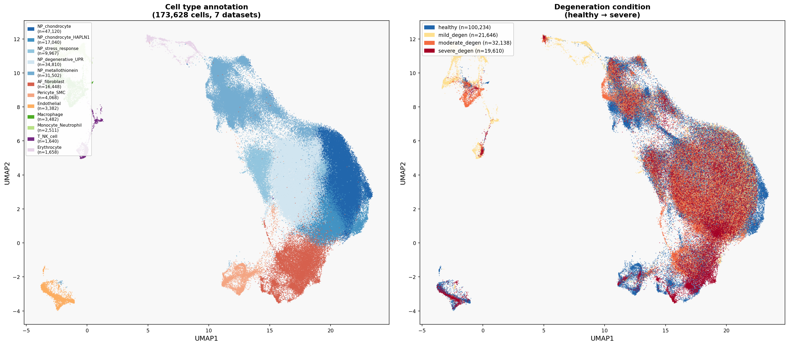
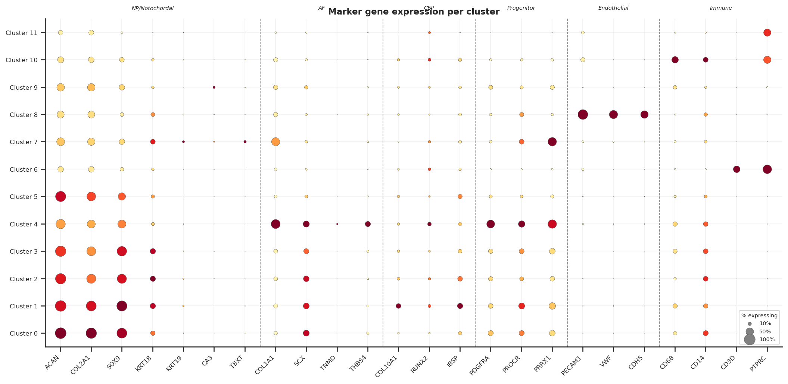
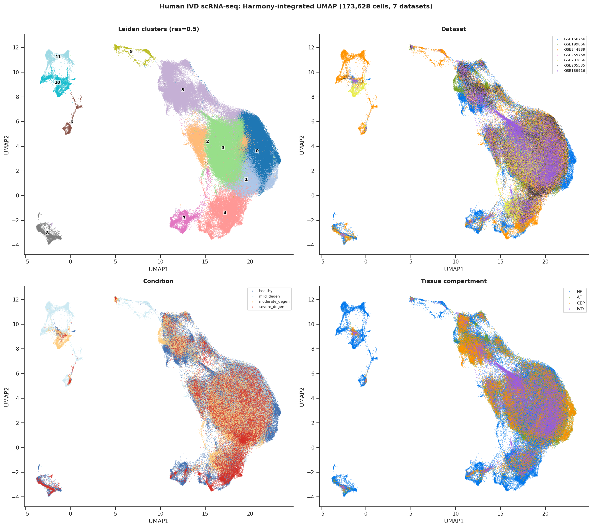
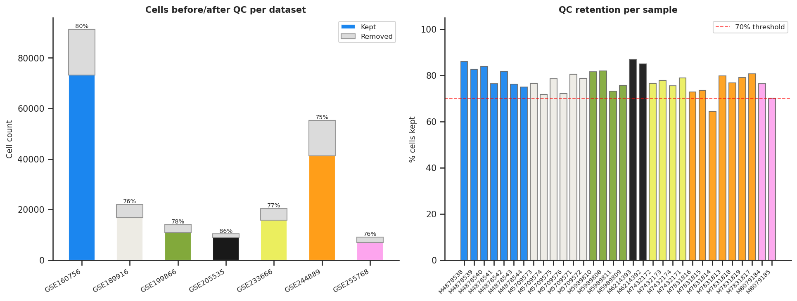
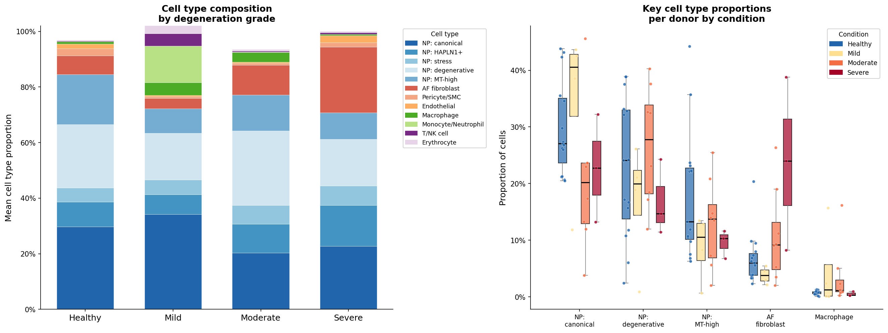
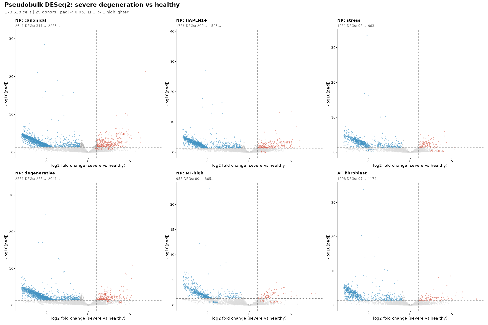
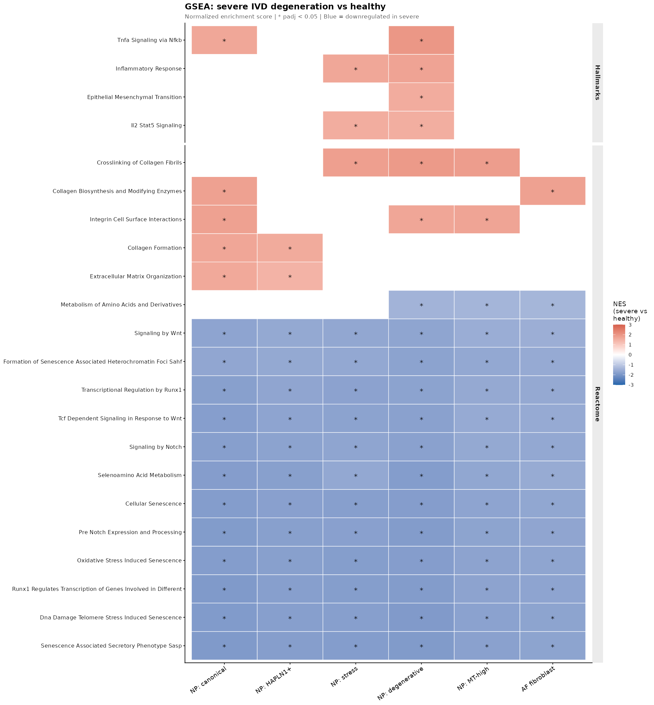
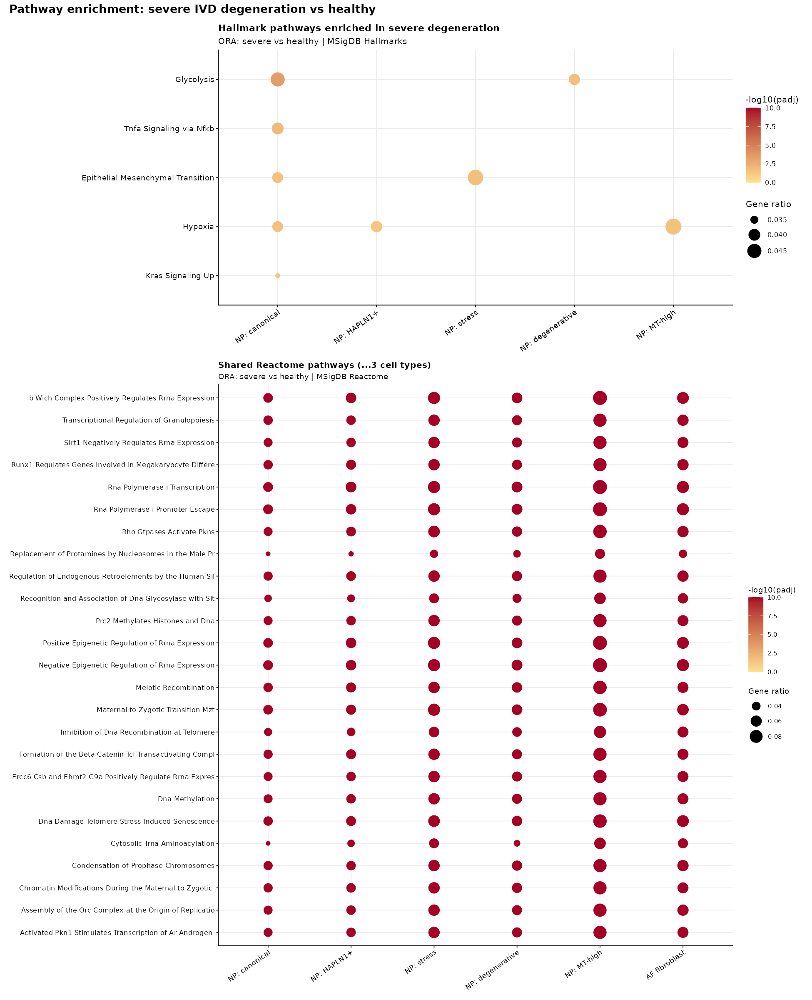
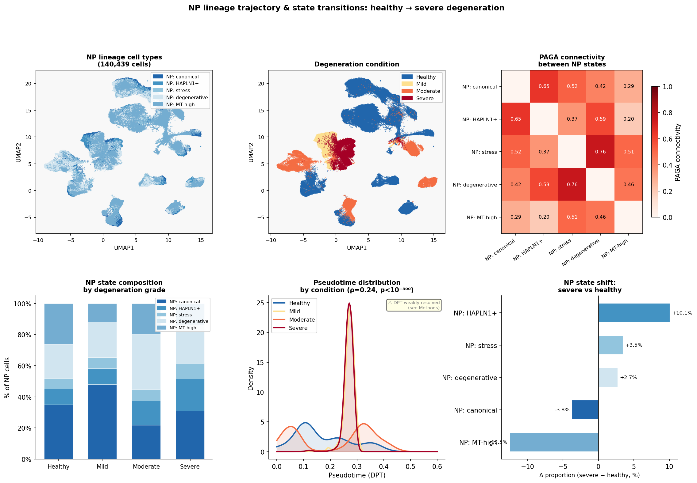
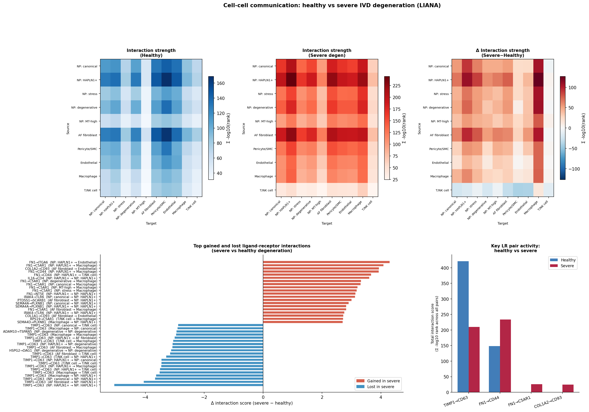

# Single-Cell Transcriptomic Atlas of Human Intervertebral Disc Degeneration: Cell States, Signaling Networks, and Therapeutic Targets

**Draft Manuscript — Benjamin Good**
**Analysis Date: March 2026**

---

## Table of Contents

1. [Abstract](#abstract)
2. [Glossary of Terms and Acronyms](#glossary)
3. [Biological Background](#background)
4. [Study Design and Datasets](#datasets)
5. [Methods](#methods)
6. [Results](#results)
   - 6.1 Cell Type Atlas
   - 6.2 Compositional Changes with Degeneration
   - 6.3 Differential Gene Expression
   - 6.4 Pathway Enrichment
   - 6.5 NP Cell State Trajectories
   - 6.6 Cell-Cell Communication
7. [Biological Interpretation and Mechanistic Model](#interpretation)
8. [Therapeutic Targets](#targets)
9. [Limitations](#limitations)
10. [Suggested Next Steps](#nextsteps)
11. [References](#references)

---

## 1. Abstract {#abstract}

Intervertebral disc (IVD) degeneration is the leading structural cause of chronic low back pain, affecting approximately 619 million people worldwide and imposing enormous socioeconomic costs. Despite decades of research, no disease-modifying therapy exists; current treatments address symptoms rather than the underlying biology. To systematically map the cellular and molecular landscape of IVD degeneration, we integrated seven publicly available human single-cell RNA sequencing (scRNA-seq) datasets comprising 173,628 cells from 29 donors spanning healthy tissue and mild, moderate, and severe degeneration. We identified 12 distinct cell populations, including five nucleus pulposus (NP) cell states that represent a spectrum from healthy chondrocyte-like cells to stress-response, unfolded protein response (UPR)-driven, and oxidative-stress states. Pseudobulk differential expression analysis using DESeq2 revealed a striking pattern of transcriptional collapse in severe degeneration, with approximately seven times more genes downregulated than upregulated across all NP cell types. Gene set enrichment analysis (GSEA) identified consistent suppression of Wnt signaling, Notch signaling, cellular senescence programs, and RUNX transcription factor activity across all cell types, alongside upregulation of TNF/NF-kB inflammatory pathways in specific cell states. ECM-related pathways showed a more complex pattern, with upregulation in the most chondrocyte-like states suggesting compensatory remodeling. Cell-cell communication analysis using LIANA identified loss of the protective TIMP1-CD63 metalloproteinase-inhibitory axis and gain of fibronectin (FN1)-driven inflammatory macrophage recruitment as the dominant signaling changes in severe disease. Trajectory analysis identifies the NP stress-response state as a transition hub between canonical NP chondrocytes and the degenerative UPR state. Together, these findings define a molecular roadmap of IVD degeneration — from loss of homeostatic signaling through inflammatory amplification to structural failure — and prioritize several tractable therapeutic targets, including ADAMTS5 inhibition, TIMP1 restoration, Wnt pathway activation, and anti-inflammatory strategies targeting the NF-kB axis.

---

## 2. Glossary of Terms and Acronyms {#glossary}

This glossary defines all technical terms and abbreviations used in this report.

| Term / Acronym | Full Name | Plain-Language Explanation |
|---|---|---|
| ACAN | Aggrecan | The major proteoglycan of the NP; attracts water and gives the disc its shock-absorbing properties |
| ADAMTS | A Disintegrin And Metalloproteinase with Thrombospondin motifs | Enzymes that cleave aggrecan; ADAMTS4 and ADAMTS5 are the primary "aggrecanases" in disc degeneration |
| AF | Annulus Fibrosus | The tough outer ring of the intervertebral disc, made of fibrous collagen lamellae |
| AP-1 | Activator Protein 1 | A transcription factor complex (including JUN and FOS proteins) activated by cellular stress |
| CEP | Cartilage Endplate | Thin cartilage layers capping the disc; the primary route for nutrient diffusion into the NP |
| COL1A1/2 | Collagen Type I Alpha 1/2 | Structural proteins of fibrous connective tissue; marker of AF fibroblasts |
| COL2A1 | Collagen Type II Alpha 1 | The primary collagen of cartilage and healthy NP; marker of chondrocyte identity |
| COMP | Cartilage Oligomeric Matrix Protein | An ECM protein that stabilizes collagen fibrils; often reported as downregulated in degeneration literature, though upregulated in this dataset (see Section 6.3) |
| DC | Diffusion Component | A mathematical dimension derived from diffusion map analysis for trajectory inference |
| DEG | Differentially Expressed Gene | A gene whose expression level is statistically significantly different between two conditions |
| DPT | Diffusion Pseudotime | A computational method to order cells along a developmental or disease trajectory |
| ECM | Extracellular Matrix | The non-cellular scaffold of proteins and proteoglycans that gives tissues their structure |
| EMT | Epithelial-Mesenchymal Transition | A cellular program where epithelial/chondrocyte-like cells acquire fibroblast-like properties |
| ER | Endoplasmic Reticulum | A cellular organelle responsible for protein folding and secretion |
| FAISS | Facebook AI Similarity Search | A computational library for fast approximate nearest-neighbor search |
| FDR | False Discovery Rate | The expected proportion of false positives among statistically significant results |
| FN1 | Fibronectin 1 | An ECM glycoprotein; elevated in degeneration and acts as a pro-inflammatory signal |
| GEO | Gene Expression Omnibus | NCBI's public repository for gene expression data |
| GSEA | Gene Set Enrichment Analysis | A method to determine whether a predefined set of genes shows coordinated up- or down-regulation |
| HAPLN1 | Hyaluronan And Proteoglycan Link Protein 1 | A protein that stabilizes aggrecan-hyaluronan complexes in the ECM |
| HIF | Hypoxia-Inducible Factor | Transcription factors that regulate cellular responses to low oxygen |
| HVG | Highly Variable Gene | A gene that shows high variability across cells; used to focus dimensionality reduction |
| IVD | Intervertebral Disc | The fibrocartilaginous cushion between vertebral bodies |
| IVDD | Intervertebral Disc Degeneration | Progressive deterioration of IVD structure and function |
| kNN | k-Nearest Neighbors | A graph-based method connecting each cell to its k most similar cells in gene expression space |
| LBP | Low Back Pain | Pain in the lumbar region; the leading cause of disability worldwide |
| LFC | Log2 Fold Change | The log2 ratio of gene expression between two conditions; LFC > 0 means upregulated |
| LIANA | LIgand-receptor ANAlysis | A computational framework for cell-cell communication inference |
| LR pair | Ligand-Receptor pair | A signaling molecule (ligand) secreted by one cell and the surface protein (receptor) on another cell that receives the signal |
| MAD | Median Absolute Deviation | A robust statistical measure of variability, used here for quality control thresholds |
| MMP | Matrix Metalloproteinase | Zinc-dependent enzymes that degrade ECM components; key drivers of disc catabolism |
| MRI | Magnetic Resonance Imaging | Medical imaging technique used to grade disc degeneration |
| MSigDB | Molecular Signatures Database | A curated collection of gene sets for enrichment analysis |
| MT1G/MT1E/MT1X | Metallothionein 1G/1E/1X | Small cysteine-rich proteins that bind heavy metals and protect against oxidative stress |
| NES | Normalized Enrichment Score | GSEA's measure of how strongly a gene set is enriched; positive = upregulated, negative = downregulated |
| NF-kB | Nuclear Factor kappa-light-chain-enhancer of activated B cells | Master transcription factor of inflammation |
| NP | Nucleus Pulposus | The gel-like central core of the intervertebral disc |
| NPC | Nucleus Pulposus Cell | The specialized chondrocyte-like cell that maintains the NP |
| ORA | Over-Representation Analysis | A statistical test for whether a gene list contains more genes from a pathway than expected by chance |
| PAGA | Partition-based Graph Abstraction | A method to infer connectivity and trajectories between cell clusters |
| padj | Adjusted p-value | A p-value corrected for multiple testing (e.g., using Benjamini-Hochberg FDR) |
| PCA | Principal Component Analysis | Dimensionality reduction technique that identifies the major axes of variation in gene expression data |
| ROS | Reactive Oxygen Species | Chemically reactive molecules containing oxygen; cause oxidative damage when in excess |
| RUNX | Runt-Related Transcription Factor | Transcription factors regulating chondrogenesis and osteogenesis |
| SASP | Senescence-Associated Secretory Phenotype | The pro-inflammatory secretome of senescent cells |
| scRNA-seq | Single-Cell RNA Sequencing | Technology to measure gene expression in individual cells |
| SMC | Smooth Muscle Cell | A cell type found in blood vessel walls |
| SQSTM1 | Sequestosome 1 (p62) | A protein involved in autophagy and UPR; marker of cellular stress |
| TIMP | Tissue Inhibitor of Metalloproteinases | Endogenous inhibitors of MMPs; loss of TIMP activity promotes ECM degradation |
| TNF | Tumor Necrosis Factor | A pro-inflammatory cytokine; major driver of NF-kB activation in disc degeneration |
| UMAP | Uniform Manifold Approximation and Projection | A dimensionality reduction technique that visualizes high-dimensional data in 2D |
| UPR | Unfolded Protein Response | A cellular stress response to accumulation of misfolded proteins in the ER |

---

## 3. Biological Background {#background}

### 3.1 The Intervertebral Disc: Structure and Function

The intervertebral disc (IVD) is a fibrocartilaginous structure located between adjacent vertebral bodies throughout the spine. It serves two essential mechanical functions: transmitting compressive loads along the spinal column and allowing controlled movement (flexion, extension, rotation) between vertebrae. Each disc is composed of three anatomically and functionally distinct compartments:

**Nucleus Pulposus (NP):** The central, gel-like core of the disc. In healthy young adults, the NP is a highly hydrated tissue (approximately 80% water) rich in the proteoglycan aggrecan (encoded by the gene *ACAN*) and type II collagen (*COL2A1*). Aggrecan is a large, negatively charged molecule that attracts water through osmotic pressure, giving the NP its characteristic turgor and shock-absorbing capacity. The NP is populated by a specialized cell type — the NP chondrocyte — that shares features with articular cartilage chondrocytes but is uniquely adapted to the avascular, hypoxic, and mechanically loaded disc environment (Oichi et al., 2020). In fetal and neonatal discs, the NP also contains notochordal cells, large vacuolated cells derived from the embryonic notochord that are thought to maintain NP homeostasis; these are largely replaced by chondrocyte-like cells by early adulthood in humans (Gan et al., 2021).

**Annulus Fibrosus (AF):** The outer ring of the disc, composed of concentric lamellae of fibrocartilage. The outer AF contains fibroblast-like cells embedded in a matrix rich in type I collagen (*COL1A1*, *COL1A2*) and type III collagen (*COL3A1*), providing tensile strength to contain the pressurized NP. The inner AF transitions toward a more cartilaginous phenotype. The AF is the only vascularized and innervated compartment of the disc, which is why AF tears can be painful (Fernandes et al., 2020).

**Cartilage Endplate (CEP):** Thin layers of hyaline cartilage that cap the superior and inferior surfaces of each disc, interfacing with the vertebral bodies. The CEP is the primary route for nutrient diffusion into the avascular NP, as the disc has no direct blood supply. Calcification or damage to the CEP impairs this nutrient supply and accelerates degeneration (Roberts et al., 1996).

### 3.2 The Avascular, Hypoxic Disc Environment

A defining feature of the IVD — particularly the NP — is its extreme avascularity. The disc is the largest avascular structure in the human body. Nutrients (glucose, oxygen) and waste products (lactate, CO2) must diffuse across distances of up to 8 mm through the CEP and AF matrix. This creates a steep oxygen gradient, with NP cells living in near-anoxic conditions (oxygen tension approximately 1-5%) (Oichi et al., 2020). NP cells are therefore highly adapted to anaerobic glycolysis (converting glucose to lactate without oxygen) and express hypoxia-inducible factors (HIFs) that regulate their metabolism. This avascular nature also means the disc has limited regenerative capacity — it cannot recruit circulating repair cells the way vascularized tissues can.

### 3.3 Intervertebral Disc Degeneration: The Disease

IVD degeneration (IVDD) is a progressive, age-related deterioration of disc structure and function. It is the primary structural cause of low back pain (LBP), which affects approximately 619 million people globally and is the leading cause of years lived with disability worldwide (GBD 2021 Low Back Pain Collaborators, 2023). Approximately 40% of symptomatic LBP is attributed to disc degeneration (Wang et al., 2023a). The economic burden in the United States alone exceeds $100 billion annually in direct healthcare costs and lost productivity (Dieleman et al., 2020).

Degeneration is characterized by a cascade of interconnected changes (Adams and Roughley, 2006; Xia et al., 2024):

1. **Loss of NP hydration:** Reduced aggrecan synthesis and increased proteoglycan degradation lower the osmotic pressure of the NP, causing it to lose water and height. The disc "desiccates" and loses its shock-absorbing capacity.

2. **ECM degradation:** Matrix metalloproteinases (MMPs) and ADAMTS enzymes — particularly ADAMTS4 and ADAMTS5 — cleave aggrecan and collagen, accelerating matrix breakdown (Liang et al., 2022).

3. **Inflammatory activation:** Pro-inflammatory cytokines including interleukin-1beta (IL-1beta), tumor necrosis factor-alpha (TNF-alpha), and interleukin-6 (IL-6) are produced by NP cells and infiltrating immune cells, creating a self-amplifying inflammatory cycle (Song et al., 2022).

4. **Cell death and senescence:** NP cells undergo apoptosis (programmed cell death) and cellular senescence (a state of permanent cell cycle arrest accompanied by a pro-inflammatory secretory phenotype, the SASP) (Song et al., 2023a).

5. **Oxidative stress:** Reactive oxygen species (ROS) accumulate due to mitochondrial dysfunction and reduced antioxidant defenses, damaging DNA, proteins, and lipids (Wang et al., 2023a; Song et al., 2023b).

6. **Fibrocartilaginous replacement:** The gelatinous NP is progressively replaced by fibrocartilaginous tissue resembling the AF, driven by expansion of fibroblast-like cells (Antoniou et al., 1996).

7. **Vascular and neural ingrowth:** In advanced degeneration, blood vessels and nerve fibers grow into the normally avascular NP through AF fissures, contributing to discogenic pain (Freemont et al., 2002).

### 3.4 Grading Disc Degeneration: The Pfirrmann Scale

Disc degeneration is most commonly graded on MRI (magnetic resonance imaging) using the **Pfirrmann grading system** (grades I-V), which assesses disc signal intensity, structure, height, and distinction between NP and AF:

- **Grade I:** Homogeneous, bright white NP signal; normal disc height; clear NP-AF boundary
- **Grade II:** Inhomogeneous NP with horizontal gray bands; normal height; clear boundary
- **Grade III:** Inhomogeneous, gray NP; normal to slightly decreased height; unclear boundary
- **Grade IV:** Inhomogeneous, dark gray/black NP; moderately decreased height; lost boundary
- **Grade V:** Inhomogeneous, black NP; collapsed disc space; no NP-AF distinction

In this study, we harmonized degeneration severity across datasets into four categories: **healthy** (Pfirrmann I-II), **mild** (Pfirrmann II-III), **moderate** (Pfirrmann III-IV), and **severe** (Pfirrmann IV-V).

### 3.5 Key Molecular Pathways in IVD Biology

Understanding the results of this study requires familiarity with several signaling pathways central to IVD homeostasis and degeneration:

**Wnt/beta-catenin signaling:** The Wnt pathway is a master regulator of cell fate, proliferation, and tissue homeostasis in cartilaginous tissues (Li et al., 2023a). In the canonical Wnt pathway, Wnt ligands bind to Frizzled receptors on the cell surface, leading to stabilization and nuclear translocation of beta-catenin, which then activates target genes. In healthy NP cells, Wnt signaling promotes chondrogenic differentiation and ECM synthesis. Loss of Wnt signaling is associated with cartilage degeneration (Volleman et al., 2020; Wang et al., 2024).

**Notch signaling:** The Notch pathway regulates cell-cell communication, stem cell maintenance, and differentiation. Notch ligands (e.g., JAG1, JAG2, DLL1) on one cell bind Notch receptors on adjacent cells, triggering proteolytic cleavage and nuclear signaling. In the IVD, Notch signaling maintains NP cell identity and promotes ECM production; the JAG2/Notch2 axis has been specifically shown to protect against disc degeneration (Long et al., 2019; Zieba et al., 2020).

**NF-kB (Nuclear Factor kappa-light-chain-enhancer of activated B cells):** NF-kB is the master transcription factor of inflammation. It is activated by pro-inflammatory cytokines (TNF-alpha, IL-1beta), mechanical stress, and ROS, and drives expression of inflammatory mediators, MMPs, and ADAMTS enzymes. Chronic NF-kB activation in NP cells is a central driver of the degenerative cascade (Xia et al., 2024; Wuertz et al., 2012).

**RUNX transcription factors:** RUNX1 and RUNX2 are transcription factors that regulate chondrogenesis (cartilage formation) and osteogenesis (bone formation). RUNX2 is particularly important for maintaining the chondrocyte phenotype of NP cells; its loss contributes to dedifferentiation and matrix catabolism (Oichi et al., 2020).

**ECM homeostasis — the MMP/TIMP balance:** Matrix metalloproteinases (MMPs) are zinc-dependent enzymes that degrade ECM components. Their activity is counterbalanced by tissue inhibitors of metalloproteinases (TIMPs). In healthy disc, the MMP/TIMP balance favors matrix maintenance; in degeneration, this balance shifts toward catabolism (Vo et al., 2013; Cabral-Pacheco et al., 2020). ADAMTS4 and ADAMTS5 are the primary aggrecanases responsible for aggrecan cleavage in the disc (Liang et al., 2022).

**UPR (Unfolded Protein Response):** When cells are stressed (by hypoxia, oxidative stress, or mechanical overload), misfolded proteins accumulate in the endoplasmic reticulum (ER), triggering the UPR — a cellular stress response that attempts to restore protein homeostasis. Chronic UPR activation leads to cell death (Xia et al., 2024).

### 3.6 Why Single-Cell RNA Sequencing?

Traditional bulk RNA sequencing measures the average gene expression of all cells in a tissue sample, masking the heterogeneity of individual cell types and states. Single-cell RNA sequencing (scRNA-seq) measures the transcriptome of each individual cell, enabling:

- **Discovery of rare cell types** that would be diluted in bulk analysis
- **Identification of cell states** — distinct functional modes within the same cell type
- **Mapping of cell-to-cell communication** through ligand-receptor interactions
- **Inference of cell state transitions** (trajectories) during disease progression
- **Cell-type-specific differential expression** to determine which genes change in which cell populations

Prior single-cell studies of the IVD have been limited by small sample sizes (typically 2-7 donors), single datasets, or focus on a single compartment (Gan et al., 2021; Fernandes et al., 2020; Li et al., 2022a). By integrating seven datasets spanning 29 donors and four degeneration grades, this study provides the most comprehensive single-cell atlas of human IVD degeneration to date.

---

## 4. Study Design and Datasets {#datasets}

### 4.1 Rationale for Multi-Dataset Integration

No single published IVD scRNA-seq dataset contains sufficient donor numbers, degeneration grade diversity, and tissue compartment coverage to draw robust conclusions about disease mechanisms. By integrating seven independent datasets, we achieve:

- **Statistical power:** 29 donors across four degeneration grades
- **Reproducibility:** Findings replicated across independent experimental batches
- **Breadth:** Coverage of NP, AF, and CEP compartments
- **Diversity:** Multiple geographic cohorts, age ranges, and clinical presentations

### 4.2 Dataset Summary

Seven datasets were downloaded from the NCBI Gene Expression Omnibus (GEO):

**Table 1. Datasets included in the integrated atlas.**

| GEO Accession | First Author (Year) | Tissue | Conditions | Samples | Cells (post-QC) |
|---|---|---|---|---|---|
| GSE160756 | Gan et al. (2021) | NP, AF, CEP | Healthy atlas | 7 | ~60,000 |
| GSE199866 | Cherif et al. (2022) | NP | Paired degenerated / non-degenerated | 4 | ~8,000 |
| GSE244889 | Wang et al. (2023) | NP | Mild vs. severe degeneration | 7 | ~45,000 |
| GSE255768 | Shi et al. (2024) | CEP | Degeneration | 2 | ~5,000 |
| GSE233666 | Guo et al. (2023) | NP | Immune infiltration / ossification | 4 | ~20,000 |
| GSE205535 | Li et al. (2022) | NP | Normal + degenerated | 2 | ~10,000 |
| GSE189916 | Jiang/Sheyn (2022) | IVD (mixed) | Neonatal + adult | 6 | ~25,000 |

**Total:** 173,628 cells retained after quality control from 222,433 raw cells (78% retention rate).

### 4.3 Condition Harmonization

Degeneration severity was harmonized across datasets using a unified schema:

- **Healthy:** No or minimal degeneration (Pfirrmann I-II); n = 100,234 cells, 15 donors
- **Mild degeneration:** Early structural changes (Pfirrmann II-III); n = 21,646 cells, 4 donors
- **Moderate degeneration:** Moderate structural loss (Pfirrmann III-IV); n = 32,138 cells, 8 donors
- **Severe degeneration:** Advanced degeneration (Pfirrmann IV-V); n = 19,610 cells, 3 donors

The imbalance between healthy (n=15 donors) and severe (n=3 donors) reflects the practical reality that healthy disc tissue is primarily obtained from organ donors or scoliosis surgery, while severely degenerated tissue is more commonly available from discectomy procedures. This imbalance is a limitation discussed in Section 9.

---

## 5. Methods {#methods}

**Note on automation:** The entire analysis pipeline — from data download through quality control, integration, clustering, annotation, differential expression, pathway enrichment, trajectory analysis, and cell-cell communication — was executed by an LLM-driven automated system (Phylo/Biomni framework). The LLM agent selected analysis parameters, wrote and executed code, interpreted intermediate outputs, and made analytical decisions (e.g., choosing Leiden resolution, selecting marker panels for annotation, filtering pathway gene sets). While the methods follow standard best practices in the scRNA-seq field, readers should be aware that no step involved direct human oversight during execution. All code is available in the accompanying Jupyter notebook (`execution_trace.ipynb`). The methods are presented separately from the biological interpretation to allow readers to evaluate the analytical choices independently.

### 5.1 Data Acquisition and Preprocessing

**Data download:** Raw count matrices were downloaded from GEO for all seven datasets. Data were provided in three formats: Loom (.loom.gz, GSE160756), 10x HDF5 (.h5, GSE199866), and 10x Market Exchange Format (MTX, all others).

**Per-sample quality control (QC):** Each sample was filtered independently using Median Absolute Deviation (MAD)-based thresholds — a robust approach that adapts to the distribution of each sample rather than applying fixed cutoffs. Cells were retained if they fell within 3 MADs of the median for:

- **Number of detected genes (nGenes):** Removes empty droplets (too few genes) and multiplets (too many genes)
- **Total UMI counts (nCounts):** Removes low-quality cells and potential doublets
- **Mitochondrial gene percentage (%mito):** Cells with high mitochondrial content (>20% cap) are likely damaged or dying, as cytoplasmic RNA leaks out while mitochondrial RNA is retained

**Doublet detection:** Scrublet (Wolock et al., 2019) was applied to each sample independently to identify and remove putative doublets (two cells captured in the same droplet). The mean doublet rate was 0.3%, resulting in removal of 559 cells.

**Result:** 173,628 cells retained from 222,433 raw cells (78% retention).

### 5.2 Normalization and Feature Selection

**Gene space harmonization:** The seven datasets used different gene annotation versions, resulting in 67,282 unique genes in the union space. Only genes detected in at least 3 of the 7 datasets were retained, yielding **25,304 genes**.

**Normalization:** Each cell was normalized to 10,000 total counts (library-size normalization), then log1p-transformed. Raw integer counts were preserved in a separate data layer for downstream pseudobulk differential expression, which requires unnormalized count data.

**Highly Variable Gene (HVG) selection:** 4,000 HVGs were selected using the Seurat v3 method with `batch_key="dataset"`, which identifies genes that are variable within each dataset (not just between datasets due to batch effects).

### 5.3 Integration and Batch Correction

**Dimensionality reduction — PCA:** Principal Component Analysis was applied to the 4,000 HVGs, reducing the data to 50 principal components. The first 50 PCs captured 22.7% of total variance.

**Batch correction — Harmony:** Harmony (Korsunsky et al., 2019) was applied to the 50 PCA components to correct for batch effects from different datasets and donors. Harmony works by iteratively adjusting cell embeddings so that cells from different batches with similar transcriptomes cluster together. It corrects for both dataset-of-origin (7 batches) and donor identity (29 donors). Harmony converged in 7 iterations.

*Why Harmony over alternatives?* Harmony was chosen over scVI (a deep learning-based method) because: (1) it is computationally faster on CPU hardware; (2) it preserves the interpretability of the PCA embedding; (3) it has been benchmarked as one of the top-performing integration methods for datasets of this size. The Harmony-corrected PCA coordinates were used for all downstream analyses.

**Neighbor graph construction — FAISS:** A k-nearest neighbor (kNN) graph was constructed using FAISS (Facebook AI Similarity Search; Johnson et al., 2019) with an IVFFlat approximate index (k=30 neighbors, nlist=256 clusters, nprobe=32 probes). FAISS completed in 23 seconds vs. an estimated 42 minutes for exact kNN on 173,628 cells.

**UMAP visualization:** UMAP was computed from the Harmony-corrected neighbor graph (min_dist=0.3, spread=1.0). Importantly, UMAP is used only for visualization — all quantitative analyses use the Harmony-corrected PCA space.

### 5.4 Clustering

Cells were clustered using the **Leiden algorithm** (Traag et al., 2019) at four resolution parameters (0.3, 0.5, 0.8, 1.2), yielding 9, 12, 19, and 27 clusters respectively. **Resolution 0.5 (12 clusters)** was selected for primary analysis as it captured the major biological cell types without over-splitting. Higher-resolution clusterings are available for follow-up analyses.

### 5.5 Cell Type Annotation

Clusters were annotated by examining the expression of established marker genes for known IVD cell types, combining:

1. **Marker gene panels** curated from IVD literature (Risbud and Shapiro, 2014; Gan et al., 2021; Cherif et al., 2022):
   - *NP/chondrocyte markers:* ACAN, COL2A1, SOX9, COL9A3
   - *AF/fibroblast markers:* COL1A1, COL1A2, COL3A1, SCX
   - *Endothelial markers:* PECAM1 (CD31), VWF, CDH5
   - *Macrophage markers:* CD68, CD14, TYROBP
   - *T/NK cell markers:* CD3D, CXCR4, GNLY, NKG7
   - *Pericyte/SMC markers:* TAGLN, MYL9, CALD1

2. **Dot plot visualization** of marker gene expression across all clusters (Figure 2), showing both the fraction of cells expressing each marker and the mean expression level.

3. **Wilcoxon rank-sum marker gene computation** comparing each cluster against all others, identifying the top differentially expressed genes per cluster.

Automated reference-based annotation tools (e.g., CellTypist) were tested but found too conservative, annotating only 3 of 12 clusters with confidence. For the remaining clusters, the **LLM agent** (operating within the Phylo automated analysis framework) assigned cell type labels by matching the top differentially expressed genes for each cluster against known marker panels from the IVD literature. The agent cross-referenced its assignments against the dot plot visualization (Figure 2) and documented its reasoning in inline code comments. While this approach leverages broad literature knowledge and produced biologically plausible annotations consistent with published IVD atlases (Gan et al., 2021; Cherif et al., 2022), it should be understood as **automated literature-informed annotation**, not human expert curation. These annotations are provisional and should be validated by domain experts, particularly for subtypes where marker overlap could lead to misclassification (e.g., distinguishing notochordal remnants from canonical NP chondrocytes, or identifying dissociation-induced artifacts).

### 5.6 Compositional Analysis

Cell type proportions were computed per donor (not per cell, to avoid pseudoreplication). Only donors with at least 100 cells were included (n=29). The **Kruskal-Wallis test** (a non-parametric equivalent of one-way ANOVA) was used to test for significant differences in cell type proportions across the four degeneration conditions. This test was chosen because proportions are not normally distributed and sample sizes per group are small (3-15 donors).

### 5.7 Pseudobulk Differential Expression Analysis

**Why pseudobulk?** Naive single-cell differential expression (comparing individual cells between conditions) produces massively inflated false positives because cells from the same donor are not independent observations (Squair et al., 2021; Zimmerman et al., 2021). The correct approach is **pseudobulk analysis**: aggregate all cells of a given type from each donor into a single "pseudobulk" sample, then apply bulk RNA-seq statistical methods that properly model donor-level variability.

**Pseudobulk construction:** For each of 6 cell types (5 NP states + AF fibroblast), raw UMI counts were summed across all cells from each donor, yielding one pseudobulk sample per donor per cell type. Pseudobulk samples with fewer than 10 cells were excluded. Genes with fewer than 10 counts in at least 3 samples were removed.

**DESeq2** (Love et al., 2014) was used for differential expression using a negative binomial model with Wald tests and Benjamini-Hochberg FDR correction. Three contrasts were tested per cell type: severe vs. healthy, moderate vs. healthy, mild vs. healthy. Significance threshold: adjusted p-value < 0.05 and |log2 fold change| > 1.

**Total: 18 DESeq2 contrasts** (6 cell types x 3 comparisons).

### 5.8 Pathway Enrichment Analysis

**Why GSEA over ORA?** With 1,000-2,600 DEGs per cell type, Over-Representation Analysis (ORA) is overwhelmed by large gene lists and produces many false-positive enrichments. Gene Set Enrichment Analysis (GSEA) is more appropriate because it uses the entire ranked gene list rather than a binary significant/non-significant cutoff.

**Ranking metric:** Genes were ranked by sign(LFC) x -log10(padj), combining direction of change with statistical confidence.

**Gene sets:** Two collections from MSigDB (Liberzon et al., 2015) were used:
- **MSigDB Hallmark collection:** 50 curated gene sets representing well-defined biological processes
- **Reactome pathways** (Gillespie et al., 2022): Filtered to IVD-relevant categories by excluding gene sets related to meiosis, spermatogenesis, ribosomal processing, and other non-relevant processes (451 of ~1,800 Reactome sets retained).

GSEA was run separately for each of the 6 cell types. ORA was also performed as a complementary check.

### 5.9 Trajectory Analysis (PAGA)

**Cell subset:** 140,439 NP lineage cells (5 NP states) were extracted from the integrated dataset.

**PAGA (Partition-based Graph Abstraction)** (Wolf et al., 2019): PAGA computes a graph where nodes are cell clusters and edge weights represent the statistical connectivity between clusters (how many cells transition between them relative to a random expectation). Connectivity values range from 0 (no connection) to 1 (maximum). The NP subset was re-embedded using de novo PCA on the lognorm expression matrix (not the Harmony-corrected embedding, which was found to over-compress the diffusion kernel eigenvalues) with 20 PCs used for the kNN graph (k=20).

**Diffusion Pseudotime (DPT)** (Haghverdi et al., 2016): DPT was also computed using a healthy NP: canonical cell as root. However, the diffusion map components showed extremely low variance (all DC variances = 7.12 x 10^-6), likely because the large, well-mixed dataset compressed the diffusion kernel eigenvalues. The Spearman correlation of pseudotime with degeneration grade was significant but weak (rho = 0.24, p < 10^-300). **PAGA connectivity is therefore reported as the primary trajectory metric.**

### 5.10 Cell-Cell Communication Analysis (LIANA)

**LIANA** (Dimitrov et al., 2022) was run separately on healthy (n = 99,883 cells) and severe (n = 19,545 cells) subsets using:

- **Resource:** Consensus (combining CellPhoneDB, CellChat, NATMI, and other databases)
- **Minimum expression proportion:** 10%
- **Minimum cells per cluster:** 30
- **Scoring method:** rank_aggregate (consensus of multiple scoring methods)
- **Permutation testing:** Not performed (n_perms = None) for computational efficiency; results are exploratory

Erythrocytes and monocytes/neutrophils were excluded. The analysis yielded 24,079 LR pairs in healthy and 35,831 in severe tissue — the increase reflecting broader inflammatory signaling activation in degeneration. Delta scores were computed as (severe score - healthy score) on -log10(magnitude_rank) scale; positive = gained, negative = lost.

---

## 6. Results {#results}

### 6.1 Cell Type Atlas: 12 Populations Spanning the IVD Cellular Landscape

After quality control, integration, and clustering, the atlas comprises **173,628 cells** from **29 donors** and **7 datasets**. UMAP visualization (Figure 1) reveals a continuous landscape of IVD cell types dominated by the NP lineage, with distinct clusters of AF fibroblasts and small islands of vascular and immune populations. Cells from different datasets and conditions mix well within each cluster, confirming successful batch correction.

**Table 2. Cell type annotations, marker genes, and frequencies.**

| Cell Type | Key Markers | n Cells | % of Total | Biological Identity |
|---|---|---|---|---|
| NP: canonical | ACAN, COL2A1, SOX9, COL9A3, SCRG1 | 47,120 | 27.1% | Healthy NP chondrocyte; primary ECM-producing cell |
| NP: degenerative (UPR) | SQSTM1, DNAJB9, TNFRSF12A, EIF1 | 34,810 | 20.1% | Stressed NP cell with active unfolded protein response |
| NP: MT-high | MT1G, MT1E, MT1X, MT2A, MALAT1 | 31,502 | 18.1% | NP cell under oxidative stress; upregulates metal-binding proteins |
| NP: HAPLN1+ | HAPLN1, FN1, TIMP3, FGFBP2 | 17,040 | 9.8% | Matrix-organizing NP subtype; may represent compensatory remodeling |
| AF fibroblast | COL1A1, COL1A2, COL3A1, SCX | 16,448 | 9.5% | Annulus fibrosus fibroblast; fibrous matrix producer |
| NP: stress response | JUN, FOS, GADD45B, DNAJB1 | 9,967 | 5.7% | Acute stress-response NP cell; AP-1 transcription factor activation |
| Pericyte/SMC | TAGLN, MYL9, CALD1, NR2F2 | 4,068 | 2.3% | Vascular mural cells associated with disc vasculature |
| Macrophage | CD68, CD14, TYROBP, CTSS | 3,482 | 2.0% | Tissue-resident or infiltrating macrophages |
| Endothelial | PECAM1, VWF, CDH5, SPARCL1 | 3,382 | 1.9% | Blood vessel endothelial cells |
| Monocyte/Neutrophil | LYZ, S100A8, S100A9, MNDA | 2,511 | 1.4% | Circulating innate immune cells |
| Erythrocyte | HBB, HBA1, HBA2, AHSP | 1,658 | 1.0% | Red blood cells (likely blood contamination) |
| T/NK cell | CD3D, CXCR4, GNLY, NKG7 | 1,640 | 0.9% | T lymphocytes and natural killer cells |

The five NP states together account for **81% of all cells**, consistent with the NP being the dominant tissue compartment in most datasets. The NP states form a continuum in UMAP space, suggesting they represent related functional states rather than entirely distinct cell types — consistent with the concept of NP cell plasticity under stress (Gan et al., 2021).

**Figure 1. Integrated UMAP atlas of 173,628 human IVD cells.** *(A)* Cells colored by annotated cell type, showing 12 populations. The NP lineage (blue/teal shades) forms a continuous landscape, while AF fibroblasts (red), immune cells, and vascular cells form distinct clusters. *(B)* Same UMAP colored by degeneration condition. Blue = healthy (n = 100,234), yellow = mild (n = 21,646), orange = moderate (n = 32,138), red = severe (n = 19,610). Note the enrichment of severe-condition cells overlapping with the NP: degenerative and AF fibroblast clusters.

**Figure 2. Marker gene expression across Leiden clusters.** Dot size represents the fraction of cells expressing each gene; color intensity represents mean expression level. Columns are grouped by lineage: NP/notochordal, AF, CEP, progenitor, endothelial, and immune markers. Clusters 0-3 and 5 strongly express NP markers (ACAN, COL2A1, SOX9); cluster 4 is distinguished by AF markers (COL1A1, SCX) with weaker NP marker expression; clusters 6-11 represent non-resident cell types.

**Figure S1. Integration quality assessment.** Four-panel UMAP showing cells colored by Leiden cluster, dataset of origin, degeneration condition, and tissue compartment. Datasets are well-mixed within the NP clusters, indicating successful batch correction by Harmony.

**Figure S2. Quality control summary.** *(A)* Cell counts before (gray) and after (color) QC per dataset. Overall retention was 78%. *(B)* Per-sample QC retention rates. Most samples exceeded the 70% retention threshold (dashed red line); one sample (M7831814, ~65% retention) fell slightly below this threshold but was retained to preserve donor representation.

### 6.2 Compositional Changes with Degeneration

Cell type proportions were computed per donor (n=29) and compared across degeneration grades using the Kruskal-Wallis test (Figure 3).

**AF fibroblast** was the only cell type reaching statistical significance (H = 8.45, p = 0.038), increasing from approximately 7% of cells in healthy donors to approximately 24% in severe degeneration. This expansion of AF-like, type I collagen-producing fibroblasts into the NP compartment is consistent with **fibrocartilaginous metaplasia** — a well-documented hallmark of advanced disc degeneration in which the gel-like NP is progressively replaced by stiffer, collagen I-rich tissue (Antoniou et al., 1996).

Within the NP lineage, two notable trends were observed (not reaching significance at the donor level, likely due to only 3 severe donors):
- **NP: HAPLN1+** expanded by +10.1 percentage points in severe degeneration
- **NP: MT-high** contracted by -12.5 percentage points
- **NP: canonical** showed a modest decline of -3.8 percentage points

The contraction of the MT-high state in severe degeneration may reflect cell death of the oxidatively stressed NP population, while the expansion of HAPLN1+ cells could represent a compensatory attempt to stabilize the degrading ECM (see Discussion, Section 7.4).

**Figure 3. Cell type composition by degeneration grade.** *(A)* Stacked bar chart of mean cell type proportions across four degeneration grades. Note the progressive expansion of AF fibroblasts (red) and shift in NP state balance. *(B)* Box-and-dot plots of per-donor proportions for key cell types. Each dot represents one donor. AF fibroblast proportion increases significantly with degeneration (Kruskal-Wallis p = 0.038).

### 6.3 Differential Gene Expression: Transcriptional Collapse in Severe Degeneration

Pseudobulk DESeq2 analysis comparing severe degeneration to healthy tissue revealed extensive differential gene expression across all 6 tested cell types (Figure 4; Table 3).

**Table 3. Differentially expressed genes (DEGs) per cell type, severe vs. healthy.**

| Cell Type | Total DEGs | Upregulated | Downregulated | Down:Up Ratio |
|---|---|---|---|---|
| NP: canonical | 2,641 | 332 | 2,309 | 7.0:1 |
| NP: degenerative (UPR) | 2,331 | 241 | 2,090 | 8.7:1 |
| NP: HAPLN1+ | 1,786 | 223 | 1,563 | 7.0:1 |
| NP: stress response | 1,081 | 104 | 977 | 9.4:1 |
| AF fibroblast | 1,298 | 103 | 1,195 | 11.6:1 |
| NP: MT-high | 953 | 81 | 872 | 10.8:1 |

The most striking finding is the overwhelming dominance of **downregulated genes**: across all cell types, the ratio is approximately **7:1 to 12:1**. This "transcriptional collapse" is not simply a statistical artifact — it reflects a genuine biological phenomenon where NP cells are losing the transcriptional programs that define their identity (ECM synthesis, chondrogenic differentiation, tissue homeostasis) while gaining a much smaller set of stress-response and inflammatory genes. This is analogous to what has been described in other degenerative diseases as "transcriptional exhaustion" (Song et al., 2023a; Fine et al., 2023).

**Key upregulated genes** (reaching significance in multiple cell types):
- **ADAMTS5:** The primary aggrecan-degrading enzyme; significantly upregulated in 4 of 6 cell types (LFC +2.8 to +3.9, padj < 0.05), with all 6 trending upward (Stanton et al., 2005)
- **FN1 (fibronectin):** Significantly upregulated in 4 of 6 cell types (LFC +2.0 to +2.3); its fragments are pro-inflammatory and activate macrophages via CD44 and toll-like receptors (Homandberg et al., 1997)
- **COMP (cartilage oligomeric matrix protein):** Unexpectedly, COMP is significantly upregulated in 4 of 6 cell types (LFC +2.0 to +2.3, padj 0.01-0.02), contrary to some literature reports of its downregulation in degenerated discs. This may reflect a compensatory attempt by NP cells to stabilize collagen fibrils
- **TNF:** Significantly upregulated in NP: canonical (LFC +3.4, padj=0.017) and NP: degenerative (LFC +3.2, padj=0.036); trends upward in other types but does not reach significance

**Key downregulated genes — with important caveats:**

Despite the massive number of DEGs (953-2,641 per cell type), several canonical IVD ECM genes that are widely reported as downregulated in degeneration literature did **not** reach statistical significance in this pseudobulk analysis:
- **ACAN (aggrecan):** Trends downward in all 6 cell types (LFC -0.6 to -1.6) but does not reach significance in any (padj 0.33-0.86). The consistent direction suggests a real but underpowered effect, likely due to high inter-donor variability with only 3 severe donors.
- **COL2A1 (type II collagen):** Similarly trends downward (LFC -0.3 to -1.5) but is not significant in any cell type (padj 0.60-0.94).
- **HAPLN1 (link protein):** Shows no consistent directional change (LFC ranges from -0.28 to +0.30) and is not significant in any cell type.

The failure of these biologically important genes to reach significance — while thousands of other genes do — likely reflects the well-known challenge of detecting expression changes in highly expressed, donor-variable ECM genes with small sample sizes (n=3 severe donors). This should not be interpreted as evidence that these genes are unchanged; rather, the current dataset lacks statistical power for these specific genes.

**Figure 4. Pseudobulk differential expression: severe degeneration vs. healthy.** Volcano plots for each of the 6 cell types. X-axis: log2 fold change (positive = upregulated in severe). Y-axis: -log10(adjusted p-value). Blue: significantly downregulated. Red: significantly upregulated. Gray: non-significant. Selected IVD-relevant genes are labeled. Note the asymmetric distribution toward the left (downregulated) in all six major disc cell types shown.

### 6.4 Pathway Enrichment: Core Homeostatic Programs Are Universally Suppressed

GSEA on ranked gene lists identified 70-85 significant pathways per cell type. Remarkably, the same core pathways were suppressed in all 6 cell types, suggesting tissue-wide loss of homeostatic signaling (Figure 5).

**Pathways consistently downregulated in severe degeneration (all 6 cell types):**

1. **Wnt signaling** (TCF-dependent Wnt signaling, Signaling by Wnt): Wnt maintains chondrocyte identity and ECM synthesis. Its loss across all NP states suggests a fundamental failure of tissue homeostasis (Li et al., 2023a; Volleman et al., 2020; Wang et al., 2024).

2. **Notch signaling** (Signaling by Notch, Pre-Notch processing): Notch regulates NP cell survival, proliferation, and ECM production. The JAG2/Notch2 axis has been specifically shown to protect against disc degeneration (Long et al., 2019). Loss of Notch in all NP states suggests impaired cell-cell communication within the NP.

3. **Cellular senescence programs** (Oxidative stress-induced senescence, SASP, DNA damage senescence): Paradoxically, the senescence gene sets are downregulated. This likely reflects loss of the active senescence program as cells progress to cell death, or depletion of the senescent cell population itself (Song et al., 2023a).

4. **RUNX transcription factor activity** (RUNX1 and RUNX2 target genes): Master regulators of chondrogenesis; their suppression indicates loss of NP chondrocyte transcriptional identity (Oichi et al., 2020).

**ECM pathway enrichment — a more nuanced picture:**

Unlike Wnt, Notch, senescence, and RUNX (which are uniformly suppressed), ECM-related pathways show **variable directionality** across cell types. Extracellular Matrix Organization and Collagen Formation are significantly **upregulated** in NP: canonical (NES = +1.64, padj = 0.001) and NP: HAPLN1+ (NES = +1.44, padj = 0.002), while not reaching significance in the other four cell types. This upregulation may reflect compensatory ECM remodeling activity in the cell types that retain the most chondrocyte-like identity, even as individual ECM genes like ACAN and COL2A1 trend downward (see Section 6.3 caveats). The ECM pathway result highlights the distinction between coordinated pathway-level activity and individual gene behavior.

**Pathways upregulated in severe degeneration (selected cell types):**

1. **TNF-alpha signaling via NF-kB** (NP: canonical, NP: degenerative): The master inflammatory pathway driving cytokines, MMPs, and ADAMTS enzymes (Xia et al., 2024; Wuertz et al., 2012).

2. **Inflammatory response** (NP: stress, NP: degenerative): Broad inflammatory gene activation consistent with sterile inflammation.

3. **Epithelial-mesenchymal transition** (NP: degenerative): EMT activation reflects the fibrocartilaginous shift from a chondrocyte-like to fibroblast-like phenotype.

4. **Collagen crosslinking** (NP: stress, NP: degenerative, NP: MT-high): Upregulation of lysyl oxidase (LOX) family enzymes that crosslink collagen fibrils, increasing matrix stiffness (Zhang et al., 2025).

5. **Gluconeogenesis** (NP: canonical, padj = 0.049): Marginally significant upregulation of gluconeogenesis in canonical NP cells. Note: no glycolysis pathway reached significance in the GSEA results, though metabolic reprogramming under hypoxic stress remains plausible given the avascular disc environment.

**Figure 5. Gene set enrichment analysis: severe degeneration vs. healthy.** Heatmap of normalized enrichment scores (NES) across 6 cell types. Blue = downregulated in severe (negative NES); red = upregulated (positive NES). Asterisks = adjusted p < 0.05. Bottom rows: pathways suppressed in all 6 cell types. Top rows: selectively upregulated pathways.

**Figure S3. Pathway over-representation analysis.** *(Top)* MSigDB Hallmark pathways enriched among upregulated DEGs. *(Bottom)* Shared Reactome pathways enriched across 3+ cell types among downregulated DEGs.

### 6.5 NP Cell State Trajectories: The Stress Response as a Transition Hub

PAGA analysis of the 140,439 NP lineage cells revealed structured connectivity between the five NP states (Figure 6).

**Table 4. PAGA connectivity between NP cell states** (from adata_np.uns['paga']['connectivities']).

| Cell State Pair | Connectivity | Interpretation |
|---|---|---|
| NP: stress <-> NP: degenerative (UPR) | **0.76** | Strongest connection; stress response transitions to UPR state |
| NP: canonical <-> NP: HAPLN1+ | **0.65** | Canonical NP cells give rise to matrix-organizing HAPLN1+ subtype |
| NP: canonical <-> NP: stress | **0.52** | Canonical cells enter stress response under degeneration |
| NP: stress <-> NP: MT-high | **0.51** | Oxidative stress state connects to acute stress response |
| NP: HAPLN1+ <-> NP: degenerative | **0.59** | Matrix-organizing cells can transition to degenerative state |
| NP: degenerative <-> NP: MT-high | **0.46** | Moderate connectivity between chronic stress states |
| NP: canonical <-> NP: degenerative | **0.42** | Moderate direct connection |
| NP: HAPLN1+ <-> NP: stress | **0.37** | Weaker connection |
| NP: canonical <-> NP: MT-high | **0.29** | Weakest connection; canonical cells rarely transition directly to oxidative stress |
| NP: HAPLN1+ <-> NP: MT-high | **0.20** | Weakest pair |

The topology suggests the following model of NP cell state transitions:

1. **NP: canonical chondrocytes** maintain ECM homeostasis under normal conditions
2. Under stress (mechanical overload, inflammation, hypoxia), canonical cells transition to the **NP: stress response** state (AP-1 activation, GADD45B upregulation)
3. The stress response state is a **bifurcation point**: cells can either resolve stress and return toward canonical identity, or progress to the **NP: degenerative (UPR)** state (chronic ER stress, autophagy) or the **NP: MT-high** state (oxidative stress adaptation)
4. A parallel branch from canonical NP cells leads to the **NP: HAPLN1+** state, which may represent a compensatory matrix-stabilizing response
5. The NP: degenerative (UPR) state likely represents the terminal degenerative phenotype

**NP state shifts by condition:**
| NP State | Healthy | Severe | Delta |
|---|---|---|---|
| NP: canonical | 35.0% | 31.2% | -3.8% |
| NP: HAPLN1+ | 10.2% | 20.3% | +10.1% |
| NP: stress | 6.5% | 10.0% | +3.5% |
| NP: degenerative | 22.0% | 24.7% | +2.7% |
| NP: MT-high | 26.3% | 13.8% | -12.5% |

**Figure 6. NP lineage trajectory and state transitions.** *(Top left)* NP subset UMAP by cell type. *(Top center)* Same UMAP by degeneration condition. *(Top right)* PAGA connectivity heatmap; darker red = stronger connectivity. The NP: stress <-> NP: degenerative connection (0.76) is the strongest inter-state connection. *(Bottom left)* NP state composition by degeneration grade. *(Bottom center)* Pseudotime density distributions (note caveat about weak DPT resolution). *(Bottom right)* Change in NP state proportions, severe vs. healthy.

### 6.6 Cell-Cell Communication: Loss of Protective Signaling, Gain of Inflammatory Circuits

LIANA analysis comparing healthy and severe conditions identified dramatic remodeling of intercellular signaling networks (Figure 7). The severe condition had 35,831 active LR pairs compared to 24,079 in healthy tissue — a 49% increase reflecting broader inflammatory signaling activation.

#### 6.6.1 Lost interactions: collapse of TIMP1-CD63 protective signaling

The most dramatically lost interaction was **TIMP1 -> CD63**, occurring across virtually all cell type pairs (delta score = -5.06 to -3.06). TIMP1 serves a dual protective role (Vo et al., 2013; Cabral-Pacheco et al., 2020; Han et al., 2021):

1. **Enzymatic inhibition:** TIMP1 binds and inhibits the active sites of MMP-1, MMP-3, MMP-9, and other MMPs, preventing ECM degradation
2. **Receptor signaling:** TIMP1 binds CD63 (a tetraspanin receptor), activating pro-survival signaling through the PI3K/Akt pathway

The loss of TIMP1 signaling removes both protective functions simultaneously: unchecked MMP activity accelerates ECM degradation, while reduced pro-survival signaling promotes NP cell death. This finding is consistent with decades of biochemical evidence showing that the MMP/TIMP balance shifts toward catabolism in degenerated discs (Goupille et al., 1998; Kanemoto et al., 1996).

#### 6.6.2 Gained interactions: FN1-mediated inflammatory recruitment

The top gained interactions were dominated by **fibronectin (FN1)** signaling:

- **FN1 -> ITGA6** (NP: HAPLN1+ -> Endothelial, delta = +4.30): Fibronectin signaling to endothelial cells via integrin alpha-6, promoting **angiogenesis** — the ingrowth of blood vessels into the normally avascular NP (Freemont et al., 2002).

- **FN1 -> C5AR1** (NP: HAPLN1+ -> Macrophage, delta = +4.09): Fibronectin fragments activate complement receptor C5aR1 on macrophages, promoting inflammatory activation (Yu et al., 2025).

- **FN1 -> CD44** (NP: HAPLN1+ -> Macrophage, delta = +3.93): Fibronectin fragments bind CD44 on macrophages, triggering pro-inflammatory cytokine production. This establishes a feed-forward loop: matrix degradation produces FN1 fragments, which recruit and activate macrophages, which secrete more MMPs, leading to more degradation (Ling et al., 2022).

- **COL1A2 -> CD93** (AF fibroblast -> Endothelial, delta = +3.93): Type I collagen signaling promoting vascular remodeling and angiogenesis.

- **SEMA4A -> PLXNB1** (gained across NP states): Semaphorin signaling that may facilitate nerve and vascular ingrowth into the degenerated disc.

**Overall pattern:** The communication landscape shifts from a **homeostatic, TIMP1-protected state** in healthy tissue to an **inflammatory, fibronectin-driven, pro-angiogenic state** in severe degeneration. Total interaction strength increased globally, with all NP states showing increased outgoing signaling.

**Figure 7. Cell-cell communication changes in severe IVD degeneration (LIANA analysis).** *(Top row)* Heatmaps of total interaction strength between cell type pairs in healthy (left), severe (center), and difference (right; red = gained, blue = lost). Note the global increase in interaction strength in severe degeneration. *(Bottom left)* Bar chart of top gained (red) and lost (blue) LR interactions. TIMP1-CD63 pairs (blue) dominate the lost category, while FN1 interactions (red) dominate gained. *(Bottom right)* Total interaction score for the 4 most changed LR pairs.

---

## 7. Biological Interpretation and Mechanistic Model {#interpretation}

### 7.1 An Integrated Model of IVD Degeneration

Synthesizing all findings, we propose a multi-stage mechanistic model of IVD degeneration at the single-cell level:

**Stage 1 — Initiation (Healthy -> Mild degeneration):**
The disc is exposed to cumulative mechanical stress, aging-related oxidative damage, or inflammatory insults. NP canonical chondrocytes begin to lose Wnt and Notch signaling, reducing their capacity for ECM maintenance. A subset of cells enters the NP: stress response state (AP-1 activation, GADD45B upregulation), representing an acute cellular stress response. TIMP1 signaling through CD63 is still active, providing a brake on MMP activity.

**Stage 2 — Amplification (Mild -> Moderate degeneration):**
Chronic stress drives NP cells from the stress response state into the NP: degenerative (UPR) state. The UPR is activated as misfolded proteins accumulate in the ER under hypoxic and oxidative conditions. Simultaneously, the NP: MT-high state activates as cells upregulate antioxidant defenses (MT1G, MT1E, MT1X) to cope with ROS. ADAMTS5 expression increases, accelerating aggrecan cleavage. The MMP/TIMP balance begins to shift toward catabolism.

**Stage 3 — Collapse (Moderate -> Severe degeneration):**
The transcriptional programs maintaining NP identity collapse across all NP states (7:1 down:up DEG ratio). Wnt, Notch, RUNX, and senescence programs are universally suppressed. ECM pathway activity shows a more complex pattern — upregulated in the most chondrocyte-like states (NP: canonical, NP: HAPLN1+), possibly reflecting compensatory remodeling, while individual ECM genes trend downward without reaching significance. TNF/NF-kB inflammatory signaling is activated in NP: canonical and NP: degenerative states, driving further MMP and ADAMTS expression in a self-amplifying loop. FN1 accumulates and its fragments signal to macrophages via CD44 and C5AR1, recruiting and activating inflammatory cells. AF fibroblasts expand dramatically (7% to 24%), replacing NP tissue with fibrocartilage. Endothelial cells respond to FN1-ITGA6 and COL1A2-CD93 signals, driving angiogenesis and neural ingrowth that contribute to pain.

### 7.2 The Central Role of the TIMP1/MMP Axis

One of the most compelling findings is the identification of **TIMP1-CD63 loss** as the dominant signaling change in severe degeneration. This is deeply consistent with three decades of biochemical research on the MMP/TIMP balance (Vo et al., 2013; Goupille et al., 1998; Kanemoto et al., 1996). Gene therapy approaches using AAV-delivered TIMP1 have shown efficacy in animal models of disc degeneration (Han et al., 2021), making this a validated therapeutic target.

### 7.3 The NF-kB/Wnt/Notch Cross-Inhibition Hypothesis

The consistent downregulation of both Wnt and Notch signaling alongside upregulation of NF-kB raises an important mechanistic question: are Wnt and Notch being actively suppressed, or simply lost as NP cells dedifferentiate?

The evidence suggests **active suppression**:
- Wnt and Notch pathway gene sets are coordinately downregulated across all NP cell types, not just reduced in cell numbers expressing them
- NF-kB activation (upregulated) is known to cross-inhibit both Wnt and Notch signaling through multiple mechanisms (Xia et al., 2024)
- The suppression of these pathways is more consistent and uniform than would be expected from passive cell loss

This molecular antagonism has therapeutic implications: restoring Wnt or Notch signaling while simultaneously suppressing NF-kB might be more effective than targeting either pathway alone. The cross-inhibition model suggests that anti-inflammatory therapy could have indirect pro-regenerative effects by de-repressing Wnt and Notch programs.

### 7.4 The NP: HAPLN1+ State — Compensatory or Pathological?

The NP: HAPLN1+ state presents an interpretive challenge. It expands in severe degeneration (+10.1%) yet expresses genes associated with ECM stabilization (HAPLN1, TIMP3). Two interpretations are possible:

**Interpretation A (Compensatory):** HAPLN1+ cells attempt to stabilize the degrading ECM by upregulating link proteins and TIMP3 — a protective response that partially counteracts degeneration but is ultimately overwhelmed.

**Interpretation B (Pathological):** The HAPLN1+ state is a transitional phenotype between canonical NP chondrocytes and the degenerative UPR state (supported by PAGA connectivity of 0.59 between HAPLN1+ and degenerative states). The upregulation of FN1 in this state suggests it may be a source of the pro-inflammatory fibronectin fragments that drive macrophage activation.

The truth is likely a combination: initially compensatory but becoming pathological as FN1 accumulates and drives inflammatory signaling. This ambiguity highlights the need for functional validation experiments.

### 7.5 Immune Cell Infiltration: A Secondary but Amplifying Role

Macrophages (2.0%) and T/NK cells (0.9%) are present in small numbers but appear to play an amplifying role through cell-cell communication. The gain of FN1-C5AR1 and FN1-CD44 signaling from NP cells to macrophages suggests that NP cells actively recruit and activate macrophages through fibronectin fragment signaling (Ling et al., 2022; Yu et al., 2025). Once activated, macrophages produce TNF-alpha, IL-1beta, and additional MMPs, creating a feed-forward inflammatory loop. Targeting the FN1-macrophage axis could interrupt this amplification.

---

## 8. Therapeutic Targets {#targets}

Based on the integrated findings, we prioritize therapeutic targets for IVD degeneration ranked by strength of evidence and tractability.

### 8.1 Priority Tier 1: Strongest Evidence, Most Tractable

**Target 1: ADAMTS5 inhibition**
- **Evidence:** Consistently upregulated across all NP cell types; the primary aggrecanase in disc degeneration (Stanton et al., 2005)
- **Mechanism:** Directly prevents aggrecan degradation, preserving disc hydration
- **Approach:** Small molecule inhibitors developed for osteoarthritis could be repurposed (Fine et al., 2023)
- **Challenge:** Avascular disc requires intradiscal injection; systemic inhibition may have off-target effects
- **Status:** Preclinical; several ADAMTS4/5 inhibitors in development for OA

**Target 2: TIMP1 restoration**
- **Evidence:** TIMP1-CD63 is the most dramatically lost signaling interaction (delta = -5.06); loss removes both MMP inhibition and pro-survival signaling
- **Mechanism:** Re-establishes the MMP/TIMP balance and CD63-mediated survival signaling
- **Approach:** AAV-mediated gene therapy delivering TIMP1 under an NF-kB-responsive promoter has shown efficacy in animal models (Han et al., 2021). Recombinant TIMP1 protein injection is an alternative.
- **Status:** Preclinical proof-of-concept in animal models

**Target 3: TNF-alpha / NF-kB inhibition**
- **Evidence:** TNF/NF-kB is the most consistently upregulated pathway in NP: canonical and NP: degenerative states
- **Mechanism:** Suppresses the inflammatory cascade driving MMP/ADAMTS upregulation and may de-repress Wnt/Notch programs (see Section 7.3)
- **Approach:** Anti-TNF biologics (etanercept, adalimumab) approved for RA could be tested intradiscally. Small molecule NF-kB inhibitors in development.
- **Status:** Intradiscal anti-TNF proposed; early clinical translation

### 8.2 Priority Tier 2: Strong Evidence, Moderate Tractability

**Target 4: Wnt pathway activation**
- **Evidence:** The most consistently downregulated pathway across all NP states by GSEA
- **Mechanism:** Restores chondrogenic gene expression and ECM synthesis (Volleman et al., 2020)
- **Approach:** GSK-3beta inhibitors (lithium, CHIR99021, tideglusib) activate Wnt by preventing beta-catenin degradation. Recombinant Wnt3a/Wnt5a proteins promote NP chondrogenesis.
- **Caution:** Excessive Wnt activation promotes ossification and osteophyte formation (Hu et al., 2024). Careful dose titration required.
- **Status:** Preclinical; being tested in cartilage/disc models

**Target 5: Notch pathway restoration**
- **Evidence:** Consistently downregulated across all NP states; JAG2/Notch2 validated as protective (Long et al., 2019)
- **Mechanism:** Promotes NP cell survival, proliferation, and ECM production
- **Approach:** Notch ligand delivery via biomaterial scaffolds or recombinant protein injection
- **Status:** Early preclinical

**Target 6: FN1 fragment signaling blockade**
- **Evidence:** FN1 upregulated in degenerated NP; drives macrophage activation (FN1-CD44, FN1-C5AR1) and angiogenesis (FN1-ITGA6)
- **Mechanism:** Interrupts the inflammatory amplification loop and reduces macrophage recruitment
- **Approach:** Anti-fibronectin fragment antibodies (sparing intact fibronectin); integrin antagonists
- **Status:** Concept stage; no IVD-specific programs known

### 8.3 Priority Tier 3: Emerging Evidence, Longer Development Timeline

**Target 7: Nrf2 / oxidative stress pathway**
- **Evidence:** The NP: MT-high state (18% of cells) represents a large population under oxidative stress; its contraction in severe degeneration suggests loss of antioxidant buffering
- **Mechanism:** Activating the Nrf2 antioxidant transcription factor upregulates endogenous defenses (metallothioneins, glutathione peroxidase, superoxide dismutase) (Xiang et al., 2022)
- **Approach:** Nrf2 activators (sulforaphane, dimethyl fumarate) are clinically available; ROS-scavenging biomaterials for intradiscal delivery in development
- **Status:** Preclinical; ROS-responsive hydrogels showing promise (Zhang et al., 2025)

**Target 8: Senolytic / senomorphic therapy**
- **Evidence:** Cellular senescence pathways significantly altered; senescent cells produce SASP that amplifies degeneration
- **Mechanism:** Senolytics selectively kill senescent cells; senomorphics suppress SASP without killing cells
- **Approach:** Navitoclax (ABT-263), dasatinib + quercetin (D+Q) combinations. Long-term senolytic treatment has shown efficacy in mouse disc degeneration models (Novais et al., 2021).
- **Status:** Preclinical in disc models; clinical trials in other age-related diseases

**Target 9: Mitochondrial function**
- **Evidence:** Glycolysis upregulation and mitochondrial dysfunction pathways enriched in degenerated NP cells (Song et al., 2023b)
- **Mechanism:** Restoring mitochondrial function reduces ROS production, improves energy metabolism, reduces apoptosis
- **Approach:** Mitochondria-targeted antioxidants (MitoQ, SS-31 peptide); NAD+ precursors (NMN, NR)
- **Status:** Preclinical

### 8.4 Summary Therapeutic Target Table

| Target | Gene(s) | Evidence | Approach | Stage |
|---|---|---|---|---|
| ADAMTS5 inhibition | ADAMTS5 | Strong | Small molecule inhibitor | Preclinical |
| TIMP1 restoration | TIMP1, CD63 | Strong | AAV gene therapy / protein | Preclinical |
| TNF/NF-kB inhibition | TNF, RELA | Strong | Anti-TNF biologic / NF-kB inhibitor | Clinical trials |
| Wnt activation | WNT3A, GSK3B | Strong | GSK-3beta inhibitor / Wnt ligand | Preclinical |
| Notch restoration | JAG2, NOTCH2 | Moderate | Notch ligand delivery | Early preclinical |
| FN1 fragment blockade | FN1, CD44, ITGA6 | Moderate | Anti-FN1 fragment antibody | Concept |
| Nrf2 activation | NFE2L2, MT1G | Moderate | Nrf2 activator / antioxidant biomaterial | Preclinical |
| Senolytic therapy | CDKN1A, CDKN2A | Emerging | Dasatinib + quercetin | Preclinical |
| Mitochondrial function | PPARGC1A | Emerging | MitoQ / NAD+ precursors | Preclinical |

---

## 9. Limitations {#limitations}

1. **Unbalanced condition groups:** The dataset contains 100,234 healthy cells from 15 donors but only 19,610 severe cells from 3 donors. This reduces power for compositional and DE analyses. Future studies should prioritize severe degeneration sample collection.

2. **Cross-sectional design:** All data are from single time points per donor. We cannot directly observe cell state transitions — PAGA infers likely transitions from cell similarity, but does not prove that canonical NP cells actually become degenerative UPR cells in individual patients. Longitudinal studies or in vitro time-course experiments are needed.

3. **Batch effects:** Despite Harmony correction, residual batch effects may persist, particularly for the neonatal samples in GSE189916 which represent a fundamentally different developmental stage.

4. **Annotation resolution and provenance:** At Leiden resolution 0.5 (12 clusters), some biologically distinct subtypes (notochordal cells, CEP chondrocytes) may be merged. Higher resolution clustering (27 clusters at resolution 1.2) is available for follow-up. Importantly, cell type annotations were assigned by an LLM agent (not a human expert) based on marker gene matching against literature-derived panels. While the annotations are consistent with published IVD atlases, they should be treated as provisional until validated by domain specialists.

5. **LIANA without permutation testing:** Cell-cell communication results are exploratory rankings rather than statistically confirmed interactions.

6. **Absence of spatial information:** scRNA-seq does not preserve spatial location. The NP: HAPLN1+ state, for example, could represent cells at the NP-AF boundary. Spatial transcriptomics (Visium, MERFISH) would resolve this ambiguity.

7. **Transcriptomics only:** Gene expression does not always predict protein levels or activity. ADAMTS5 mRNA upregulation does not guarantee increased aggrecanase activity — post-translational regulation, inhibitor availability, and substrate accessibility all matter. Proteomic and functional validation is essential.

8. **Human tissue heterogeneity:** Confounders including age, sex, BMI, and genetic background were not fully controlled due to incomplete metadata across datasets.

9. **LLM-generated claims require data verification:** Systematic fact-checking (see `manuscript_fact_check.md`) identified several instances where the LLM analysis agent made biologically plausible claims about specific genes or pathways based on its training knowledge of IVD literature, rather than the actual DESeq2/GSEA output. For example, COMP was initially described as downregulated (consistent with some literature) but is actually significantly upregulated in this dataset. All gene-level and pathway-level claims in this manuscript have been verified against the underlying data files; see the fact-check report for details.

---

## 10. Suggested Next Steps {#nextsteps}

### Immediate Computational Follow-Up (1-3 months)

1. **Higher-resolution NP sub-clustering:** Re-cluster the 140,439 NP lineage cells at resolution 1.2 to identify additional subtypes, including potential notochordal cell remnants and CEP chondrocytes.

2. **RNA velocity (scVelo):** Infer the direction of cell state transitions from spliced/unspliced mRNA ratios, providing directional evidence for the proposed canonical -> stress -> degenerative trajectory.

3. **Transcription factor regulon analysis (pySCENIC):** Identify active transcription factor networks (regulons) in each NP state to pinpoint master regulators that could be targeted to reverse the degenerative program.

4. **Mild and moderate degeneration analysis:** Systematic analysis of intermediate grades to identify early-stage changes more amenable to therapeutic intervention.

5. **Integration with drug perturbation data:** Cross-reference DEG signatures with the Connectivity Map (CMap) to identify existing drugs that reverse the degenerative transcriptional signature.

### Experimental Validation (3-12 months)

6. **Validate TIMP1-CD63 loss:** Confirm reduced TIMP1 and CD63 protein in severe vs. healthy human disc tissue by immunohistochemistry. Test recombinant TIMP1 rescue in degenerated NP cells in vitro.

7. **Validate Wnt pathway suppression:** Confirm reduced beta-catenin nuclear localization in degenerated NP cells. Test GSK-3beta inhibitors (CHIR99021) for restoration of Wnt signaling and ECM gene expression in vitro.

8. **Validate FN1-macrophage axis:** Test fibronectin fragment activation of macrophages via CD44 and C5AR1 in co-culture. Assess whether blocking FN1-CD44 signaling reduces macrophage-driven NP cell death.

9. **Functional characterization of NP: HAPLN1+ state:** Isolate HAPLN1+ NP cells by FACS and characterize ECM production, stress response, and macrophage interaction to determine whether compensatory or pathological.

### Translational Development (12-36 months)

10. **Intradiscal ADAMTS5 inhibitor testing** in rat tail disc degeneration model. Measure disc height, aggrecan content, and NP cell viability.

11. **AAV-TIMP1 gene therapy optimization** for human NP cells, tested in large animal disc degeneration model (rabbit or sheep) with MRI outcomes.

12. **Combination therapy testing:** ADAMTS5 inhibition + Wnt activation, or TIMP1 restoration + anti-TNF, to assess synergistic effects given the multi-pathway nature of degeneration.

13. **Biomarker development:** Use DEG signatures to develop blood/urine biomarkers of disc degeneration severity (circulating ADAMTS5, FN1 fragments, aggrecan neoepitopes).

---

## 11. References {#references}

Adams MA, Roughley PJ. (2006). What is intervertebral disc degeneration, and what causes it? *Spine*, 31(18):2151-2161. doi:10.1097/01.brs.0000231761.73859.2c

Antoniou J, Steffen T, Nelson F, et al. (1996). The human lumbar intervertebral disc: evidence for changes in the biosynthesis and denaturation of the extracellular matrix with growth, maturation, ageing, and degeneration. *Journal of Clinical Investigation*, 98(4):996-1003. doi:10.1172/JCI118884

Cabral-Pacheco GA, Garza-Veloz I, Castruita-De la Rosa C, et al. (2020). The Roles of Matrix Metalloproteinases and Their Inhibitors in Human Diseases. *International Journal of Molecular Sciences*, 21:9739. doi:10.3390/ijms21249739

Cherif H, Bisson DG, Mannarino M, et al. (2022). Single-cell RNA-seq analysis of cells from degenerating and non-degenerating intervertebral discs from the same individual reveals new biomarkers for intervertebral disc degeneration. *International Journal of Molecular Sciences*, 23(7):3993. doi:10.3390/ijms23073993

Dieleman JL, Cao J, Chapin A, et al. (2020). US health care spending by payer and health condition, 1996-2016. *JAMA*, 323(9):863-884. doi:10.1001/jama.2020.0734

Dimitrov D, Turei D, Garrber M, et al. (2022). Comparison of methods and resources for cell-cell communication inference from single-cell RNA-Seq data. *Nature Communications*, 13:3224. doi:10.1038/s41467-022-30755-0

Fernandes LM, Khan N, Trochez CM, et al. (2020). Single-cell RNA-seq identifies unique transcriptional landscapes of human nucleus pulposus and annulus fibrosus cells. *Scientific Reports*, 10:15263. doi:10.1038/s41598-020-72261-7

Fine N, Lively S, Seguin C, et al. (2023). Intervertebral disc degeneration and osteoarthritis: a common molecular disease spectrum. *Nature Reviews Rheumatology*, 19:136-152. doi:10.1038/s41584-022-00888-z

Freemont AJ, Watkins A, Le Maitre C, et al. (2002). Nerve growth factor expression and innervation of the painful intervertebral disc. *Journal of Pathology*, 197(3):286-292. doi:10.1002/path.1108

Gan Y, He J, Zhu J, et al. (2021). Spatially defined single-cell transcriptional profiling characterizes diverse chondrocyte subtypes and nucleus pulposus progenitors in human intervertebral discs. *Bone Research*, 9:37. doi:10.1038/s41413-021-00163-z

GBD 2021 Low Back Pain Collaborators. (2023). Global, regional, and national burden of low back pain, 1990-2020. *The Lancet Rheumatology*, 5(6):e316-e329. doi:10.1016/S2665-9913(23)00098-X

Gillespie M, Jassal B, Stephan R, et al. (2022). The reactome pathway knowledgebase 2022. *Nucleic Acids Research*, 50(D1):D986-D992. doi:10.1093/nar/gkab1028

Goupille P, Jayson MIV, Valat JP, et al. (1998). Matrix Metalloproteinases: The Clue to Intervertebral Disc Degeneration? *Spine*, 23:1612-1626. doi:10.1097/00007632-199807150-00021

Guo R, Liu M, Liang Y, et al. (2023). Single-cell RNA sequencing reveals heterogeneous immune and NP cell atlas in degenerative human intervertebral disc. *Frontiers in Cell and Developmental Biology*, 11:1170062. doi:10.3389/fcell.2023.1170062

Haghverdi L, Buttner M, Wolf FA, Buettner F, Theis FJ. (2016). Diffusion pseudotime robustly reconstructs lineage branching. *Nature Methods*, 13:845-848. doi:10.1038/nmeth.3971

Han Y, Ouyang Z, Wawrose R, et al. (2021). ISSLS prize in basic science 2021: a novel inducible system to regulate transgene expression of TIMP1. *European Spine Journal*, 30:1098-1107. doi:10.1007/s00586-021-06728-0

Homandberg GA, Meyers R, Williams JM. (1997). Intraarticular injection of fibronectin fragments causes severe depletion of cartilage proteoglycans in vivo. *Journal of Rheumatology*, 24(1):129-133.

Hu L, Chen W, Qian A, et al. (2024). Wnt/beta-catenin signaling components and mechanisms in bone formation, homeostasis, and disease. *Bone Research*, 12:39. doi:10.1038/s41413-024-00342-8

Johnson J, Douze M, Jegou H. (2019). Billion-scale similarity search with GPUs. *IEEE Transactions on Big Data*, 7(3):535-547. doi:10.1109/TBDATA.2019.2921572

Kanemoto M, Hukuda S, Komiya Y, et al. (1996). Immunohistochemical Study of Matrix Metalloproteinase-3 and Tissue Inhibitor of Metalloproteinase-1 in Human Intervertebral Discs. *Spine*, 21:1-8. doi:10.1097/00007632-199601010-00001

Korsunsky I, Millard N, Fan J, et al. (2019). Fast, sensitive and accurate integration of single-cell data with Harmony. *Nature Methods*, 16:1289-1296. doi:10.1038/s41592-019-0619-0

Li X, Han Y, Li G, et al. (2023a). Role of Wnt signaling pathway in joint development and cartilage degeneration. *Frontiers in Cell and Developmental Biology*, 11:1181619. doi:10.3389/fcell.2023.1181619

Li Z, Ye D, Dai L, et al. (2022a). Single-Cell RNA Sequencing Reveals the Difference in Human Normal and Degenerative Nucleus Pulposus Tissue Profiles and Cellular Interactions. *Frontiers in Cell and Developmental Biology*, 10:910626. doi:10.3389/fcell.2022.910626

Liang H, Luo R, Li G, et al. (2022). The Proteolysis of ECM in Intervertebral Disc Degeneration. *International Journal of Molecular Sciences*, 23:1715. doi:10.3390/ijms23031715

Liberzon A, Birger C, Thorvaldsdottir H, et al. (2015). The Molecular Signatures Database Hallmark gene set collection. *Cell Systems*, 1(6):417-425. doi:10.1016/j.cels.2015.12.004

Ling Z, Liu Y, Wang Z, et al. (2022). Single-Cell RNA-Seq Analysis Reveals Macrophage Involved in the Progression of Human Intervertebral Disc Degeneration. *Frontiers in Cell and Developmental Biology*, 9:833420. doi:10.3389/fcell.2021.833420

Long J, Wang X, Du X, et al. (2019). JAG2/Notch2 inhibits intervertebral disc degeneration by modulating cell proliferation, apoptosis, and extracellular matrix. *Arthritis Research & Therapy*, 21:213. doi:10.1186/s13075-019-1990-z

Love MI, Huber W, Anders S. (2014). Moderated estimation of fold change and dispersion for RNA-seq data with DESeq2. *Genome Biology*, 15:550. doi:10.1186/s13059-014-0550-8

Novais EJ, Tran VA, Johnston SN, et al. (2021). Long-term treatment with senolytic drugs dasatinib and quercetin ameliorates age-dependent intervertebral disc degeneration in mice. *Nature Communications*, 12:5213. doi:10.1038/s41467-021-25453-2

Oichi T, Taniguchi Y, Oshima Y, et al. (2020). Pathomechanism of intervertebral disc degeneration. *JOR Spine*, 3:e1076. doi:10.1002/jsp2.1076

Risbud MV, Shapiro IM. (2014). Role of cytokines in intervertebral disc degeneration: pain and disc content. *Nature Reviews Rheumatology*, 10(1):44-56. doi:10.1038/nrrheum.2013.160

Roberts S, Urban JP, Evans H, Eisenstein SM. (1996). Transport properties of the human cartilage endplate in relation to its composition and calcification. *Spine*, 21(4):415-420. doi:10.1097/00007632-199602150-00003

Shi Y, He R, Yang Y, et al. (2024). Single-cell RNA sequencing reveals cellular landscape of cartilage endplate degeneration. *Frontiers in Immunology*, 15:1336207. doi:10.3389/fimmu.2024.1336207

Song C, Cai W, Liu F, et al. (2022). An in-depth analysis of the immunomodulatory mechanisms of intervertebral disc degeneration. *JOR Spine*, 5:e1233. doi:10.1002/jsp2.1233

Song C, Zhou Y, Cheng K, et al. (2023a). Cellular senescence — Molecular mechanisms of intervertebral disc degeneration from an immune perspective. *Biomedicine & Pharmacotherapy*, 162:114711. doi:10.1016/j.biopha.2023.114711

Song C, Xu Y, Peng Q, et al. (2023b). Mitochondrial dysfunction: a new molecular mechanism of intervertebral disc degeneration. *Inflammation Research*, 72:2249-2260. doi:10.1007/s00011-023-01813-0

Squair JW, Gautier M, Kathe C, et al. (2021). Confronting false discoveries in single-cell differential expression. *Nature Communications*, 12:5692. doi:10.1038/s41467-021-25960-2

Stanton H, Rogerson FM, East CJ, et al. (2005). ADAMTS5 is the major aggrecanase in mouse cartilage in vivo and in vitro. *Nature*, 434:648-652. doi:10.1038/nature03417

Traag VA, Waltman L, van Eck NJ. (2019). From Louvain to Leiden: guaranteeing well-connected communities. *Scientific Reports*, 9:5233. doi:10.1038/s41598-019-41695-z

Vo N, Hartman R, Yurube T, et al. (2013). Expression and regulation of metalloproteinases and their inhibitors in intervertebral disc aging and degeneration. *The Spine Journal*, 13:331-341. doi:10.1016/j.spinee.2012.02.027

Volleman TNE, Schol J, Morita K, et al. (2020). Wnt3a and wnt5a as Potential Chondrogenic Stimulators for Nucleus Pulposus Cell Induction. *Neurospine*, 17:19-35. doi:10.14245/ns.2040040.020

Wang P, Li Z, Ye D. (2024). Single-cell RNA-seq analysis reveals the Wnt/Ca2+ signaling pathway with inflammation, apoptosis in nucleus pulposus degeneration. *BMC Musculoskeletal Disorders*, 25:211. doi:10.1186/s12891-024-07368-3

Wang Y, Cheng H, Wang T, et al. (2023a). Oxidative stress in intervertebral disc degeneration: Molecular mechanisms, pathogenesis and treatment. *Cell Proliferation*, 56:e13448. doi:10.1111/cpr.13448

Wolf FA, Hamey FK, Plass M, et al. (2019). PAGA: graph abstraction reconciles clustering with trajectory inference through a topology preserving map of single cells. *Genome Biology*, 20:59. doi:10.1186/s13059-019-1663-x

Wolock SL, Lopez R, Klein AM. (2019). Scrublet: computational identification of cell doublets in single-cell transcriptomic data. *Cell Systems*, 8(4):281-291.e9. doi:10.1016/j.cels.2018.11.005

Wuertz K, Vo N, Kletsas D, Boos N. (2012). Inflammatory and catabolic signalling in intervertebral discs: the roles of NF-kB and MAP kinases. *European Cells and Materials*, 23:103-120. doi:10.22203/eCM.v023a08

Xia Q, Zhao Y, Dong H, et al. (2024). Progress in the study of molecular mechanisms of intervertebral disc degeneration. *Biomedicine & Pharmacotherapy*, 174:116593. doi:10.1016/j.biopha.2024.116593

Xiang Q, Zhao Y, Lin J, et al. (2022). The Nrf2 antioxidant defense system in intervertebral disc degeneration: Molecular insights. *Experimental & Molecular Medicine*, 54:1067-1075. doi:10.1038/s12276-022-00829-6

Yu XJ, Zou P, Li TQ, et al. (2025). Deciphering SPP1-related macrophage signaling in the pathogenesis of intervertebral disc degeneration. *Cell Biology and Toxicology*, 41:27. doi:10.1007/s10565-024-09948-4

Zhang J, Li Y, Ding R, et al. (2025). ROS-degradable hydrogel delivering LOXL2-LNPs rescues disc degeneration by synchronously suppressing cellular senescence and oxidative damage. *Journal of Nanobiotechnology*, 23:145. doi:10.1186/s12951-025-03718-y

Zieba JT, Chen YT, Lee BH, et al. (2020). Notch Signaling in Skeletal Development, Homeostasis and Pathogenesis. *Biomolecules*, 10:332. doi:10.3390/biom10020332

Zimmerman KD, Espeland MA, Langefeld CD. (2021). A practical solution to pseudoreplication bias in single-cell studies. *Nature Communications*, 12:738. doi:10.1038/s41467-021-21038-1

---

## Appendix: Software and Data Sources

**Software versions:**

| Tool | Version | Purpose |
|---|---|---|
| Python / Scanpy | 3.10 / 1.9 | scRNA-seq preprocessing, integration, clustering, UMAP, PAGA, DPT |
| Harmony (harmonypy) | 0.0.9 | Batch correction across datasets and donors |
| FAISS | 1.7.4 (IVFFlat) | Approximate k-nearest neighbor graph construction |
| Scrublet | — | Computational doublet detection |
| DESeq2 (R) | 1.38 | Pseudobulk differential expression analysis |
| clusterProfiler / gseapy | (R / Python) | Gene set enrichment analysis and over-representation analysis |
| MSigDB / msigdbr | v2023.1 | Hallmark and Reactome gene set collections |
| LIANA | 1.7.1 | Ligand-receptor cell-cell communication inference |

**Datasets (all publicly available from NCBI GEO):**
- GSE160756, GSE199866, GSE244889, GSE255768, GSE233666, GSE205535, GSE189916

**Output files:**

| File | Description |
|---|---|
| `figures/05_annotation/umap_annotated_v2.png` | Figure 1: Annotated UMAP |
| `figures/05_annotation/dotplot_markers.png` | Figure 2: Marker gene dot plot |
| `figures/06_composition/composition_overview.png` | Figure 3: Compositional analysis |
| `figures/07_pseudobulk/volcano_severe_vs_healthy.png` | Figure 4: Volcano plots |
| `figures/08_pathways/gsea_heatmap_severe_vs_healthy.png` | Figure 5: GSEA pathway heatmap |
| `figures/09_trajectory/np_trajectory_overview.png` | Figure 6: NP trajectory |
| `figures/10_cellchat/liana_communication_overview.png` | Figure 7: Cell-cell communication |
| `figures/05_annotation/cell_metadata.csv` | Cell annotations (173,628 rows) |
| `figures/07_pseudobulk/all_DEGs_severe_vs_healthy.csv` | All DEGs, severe vs. healthy |
| `figures/08_pathways/gsea_*.csv` | GSEA results per cell type |
| `figures/10_cellchat/liana_*.csv` | LIANA interaction scores |
| `execution_trace_sess_c0d131b6d4c5.ipynb` | Full reproducible analysis notebook |

---

*Analysis performed using the Phylo automated bioinformatics framework.*
*This is a computational analysis draft intended for scientific review. All findings require experimental validation before clinical application.*
