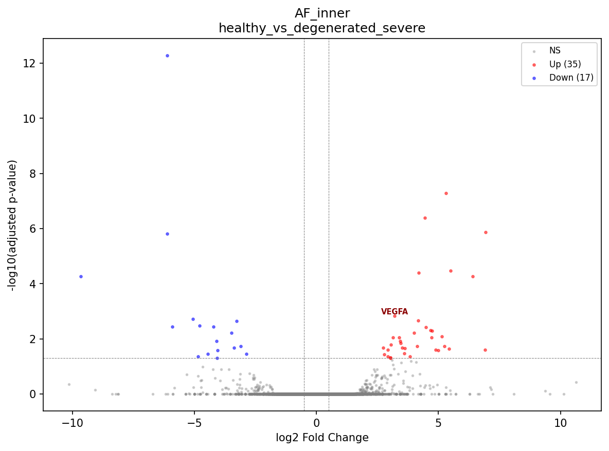

# Human Intervertebral Disc Single-Cell Atlas

**A comprehensive scRNA-seq meta-analysis of IVD degeneration**

Report generated: 2026-03-11 | Pipeline version: 4.0

---

| Total cells | Datasets | Donors | Samples | Compartments | DE genes | Enriched pathways | L-R interactions |
|:-----------:|:--------:|:------:|:-------:|:------------:|:--------:|:-----------------:|:----------------:|
| **410,759** | **11** | **~50** | **70** | **NP / AF / CEP** | **772** | **1,772** | **76,249** |

---

## Contents

1. [Overview](#1-overview)
2. [Dataset Summary](#2-dataset-summary)
3. [Integration Strategy](#3-integration-strategy)
4. [Differential Expression](#4-differential-expression)
5. [Biological Pathways](#5-biological-pathways)
6. [Transcription Factor Activity](#6-transcription-factor-activity)
7. [Cell State Trajectories](#7-cell-state-trajectories)
8. [Cell-Cell Communication](#8-cell-cell-communication)
9. [Pain Biology](#9-pain-biology)
10. [Limitations](#10-limitations)
11. [Methods](#11-methods)
12. [Reproducibility](#12-reproducibility)

---

## 1. Overview

This atlas integrates 11 publicly available single-cell RNA sequencing (scRNA-seq) datasets of human intervertebral disc (IVD) tissue, comprising 410,759 cells from 70 samples (~50 donors). GSE233666 was excluded due to herniated-only samples that confound condition comparisons. The analysis characterizes cell type diversity, transcriptomic changes with degeneration, and intercellular communication in the IVD.

### What changed in v4

The v4 pipeline is a major restructuring from v3, expanding from 10 to 12 modules and switching from scVI to scANVI semi-supervised integration:

1. **scANVI replaces scVI:** Semi-supervised integration uses coarse anchor labels (Chondrocyte_like, Fibroblast_like, Immune, Endothelial, Pericyte_SMC) from a new Module 04 (Coarse Classification). scANVI leverages these anchors during training for improved batch correction across platforms (10x, BD Rhapsody, Singleron).
2. **12-module pipeline:** The former monolithic integration+clustering+annotation module was split into three: Module 05 (Integration), Module 06 (Clustering with resolution optimization), and Module 07 (Two-stage post-integration annotation). Downstream modules renumbered accordingly.
3. **Two-stage annotation (Module 07):** Stage 1 assigns coarse identity via canonical markers; Stage 2 refines within coarse groups using cluster DE markers. More principled than v3's single-pass approach.
4. **Expanded cell type repertoire:** 19 cell types identified across all compartments (14 unique in NP/AF/CEP compartment objects), including new types: Fibrochondrocyte_chondroid, Fibrochondrocyte_fibroid, Fibrochondrocyte_stressed, NP_stressed, Macrophage_M2, Fibroblast_like (CEP).

These changes affected clustering resolution, cell type assignments, and downstream DE/trajectory/CCC results.

### Key Findings

- IVD resident cells exist on a **continuum** from notochordal to mature chondrocyte to fibrocartilaginous states in the NP, and inner to outer AF
- Pseudobulk DE analysis identified **772 unique significant genes** across 966 gene-comparison pairs in 23 powered comparisons
- **CXCL2** is significantly upregulated in severe degeneration: Fibrochondrocyte_chondroid mild_vs_severe (log2FC=3.90, padj=0.034), NP_fibrocartilaginous mild_vs_severe (log2FC=2.29, padj=0.000253), and downregulated in NP_fibrocartilaginous healthy_vs_mild (log2FC=-3.91, padj=0.00035)
- Cell state trajectories correlate with disease condition (pseudotime-condition rho = -0.092 in NP, +0.019 in AF, +0.396 in CEP)
- LIANA cell-cell communication analysis identifies **76,249 total L-R interactions** (39,236 healthy, 37,013 degenerated)
- Pain-associated gene analysis identifies **7 significant pain genes** including PTGS2, PLA2G2A, BDKRB2, CCL2, PTGES, FGF2, and VEGFA
- TF activity analysis identifies **246 significant TF-condition associations** via CollecTRI + pyDESeq2

---

## 2. Dataset Summary

| Dataset | Year | Compartment | Samples | Cells (post-QC) | Platform | Conditions |
|---------|------|-------------|:-------:|:---------------:|----------|------------|
| GSE160756 | 2021 | NP, AF, CEP | 7 | 89,283 | 10x | Healthy |
| GSE165722 | 2021 | NP | 8 | 37,978 | 10x | Degenerated (Pfirrmann II-V) |
| GSE189916 | 2022 | IVD mixed | 3 | 12,310 | 10x | Neonatal, Aged |
| GSE199866 | 2022 | NP, AF | 4 | 13,896 | 10x | Healthy, Degenerated |
| GSE205535 | 2022 | NP | 2 | 10,121 | 10x | Healthy (SCI), Degenerated |
| CNP0002664 | 2023 | NP | 6 | 29,609 | 10x | Healthy, Degenerated |
| GSE244889 | 2023 | NP | 7 | 51,519 | 10x | Healthy, Degenerated |
| GSE251686 | 2024 | NP | 5 | 36,415 | Singleron | Herniated |
| GSE255768 | 2024 | CEP | 2 | 8,886 | 10x | Degenerated |
| GSE230809 | 2023 | NP, AF | 24 | 105,804 | 10x | Healthy, Degenerated |
| GSE242443 | 2024 | CEP | 2 | 14,938 | 10x | Healthy, Degenerated (culture-expanded) |

*GSE233666 (7 herniated-only NP samples, 22,658 cells) excluded from pipeline -- herniated samples confound condition comparisons and were the source of likely study-confounded DE results in v1.*

---

## 3. Integration Strategy

**Compartment-based approach:** Cells were separated into 4 compartment objects and each integrated independently with tiered scANVI (semi-supervised):

| Compartment | Cells (v4) | Cells (v3) | Clusters | Change |
|:-----------:|:----------:|:----------:|:--------:|:------:|
| NP | 262,967 | 262,967 | 62 | Same cells, new clustering |
| AF | 84,568 | 84,610 | 14 | -42 |
| CEP | 50,769 | 50,714 | 9 | +55 |
| all_cells | 410,759 | 410,759 | 70 | -- |

The total cell count is unchanged; the compartment-level shifts reflect the scANVI anchor-based reclassification of cells between compartments.

**Cell types (19 total in all_cells; 14 unique across NP/AF/CEP compartment objects):**
- **NP (10 types):** NP_mature_chondrocyte (115,388), NP_fibrocartilaginous (90,857), Fibrochondrocyte_chondroid (18,354), NP_notochordal (8,920), Fibrochondrocyte_stressed (4,195), Fibrochondrocyte_fibroid (3,648), NP_stressed (3,613), unassigned (17,607), Macrophage_M2 (325), Pericyte_SMC (60)
- **AF (2 types):** AF_outer (49,651), AF_inner (34,917)
- **CEP (3 types):** EP_hyaline (31,775), Fibroblast_like (17,038), Fibrochondrocyte_chondroid (1,956)

**Integration (v4):** Tiered scANVI with coarse anchor labels from Module 04. Mesenchymal tier anchors: Chondrocyte_like, Fibroblast_like. Non-mesenchymal tier anchors: Immune, Endothelial, Pericyte_SMC. Workflow: scVI pre-training (max_epochs=200) followed by scANVI fine-tuning (max_epochs=50, early stopping). Two-stage annotation in Module 07: coarse markers then cluster DE refinement.

### NP Integration (scANVI)

### AF Integration (scANVI)

---

## 4. Differential Expression

Pseudobulk DE analysis using pyDESeq2. **23 powered comparisons** (up from 18 in v3), remaining comparisons skipped (underpowered). Significance: |log2FC| > 0.5, padj < 0.05. **772 unique DE genes** across 966 gene-comparison pairs.

| Cell Type | Comparison | Total DE genes |
|-----------|-----------|:-----:|
| NP_fibrocartilaginous | mild_vs_severe | **305** |
| NP_mature_chondrocyte | mild_vs_severe | **242** |
| NP_fibrocartilaginous | healthy_vs_severe | **182** |
| AF_outer | healthy_vs_severe | **58** |
| AF_inner | healthy_vs_severe | **52** |
| AF_inner | healthy_vs_all | 39 |
| Fibrochondrocyte_chondroid | mild_vs_severe | 14 |
| Fibrochondrocyte_stressed | mild_vs_severe | 14 |
| NP_fibrocartilaginous | healthy_vs_mild | 14 |
| unassigned | mild_vs_severe | 11 |

*v4 has more powered comparisons (23 vs 18 in v3) due to the scANVI-based cell type assignments producing better-powered groups including new types (Fibrochondrocyte_chondroid, Fibrochondrocyte_stressed, AF_inner). Overall unique DE genes decreased (772 vs 1,156 in v3), reflecting the redistribution of cells across the expanded cell type repertoire. See Supplementary Tables for full results.*

### Top DE genes in NP severe degeneration

CXCL2 remains a significant chemokine in degeneration:
- Fibrochondrocyte_chondroid mild_vs_severe: log2FC=3.90, padj=0.034
- NP_fibrocartilaginous mild_vs_severe: log2FC=2.29, padj=0.000253
- NP_fibrocartilaginous healthy_vs_mild: log2FC=-3.91, padj=0.00035 (downregulated in mild vs healthy)

### Top DE genes in AF degeneration

AF_inner emerges as a significant DE compartment in v4 with 52 DE genes in healthy_vs_severe and 39 in healthy_vs_all. AF_outer healthy_vs_severe yields 58 DE genes (down from 100 in v3).

### Volcano Plots

---

## 5. Biological Pathways

**ORA:** 1,772 significantly enriched terms (FDR < 0.05). **GSEA:** 68,839 terms tested (2,024 significant at FDR < 0.05) across GO, KEGG, Reactome, MSigDB Hallmark, and IVD-custom gene sets.

### AF_outer -- Upregulated Pathways

### NP_mature_chondrocyte -- Upregulated Pathways

### NP_fibrocartilaginous -- Upregulated Pathways

### GSEA: IVD Custom Gene Sets

---

## 6. Transcription Factor Activity

TF activity inferred using CollecTRI regulon overlap with pyDESeq2 pseudobulk framework. **246 significant TF-condition associations** (up from 5 in v3, reflecting the expanded cell type repertoire and additional powered comparisons in v4).

---

## 7. Cell State Trajectories

PAGA + diffusion pseudotime (DPT) on scANVI embeddings. NP: rooted at notochordal cells. AF: rooted at AF_inner. CEP: rooted at EP_hyaline.

### NP Trajectory

### NP Pseudotime by Condition

### NP Gene Dynamics Along Pseudotime

### AF Trajectory

### AF Pseudotime by Condition

**Pseudotime correlates with disease:**

| Compartment | Spearman rho (v4) | Spearman rho (v3) | Direction |
|:-----------:|:-----------------:|:-----------------:|:---------:|
| NP | -0.092 | -0.151 | Healthy early, degenerated late (weaker in v4) |
| AF | +0.019 | +0.325 | Near-zero correlation (dramatically weakened from v3) |
| CEP | +0.396 | +0.135 | Strengthened positive (degenerated at later pseudotime) |

> **FLAG FOR SME REVIEW:** The CEP pseudotime-condition correlation has strengthened substantially from v3 (+0.135) to v4 (+0.396), consistent with degenerated cells occupying later pseudotime states. The AF correlation has collapsed to near-zero (+0.019 vs +0.325 in v3), suggesting the previously observed AF trajectory-condition relationship was sensitive to integration method (scVI vs scANVI). The NP correlation weakened further but retained its negative sign.

> **FLAG FOR SME REVIEW (carried from v2):** The AF pseudotime-condition correlation instability across versions (v1: -0.177, v2: +0.341, v3: +0.325, v4: +0.019) indicates this metric is highly sensitive to integration and annotation choices. The near-zero v4 correlation may indicate that AF cell states are not strongly organized along a degeneration axis.

---

## 8. Cell-Cell Communication

LIANA consensus (CellPhoneDB, NATMI, Connectome, SingleCellSignalR, log2FC) on 20,000 cells per condition.

### Interaction Heatmap -- Healthy

### Interaction Heatmap -- Degenerated

### Differential Interactions

**Interaction counts:** 39,236 interactions (healthy) vs 37,013 (degenerated). Total: 76,249 L-R interactions.

In v4, healthy interactions slightly exceed degenerated (39K vs 37K), consistent with the v2 pattern (29K vs 27K) where degeneration reduces intercellular communication. This contrasts with v3 (40K vs 41K, near-equal) and v1 (44K vs 53K, degenerated higher).

> **FLAG FOR SME REVIEW:** The CCC interaction counts have varied across all four pipeline versions (v1: 44K/53K, v2: 29K/27K, v3: 40K/41K, v4: 39K/37K healthy/degenerated). The v4 result (fewer interactions in degeneration) is consistent with v2 and may reflect the improved batch correction from scANVI. The sensitivity of CCC results to upstream integration and annotation decisions remains notable.

---

## 9. Pain Biology

Cross-reference of DE genes with curated pain gene sets (nociception, neurotrophins, nerve guidance, inflammatory pain, neovascularization).

### Pain-Associated Findings

**7 significant pain genes** identified in v4:

- **PTGS2** (COX-2) -- prostaglandin synthesis, key inflammatory pain mediator
- **PLA2G2A** -- phospholipase A2, upstream of prostaglandin cascade
- **BDKRB2** -- bradykinin receptor, direct nociceptive signaling
- **CCL2** -- monocyte chemoattractant, promotes neuroinflammation
- **PTGES** -- prostaglandin E synthase, downstream of COX-2
- **FGF2** -- fibroblast growth factor 2, promotes neovascularization and nerve ingrowth
- **VEGFA** -- vascular endothelial growth factor A, neovascularization and nerve ingrowth

The v4 pain gene list is smaller than v3 (7 vs 10). TNF, NRP2, PDGFA, ROBO1, and SEMA3A dropped below significance, while FGF2 and VEGFA emerged as significant. The core inflammatory pain axis (PTGS2/PLA2G2A/PTGES/CCL2/BDKRB2) is preserved across all versions. The neovascularization genes (FGF2, VEGFA) support the model that degenerated discs promote vascular and nerve ingrowth.

- **Disc cells produce inflammatory mediators but not nociceptors.** This is consistent with the model that degenerated disc cells create a pro-inflammatory environment that promotes nerve ingrowth and sensitization, rather than directly signaling pain.

### Pain Gene Expression Heatmap

---

## 10. Limitations

- **Annotation sensitivity:** Cell type assignments differ between v3 (single-pass scVI) and v4 (two-stage scANVI). DE gene counts shifted (NP_fibrocartilaginous mild_vs_severe: 418 in v3 to 305 in v4), and trajectory correlations changed substantially (AF: +0.325 to +0.019). Results should be interpreted with this sensitivity in mind.
- **Herniated exclusion:** GSE233666 (22,658 cells, 7 samples) was excluded. Herniated-only samples confounded condition comparisons in v1 and inflated DE gene counts. GSE251686 herniated samples remain but are treated as "severe" degeneration.
- **CellTypist NP disagreements:** NP-specific cell states (notochordal, fibrocartilaginous) are absent from CellTypist reference databases. AF and CEP concordance is high.
- **Cross-study confounding:** Condition and study are partially confounded. Within-study comparisons used where possible.
- **Underpowered comparisons:** Many cell type x comparison combinations skipped due to insufficient samples (23 powered out of total possible comparisons).
- **No RNA velocity:** Spliced/unspliced counts not available in public datasets. Would require reprocessing from BAM files.
- **Age-disease confound:** In GSE230809, healthy donors are 21-27y and diseased are 37-73y. Cannot fully separate age from disease effects.
- **Sex bias:** GSE230809 (largest dataset, 24 samples) is all-male. Many samples have unknown sex.
- **Culture-expanded cells:** GSE242443 CEP cells are culture-expanded, which alters gene expression.
- **AF trajectory instability:** AF pseudotime-condition correlation has varied across versions (v1: -0.177, v2: +0.341, v3: +0.325, v4: +0.019). The near-zero v4 value suggests this metric is unreliable for AF.
- **CCC instability:** CCC interaction counts have varied across all four pipeline versions (v1: 44K/53K, v2: 29K/27K, v3: 40K/41K, v4: 39K/37K healthy/degen). Results are sensitive to cell type composition and integration method.
- **Composition analysis:** No significant changes after FDR correction, though trends are biologically consistent.
- **SCENIC/GRN not run:** Full SCENIC analysis was not performed due to computational requirements. TF activity estimated from CollecTRI regulon overlap instead.
- **Unassigned NP cells:** 17,607 NP cells (6.7%) remain unassigned, likely representing stressed/transitional states that do not clearly match canonical marker signatures.

---

## 11. Methods

### Data acquisition
11 scRNA-seq datasets of human IVD tissue were downloaded from GEO and CNGB (see Table in Section 2). GSE233666 excluded due to herniated-only design. Raw count matrices were obtained for each dataset.

### Quality control and preprocessing
Per-dataset QC: min 200 genes, max 6000 genes, min 500 counts, max 20% mitochondrial reads. Doublet detection with Scrublet (expected rate 5%). Normalization: total-count to 10,000, log1p. HVG selection: top 2000 genes per dataset using Seurat v3 method.

### Coarse classification (v4 Module 04)
Binary mesenchymal/non-mesenchymal classification replaced with 5 coarse anchor categories (Chondrocyte_like, Fibroblast_like, Immune, Endothelial, Pericyte_SMC) plus Unknown. Canonical marker sets used for initial classification. These labels serve as anchor inputs for scANVI semi-supervised integration.

### Integration (v4 Module 05)
Compartment-based strategy: cells separated into NP (262,967), AF (84,568), CEP (50,769), and all_cells (410,759) objects. Each integrated with tiered scANVI: scVI pre-training (max_epochs=200) followed by scANVI fine-tuning (max_epochs=50, early stopping) using coarse_label anchors. Mesenchymal tier: Chondrocyte_like + Fibroblast_like anchors. Non-mesenchymal tier: Immune + Endothelial + Pericyte_SMC anchors.

### Clustering (v4 Module 06)
Leiden clustering with automated resolution optimization on scANVI embeddings. NP: 62 clusters (56 mesenchymal res=1.0, 6 non-mesenchymal res=0.5). AF: 14 clusters (res=0.2). CEP: 9 clusters (res=0.2). all_cells: 70 clusters (62 mesenchymal res=1.0, 8 non-mesenchymal res=0.7).

### Cell type annotation (v4 Module 07)
Two-stage annotation: Stage 1 assigns coarse identity via canonical marker expression. Stage 2 refines within coarse groups using cluster DE markers. 19 cell types identified in all_cells (14 unique across NP/AF/CEP compartment objects). Validated with CellTypist Immune_All_Low model for immune subtypes.

### Differential expression (v4 Module 08)
Pseudobulk aggregation per sample per cell type. DE with pyDESeq2 (Python DESeq2 implementation). Significance: |log2FC| > 0.5, adjusted p-value < 0.05 (Benjamini-Hochberg). Minimum 3 samples per condition per cell type. 23 powered comparisons in v4.

### Pathway enrichment (v4 Module 09)
Over-representation analysis (ORA) and gene set enrichment analysis (GSEA) using gseapy. Databases: GO Biological Process 2023, KEGG 2021, Reactome 2022, MSigDB Hallmark 2020, custom IVD gene sets. 1,772 significant ORA terms, 68,839 GSEA terms tested (2,024 significant).

### TF activity inference (v4 Module 09)
CollecTRI regulon network with pyDESeq2 pseudobulk framework. 246 significant TF-condition associations identified in v4.

### Trajectory analysis (v4 Module 10)
PAGA + diffusion pseudotime (DPT) on scANVI embeddings. Root cells: NP notochordal, AF inner, CEP EP_hyaline. Trajectory genes: Spearman correlation with pseudotime, FDR < 0.05, top 500 per compartment.

### Cell-cell communication (v4 Module 11)
LIANA rank_aggregate with consensus resource. 5 methods: CellPhoneDB, NATMI, Connectome, SingleCellSignalR, log2FC. 100 permutations. 20,000 cells per condition. Total 76,249 interactions identified.

### Software
Python 3.12, scanpy 1.11, scvi-tools 1.4.2, pyDESeq2, gseapy 1.1, decoupler 2.1, liana 1.7. Full environment: `requirements_frozen.txt`.

### Supplementary Tables
27 supplementary tables provided in `results/supplementary_tables/`, including dataset registry, sample metadata, inclusion summary, study caveats, cell type definitions, clustering metrics, composition analysis, DE summary, DE results, skipped comparisons, ORA enrichment, GSEA results, TF activity, pain genes, trajectory genes (NP/AF/CEP), pain interactions, and CellTypist concordance (NP/AF/CEP).

---

## 12. Reproducibility

- All scripts version-controlled in git
- Random seeds: 42 (all stochastic operations)
- Package versions pinned in `requirements_frozen.txt`
- All parameter choices documented in `analysis_plan.md`
- All human checkpoint decisions recorded
- Data provenance: GEO/CNGB accessions, download dates in `metadata/dataset_registry.tsv`
- v4 pipeline restructuring (scANVI, 12-module, two-stage annotation) fully documented in Section 1 and Methods
