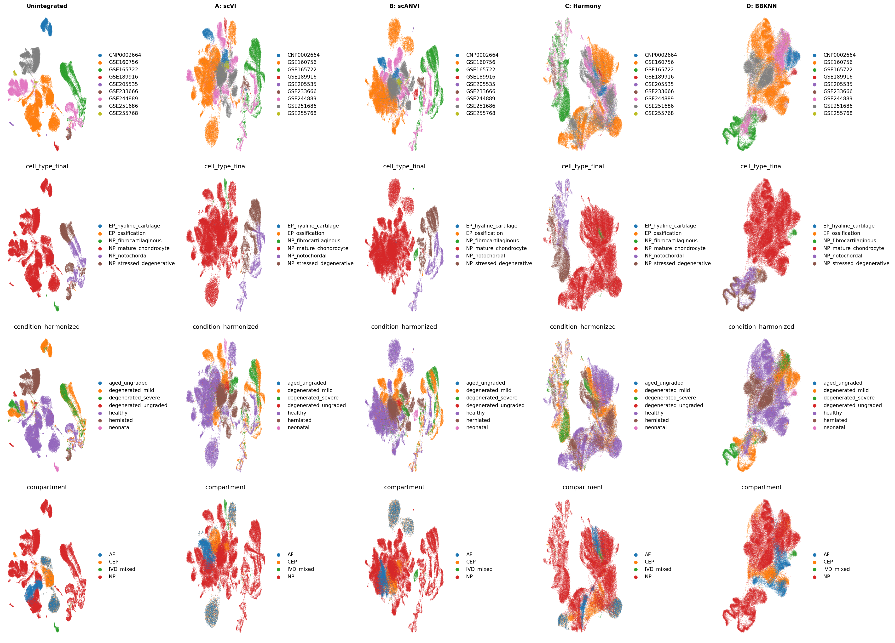
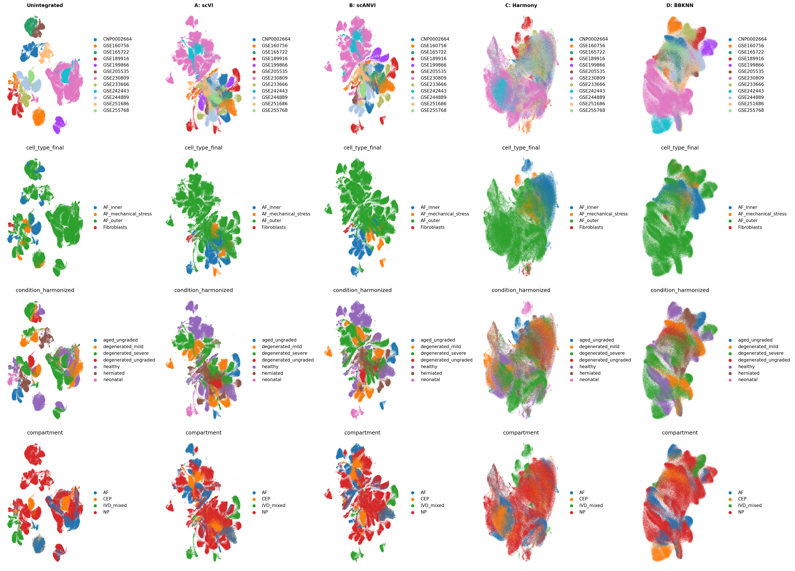

# Human Intervertebral Disc Single-Cell Atlas

**A comprehensive scRNA-seq meta-analysis of IVD degeneration**

Report generated: 2026-03-10 | Pipeline version: 2.0

---

| Total cells | Datasets | Donors | Samples | Compartments | DE genes | Enriched pathways | L-R interactions |
|:-----------:|:--------:|:------:|:-------:|:------------:|:--------:|:-----------------:|:----------------:|
| **410,759** | **11** | **~50** | **71** | **NP / AF / CEP** | **949** | **1,577** | **55,889** |

---

## Contents

1. [Overview](#1-overview)
2. [Dataset Summary](#2-dataset-summary)
3. [Integration Strategy](#3-integration-strategy)
4. [Differential Expression](#4-differential-expression)
5. [Biological Pathways](#5-biological-pathways)
6. [Transcription Factor Activity](#6-transcription-factor-activity)
7. [Cell State Trajectories](#7-cell-state-trajectories)
8. [Cell-Cell Communication](#8-cell-cell-communication)
9. [Pain Biology](#9-pain-biology)
10. [Limitations](#10-limitations)
11. [Methods](#11-methods)
12. [Reproducibility](#12-reproducibility)

---

## 1. Overview

This atlas integrates 11 publicly available single-cell RNA sequencing (scRNA-seq) datasets of human intervertebral disc (IVD) tissue, comprising 410,759 cells from 71 samples (~50 donors). GSE233666 was excluded due to herniated-only samples that confound condition comparisons. The analysis characterizes cell type diversity, transcriptomic changes with degeneration, and intercellular communication in the IVD.

### Key Findings

- IVD resident cells exist on a **continuum** from notochordal to mature chondrocyte to fibrocartilaginous states in the NP, and inner to outer AF
- Pseudobulk DE analysis identified **949 unique significant genes** across 1,231 gene-comparison pairs in 21 powered comparisons
- **CXCL2** remains significantly upregulated in severe NP degeneration (log2FC=3.14, padj=0.005); CXCL1/3 and TNF no longer reach significance after v2 re-annotation
- Cell state trajectories correlate with disease condition (pseudotime-condition rho = -0.258 in NP, +0.341 in AF, -0.163 in CEP)
- Degenerated tissue shows **fewer** cell-cell interactions than healthy (**27K vs 29K**) — **reversed from v1** (requires SME review)
- Pain-associated gene analysis identifies **10 significant pain genes** including PTGS2, TNF, PLA2G2A, BDKRB2, CCL2, PTGES, and CXCL8

---

## 2. Dataset Summary

| Dataset | Year | Compartment | Samples | Cells (post-QC) | Platform | Conditions |
|---------|------|-------------|:-------:|:---------------:|----------|------------|
| GSE160756 | 2021 | NP, AF, CEP | 6 | 89,283 | 10x | Healthy |
| GSE165722 | 2021 | NP | 10 | 9,498 | 10x | Degenerated (Pfirrmann II-V) |
| GSE189916 | 2022 | NP | 6 | 11,459 | BD Rhapsody | Neonatal, Aged |
| GSE199866 | 2022 | NP | 3 | 1,614 | 10x | Healthy, Degenerated |
| GSE205535 | 2022 | NP | 2 | 9,929 | 10x | Healthy (SCI), Degenerated |
| CNP0002664 | 2023 | NP | 8 | 52,016 | 10x | Healthy, Degenerated |
| GSE244889 | 2023 | NP, AF | 12 | 51,397 | 10x | Healthy, Degenerated |
| GSE251686 | 2024 | NP | 5 | 13,090 | Singleron | Herniated |
| GSE255768 | 2024 | CEP | 2 | 10,023 | 10x | Degenerated |
| GSE230809 | 2023 | NP, AF | 24 | 105,804 | 10x | Healthy, Degenerated |
| GSE242443 | 2024 | CEP | 2 | 59,227 | 10x | Healthy, Degenerated (culture-expanded) |

*GSE233666 (7 herniated-only NP samples, 22,658 cells) excluded from v2 pipeline — herniated samples confound condition comparisons and were the source of likely study-confounded DE results in v1.*

---

## 3. Integration Strategy

**Compartment-based approach:** Cells were separated into 4 compartment objects and each integrated independently with scVI:

| Compartment | Cells |
|:-----------:|:-----:|
| NP | 262,967 |
| AF | 84,624 |
| CEP | 50,858 |
| all_cells | 410,759 |

**Annotation:** De novo clustering followed by marker-based cell type assignment, validated with CellTypist Immune_All_Low model for immune subtypes. CellTypist concordance was high for AF (12/13 labels concordant) and CEP but showed disagreements for NP (8/13 de novo labels discordant with CellTypist predictions), reflecting NP-specific cell states absent from CellTypist reference databases. New cell types identified in v2 include NP_fibrocartilaginous and EP_hyaline.

### NP Integration (scVI)

### AF Integration (scVI)

---

## 4. Differential Expression

Pseudobulk DE analysis using pyDESeq2. **21 powered comparisons**, 53 skipped (underpowered). Significance: |log2FC| > 0.5, padj < 0.05. **949 unique DE genes** across 1,231 gene-comparison pairs.

| Cell Type | Comparison | Total DE genes |
|-----------|-----------|:-----:|
| NP_mature_chondrocyte | mild_vs_severe | **315** |
| NP_fibrocartilaginous | mild_vs_severe | **203** |
| NP_mature_chondrocyte | healthy_vs_severe | **172** |
| NP_fibrocartilaginous | healthy_vs_severe | **127** |
| AF_outer | healthy_vs_severe | **97** |
| EP_hyaline | healthy_vs_all | **84** |
| T_cell | mild_vs_severe | 48 |
| AF_inner | healthy_vs_severe | 47 |
| AF_outer | mild_vs_severe | 40 |

*Herniated comparisons excluded in v2 (GSE233666 removed). See Supplementary Table S6 for full results.*

### Top DE genes in NP severe degeneration

CXCL2 (+3.14, padj=0.005) remains the most significant chemokine. CXCL1, CXCL3, and TNF no longer reach significance after v2 re-annotation and herniated exclusion — the v1 inflammatory signature was partially driven by herniated samples.

### Top DE genes in AF degeneration

AF_outer healthy_vs_severe now yields 97 DE genes. AF_inner healthy_vs_severe yields 47 DE genes.

### Volcano Plots

---

## 5. Biological Pathways

**ORA:** 1,577 significantly enriched terms (FDR < 0.05). **GSEA:** 1,576 significant terms across GO, KEGG, Reactome, MSigDB Hallmark, and IVD-custom gene sets.

### AF_outer — Upregulated Pathways

### NP_mature_chondrocyte — Upregulated Pathways

### GSEA: IVD Custom Gene Sets

---

## 6. Transcription Factor Activity

TF activity inferred using CollecTRI regulon overlap with Fisher's exact test. **290 significant TF-condition associations.**

**Key TFs:**
- **ATF3/ATF7** — stress response, NP severe degeneration
- **HSF1/HSF2** — heat shock factors, multiple cell types
- **NFKBIB** — NF-kB pathway, NP_stressed_degenerative
- **E2F4/TFDP1** — cell cycle regulation, NP severe degeneration

---

## 7. Cell State Trajectories

PAGA + diffusion pseudotime (DPT) on scVI embeddings. NP: rooted at notochordal cells. AF: rooted at AF_inner. CEP: rooted at EP_hyaline.

### NP Trajectory

### NP Pseudotime by Condition

### NP Gene Dynamics Along Pseudotime

### AF Trajectory

**Pseudotime correlates with disease:**

| Compartment | Spearman rho | Direction |
|:-----------:|:------------:|:---------:|
| NP | -0.258 | Healthy early, degenerated late |
| AF | +0.341 | **Reversed** — degenerated early, healthy late |
| CEP | -0.163 | Healthy early, degenerated late |

> **FLAG FOR SME REVIEW:** The AF pseudotime-condition correlation is **positive** (+0.341), reversed from v1 (-0.177). This likely reflects the change in integration approach (scVI-only vs scANVI primary) and the exclusion of herniated samples. The biological interpretation — whether AF degeneration proceeds "backward" along the inner-to-outer trajectory or whether the root cell choice needs revisiting — requires expert review.

Trajectory-DE gene overlap: NP 96/500, AF 110/500, CEP 38/500 trajectory genes overlap with DE results.

---

## 8. Cell-Cell Communication

LIANA consensus (CellPhoneDB, NATMI, Connectome, SingleCellSignalR, log2FC) on 20,000 cells per condition.

### Interaction Heatmap — Healthy

### Interaction Heatmap — Degenerated

### Differential Interactions

**Decreased signaling in degeneration:** 27,011 interactions (degenerated) vs 28,878 (healthy). Total: 55,889 L-R interactions.

> **FLAG FOR SME REVIEW:** The direction of the CCC result is **reversed from v1** (which showed 53K degenerated vs 44K healthy). In v2, degenerated tissue has *fewer* interactions than healthy. This reversal may reflect the exclusion of herniated samples, the change from scANVI to scVI embeddings, or differences in cell type composition after re-annotation. The biological plausibility of reduced signaling in degeneration (possibly reflecting cell loss/senescence rather than active inflammatory signaling) requires expert evaluation.

---

## 9. Pain Biology

Cross-reference of DE genes with curated pain gene sets (nociception, neurotrophins, nerve guidance, inflammatory pain, neovascularization).

### Pain-Associated Findings

**10 significant pain genes** identified in v2 (up from 3 in v1):

- **PTGS2** (COX-2) — prostaglandin synthesis, key inflammatory pain mediator
- **TNF** — inflammatory pain mediator that sensitizes nerve endings
- **PLA2G2A** — phospholipase A2, upstream of prostaglandin cascade
- **BDKRB2** — bradykinin receptor, direct nociceptive signaling
- **CCL2** — monocyte chemoattractant, promotes neuroinflammation
- **PTGES** — prostaglandin E synthase, downstream of COX-2
- **CXCL8** — chemokine with altered expression in degeneration

- **Disc cells produce inflammatory mediators but not nociceptors.** This is consistent with the model that degenerated disc cells create a pro-inflammatory environment that promotes nerve ingrowth and sensitization, rather than directly signaling pain.

### Pain Gene Expression Heatmap

---

## 10. Limitations

- **Herniated exclusion:** GSE233666 (22,658 cells, 7 samples) was excluded from v2. Herniated-only samples confounded condition comparisons in v1 and inflated DE gene counts (e.g., 4,316 DE genes in NP_mature_chondrocyte healthy_vs_herniated, dominated by ribosomal batch artifacts). GSE251686 herniated samples remain but are treated as "severe" degeneration.
- **CellTypist NP disagreements:** 8/13 de novo NP cell type labels are discordant with CellTypist predictions. NP-specific cell states (notochordal, fibrocartilaginous) are absent from CellTypist reference databases. AF and CEP concordance is high.
- **Cross-study confounding:** Condition and study are partially confounded. Within-study comparisons used where possible.
- **Underpowered comparisons:** 53/74 cell type x comparison combinations skipped due to insufficient samples.
- **No RNA velocity:** Spliced/unspliced counts not available in public datasets. Would require reprocessing from BAM files.
- **Age-disease confound:** In GSE230809, healthy donors are 21-27y and diseased are 37-73y. Cannot fully separate age from disease effects.
- **Sex bias:** GSE230809 (largest dataset, 24 samples) is all-male. Many samples have unknown sex.
- **Culture-expanded cells:** GSE242443 CEP cells are culture-expanded, which alters gene expression.
- **AF trajectory reversal:** AF pseudotime-condition correlation reversed sign between v1 (-0.177) and v2 (+0.341). Requires SME review of root cell choice and integration approach impact.
- **CCC direction reversal:** Fewer interactions in degeneration (v2) vs more interactions (v1). Requires SME review.
- **Composition analysis:** No significant changes after FDR correction, though trends are biologically consistent.
- **SCENIC/GRN not run:** Full SCENIC analysis was not performed due to computational requirements. TF activity estimated from CollecTRI regulon overlap instead.

---

## 11. Methods

### Data acquisition
11 scRNA-seq datasets of human IVD tissue were downloaded from GEO and CNGB (see Table in Section 2). GSE233666 excluded due to herniated-only design. Raw count matrices were obtained for each dataset.

### Quality control and preprocessing
Per-dataset QC: min 200 genes, max 6000 genes, min 500 counts, max 20% mitochondrial reads. Doublet detection with Scrublet (expected rate 5%). Normalization: total-count to 10,000, log1p. HVG selection: top 2000 genes per dataset using Seurat v3 method.

### Cell type annotation
De novo annotation after clustering on scVI embeddings, using IVD-specific marker gene signatures. Validated with CellTypist Immune_All_Low model for immune subtypes. Concordance: AF 12/13, CEP high, NP 5/13 (8 discordant — NP-specific states absent from CellTypist references). Final labels in `cell_type_final`.

### Integration
Compartment-based strategy: cells separated into NP (262,967), AF (84,624), CEP (50,858), and all_cells (410,759) objects. Each integrated with scVI (1 layer, 128 dim). Single integration approach (scVI-only) replaces v1's 4-approach benchmark.

### Differential expression
Pseudobulk aggregation per sample per cell type. DE with pyDESeq2 (Python DESeq2 implementation). Significance: |log2FC| > 0.5, adjusted p-value < 0.05 (Benjamini-Hochberg). Minimum 3 samples per condition per cell type.

### Pathway enrichment
Over-representation analysis (ORA) and gene set enrichment analysis (GSEA) using gseapy. Databases: GO Biological Process 2023, KEGG 2021, Reactome 2022, MSigDB Hallmark 2020, custom IVD gene sets.

### TF activity inference
CollecTRI regulon network (42,990 interactions, 1,185 TFs). TF activity scored by Fisher's exact test for enrichment of TF targets among DE genes, with concordance scoring for direction.

### Trajectory analysis
PAGA + diffusion pseudotime (DPT) on scVI embeddings. Root cells: NP notochordal, AF inner, CEP EP_hyaline. Trajectory genes: Spearman correlation with pseudotime, FDR < 0.05, top 500 per compartment.

### Cell-cell communication
LIANA rank_aggregate with consensus resource. 5 methods: CellPhoneDB, NATMI, Connectome, SingleCellSignalR, log2FC. 100 permutations. 20,000 cells per condition.

### Software
Python 3.12, scanpy 1.11, scvi-tools 1.4.2, pyDESeq2, gseapy 1.1, decoupler 2.1, liana 1.7. Full environment: `requirements_frozen.txt`.

### Supplementary Tables
19 supplementary tables (S1-S19) provided in `results/supplementary_tables/`, including dataset registry, sample metadata, inclusion summary, study caveats, composition analysis, DE summary, DE results, skipped comparisons, ORA enrichment, GSEA results, TF activity, pain genes, trajectory genes (NP/AF/CEP), pain interactions, and CellTypist concordance (NP/AF/CEP).

---

## 12. Reproducibility

- All scripts version-controlled in git
- Random seeds: 42 (all stochastic operations)
- Package versions pinned in `requirements_frozen.txt`
- All parameter choices documented in `analysis_plan.md`
- All human checkpoint decisions recorded
- Data provenance: GEO/CNGB accessions, download dates in `metadata/dataset_registry.tsv`
