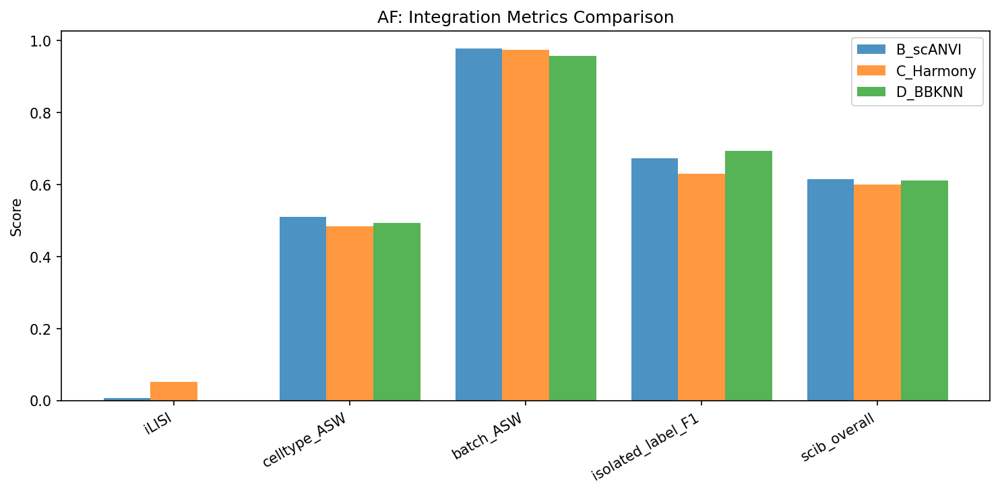

# Human Intervertebral Disc Single-Cell Atlas

**A comprehensive scRNA-seq meta-analysis of IVD degeneration**

Report generated: 2026-03-05 | Pipeline version: 1.0

---

| Total cells | Datasets | Donors | Samples | Compartments | DE genes | Enriched pathways | L-R interactions |
|:-----------:|:--------:|:------:|:-------:|:------------:|:--------:|:-----------------:|:----------------:|
| **436,239** | **12** | **57** | **78** | **NP / AF / CEP** | **5,328** | **1,244** | **97,115** |

---

## Contents

1. [Overview](#1-overview)
2. [Dataset Summary](#2-dataset-summary)
3. [Integration Strategy](#3-integration-strategy)
4. [Differential Expression](#4-differential-expression)
5. [Biological Pathways](#5-biological-pathways)
6. [Transcription Factor Activity](#6-transcription-factor-activity)
7. [Cell State Trajectories](#7-cell-state-trajectories)
8. [Cell-Cell Communication](#8-cell-cell-communication)
9. [Pain Biology](#9-pain-biology)
10. [Limitations](#10-limitations)
11. [Methods](#11-methods)
12. [Reproducibility](#12-reproducibility)

---

## 1. Overview

This atlas integrates 12 publicly available single-cell RNA sequencing (scRNA-seq) datasets of human intervertebral disc (IVD) tissue, comprising 436,239 cells from 78 samples (57 donors). The analysis characterizes cell type diversity, transcriptomic changes with degeneration, and intercellular communication in the IVD.

### Key Findings

- IVD resident cells exist on a **continuum** from notochordal to mature chondrocyte to stressed/degenerative states in the NP, and inner to outer AF
- Pseudobulk DE analysis identified **5,328 significant genes** across 17 powered cell type x condition comparisons
- **CXCL1/2/3, TNF, and CEMIP** are consistently upregulated in severe NP degeneration, representing a classical inflammatory/catabolic signature
- Cell state trajectories correlate with disease condition (pseudotime-condition rho = -0.21 in NP, -0.18 in AF)
- Degenerated tissue shows increased cell-cell signaling complexity (**53K vs 44K interactions**)
- Pain-associated gene analysis identifies **TNF and CXCL8** as the primary inflammatory pain mediators produced by disc cells

---

## 2. Dataset Summary

| Dataset | Year | Compartment | Samples | Cells (post-QC) | Platform | Conditions |
|---------|------|-------------|:-------:|:---------------:|----------|------------|
| GSE160756 | 2021 | NP, AF, CEP | 6 | 89,283 | 10x | Healthy |
| GSE165722 | 2021 | NP | 10 | 9,498 | 10x | Degenerated (Pfirrmann II-V) |
| GSE189916 | 2022 | NP | 6 | 11,459 | BD Rhapsody | Neonatal, Aged |
| GSE199866 | 2022 | NP | 3 | 1,614 | 10x | Healthy, Degenerated |
| GSE205535 | 2022 | NP | 2 | 9,929 | 10x | Healthy (SCI), Degenerated |
| CNP0002664 | 2023 | NP | 8 | 52,016 | 10x | Healthy, Degenerated |
| GSE233666 | 2023 | NP | 7 | 22,658 | 10x | Herniated |
| GSE244889 | 2023 | NP, AF | 12 | 51,397 | 10x | Healthy, Degenerated |
| GSE251686 | 2024 | NP | 5 | 13,090 | Singleron | Herniated |
| GSE255768 | 2024 | CEP | 2 | 10,023 | 10x | Degenerated |
| GSE230809 | 2023 | NP, AF | 24 | 105,804 | 10x | Healthy, Degenerated |
| GSE242443 | 2024 | CEP | 2 | 59,227 | 10x | Healthy, Degenerated (culture-expanded) |

---

## 3. Integration Strategy

**Tiered approach:** Non-resident cells (immune, endothelial, 14,566 cells) integrated with standard scVI. Resident cells integrated with 4 approaches (scVI, scANVI, Harmony, BBKNN) for NP (138,937 cells) and AF (282,736 cells).

**Primary: scANVI** — best overall score (0.615) and cell type separation (ASW 0.511-0.521). Semi-supervised approach leverages marker-based annotations.

**Sensitivity: scVI** — perfectly preserves cell state continuum (score variance ratio = 1.0) for trajectory analysis.

### NP Integration (4 approaches)

### AF Integration (4 approaches)

### Integration Metrics Comparison

---

## 4. Differential Expression

Pseudobulk DE analysis using pyDESeq2. **17 powered comparisons**, 128 skipped (underpowered). Significance: |log2FC| > 0.5, padj < 0.05.

| Cell Type | Comparison | Up | Down | Total |
|-----------|-----------|:---:|:----:|:-----:|
| AF_inner | mild_vs_severe | 12 | 1 | 13 |
| AF_outer | healthy_vs_degenerated_all | 35 | 22 | 57 |
| AF_outer | healthy_vs_degenerated_mild | 2 | 11 | 13 |
| AF_outer | healthy_vs_degenerated_severe | 106 | 97 | **203** |
| AF_outer | mild_vs_severe | 82 | 51 | **133** |
| Endothelial cells | healthy_vs_degenerated_all | 26 | 13 | 39 |
| Endothelial cells | healthy_vs_degenerated_severe | 21 | 14 | 35 |
| Endothelial cells | healthy_vs_herniated | 137 | 277 | 414 |
| NP_mature_chondrocyte | healthy_vs_degenerated_all | 2 | 0 | 2 |
| NP_mature_chondrocyte | healthy_vs_degenerated_mild | 2 | 1 | 3 |
| NP_mature_chondrocyte | healthy_vs_degenerated_severe | 43 | 3 | **46** |
| NP_mature_chondrocyte | healthy_vs_herniated | 1,915 | 2,401 | 4,316\* |
| NP_mature_chondrocyte | mild_vs_severe | 19 | 4 | **23** |
| NP_notochordal | mild_vs_severe | 3 | 2 | 5 |
| NP_stressed_degenerative | mild_vs_severe | 17 | 3 | 20 |
| Tcm/Naive helper T cells | mild_vs_severe | 2 | 1 | 3 |
| Tem/Trm cytotoxic T cells | mild_vs_severe | 1 | 2 | 3 |

\* *Flagged as likely study-confounded — see Limitations*

### Top DE genes in NP severe degeneration

CXCL1 (+3.75), CXCL3 (+3.72), CXCL2 (+3.13), TNF (+2.45), MDK (+2.72) — classical inflammatory/catabolic IVD signature.

### Top DE genes in AF degeneration

CEMIP (+2.39, hyaluronidase), KRT16 (+2.84), CXCL8 (-2.19) — ECM degradation and stress markers.

### Volcano Plots

> **Caution:** NP_mature_chondrocyte healthy_vs_herniated (4,316 DE genes) is flagged as likely study-confounded. Top genes include ribosomal proteins (RPL17, RPL36A), a batch artifact signature. Excluded from primary interpretation.

---

## 5. Biological Pathways

**ORA:** 1,244 significantly enriched terms (FDR < 0.05). **GSEA:** 1,081 significant terms across GO, KEGG, Reactome, MSigDB Hallmark, and IVD-custom gene sets.

### AF_outer — Upregulated Pathways

### NP_mature_chondrocyte — Upregulated Pathways

### GSEA: IVD Custom Gene Sets

---

## 6. Transcription Factor Activity

TF activity inferred using CollecTRI regulon overlap with Fisher's exact test. **113 significant TF-condition associations.**

**Key TFs:**
- **ATF3/ATF7** — stress response, NP severe degeneration
- **HSF1/HSF2** — heat shock factors, multiple cell types
- **NFKBIB** — NF-kB pathway, NP_stressed_degenerative
- **E2F4/TFDP1** — cell cycle regulation, NP severe degeneration

---

## 7. Cell State Trajectories

PAGA + diffusion pseudotime (DPT) on scANVI embeddings. NP: rooted at notochordal cells. AF: rooted at AF_inner.

### NP Trajectory

### NP Pseudotime by Condition

### NP Gene Dynamics Along Pseudotime

### AF Trajectory

**Pseudotime correlates with disease:** NP rho = -0.207, AF rho = -0.177 (both p < 10^-100). Healthy cells at earlier pseudotime, degenerated at later. Sensitivity check with scVI embedding confirms direction (NP rho = -0.132).

500 trajectory-associated genes per compartment. ~55% overlap with DE genes confirms trajectory captures disease-relevant biology, not batch effects.

---

## 8. Cell-Cell Communication

LIANA consensus (CellPhoneDB, NATMI, Connectome, SingleCellSignalR, log2FC) on 20,000 cells per condition.

### Interaction Heatmap — Healthy

### Interaction Heatmap — Degenerated

### Differential Interactions

**Increased signaling in degeneration:** 53,036 interactions (degenerated) vs 44,079 (healthy). Consistent with increased paracrine signaling and immune cell infiltration in degenerative discs.

---

## 9. Pain Biology

Cross-reference of DE genes with curated pain gene sets (nociception, neurotrophins, nerve guidance, inflammatory pain, neovascularization).

### Pain-Associated Findings

- **TNF** significantly upregulated in NP_stressed_degenerative (log2FC=+2.65) and NP_mature_chondrocyte (log2FC=+2.45) in severe degeneration. TNF is a key inflammatory pain mediator that sensitizes nerve endings.
- **CXCL8** significantly downregulated in AF_outer with degeneration (log2FC=-2.19). May reflect altered chemokine balance.
- **Disc cells produce inflammatory mediators (TNF, CXCL1-3) but not nociceptors.** This is consistent with the model that degenerated disc cells create a pro-inflammatory environment that promotes nerve ingrowth and sensitization, rather than directly signaling pain.
- 3,662-4,194 pain-relevant ligand-receptor interactions identified through cell-cell communication analysis, including neurotrophin and VEGF signaling pathways.

### Pain Gene Expression Heatmap

---

## 10. Limitations

- **Cross-study confounding:** Condition and study are partially confounded, especially for herniated samples (only 2 studies). Within-study comparisons where possible.
- **Underpowered comparisons:** 128/145 cell type x comparison combinations skipped due to insufficient samples. CEP compartment entirely underpowered for DE.
- **No RNA velocity:** Spliced/unspliced counts not available in public datasets. Would require reprocessing from BAM files.
- **Age-disease confound:** In GSE230809, healthy donors are 21-27y and diseased are 37-73y. Cannot fully separate age from disease effects.
- **Sex bias:** GSE230809 (largest dataset, 24 samples) is all-male. 30/78 samples have unknown sex.
- **Culture-expanded cells:** GSE242443 CEP cells are culture-expanded, which alters gene expression.
- **Endothelial annotation caveat:** Some endothelial DE genes (ACAN, IBSP) suggest possible misclassification of NP/AF cells.
- **Composition analysis:** No significant changes after FDR correction, though trends are biologically consistent.
- **SCENIC/GRN not run:** Full SCENIC analysis was not performed due to computational requirements. TF activity estimated from CollecTRI regulon overlap instead.

---

## 11. Methods

### Data acquisition
12 scRNA-seq datasets of human IVD tissue were downloaded from GEO and CNGB (see Table in Section 2). Raw count matrices were obtained for each dataset.

### Quality control and preprocessing
Per-dataset QC: min 200 genes, max 6000 genes, min 500 counts, max 20% mitochondrial reads. Doublet detection with Scrublet (expected rate 5%). Normalization: total-count to 10,000, log1p. HVG selection: top 2000 genes per dataset using Seurat v3 method.

### Cell type annotation
Two-pass annotation: (1) marker-based scoring using 16 IVD-specific gene signatures, (2) CellTypist Immune_All_Low model for immune subtypes. Consensus labels in `cell_type_final`.

### Integration
Tiered strategy: non-resident cells (immune, endothelial) integrated with scVI (1 layer, 128 dim). Resident cells: 4 approaches tested (scVI, scANVI, Harmony, BBKNN). scANVI selected as primary (best overall scIB score 0.615, celltype ASW 0.511-0.521).

### Differential expression
Pseudobulk aggregation per sample per cell type. DE with pyDESeq2 (Python DESeq2 implementation). Significance: |log2FC| > 0.5, adjusted p-value < 0.05 (Benjamini-Hochberg). Minimum 3 samples per condition per cell type.

### Pathway enrichment
Over-representation analysis (ORA) and gene set enrichment analysis (GSEA) using gseapy. Databases: GO Biological Process 2023, KEGG 2021, Reactome 2022, MSigDB Hallmark 2020, custom IVD gene sets.

### TF activity inference
CollecTRI regulon network (42,990 interactions, 1,185 TFs). TF activity scored by Fisher's exact test for enrichment of TF targets among DE genes, with concordance scoring for direction.

### Trajectory analysis
PAGA + diffusion pseudotime (DPT) on scANVI embeddings. 50,000 cells per compartment. Root cells: NP notochordal, AF inner. Trajectory genes: Spearman correlation with pseudotime, FDR < 0.05, top 500.

### Cell-cell communication
LIANA rank_aggregate with consensus resource. 5 methods: CellPhoneDB, NATMI, Connectome, SingleCellSignalR, log2FC. 100 permutations. 20,000 cells per condition.

### Software
Python 3.12, scanpy 1.11, scvi-tools 1.4.2, pyDESeq2, gseapy 1.1, decoupler 2.1, liana 1.7, harmonypy, bbknn. Full environment: `requirements_frozen.txt`.

---

## 12. Reproducibility

- All scripts version-controlled in git
- Random seeds: 42 (all stochastic operations)
- Package versions pinned in `requirements_frozen.txt`
- All parameter choices documented in `analysis_plan.md`
- All human checkpoint decisions recorded
- Data provenance: GEO/CNGB accessions, download dates in `metadata/dataset_registry.tsv`
