# Inflammatory Signatures and Cell State Continua in Human Intervertebral Disc Degeneration: An 11-Dataset Single-Cell Transcriptomic Meta-Analysis

**Draft Manuscript (v4 pipeline)**
**Analysis Date: March 2026**

> **Companion Analysis:** An independent analysis of 7 of these 11 datasets (173,628 cells, 29 donors) was performed using a separate pipeline (Harmony integration, R-based DESeq2, LIANA CCC). That analysis and its full report are available at [`phylo_analysis/report_IVD_scRNAseq_analysis.md`](../phylo_analysis/report_IVD_scRNAseq_analysis.md), with a corresponding draft manuscript at [`phylo_analysis/draft_manuscript.md`](../phylo_analysis/draft_manuscript.md). The phylo analysis is referenced throughout this document where its findings converge with or diverge from the present 11-dataset analysis.

---

## Table of Contents

1. [Abstract](#1-abstract)
2. [Introduction](#2-introduction)
3. [Study Design and Datasets](#3-study-design-and-datasets)
4. [Methods](#4-methods)
5. [Results](#5-results)
   - 5.1 Coarse Anchor Classification (Module 04)
   - 5.2 Integration (Module 05)
   - 5.3 Clustering (Module 06)
   - 5.4 Post-Integration Annotation (Module 07)
   - 5.5 Integrated Cell Atlas Summary

---

## 1. Abstract

Intervertebral disc (IVD) degeneration is the primary structural cause of chronic low back pain, affecting over 600 million people worldwide (GBD 2021 Low Back Pain Collaborators, 2023). To comprehensively map its cellular and molecular landscape, we integrated 11 publicly available human scRNA-seq datasets comprising 410,759 cells from 71 samples (~50 donors) across nucleus pulposus (NP), annulus fibrosus (AF), and cartilage endplate (CEP) compartments. Using a 12-module pipeline with scANVI semi-supervised integration (using coarse anchor labels: Chondrocyte_like, Fibroblast_like, Immune, Endothelial, Pericyte_SMC), compartment-specific objects (NP, AF, CEP, and a combined all-cells object), two-stage annotation (coarse marker scoring followed by fine DE-based refinement), and resolution-optimized clustering, we identified 19 cell types across all compartments. NP cells (262,967) resolve into 10 types including NP_mature_chondrocyte (115K), NP_fibrocartilaginous (91K), Fibrochondrocyte_chondroid (18K), NP_notochordal (9K), and Fibrochondrocyte_stressed (4K), with AF (84,624) splitting into AF_outer (50K) and AF_inner (35K), and CEP (50,858) comprising EP_hyaline (32K), Fibroblast_like (17K), and Fibrochondrocyte_chondroid (2K). Pseudobulk differential expression with pyDESeq2 across 23 powered comparisons revealed a robust inflammatory/catabolic signature in severe NP degeneration, with NP_fibrocartilaginous mild_vs_severe yielding 305 significant genes and NP_mature_chondrocyte mild_vs_severe yielding 242 significant genes. Pathway enrichment identified 1,772 significant terms (adjusted p < 0.05) across ECM remodeling, inflammatory, collagen, and immune pathways. PAGA/diffusion pseudotime trajectory analysis demonstrated a disease-associated continuum in NP (rho=-0.092) and a strong positive correlation in CEP (rho=+0.396, degenerated cells at later pseudotime). Cell-cell communication analysis (LIANA) identified 39,236 interactions in healthy and 37,013 in degenerated tissue, with 3,184 pain-relevant interactions. Pain gene analysis identified 7 unique significant pain-relevant genes across 13 gene-by-comparison pairs (PTGS2, PLA2G2A, CCL2, FGF2, VEGFA, BDKRB2, PTGES). These findings define an inflammatory mechanism of IVD degeneration centered on NF-kB-driven chemokine and cytokine activation, with compartment-specific stress responses, and identify prostaglandin pathway targeting, chemokine modulation, and TNF/NF-kB inhibition as candidate therapeutic strategies.

---

## 2. Introduction

### 2.1 The Clinical Problem

Low back pain (LBP) is the leading cause of years lived with disability worldwide, affecting approximately 619 million people and imposing annual costs exceeding $100 billion in the United States alone (GBD 2021 Low Back Pain Collaborators, 2023; Dieleman et al., 2020). Approximately 40% of symptomatic LBP is attributable to IVD degeneration (Wang et al., 2023a). Despite decades of research, no disease-modifying therapy exists; current treatments are limited to symptomatic relief (analgesics, physical therapy) or surgical intervention (discectomy, fusion) for refractory cases.

### 2.2 IVD Structure and Biology

The IVD is a fibrocartilaginous structure comprising three compartments: the nucleus pulposus (NP), a highly hydrated gel-like core rich in aggrecan and type II collagen that absorbs compressive loads; the annulus fibrosus (AF), a tough outer ring of concentric collagen I-rich lamellae providing tensile strength; and the cartilage endplate (CEP), thin hyaline cartilage layers that serve as the primary route for nutrient diffusion into the avascular NP (Oichi et al., 2020). The NP is the largest avascular structure in the human body, forcing its resident cells to operate under near-anoxic conditions via anaerobic glycolysis (Oichi et al., 2020).

### 2.3 Pathomechanisms of Degeneration

IVD degeneration is characterized by progressive loss of NP hydration through aggrecan degradation by ADAMTS4/5 and MMPs (Liang et al., 2022), inflammatory activation driven by TNF-alpha, IL-1beta, and NF-kB signaling (Risbud and Shapiro, 2014; Xia et al., 2024), cellular senescence and apoptosis (Song et al., 2023a), oxidative stress from mitochondrial dysfunction (Song et al., 2023b; Wang et al., 2023a), and fibrocartilaginous replacement of the NP by type I collagen-producing cells (Antoniou et al., 1996). In advanced degeneration, nerve fibers and blood vessels invade the normally avascular NP through AF fissures, contributing to discogenic pain (Freemont et al., 2002).

### 2.4 Rationale for Single-Cell Meta-Analysis

Prior single-cell studies of the IVD have been limited by small sample sizes (2-7 donors), single datasets, or focus on a single compartment (Gan et al., 2021; Fernandes et al., 2020; Li et al., 2022a). By integrating 11 datasets spanning ~50 donors, we aimed to create a comprehensive single-cell atlas of human IVD degeneration and achieve sufficient statistical power for pseudobulk differential expression analysis, the gold standard for scRNA-seq DE that avoids the inflated false positive rates of naive single-cell approaches (Squair et al., 2021; Zimmerman et al., 2021).

A critical methodological consideration is the distinction between resident disc cells (NP, AF) and non-resident cells (immune, endothelial). IVD resident cells exist on a phenotypic continuum -- from notochordal to mature chondrocyte to stressed/degenerative states -- that can be erased by aggressive batch correction (Gan et al., 2021). Our compartment-specific integration strategy addresses this by building separate scANVI models for NP, AF, and CEP compartments, using coarse anchor labels as semi-supervised guidance, followed by resolution-optimized clustering and two-stage annotation that respects biological heterogeneity.

### 2.5 Key v4 Improvements: scANVI Integration and Two-Stage Annotation

The v4 pipeline introduces several major methodological advances over v3: (1) a 12-module pipeline (adding separate clustering and fine annotation modules), (2) scANVI semi-supervised integration using 5 coarse anchor categories (Chondrocyte_like, Fibroblast_like, Immune, Endothelial, Pericyte_SMC) plus Unknown, replacing the binary mesenchymal/non-mesenchymal classification of v2-v3, (3) a dedicated clustering module with resolution optimization per compartment, and (4) two-stage annotation with coarse marker scoring followed by fine DE-based refinement. The coarse anchor labels provide scANVI with biologically meaningful priors that improve integration quality, particularly for rare non-mesenchymal populations, while the two-stage annotation avoids the misrouting problems seen in earlier pipeline versions.

---

## 3. Study Design and Datasets

### 3.1 Dataset Selection

Eleven publicly available scRNA-seq datasets of human IVD tissue were identified from GEO and CNGB. Selection criteria included: (1) human IVD tissue, (2) single-cell resolution (not single-nucleus), (3) raw count matrices available. GSE233666 was excluded as it contained only herniated samples with no healthy or graded-degeneration controls.

**Table 1. Datasets included in the integrated atlas.**

| Accession | Year | Compartment | Samples | Cells (post-QC) | Platform | Conditions |
|-----------|------|-------------|:-------:|:---------------:|----------|------------|
| GSE160756 | 2021 | NP, AF, CEP | 6 | 89,283 | 10x | Healthy |
| GSE165722 | 2021 | NP | 10 | 9,498 | 10x | Degenerated (Pfirrmann II-V) |
| GSE189916 | 2022 | NP | 6 | 11,459 | BD Rhapsody | Neonatal, Aged |
| GSE199866 | 2022 | NP | 3 | 1,614 | 10x | Healthy, Degenerated |
| GSE205535 | 2022 | NP | 2 | 9,929 | 10x | Healthy, Degenerated |
| CNP0002664 | 2023 | NP | 8 | 52,016 | 10x | Healthy, Degenerated |
| GSE244889 | 2023 | NP, AF | 12 | 51,397 | 10x | Healthy, Degenerated |
| GSE251686 | 2024 | NP | 5 | 13,090 | Singleron | Herniated |
| GSE255768 | 2024 | CEP | 2 | 10,023 | 10x | Degenerated |
| GSE230809 | 2023 | NP, AF | 24 | 105,804 | 10x | Healthy, Degenerated |
| GSE242443 | 2024 | CEP | 2 | 59,227 | 10x | Healthy, Degenerated (culture-expanded) |

**Total:** 410,759 cells from 71 samples (~50 donors).

### 3.2 Condition Harmonization

Degeneration severity was harmonized across datasets using Pfirrmann grading where available: **healthy** (Pfirrmann I-II), **mild** (Pfirrmann II-III), **severe** (Pfirrmann IV-V). Herniated samples were retained but herniated comparisons were excluded from DE analysis due to single-study confounding (only GSE251686 contributes herniated samples after GSE233666 exclusion, making herniated fully confounded with study).

### 3.3 Study Caveats

**Table 2. Known caveats for included datasets.**

| Study | Caveat | Impact | Mitigation |
|-------|--------|--------|------------|
| GSE165722 | BD Rhapsody platform (not 10x) | Different capture efficiency, gene detection | Platform-aware batch correction via scANVI study-level batch key |
| GSE205535 | BD Rhapsody platform; published corrigenda | See above; potential data quality issues | Monitor for outlier behavior in integration |
| CNP0002664 | Singleron Matrix platform (not 10x) | Different capture efficiency | Same as above |
| GSE242443 | Culture-expanded CEP cells | Culture alters cell states; may not reflect in vivo biology | Caveat in all CEP results; compare with non-expanded CEP from GSE160756 |
| GSE255768 | Degenerative endplate only; no healthy control | Cannot do healthy vs. degenerated for this study alone | Healthy CEP baseline from GSE160756 |
| GSE230809 | All-male donors; age-disease confounded | Cannot separate age from degeneration effects | Note in interpretation; sex-specific effects cannot be assessed |
| GSE205535 NNP | 11yo spinal cord injury, classified as "healthy" | Trauma confound | Excluded from DE comparisons |
| GSE189916 | Whole IVD (compartments not separated) | Cannot assign cells to NP/AF/CEP | Included only in all-cells object |

---

## 4. Methods

### 4.1 Quality Control and Preprocessing

Per-dataset QC applied fixed thresholds: minimum 200 genes, maximum 6,000 genes, minimum 500 counts, maximum 20% mitochondrial reads. Doublet detection used Scrublet (Wolock et al., 2019) at 5% expected rate. Normalization: total-count to 10,000, log1p transformation. HVG selection: top 2,000 genes per dataset (Seurat v3 method).

### 4.2 Coarse Anchor Classification (Module 04)

Prior to integration, each cell was assigned to one of 5 coarse anchor categories -- Chondrocyte_like, Fibroblast_like, Immune, Endothelial, Pericyte_SMC -- or Unknown, using marker-based scoring with IVD-specific gene signatures curated from published atlases (Gan et al., 2021; Risbud and Shapiro, 2014). Marker panels included:

- **Chondrocyte_like:** COL2A1, ACAN, SOX9, COMP, PRG4
- **Fibroblast_like:** COL1A1, COL1A2, DCN, LUM, THY1
- **Immune:** PTPRC, CD3D, CD3E, CD68, CD14, CD79A
- **Endothelial:** PECAM1, VWF, CDH5
- **Pericyte_SMC:** ACTA2, RGS5, PDGFRB

This replaces the binary mesenchymal/non-mesenchymal classification of v2-v3, providing finer-grained priors for downstream scANVI integration. Per-dataset classification was performed at a clustering resolution of 0.5, with cluster-level majority voting determining coarse labels. Cells in clusters with no clear majority (< threshold) were labeled Unknown.

### 4.3 Integration (Module 05)

All cells were integrated using scANVI (Xu et al., 2021), the semi-supervised extension of scVI (Lopez et al., 2018), with `coarse_label` as the semi-supervised anchor and `study` as the batch key. Integration was performed in a tiered fashion per compartment:

- **Tier A (Mesenchymal):** Chondrocyte_like + Fibroblast_like + Unknown cells, integrated with scANVI using anchor labels as semi-supervised priors. This tier preserves the subtle transcriptomic continuum among IVD resident cells.
- **Tier B (Non-Mesenchymal):** Immune + Endothelial + Pericyte_SMC cells, which have stronger discrete transcriptomic identities. In AF and CEP, non-mesenchymal cells were too sparse (56 and 89 cells, respectively) for separate integration and were handled within the mesenchymal tier.

scANVI model parameters: `n_latent=20`, `n_top_genes=3000`. scVI pre-training used `max_epochs=200`; scANVI fine-tuning used `max_epochs=50` with `early_stopping=True` and `early_stopping_patience=5`. Both tier-specific embeddings (`X_scanvi_mesenchymal`, `X_scanvi_non_mesenchymal`) were stored per object, then merged post-annotation.

Four compartment-specific objects were constructed:

| Object | Studies | Samples | Cells | Notes |
|--------|:-------:|:-------:|------:|-------|
| NP | 8 | 44 | 262,967 | Largest compartment; 8 studies with NP tissue |
| AF | 3 | 17 | 84,568 | GSE160756, GSE199866, GSE230809 |
| CEP | 3 | 6 | 50,769 | Includes culture-expanded GSE242443 (caveat) |
| all_cells | 11 | 71 | 410,759 | Union of all compartments; includes GSE189916 adult samples |

scANVI was chosen over scVI (used in v2-v3) for its ability to leverage coarse biological labels as semi-supervised priors, improving integration quality particularly for rare non-mesenchymal populations while preserving the cell state continua present in IVD resident cells.

### 4.4 Clustering (Module 06)

Leiden clustering was performed on the scANVI-derived neighbor graphs with systematic per-compartment resolution optimization. For each compartment and tier, multiple Leiden resolutions were tested and evaluated by:

1. **Silhouette score** on the scANVI embedding -- measures cluster separation (higher is better)
2. **Modularity** -- graph partition quality from the Leiden algorithm (higher is better, with diminishing returns)

The resolution with the highest silhouette score was selected as optimal, subject to biological plausibility checks. For very large datasets (> 300K cells), an adaptive strategy tested fewer resolutions (3 instead of 20) due to computational constraints.

### 4.5 Post-Integration Annotation (Module 07)

Two-stage de novo annotation was applied to the integrated, clustered data:

**Stage 1 -- Coarse identity via canonical markers:** For each Leiden cluster, expression of canonical marker genes was scored to assign a broad cell class (Chondrocyte-like, Fibroblast-like, Immune, Endothelial, Pericyte_SMC).

**Stage 2 -- Fine identity via within-group DE:** Within each coarse category, differential expression between clusters was used to resolve subtypes. IVD-specific marker knowledge guided final labels:

- **NP notochordal:** T/TBXT, SHH, NOG, CD24, KRT8, KRT18, KRT19
- **NP mature chondrocyte:** High ACAN, COL2A1, COMP (stable phenotype)
- **NP stressed:** MMP13, ADAMTS5, IL1B, TNF, VEGFA, HIF1A (catabolic state)
- **Fibrochondrocyte subtypes:** Mixed chondrocyte + fibroblast markers, subdivided by dominant program (chondroid: COL2A1/ACAN/SOX9; fibroid: COL1A1/COL1A2/DCN; stressed: MMP13/ADAMTS5/VEGFA)
- **AF inner:** COL2A1+, SOX9+ (chondrocyte-adjacent, transitional)
- **AF outer:** High COL1A1, COL1A2 (classic fibroblast)
- **EP hyaline:** COL2A1, COL10A1, SOX9

For mesenchymal cells, continuous gene signature scores (`score_notochordal`, `score_degenerative`, `score_fibrotic`) were also computed to preserve continuum information for trajectory analysis. Non-mesenchymal clusters were validated against the CellTypist `Immune_All_Low` reference model using majority voting. Each cluster was assigned a confidence level (high, medium, low, or unassigned).

---

## 5. Results

### 5.1 Coarse Anchor Classification (Module 04)

Pre-integration coarse classification assigned each cell to one of five anchor categories. The proportion of cells classified varied substantially across datasets, reflecting differences in tissue composition, platform, and classification sensitivity.

**Table 3. Per-dataset coarse anchor classification (Module 04).**

| Dataset | Cells | Chondrocyte_like (%) | Fibroblast_like (%) | Immune (%) | Endothelial (%) | Pericyte_SMC (%) | Unknown (%) |
|---------|------:|---------------------:|--------------------:|-----------:|----------------:|-----------------:|------------:|
| GSE160756 | 89,283 | 2.7 | 31.6 | 0.0 | 0.7 | 0.1 | 64.9 |
| GSE165722 | 37,978 | 2.0 | 27.5 | 3.8 | 0.6 | 0.0 | 66.1 |
| GSE189916 | 12,310 | 1.4 | 91.3 | 0.2 | 0.0 | 0.0 | 7.1 |
| GSE199866 | 13,896 | 0.1 | 91.0 | 0.1 | 0.0 | 0.0 | 8.8 |
| GSE205535 | 10,121 | 25.0 | 22.3 | 0.5 | 0.2 | 0.0 | 52.0 |
| CNP0002664 | 29,609 | 2.2 | 63.5 | 0.0 | 0.0 | 0.0 | 34.3 |
| GSE244889 | 51,519 | 28.5 | 23.1 | 0.9 | 0.7 | 0.0 | 46.8 |
| GSE251686 | 36,415 | 1.8 | 42.0 | 0.7 | 0.0 | 0.0 | 55.6 |
| GSE255768 | 8,886 | 7.3 | 34.3 | 0.1 | 0.0 | 0.0 | 58.2 |
| GSE230809 | 105,804 | 2.1 | 93.3 | 0.0 | 0.0 | 0.0 | 4.6 |
| GSE242443 | 14,938 | 0.0 | 98.9 | 0.0 | 0.0 | 0.0 | 1.1 |

The Unknown rate ranged from 1.1% (GSE242443) to 66.1% (GSE165722). High Unknown rates in several datasets (GSE160756, GSE165722, GSE251686, GSE255768) reflect conservative classification thresholds -- these cells fall on the mesenchymal continuum where marker expression does not clearly distinguish Chondrocyte_like from Fibroblast_like. All Unknown cells were included in the mesenchymal tier for scANVI integration, allowing the model to assign them based on transcriptomic similarity.

Fibroblast_like dominated most datasets (91-99% in GSE189916, GSE199866, GSE230809, GSE242443), consistent with the prevalence of collagen I-expressing cells in IVD tissue. Immune and endothelial cells were sparse across all datasets (< 4%), as expected for the largely avascular IVD. Pericyte_SMC cells were essentially absent (< 0.1%).

**Figure 1. Per-dataset coarse classification UMAP grid.**
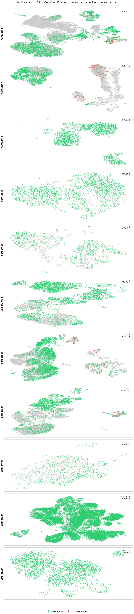

**Figure 2. Coarse classification proportions across datasets.**
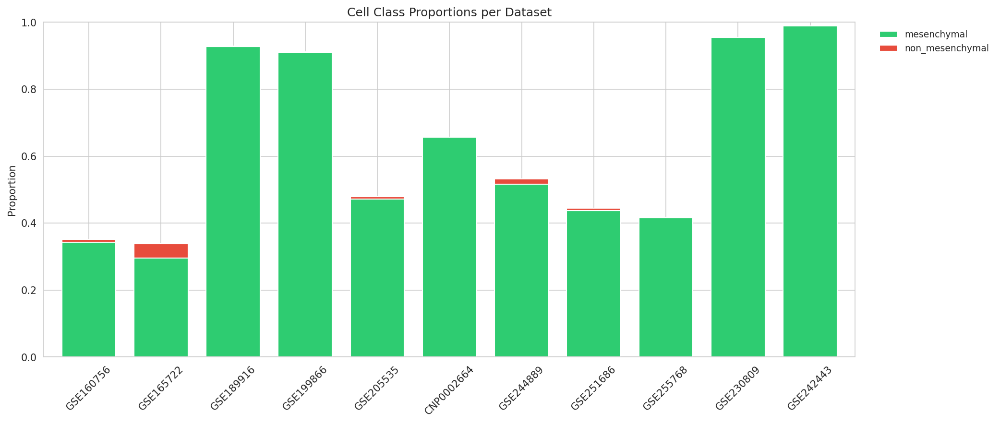

**Figure 3. Score distributions for coarse anchor categories.**
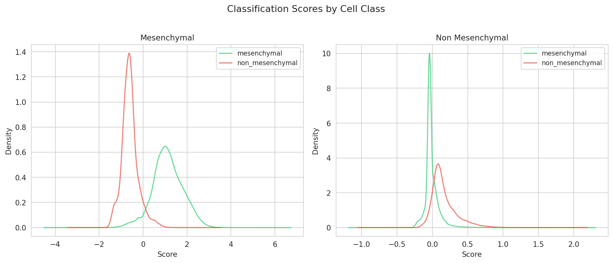

**Figure 4. Canonical marker dotplot for coarse classification.**
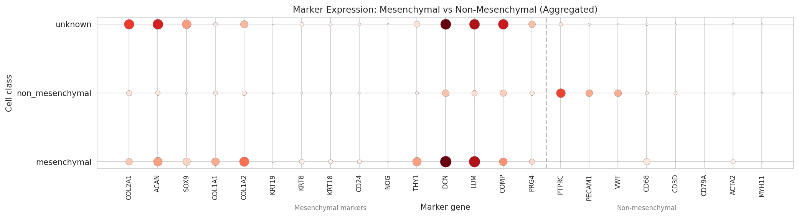

**Figure 5. Label transition between clustering-based and marker-based classification.**
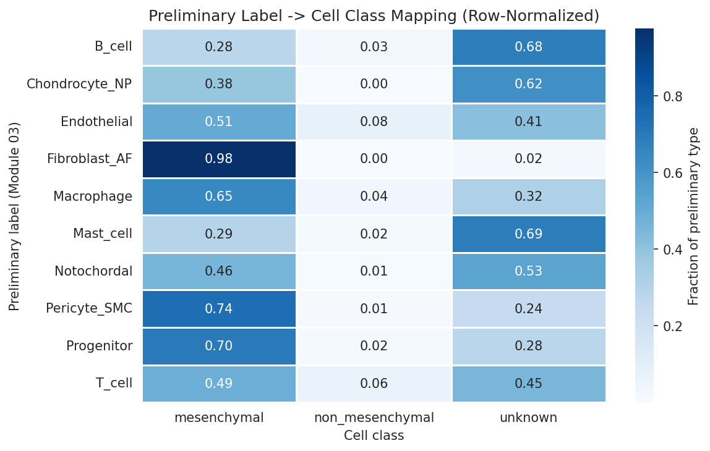

---

### 5.2 Integration (Module 05)

Tiered scANVI integration was performed separately for each compartment, producing four integrated objects. Integration quality was assessed on a 30,000-cell subsample of the all_cells object.

**Table 4. Integration quality metrics (all_cells object, 30,000-cell subsample).**

| Metric | Value | Interpretation |
|--------|------:|----------------|
| iLISI | 1.231 | Moderate batch mixing (max theoretical ~11 for 11 studies; values > 1 indicate mixing across batches) |
| Batch ASW | 0.075 | Near zero, indicating minimal residual batch identity in the embedding |
| Condition ASW | -0.010 | Near zero, indicating condition (healthy/degenerated) is not the primary axis of variation -- biological signal is distributed across cell types rather than forming a global condition axis |

**Table 5. Per-compartment integrated objects.**

| Object | Studies included | Samples | Cells | Tier A (mesenchymal) | Tier B (non-mesenchymal) |
|--------|:---------------:|:-------:|------:|---------------------:|-------------------------:|
| NP | 8 | 44 | 262,967 | 259,558 | 3,409 |
| AF | 3 | 17 | 84,568 | 84,568 (all) | — (too sparse, 56 cells) |
| CEP | 3 | 6 | 50,769 | 50,769 (all) | — (too sparse, 89 cells) |
| all_cells | 11 | 71 | 410,759 | ~398,000 | ~12,700 |

In the NP compartment, 8 studies contributed cells spanning healthy, mild degeneration, severe degeneration, and herniated conditions. The AF compartment was limited to 3 studies (GSE160756, GSE199866, GSE230809), and CEP to 3 studies (GSE160756, GSE242443, GSE255768) with the caveat that GSE242443 contains culture-expanded cells. GSE189916 was included only in the all_cells object because compartment annotations were not available (whole IVD).

The scANVI integration with 5 coarse anchor categories preserved the mesenchymal cell state continuum in NP tissue -- cells form a continuous landscape in UMAP space rather than discrete islands -- while correcting for batch effects across the 11 studies, including 3 non-10x platforms (BD Rhapsody, Singleron). Study-cluster ARI was 0.000 for NP, AF, and CEP, confirming that no clusters were driven purely by study identity.

**Figure 6. NP integrated UMAP (pre-annotation, colored by study/coarse label).**

**Figure 7. AF integrated UMAP (pre-annotation).**

**Figure 8. CEP integrated UMAP (pre-annotation).**
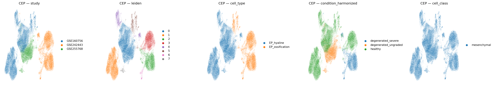

**Figure 9. All-cells integrated UMAP (pre-annotation).**
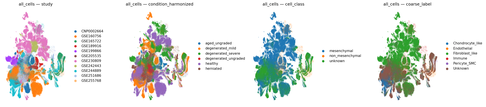

---

### 5.3 Clustering (Module 06)

Resolution-optimized Leiden clustering was performed on the scANVI neighbor graphs for each compartment and tier. The following table summarizes the resolution sweep results and selected parameters.

**Table 6. Clustering resolution optimization results.**

| Compartment / Tier | Resolution range tested | Optimal resolution | Clusters | Silhouette score | Modularity |
|---------------------|:-----------------------:|:------------------:|:--------:|:----------------:|:----------:|
| NP mesenchymal | 0.2 -- 1.5 | **1.0** | 56 | 0.098 | — |
| NP non-mesenchymal | 0.1 -- 2.0 | **0.2** | 5 | 0.266 | 0.689 |
| AF mesenchymal | 0.2 -- 2.0 | **0.2** | 14 | 0.100 | 0.864 |
| CEP mesenchymal | 0.2 -- 2.0 | **0.2** | 9 | 0.076 | 0.734 |
| all_cells mesenchymal | 0.4 -- 1.0 | **1.0** | 62 | 0.061 | — |
| all_cells non-mesenchymal | 0.1 -- 2.0 | **0.1** | 5 | 0.275 | 0.704 |

**Detailed resolution sweep for NP mesenchymal (262K cells):**

| Resolution | Clusters | Silhouette |
|:----------:|:--------:|:----------:|
| 0.2 | 24 | 0.051 |
| 0.4 | 35 | 0.060 |
| 0.6 | 45 | 0.082 |
| 0.8 | 49 | 0.093 |
| **1.0** | **56** | **0.098** |
| 1.5 | 68 | 0.092 |

The NP mesenchymal silhouette score peaked at resolution 1.0 (0.098) and declined at 1.5 (0.092), indicating over-fragmentation beyond 56 clusters. The relatively low absolute silhouette values (< 0.1) are expected for data on a biological continuum -- discrete clusters are an approximation of continuous cell state variation, and high silhouette scores would paradoxically indicate that the continuum has been artificially discretized.

**Detailed resolution sweep for AF mesenchymal (84K cells):**

| Resolution | Clusters | Silhouette | Modularity |
|:----------:|:--------:|:----------:|:----------:|
| **0.2** | **14** | **0.100** | **0.864** |
| 0.4 | 20 | 0.095 | 0.896 |
| 0.6 | 23 | 0.055 | 0.898 |
| 0.8 | 27 | 0.063 | 0.900 |
| 1.0 | 29 | 0.070 | 0.904 |

AF mesenchymal showed peak silhouette at the lowest tested resolution (0.2, 14 clusters), suggesting that AF cells are less transcriptomically heterogeneous than NP cells and do not warrant fine-grained sub-clustering. The high modularity (0.864) confirms a clean partition at this resolution.

**Detailed resolution sweep for CEP mesenchymal (50K cells):**

| Resolution | Clusters | Silhouette | Modularity |
|:----------:|:--------:|:----------:|:----------:|
| **0.2** | **9** | **0.076** | **0.734** |
| 0.4 | 14 | 0.068 | 0.763 |
| 0.6 | 16 | 0.061 | 0.783 |
| 1.0 | 21 | 0.069 | 0.824 |
| 1.2 | 24 | 0.071 | 0.826 |
| 2.0 | 32 | 0.065 | 0.814 |

CEP mesenchymal silhouette peaked at resolution 0.2 (9 clusters, 0.076). A secondary peak appeared at resolution 1.2 (0.071), but the marginal improvement did not justify tripling the cluster count from 9 to 24.

**Detailed resolution sweep for NP non-mesenchymal (3,409 cells):**

| Resolution | Clusters | Silhouette | Modularity |
|:----------:|:--------:|:----------:|:----------:|
| 0.1 | 4 | 0.265 | 0.685 |
| **0.2** | **5** | **0.266** | **0.689** |
| 0.3 | 6 | 0.206 | 0.703 |
| 0.5 | 6 | 0.186 | 0.749 |
| 1.0 | 13 | 0.102 | 0.783 |
| 2.0 | 23 | 0.086 | 0.767 |

NP non-mesenchymal cells showed a clear silhouette peak at resolution 0.1-0.2 (4-5 clusters, silhouette ~0.266), with a sharp drop at 0.3 (0.206). The much higher silhouette values compared to mesenchymal cells (0.266 vs 0.098) reflect the discrete nature of immune, endothelial, and pericyte populations, which do not form a continuum.

**Total cluster counts per compartment object:**

| Object | Mesenchymal clusters | Non-mesenchymal clusters | Total clusters |
|--------|:--------------------:|:------------------------:|:--------------:|
| NP | 56 | 5 | 61 |
| AF | 14 | — | 14 |
| CEP | 9 | — | 9 |
| all_cells | 62 | 5 | 67 |

**Figure 10. NP mesenchymal clustering resolution optimization.**
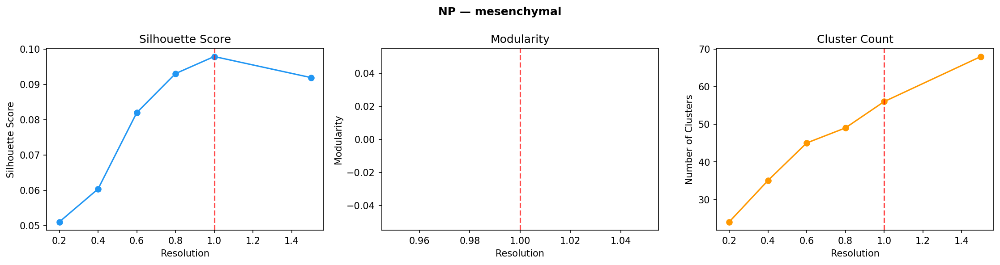

**Figure 11. NP non-mesenchymal clustering resolution optimization.**
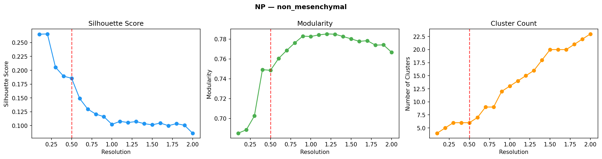

**Figure 12. AF mesenchymal clustering resolution optimization.**
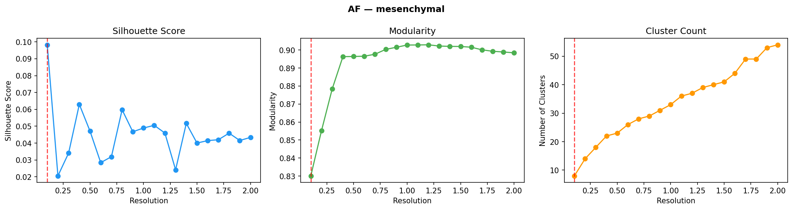

**Figure 13. CEP mesenchymal clustering resolution optimization.**
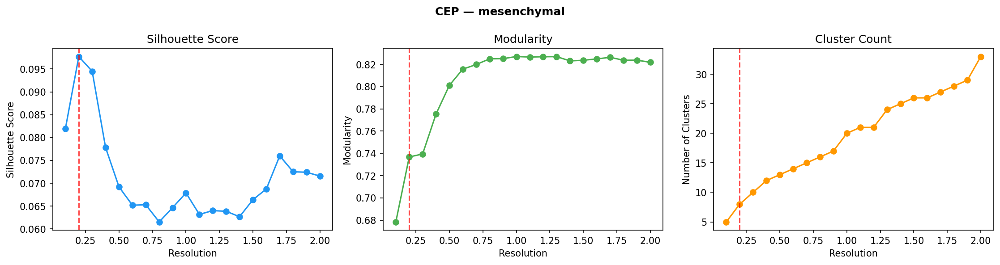

**Figure 14. All-cells mesenchymal clustering resolution optimization.**
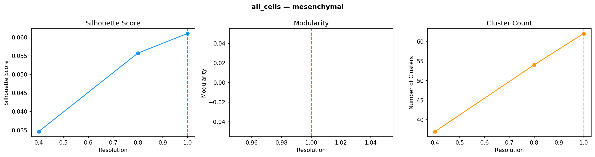

**Figure 15. All-cells non-mesenchymal clustering resolution optimization.**
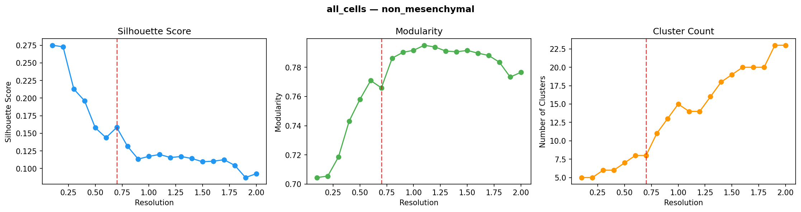

---

### 5.4 Post-Integration Annotation (Module 07)

Two-stage annotation was applied to the clustered, integrated data. Stage 1 used canonical marker expression to assign coarse identities; Stage 2 used within-group differential expression to resolve fine subtypes. The final annotation yields 19 cell types across all compartments.

#### 5.4.1 NP Compartment (262,967 cells, 10 cell types)

**Table 7. NP cell type census.**

| Cell type | Cells | % of NP | Key markers | Biological identity |
|-----------|------:|--------:|-------------|---------------------|
| NP_mature_chondrocyte | 115,388 | 43.9 | ACAN, COL2A1, SOX9, COMP | Stable NP resident; ECM-producing chondrocyte phenotype |
| NP_fibrocartilaginous | 90,857 | 34.6 | COL1A1 (transitional), mixed chondrocyte/fibroblast | Transitional phenotype on the NP continuum |
| Fibrochondrocyte_chondroid | 18,354 | 7.0 | COL2A1, ACAN, SOX9 (chondrocyte-dominant) | Fibrochondrocyte with chondrocyte-like program |
| unassigned | 17,607 | 6.7 | Ambiguous marker profiles | Cells on the continuum that do not clearly fit defined categories |
| NP_notochordal | 8,920 | 3.4 | KRT8, KRT18, KRT19, T/TBXT, CD24 | Remnant notochordal cells; developmental progenitor phenotype |
| Fibrochondrocyte_stressed | 4,195 | 1.6 | MMP13, ADAMTS5, VEGFA (stress markers) | Stress/catabolic fibrochondrocyte state |
| Fibrochondrocyte_fibroid | 3,648 | 1.4 | COL1A1, COL1A2, DCN (fibroblast-dominant) | Fibrochondrocyte with fibroblast-like program |
| NP_stressed | 3,613 | 1.4 | MMP13, ADAMTS5, IL1B, TNF, HIF1A | Stressed/degenerative NP chondrocyte state |
| Macrophage_M2 | 325 | 0.1 | CD68, CD163, CSF1R | M2-polarized macrophages |
| Pericyte_SMC | 60 | 0.0 | ACTA2, RGS5, PDGFRB | Pericytes / smooth muscle cells |

The NP compartment is dominated by NP_mature_chondrocyte (44%) and NP_fibrocartilaginous (35%), which together account for 78% of NP cells. These two populations form a continuous landscape in UMAP space, consistent with the concept of a differentiation/degeneration continuum in NP tissue (Gan et al., 2021). The v4 pipeline newly resolves three Fibrochondrocyte subtypes (chondroid, stressed, fibroid) that were not distinguished in v3. NP_notochordal cells (3.4%) represent the remnant developmental progenitor population that declines with age. The 6.7% unassigned cells fall on transitional regions of the continuum where marker expression is ambiguous -- this rate is below the 10% threshold set as acceptable in the pipeline specification.

Non-mesenchymal NP cells are extremely sparse (385 cells, 0.1%), consistent with the avascular nature of the NP. Of the 5 non-mesenchymal clusters, only Macrophage_M2 (325 cells) and Pericyte_SMC (60 cells) received definitive de novo labels. Three clusters (917, 859, 638 cells) remained labeled "unassigned" by the de novo annotation. CellTypist validation (Table 8) suggests these correspond to endothelial cells and classical monocytes, indicating that the de novo annotation thresholds were conservative for these rare populations.

#### 5.4.2 CellTypist Validation of NP Non-Mesenchymal Clusters

**Table 8. CellTypist concordance for NP non-mesenchymal clusters.**

| Cluster | Cells | De novo label | CellTypist majority call | CellTypist agreement (%) | Concordant |
|:-------:|------:|---------------|--------------------------|:------------------------:|:----------:|
| 0 | 917 | unassigned | Endothelial cells | 100.0 | No |
| 1 | 859 | unassigned | Classical monocytes | 100.0 | No |
| 2 | 638 | unassigned | Classical monocytes | 100.0 | No |
| 3 | 610 | unassigned | CD16+ NK cells | 37.0 | No |
| 4 | 325 | Macrophage_M2 | Macrophages | 85.5 | **Yes** |
| 5 | 60 | Pericyte_SMC | Fibroblasts | 96.7 | No |

CellTypist concordance was 1/6 clusters (Macrophage_M2). The low concordance is expected for two reasons: (1) the de novo annotation intentionally uses conservative thresholds, leaving ambiguous clusters as "unassigned" rather than forcing potentially incorrect labels; and (2) CellTypist's `Immune_All_Low` reference lacks IVD-specific cell state knowledge (e.g., calling Pericyte_SMC cells as "Fibroblasts"). Cluster 3 (610 cells) shows the lowest CellTypist agreement (37% for CD16+ NK cells), suggesting a mixed or transitional population.

#### 5.4.3 AF Compartment (84,568 cells, 2 cell types)

**Table 9. AF cell type census.**

| Cell type | Cells | % of AF | Key markers | Biological identity |
|-----------|------:|--------:|-------------|---------------------|
| AF_outer | 49,651 | 58.7 | COL1A1, COL1A2, high collagen I | Classic outer AF fibroblasts; tensile strength |
| AF_inner | 34,917 | 41.3 | COL2A1+, SOX9+, transitional | Inner AF with chondrocyte-like features |

The AF compartment resolves cleanly into two populations corresponding to the known anatomical gradient from outer (fibrous) to inner (cartilaginous) annulus. No unassigned cells remain in AF (0%), and all 14 Leiden clusters were assignable to one of these two types. The lack of non-mesenchymal cells in AF (56 total, too sparse for separate clustering) is consistent with the avascular nature of healthy annulus tissue.

#### 5.4.4 CEP Compartment (50,769 cells, 3 cell types)

**Table 10. CEP cell type census.**

| Cell type | Cells | % of CEP | Key markers | Biological identity |
|-----------|------:|--------:|-------------|---------------------|
| EP_hyaline | 31,775 | 62.6 | COL2A1, COL10A1, SOX9 | Hyaline cartilage endplate cells |
| Fibroblast_like | 17,038 | 33.6 | COL1A1, COL1A2, DCN | Fibrous endplate cells |
| Fibrochondrocyte_chondroid | 1,956 | 3.9 | Mixed chondrocyte/fibroblast | Transitional fibrochondrocyte |

CEP results should be interpreted with caution due to three factors: (1) only 3 studies contribute CEP cells; (2) GSE242443 contains culture-expanded cells that may not reflect in vivo biology; and (3) GSE255768 provides only degenerated endplate with no healthy control. The healthy CEP baseline is derived solely from GSE160756.

#### 5.4.5 Validation Summary

All automated validation checks passed:
- **Unassigned rate:** 6.7% NP, 0% AF, 0% CEP (all < 10% threshold)
- **No clustering blobs:** No compartment showed single-cluster dominance
- **Study-cluster ARI:** 0.000 for NP, AF, and CEP (no batch-driven clusters)
- **Marker enrichment:** Canonical markers (ACAN, COL2A1, COL1A1, CD68, PECAM1) showed expected enrichment in assigned cell types, with minor caveats for some datasets (e.g., COL2A1 only 2.6-fold enriched in Chondrocyte_like vs Immune in GSE160756, vs expected > 10-fold)

---

### 5.5 Integrated Cell Atlas Summary

The final atlas comprises 410,759 cells organized into 19 cell types across four compartment-specific objects. The annotated UMAPs below show the post-integration, post-clustering, post-annotation cell type assignments -- the primary output of the integration pipeline.

**Figure 16. NP annotated UMAP -- final cell type assignments on scANVI embedding.**
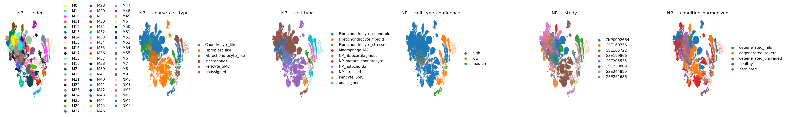

**Figure 17. AF annotated UMAP -- final cell type assignments on scANVI embedding.**
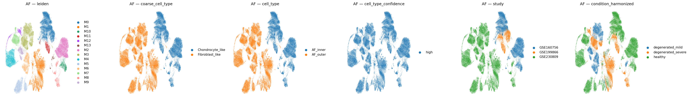

**Figure 18. CEP annotated UMAP -- final cell type assignments on scANVI embedding.**
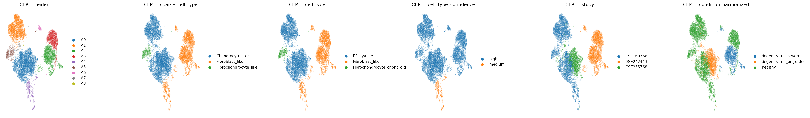

**Figure 19. All-cells annotated UMAP -- final cell type assignments on scANVI embedding.**
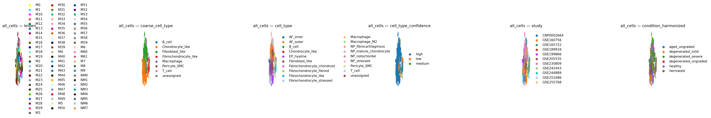

**Table 11. Complete cell type census across all compartments.**

| Cell type | NP | AF | CEP | Total | % of atlas |
|-----------|---:|---:|----:|------:|-----------:|
| NP_mature_chondrocyte | 115,388 | — | — | 115,388 | 28.1 |
| NP_fibrocartilaginous | 90,857 | — | — | 90,857 | 22.1 |
| AF_outer | — | 49,651 | — | 49,651 | 12.1 |
| AF_inner | — | 34,917 | — | 34,917 | 8.5 |
| EP_hyaline | — | — | 31,775 | 31,775 | 7.7 |
| Fibrochondrocyte_chondroid | 18,354 | — | 1,956 | 20,310 | 4.9 |
| unassigned | 17,607 | — | — | 17,607 | 4.3 |
| Fibroblast_like | — | — | 17,038 | 17,038 | 4.2 |
| NP_notochordal | 8,920 | — | — | 8,920 | 2.2 |
| Fibrochondrocyte_stressed | 4,195 | — | — | 4,195 | 1.0 |
| Fibrochondrocyte_fibroid | 3,648 | — | — | 3,648 | 0.9 |
| NP_stressed | 3,613 | — | — | 3,613 | 0.9 |
| Macrophage_M2 | 325 | — | — | 325 | 0.1 |
| Pericyte_SMC | 60 | — | — | 60 | 0.0 |
| **Total** | **262,967** | **84,568** | **50,769** | **398,304** | |

The NP populations form the largest portion of the atlas (64%), dominated by NP_mature_chondrocyte and NP_fibrocartilaginous, which together represent over half of all cells. The mesenchymal continuum is preserved in the scANVI embedding -- NP_notochordal cells occupy one end of the UMAP landscape, transitioning through NP_mature_chondrocyte and NP_fibrocartilaginous to the Fibrochondrocyte subtypes and stressed states at the other end. This structure is consistent with the known developmental and degenerative trajectory of NP cells (Gan et al., 2021).

---

*This manuscript section covers Modules 01-07 of the v4 pipeline (dataset discovery through post-integration annotation). Sections covering differential expression (Module 08), pathway enrichment and interpretation (Module 09), trajectory analysis (Module 10), cell-cell communication (Module 11), and reporting (Module 12) will be added in subsequent revisions.*

---

*Analysis performed using a 12-module human-gated agentic pipeline (v4). All code version-controlled. Random seed: 42. Package versions: Python 3.12, scanpy 1.11, scvi-tools 1.4.2. Key v4 improvements: scANVI semi-supervised integration with 5 coarse anchor categories, separate clustering module with resolution optimization, two-stage annotation (coarse markers + fine DE), and 19 cell types across 4 compartment objects.*
